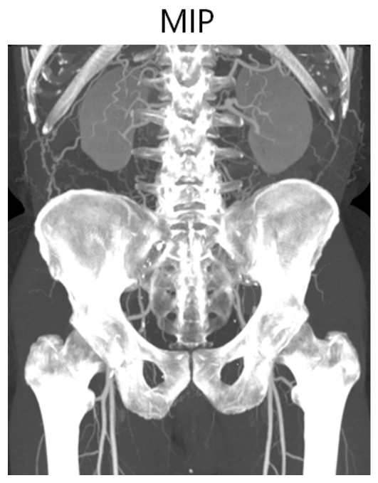

# 医疗相关

* 医疗影像的归类：Patient->Study->Serial->Image(Instance)
  * Patient就是一个人，对应主页面的第一列相同的若干项
  * Study就是对应主页面一行
  * Serial就是一个Study里面各个项(相当于具体的一个Image)
  * Instance就是一个Serial里的一张图
* 医疗影像的类别(Modality)
  * PT - PET
  * CT

## CT三维重建技术

* MPR
* MIP - 最大密度投影成像：把3D所有切片投影下去到2D平面，取最大密度。  
    
