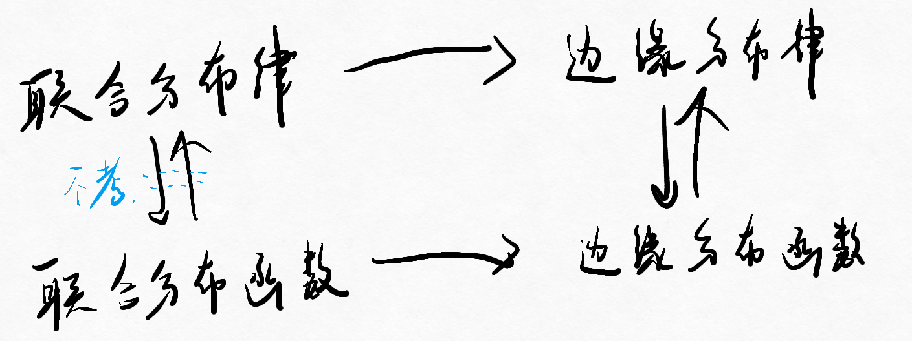

# 二维随机变量及分布函数

## 一、二维随机变量的定义

$(X,Y)$取值有限或者可列的有序数对。

## 二、 分布函数

### 1. 联合分布函数

> $(X,Y)$是定义在$S$上的二维随机变量，对于任意实数$x,y$，二元函数
> $$F(x,y)=P(X\le x,Y\le y) (x\in R, y\in R)$$
> 称为二维随机变量$(X,Y)$的分布函数，或称为随机变量X与Y的联合分布函数。

*关心左下块区域的概率。*

性质：

* 有界性：  
  $F(x,y)\in [0,1]$  
  $F(-\infty,y)=F(x,-\infty)=F(-\infty,-\infty)=0$  
  $F(\infty,\infty)=1$
* 单调性：  
  $x_2>x_1,y\in R \rightarrow F(x_2,y)\ge F(x_1,y)$  
  $y_2>y_1,x\in R \rightarrow F(x,y_2)\ge F(x,y_1)$  
  $y_2>y_1,x_2>x_1 \rightarrow F(x_2,y_2)\ge F(x_1,y_1)$
* 右连续性：  
  $F(x+0,y)=F(x,y+0)=F(x+0,y+0)=F(x,y)$
* 二增性（相较于一维多的性质）：  
  $P(x_1<X\le x_2,y_1<Y\le y_2)\\ =P(X\le x_2,Y\le y_2)-P(X\le x_1, Y\le y_2)-P(X\le x_2, Y\le y_1)+P(X\le x_1, Y\le y_1)\\ =F(x_2,y_2)-F(x_1,y_2)-F(x_2,y_1)+F(x_1,y_1) (\ge 0)$

  

满足上述性质的二元函数，都可以作为某个二维随机变量的分布函数。

### 2. 边缘分布函数

当$x$或$y$取$\infty$时，  
$$F_X(x)=P(X\le x)=P(X\le x, y<+\infty)=F(X\le x, y<+\infty)$$
$$F_Y(y)=P(Y\le y)=P(x<+\infty, Y\le y)=F(x<+\infty, Y\le y)$$
称为$x$或$y$的边缘分布函数。

### 两者关系

联合分布函数可以确定边缘分布函数，但反之不行。

## 三、 分布律

### 性质

1. 非负性
2. 规范性

### 1. 联合分布律

表达方法：

1. 表格法
2. 解析表达式法

### 2. 边缘分布律

……

联合分布律和边缘分布律关系：  
  

### 3. 条件分布律

即为将某一变量约束在某一条件下，求另一变量的发生的概率

$$P(X=x_i|Y=y_w)=\frac{P(X=x_i,Y=y_w)}{P(Y=y_w)}=\frac{P_{iw}}{P_{\centerdot w}}$$

## 第二节 二维离散型随机变量

核心：求**联合分布律**。

### 一、求联合分布律

#### 1. 古典概型

1. 定取值
2. 列表格
3. 算各项概率
4. 得到联合分布律

#### 2. 利用性质

* 非负性
* 规范性

#### 3. 已知边缘和联合分布律

利用“乘法公式”：  
$$P(X=i,Y=j)=P(X=i|Y=j)P(Y=j)=P(Y=i|X=j)P(X=j)$$

> 例：
>
> 设某班车起点站上车人数服从……
>
> 解：
>  
> 1. 下车人数服从二项分布，  
>     $P(Y=m|X=n)=C^m_np^m(1-p)^n-m$
> 2. $P(X=n,Y=m)\\ =P(X=n)P(Y=m|X=n)\\ =\frac{\lambda^n}{n!}e^{-\lambda}C^m_np^mq^{n-m}\\ =\frac{\lambda^m\lambda^{n-m}}{n!}e^{-\lambda}\frac{n!}{m!(n-m)!}p^mq^{n-m}\\ =\frac{1}{m!(n-m)!}e^{-\lambda}(\lambda p)^m(\lambda q)^{n-m)}$

---

接下来均为已知联合分布律的前提。

### 二、求边缘分布律

#### 1. 利用表格形式

  

#### 2. 公式法

……

### 三、求条件分布律

为联合分布律/边缘分布律。

> 例题：
>
> 一射手进行射击，击中目标的概率为$p$，……
>
> 解：  
> 记：第一次击中次数为$X$，第二次击中次数为$Y$。  
> 可知$x<y$
>
> 1. 联合分布律：  
>    | 1 | 2 | 3 | ... | i | ... | j |
>    | - | - | - | --- | - | --- | - |
>    | q | q | q | q   | p | q   | p |
>    $P(X=i,Y=j)=q^{i-1}pq^{j-i-1}p$
> 2. 边缘分布律：  
>    $P(X=i)\\ =\sum_{j=i+1}^{+\infty}P(X=i,Y=j)\\ =\sum_{j=i+1}^{+\infty}p^2q^{j-2}\\ =...\\ =p\bullet q^{i-1} (i=1,2,3,\cdots)$
>
>    $P(Y=j)\\ =\sum_{i=1}^{j-1}P(X=i,Y=j)\\ =\cdots\\ =p^2q^{j-2}(j-1) (j=2,3,4,\cdots)$
> 3. 条件分布律：  
>    $P(X=i|Y=j)\\ =\frac{P(X=i,Y=j)}{P(Y=j)}\\ =\frac{p^2q^{j-2}}{p^2q^{j-2}(j-1)}\\ =\frac{1}{j-1}$  
>    *发现第一次击中为均匀分布，机会均等*  
>    $P(Y=i|X=j)$同理。

## 第三节 二维连续型随机变量

### 一、二维连续随机变量及其联合概率密度

#### 1. 二维连续型随机变量的定义

$$F(x,y)=\int_{-\infty}^{y}\int_{-\infty}^{x}f(u,v)dudv$$
称$(x,y)$为二维连续型随机变量。  
其中被积函数$f(u,v)$称为联合概率密度。

* $(x,y)$取某一特定值，则$P(x,y)=0$

#### 2. 联合概率密度

性质：

* 非负性
* 规范性
* $P((x,y)\in D)=\iint _Df(x,y)dxdy$