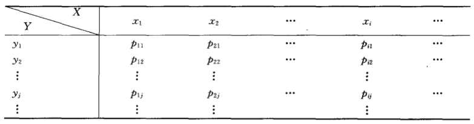
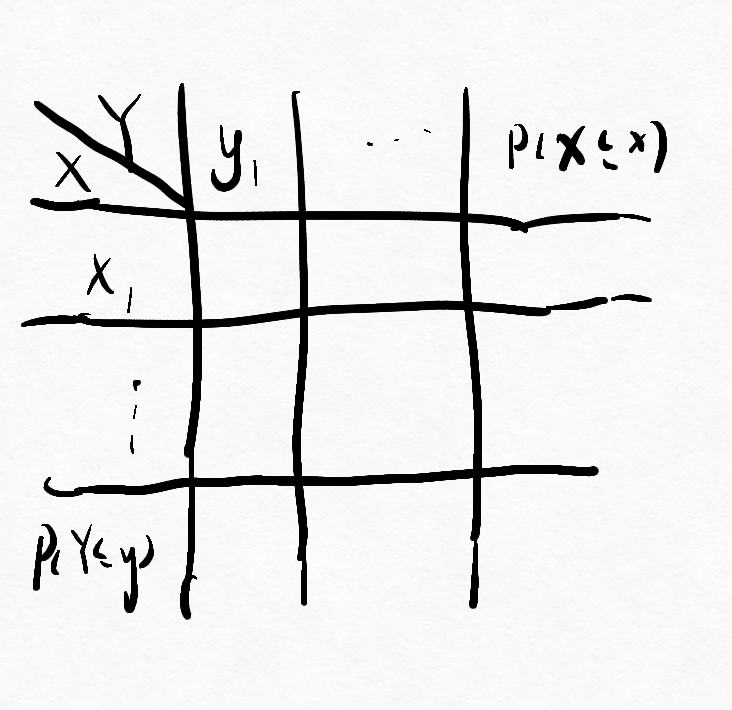
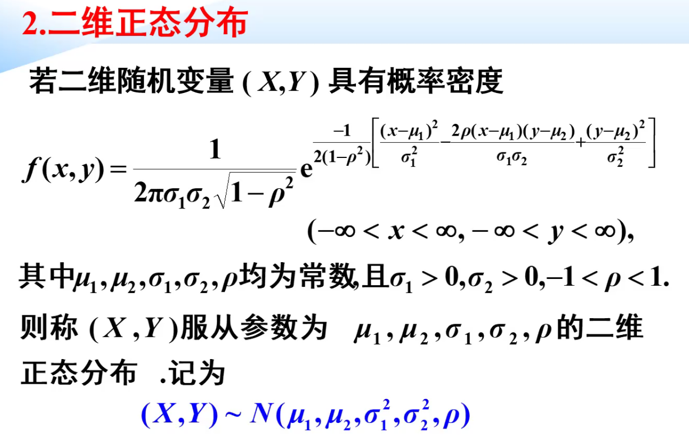

# 第二节 二维离散型随机变量

## 一、定义

二维离散型随机变量$(X,Y)$，其取值是有限个或者可列对有序数组。  
$(X,Y)=(x_i,y_i)\qquad(i,j=1,2,3,\cdots)$

## 二、分布律

### 1. 定义

设$(X,Y)$的所有可能取值为$(x_i,y_i)$，
$$p_{ij}=P\{X=x_i, Y=y_j\}, i=j=1,2,\cdots$$
称为二维离散性随机变量$(X,Y)$的分布律，也称**联和分布律**。

可以用表格来直观地表示联和分布律，称为联和分布表。  
  

### 性质

1. 非负性
2. 规范性

### 1. 联合分布律

表达方法：

1. 表格法
2. 解析表达式法

### 2. 边缘分布律

……

联合分布律和边缘分布律关系：  
  

#### 3. 条件分布律

即为将某一变量约束在某一条件下，求另一变量的发生的概率

$$P(X=x_i|Y=y_w)=\frac{P(X=x_i,Y=y_w)}{P(Y=y_w)}=\frac{P_{iw}}{P_{\centerdot w}}$$

核心：求**联合分布律**。

### 一、求联合分布律

#### 1. 古典概型

1. 定取值
2. 列表格
3. 算各项概率
4. 得到联合分布律

#### 2. 利用性质

* 非负性
* 规范性

#### 3. 已知边缘和联合分布律

利用“乘法公式”：  
$$P(X=i,Y=j)=P(X=i|Y=j)P(Y=j)=P(Y=i|X=j)P(X=j)$$

> 例：
>
> 设某班车起点站上车人数服从……
>
> 解：
>  
> 1. 下车人数服从二项分布，  
>     $P(Y=m|X=n)=C^m_np^m(1-p)^n-m$
> 2. $P(X=n,Y=m)\\ =P(X=n)P(Y=m|X=n)\\ =\frac{\lambda^n}{n!}e^{-\lambda}C^m_np^mq^{n-m}\\ =\frac{\lambda^m\lambda^{n-m}}{n!}e^{-\lambda}\frac{n!}{m!(n-m)!}p^mq^{n-m}\\ =\frac{1}{m!(n-m)!}e^{-\lambda}(\lambda p)^m(\lambda q)^{n-m)}$

---

接下来均为已知联合分布律的前提。

### 二、求边缘分布律

#### 1. 利用表格形式

  

#### 2. 公式法

……

### 三、求条件分布律

为联合分布律/边缘分布律。

> 例题：
>
> 一射手进行射击，击中目标的概率为$p$，……
>
> 解：  
> 记：第一次击中次数为$X$，第二次击中次数为$Y$。  
> 可知$x<y$
>
> 1. 联合分布律：  
>    | 1 | 2 | 3 | ... | i | ... | j |
>    | - | - | - | --- | - | --- | - |
>    | q | q | q | q   | p | q   | p |
>    $P(X=i,Y=j)=q^{i-1}pq^{j-i-1}p$
> 2. 边缘分布律：  
>    $P(X=i)\\ =\sum_{j=i+1}^{+\infty}P(X=i,Y=j)\\ =\sum_{j=i+1}^{+\infty}p^2q^{j-2}\\ =...\\ =p\bullet q^{i-1} (i=1,2,3,\cdots)$
>
>    $P(Y=j)\\ =\sum_{i=1}^{j-1}P(X=i,Y=j)\\ =\cdots\\ =p^2q^{j-2}(j-1) (j=2,3,4,\cdots)$
> 3. 条件分布律：  
>    $P(X=i|Y=j)\\ =\frac{P(X=i,Y=j)}{P(Y=j)}\\ =\frac{p^2q^{j-2}}{p^2q^{j-2}(j-1)}\\ =\frac{1}{j-1}$  
>    *发现第一次击中为均匀分布，机会均等*  
>    $P(Y=i|X=j)$同理。

## 第三节 二维连续型随机变量

### 一、二维连续随机变量及其联合概率密度

#### 1. 二维连续型随机变量的定义

$$F(x,y)=\int_{-\infty}^{y}\int_{-\infty}^{x}f(u,v)dudv$$
称$(x,y)$为二维连续型随机变量。  
其中被积函数$f(u,v)$称为联合概率密度。

* $(x,y)$取某一特定值，则$P(x,y)=0$

#### 2. 联合概率密度

性质：

* 非负性
* 规范性
* $P((x,y)\in D)=\iint _Df(x,y)dxdy$

#### 3. 边缘概率密度

$$f_X(x)=\int_{-\infty}^{+\infty}f(x,y)\textrm{d}y$$
$$f_Y(x)=\int_{-\infty}^{+\infty}f(x,y)\textrm{d}y$$

#### 4. 条件概率密度

> 定义：
>

公式：
$$f_{X|Y}(x|y)=\frac{f(x,y)}{f_Y(y)}$$

联和概率密度除以边缘概率密度

---

条件分布函数

$$f_{X|Y}(x|y)=\frac{f(x,y)}{f_Y(u)}$$

### 二、两个常用分布

#### 1. 均匀分布

$S$为区域面积。

$$
f(x, y)=\left\{\begin{array}{ll}
\frac{1}{S}, & (x, y) \in D \\
0, & Others
\end{array}\right.
$$

#### 2. 二维正态分布

  

边缘：

* $X\sim N(\mu_1,\sigma_1^2)$
* $Y\sim N(\mu_2,\sigma_2^2)$

---

* $aX+bY \sim N(a\mu_1+b\mu_2,a^2\sigma_1^2+b^2\sigma_2^2+2ab\sigma_1\sigma_2\rho)$

## 第四节 二维离散性随机变量的独立性

### 一、随机变量的相互独立性定义

> 定义：
>
> $F(x,y)=F_X(x)F_Y(y)$

*联合分布律（概率密度）等于边缘分布律（概率密度）的乘积*

反映到分布律x边缘分布律表格中：  
对于分布律表格中一格$(x,y)$，  
其为其最下方$(y)$和最右方$(x)$的边缘分布率的乘积。

