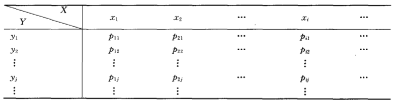
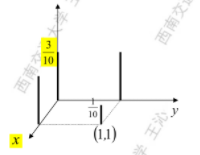
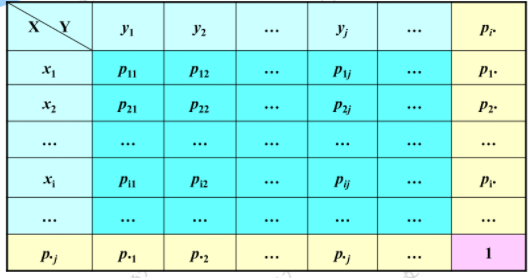
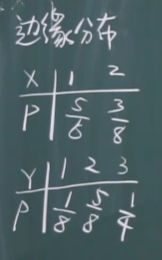
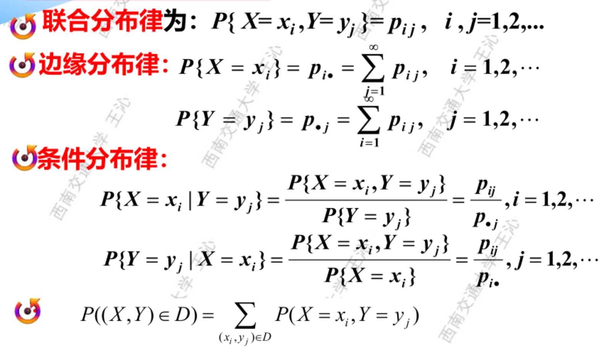

# 第二节 二维离散型随机变量

## 一、定义

二维离散型随机变量$(X,Y)$，其取值是有限个或者可列对有序数组。  
$(X,Y)=(x_i,y_i)\qquad(i,j=1,2,3,\cdots)$

由于离散型的分布函数直接是几个离散点的分布律相加，  
所以以下只**重点讨论分布律**。

## 二、分布律

对于二维随机变量，存在以下三种分布律。

* 联合分布律
* 边缘分布律
* 条件分布律

具有共同性质如下：

1. 非负性  
   $p_{ij}\ge0 \qquad (i,j=1,2,\cdots)$
2. 规范性  
   $\sum_{i=1}^\infty\sum_{j=1}^\infty p_{i,j} = 1$

### 1. 联合分布律(联和分布函数)

> 定义 - 联合分布律：
>
> 设$(X,Y)$的所有可能取值为$(x_i,y_i)$，
> $$p_{ij}=P\{X=x_i, Y=y_j\}\qquad(i,j=1,2,\cdots)$$
> 称为二维离散性随机变量$(X,Y)$的**联和分布律**。

表示方法：

1. **表格法**  
   可以用表格来直观地表示联和分布律，称为联和分布表。  
     
   *最好将第一个变量($X$)定为行（竖着写），第二个变量($Y$)定为列（横着写）。*
2. **解析表达式法**  
   $P(X=x_i,Y=y_j)=P_{ij}$
3. **三维图像法**  
   

---

可得**联合分布函数**即为：
$$F(x,y)=P\{X\le x, Y\le y\}=\sum_{x_i\le x}\sum_{y_j\le y}P(X=x_i,Y=y_j)=\sum\sum p_{ij}$$

求各种分布律的**核心即为求联合分布律**。

### 2. 边缘分布律

> 定义 - 边缘分布律
>
> 已知$(X,Y)$的概率分布（联合分布律）为$p_{ij}=P\{X=x_i, Y=y_j\}(i,j=1,2,\cdots)$，  
> 则称$P\{X=x_i\}=P\{X=x_i, Y<+\infty\}$为**关于$X$的边缘分布律**。
>
> 对于特定的一行$x_i$，可将其边缘分布律记为$p_{i\cdot}$。
>
> 存在公式：
> $$p_{i\cdot}=P\{X=x_i\}=\sum_{j=1}^\infty p_{ij}$$
> $$p_{\cdot j}=P\{Y=y_j\}=\sum_{i=1}^\infty p_{ij} $$

联合分布律和边缘分布律关系：  
  

### 3. 条件分布律

*即为将某一变量约束在某一条件下，求另一变量的发生的概率。*

公式为：
$$P(X=x_i|Y=y_w)=\frac{P(X=x_i,Y=y_w)}{P(Y=y_w)}=\frac{P_{iw}}{P_{\centerdot w}}$$

求条件分布律，则为所有可能两两组合。  
先是$Y$在依次$Y=j$的情况下，所有的$X=i$的情况，  
再是$X$在依次$X=i$的情况下，所有的$Y=j$的情况。

## 三、求联合分布律

### 1. 古典概型

1. 定取值
2. 列表格
3. 算各项概率
4. 得到联合分布律表

### 2. 利用性质

* 非负性
* **规范性**

### 3. 通过边缘和联合分布律求得

利用“乘法公式”：  
$$P(X=i,Y=j)=P(X=i|Y=j)P(Y=j)=P(Y=i|X=j)P(X=j)$$

则步骤：

1. 先求条件分布律。  
   一般某变量的概率是个条件概率，然后因为独立性可以根据公式（如二项分布）计算。
2. 求边缘分布率  
   也可以利用公式计算得出。
3. 求得联合分布律

> 例：
>
> 设某班车起点站上车人数服从参数为$\lambda(>0)$的泊松分布，  
> 每位乘客在中途下车的概率为$p(0<p<1)$，且中途下车与否相互独立。
>
> 用$X$表示起始站上车人数，$Y$表示中途下车的人数，  
> 求二维随机变量$(X,Y)$的概率分布（联合分布律）。
>
> 解：
>  
> 1. 下车人数$Y$是一个基于车上人数的条件概率，  
>    又因为是否下车相互独立，所以服从二项分布，  
>    则：$P(Y=m|X=n)=C^m_np^m(1-p)^{n-m}$
> 2. 由题知，上车人数$X$服从泊松分布，  
>    则$P(X=n)=\frac{\lambda^n}{n!}e^{-\lambda}$
> 3. $P(X=n,Y=m)\\ =P(X=n)P(Y=m|X=n)\\ =\frac{\lambda^n}{n!}e^{-\lambda}C^m_np^mq^{n-m} \qquad (0\le m\le n, n=0,1,2,\cdots)$

---

接下来均为已知联合分布律的前提。

## 四、求边缘分布律

### 1. 利用表格形式

将联合分布表中，每行每列进行求和，  
则可得边缘分布律。  

* 对行($x$)求和，即为对$X$的边缘分布律；  
* 对列($y$)求和，即为对$Y$的边缘分布律。

最后可单独将边缘分布的表列出来：  

### 2. 公式法

*就是直接套公式算，一个个加起来。不再多说。*

## 五、求条件分布律

按照条件概率的计算公式套公式即可。  
求法为“联合分布律”/“边缘分布律”。

公式：
$$P(X=i|Y=j)=\frac{P(X=i,Y=j)}{P(Y=j)}=\frac{p_{ij}}{p_{\cdot j}}$$

因此需要先求出联合分布律，再求边缘分布律，最后求条件分布律。

> 例题：
>
> 一射手进行射击，击中目标的概率为$p$，射击到击中两次目标为止。  
> 设第一次击中所进行射击次数为$X$，第二次击中射击次数为$Y$，  
> 求$X$和$Y$的条件分布律。
>
> 解：  
> 由题可得条件：第二次击中射击次数必然大于第一次次数，即$x<y$。
>
> 1. 联合分布律：  
>    每次试验的概率如下表：
>    | 1 | 2 | 3 | ... | i | ... | j |
>    | - | - | - | --- | - | --- | - |
>    | q | q | q | q   | p | q   | p |
>
>    则$P(X=i,Y=j)=q^{i-1}pq^{j-i-1}p=p^2q^{j-2}$
> 2. 边缘分布律：  
>    $P(X=i)\\ =\sum_{j=i+1}^{+\infty}P(X=i,Y=j)\\ =\sum_{j=i+1}^{+\infty}p^2q^{j-2}\\ =...\\ =pq^{i-1} (i=1,2,3,\cdots)$  
>    （需要注意这里求和的取值范围。因为$y>x$，所以$j=0\sim i$时，$P=0$）
>
>    $P(Y=j)\\ =\sum_{i=1}^{j-1}P(X=i,Y=j)\\ =\cdots\\ =p^2q^{j-2}(j-1) (j=2,3,4,\cdots)$
> 3. 条件分布律：  
>    $P(X=i|Y=j)\\ =\frac{P(X=i,Y=j)}{P(Y=j)}\\ =\frac{p^2q^{j-2}}{p^2q^{j-2}(j-1)}\\ =\frac{1}{j-1}$  
>    *发现第一次击中为均匀分布，机会均等。*  
>    $P(Y=i|X=j)$同理。

---

## 六、小结

  

* 注意：求分布函数时，虽然分布函数为右连续，但**范围确定的时候为左取等**。
