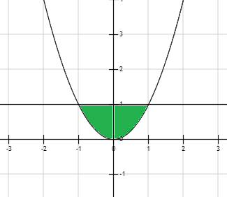
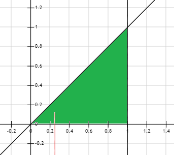
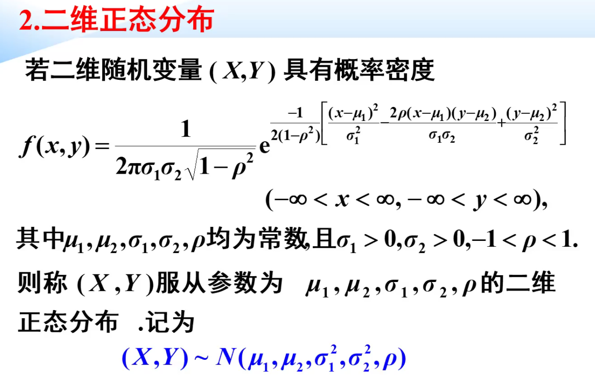
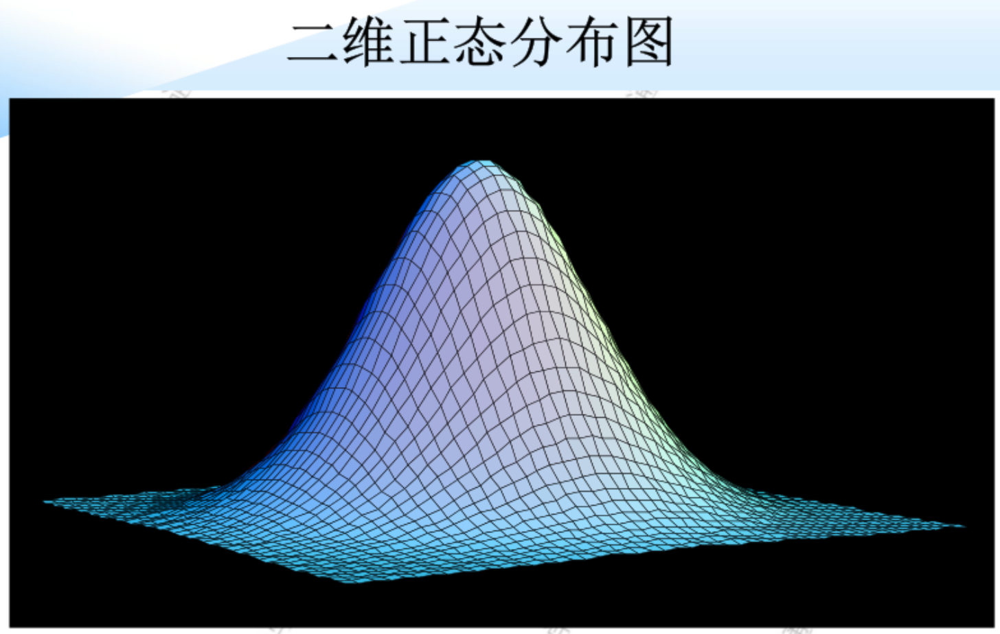

# 第三节 二维连续型随机变量

## 一、二维连续随机变量及其联合概率密度

### 1. 二维连续型随机变量的定义

> 定义 - 二维连续型随机变量
>
> 若存在非负且可积的二元实函数$f(x,y)$，且对于任意实数$x,y$，都存在函数$F(x,y)$，满足：
> $$F(x,y)=\int_{-\infty}^{y}\int_{-\infty}^{x}f(u,v)dudv$$
> 则称$(X,Y)$为**二维连续型随机变量**。
>
> 其中被积函数$f(x,y)$称为概率密度函数，或**称$(X,Y)$的联合概率密度**，  
> $F(x,y)$则为分布函数。

注：

* $(x,y)$取某一特定值，则$P(x,y)=0$
* $P(X\le x, Y \le y) = P(X\le x, Y<y) = P(X<x, Y\le y)=P(X<x,Y<y)$  
  即等号不影响连续性随机变量。

### 2. 联合概率密度x联和分布函数

联合概率密度性质：

* 非负性
* 规范性
* 与分布函数的关系：  
  $\frac{\partial^2F(x,y)}{\partial x\partial y}=f(x,y)$  
  **分布函数对两变量偏导**后，则**为联和概率密度**。
* 二维随机变量对应点$(X,Y)$落在区域$D$的概率：  
  $P((x,y)\in D)=\iint _Df(x,y)dxdy$

---

求联合分布函数：  
$$F(x,y)=\int_{-\infty}^{x}\int_{-\infty}^{y}f(u,v)dudv$$

**需要特别注意分区域讨论！**

### 3. 边缘概率密度x边缘分布函数

记二位连续随机变量$(X,Y)$的概率密度为$f(x,y)$，分布函数为$F(x,y)$，  
关于$X$的边缘分布函数：  
$F_X(x)=F(x,+\infty)=\int_{-\infty}^x\int_{-\infty}^{+\infty}f(x,y)\textrm{d}x\textrm{d}y\\=\int_{-\infty}^x[\int_{-\infty}^{+\infty}f(x,y)\textrm{d}y]\textrm{d}x$

此时令$\int_{-\infty}^{+\infty}f(x,y)\textrm{d}y=f_X(x)$，  
则$F_X(x)=\int_{-\infty}^xf_X(x)\textrm{d}x$

故$X$的边缘概率密度为：$f_X(x)=\int_{-\infty}^{+\infty}f(x,y)\textrm{d}y$

综上：

* 边缘概率密度：
  $$f_X(x)=\int_{-\infty}^{+\infty}f(x,y)\textrm{d}y$$
  $$f_Y(x)=\int_{-\infty}^{+\infty}f(x,y)\textrm{d}x$$
  注意这里的$(-\infty,+\infty)$积分范围，会根据积分变量的实际范围而变化。  
  比如$f_X(x)$中，如果$y\in(x^2,1)\quad(x\in(-1,1))$，  
  则$f_X(x)=\int_{x^2}^1f(x,y)dy$
* 边缘分布函数：
  $$F_X(x)=\int_{-\infty}^{x}f_X(u)\textrm{d}u$$
  $$F_Y(y)=\int_{-\infty}^{y}f_Y(v)\textrm{d}v$$

> 例题：
>
> 概率密度：
> $$f(x, y)=\left\{\begin{array}{lc}\frac{21}{4} x^{2} y, & x^{2} \leq y \leq 1 \\0, & \textrm{Others}\end{array}\right.$$
> 求边缘概率密度
>
> 解：
>
>   
> 区域如图所示。
>
> $$\begin{aligned}
> f_{X}(x) &=\int_{-\infty}^{+\infty} f(x, y) d y, \\
> &=\left\{\begin{array}{cc}
> \int_{x^{2}}^{1} \frac{21}{4} x^{2} y d y, & |x| \leq 1 \\
> 0, & |x|>1
> \end{array}\right.\\ &=\left\{\begin{array}{cl}
> \frac{21}{8} x^{2}\left(1-x^{4}\right), & |x| \leq 1 \\
> 0, & |x|>1
> \end{array}\right.
> \end{aligned}$$
> $$\begin{aligned}
> f_{Y}(y) &=\int_{-\infty}^{+\infty} f(x, y) d x \\
> &=\left\{\begin{array}{cc}
> \int_{-\sqrt{y}}^{\sqrt{y}} \frac{21}{4} x^{2} y d x, & 0 \leq y \leq 1 \\
> 0, & \textrm{Others}
> \end{array}\right. \\ &=\left\{\begin{array}{cc}
> \frac{7}{2} y^{\frac{5}{2}}, & 0 \leq y \leq 1 \\
> 0, & \textrm{Others}
> \end{array}\right.
> \end{aligned}$$

### 4. 条件概率密度x条件分布函数

$f_{X|Y}(x|y)$，代表在$Y=y$的条件下，$X=x$的概率密度是多少。

公式：
$$f_{X|Y}(x|y)=\frac{f(x,y)}{f_Y(y)}$$
$$f_{Y|X}(y|x)=\frac{f(x,y)}{f_X(x)}$$

仍为：联和概率密度除以边缘概率密度。

---

条件分布函数：
$$F_{X|Y}(x|y)=\frac{\int_{-\infty}^xf(u,y)\textrm{d}u}{f_Y(y)}$$
需要注意这里的$\int_{-\infty}^xf(u,y)\textrm{d}u$，  
先把确值$y$代进去，  
再求该函数从$-\infty$到$x$的积分（此时的函数既不是联和概率密度也不是边缘概率密度）。

> 例题：
>
> $f(x, y)=\left\{\begin{array}{cc}3 x & 0<x<1,0<y<x \\0 & \text{Others}\end{array}\right.$，求$P\{Y<\frac{1}{8}|X=\frac{1}{4}\}$
>
> 解：
>
> 示意图如图：  
> 
>
> $\begin{aligned}P\{Y<\frac{1}{8}|X=\frac{1}{4}\} & = F_{Y|X}(\frac{1}{8}|\frac{1}{4}) \\ &
> =\frac{\int_0^{\frac{1}{8}}f(\frac{1}{4},y)\textrm{d}y}{f_X(\frac{1}{4})} \\ &
> =\frac{\int_0^{\frac{1}{8}}\frac{3}{4}\textrm{d}y}{\int_0^\frac{1}{4}3x\textrm{d}y|_{x=\frac{1}{4}}} \\ &
> =\frac{\frac{3}{32}}{\frac{3}{16}} \\ &
> =\frac{1}{2}
> \end{aligned}$

---

跟离散型类似，  
**联合概率密度**也可以**用“边缘”乘“条件”概率密度**来算。

## 二、两个常用分布

### 1. 均匀分布

$D$为随机变量的有界区域，$S$为区域面积。

$$
f(x, y)=\left\{\begin{array}{ll}
\frac{1}{S}, & (x, y) \in D \\
0, & \text{Others}
\end{array}\right.
$$

则$(X,Y)$在$D$上服从均匀分布。

### 2. 二维正态分布

  

  
二维正态分布示意图

---

边缘概率密度：

* $X\sim N(\mu_1,\sigma_1^2)$  
  $f_X(x)=\frac{1}{\sqrt{2\pi}\sigma_1}e^{-\frac{(x-\mu_1)^2}{2\sigma_1^2}}$
* $Y\sim N(\mu_2,\sigma_2^2)$  
  $f_Y(y)=\frac{1}{\sqrt{2\pi}\sigma_2}e^{-\frac{(y-\mu_2)^2}{2\sigma_2^2}}$

可见：不同的$\rho$，虽然二维正态分布不同，但有可能其边缘分布（两个一维正态分布）相同。

---

* 若二维随机变量：  
  $(X,Y)\sim N(\mu_1,\mu_2,\sigma_1,\sigma_2,\rho)$，  
  则对应线性一维随机变量：  
  $aX+bY \sim N(a\mu_1+b\mu_2,a^2\sigma_1^2+b^2\sigma_2^2+2ab\sigma_1\sigma_2\rho)$（$a,b$为任意常数）
