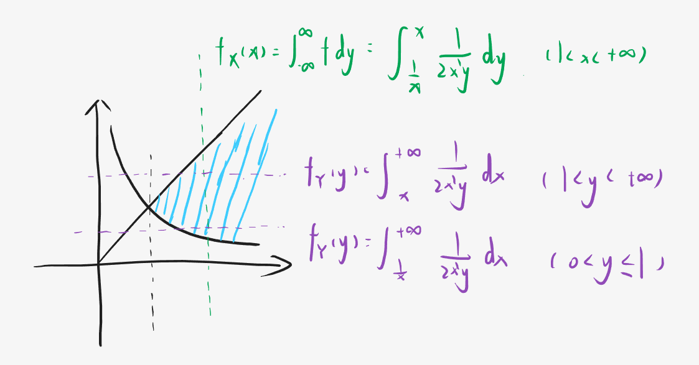
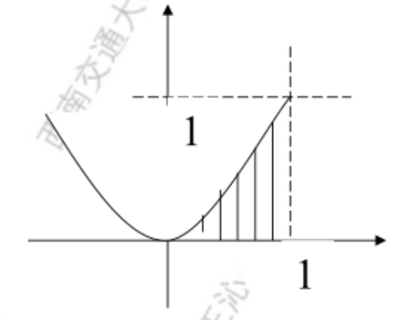

# 第四节 二维离散性随机变量的独立性

## 一、随机变量的相互独立性定义

> 定义：
>
> $F(x,y)$以及$F_X(x)$、$F_Y(y)$分别是二维随机变量$(X,Y)$的联和分布函数以及边缘分布函数。  
> 若对于所有的$x,y$，满足：
> $$F(x,y)=F_X(x)F_Y(y)$$
> 则随机变量$X$和$Y$是相互独立的。

充要判断方法：  
⭐**联合分布律**等于**边缘分布律的乘积**。

## 二、二维离散型随机变量的独立性

### 1. 离散型判断方式

对于二维离散型随机变量，  
可以反映到“分布律x边缘分布律表格”中：  
> 对于分布律表格中任意一格$p_{ij}$，  
> 其为其最下方$p_{\cdot j}$和最右方$p_{i\cdot}$的乘积。

### 2. 定理

1. 若联合概率分布表中，存在某个$p_{i_0j_0}=0$，  
   则$X$和$Y$必不相互独立。

## 三、二维连续型随机变量的独立性

## 1. 连续型判断方式

联和概率密度=边缘概率密度的乘积。  
⭐$f(x,y)=f_X(x)f_Y(y)$

故首先要**求边缘概率密度**。

> 例题 1：
>
> $f(x, y)=\left\{\begin{array}{cc}\frac{1}{2 x^{2} y}, & 1 \leq x<+\infty, \frac{1}{x} \leq y \leq x \\0, & \textrm{ 其它 }\end{array}\right.$
>
> 解：
>
> 
>
> 1. 判断积分区间  
>    如图像蓝色区域。
> 2. 计算边缘概率密度  
>    $f_X(x)=\int_{-\infty}^{+\infty}f(x,y)\textrm{d}y$，对不同的$x$分段。  
>    $f_Y(y)=\int_{-\infty}^{+\infty}f(x,y)\textrm{d}x$，对不同的$y$分段。  
>    最终分段结果如图。
> 3. 乘起来验证  
>    发现不等于联合概率密度，故不独立。

---

> 例题 2：
>
> $X,Y$相互独立，  
> $X$在$[0,1]$均匀分布，$Y$服从$\lambda=\frac{1}{2}$的指数分布，  
> 设$a$的二次方程：$a^2+2Xa+Y=0$，  
> 求有实根概率。
>
> **解：**
>
> 有实根 → $\Delta\ge0$ → $X^2\ge Y$  
> 相互独立，得$f(x,y)=\frac{1}{2}e^{-\frac{1}{2}y} \qquad (0<x<1, y>0)$  
> 得满足条件区域为如图阴影：  
> 
>
> $\begin{aligned}P\{X^2\ge Y\}&=\iint\limits_{x^2\ge y}f(x,y)\textrm{d}x\textrm{d}y\\&=\frac{1}{2}\int_0^1\textrm{d}x\int_0^{x^2}e^{-\frac{1}{2}y}\\&=\int_0^1(1-e^{-\frac{1}{2}x^2})\textrm{d}x\end{aligned}$
>
> **⭐注意：对于积分，如果发现有$e^{-Ax^2}$这一项的，需要转化为“正态分布”查表计算**  
> $\begin{aligned}P\{X^2\ge Y\}&=\int_0^1(1-e^{-\frac{1}{2}x^2})\textrm{d}x\\&=1-\sqrt{2\pi}\int_0^1\frac{1}{\sqrt{2\pi}}e^{-\frac{1}{2}x^2}\\&=1-\sqrt{2\pi}[\Phi(1)-\Phi(0)]\end{aligned}$  
> 然后查表得。

## 2. 性质

1. ⭐对于**二维正态分布**$N(\mu_1,\mu_2,\sigma_1,\sigma_2,\rho)$，  
   其$X,Y$相互独立的充分必要条件是：$\rho=0$

   且若二维正态分布独立，则**联合概率密度**直接等于两个边缘概率密度（**正态分布**）**的乘积**。
2. *自我总结：*对于极值函数来说