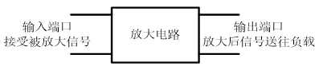
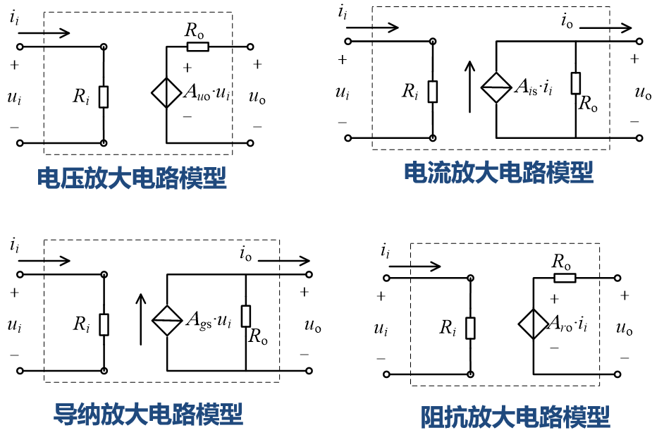
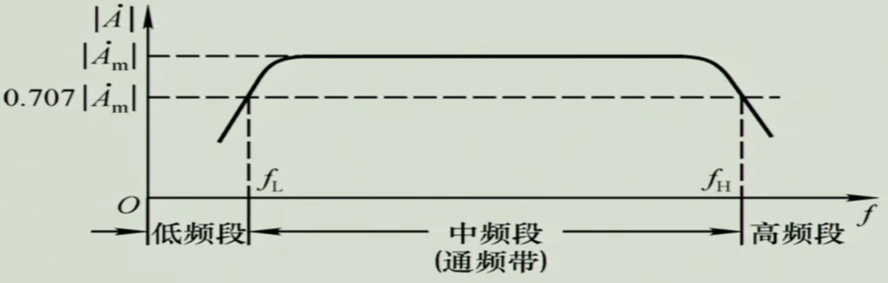

# 第一节 放大电路的基本概念

放大，即是将一个微弱的**小功率**信号等比放大成一个**大功率**信号。  
如麦克风和扩音器。

* 特征：功率的放大。
* 本质：能量的控制、转换、重新分配。
* 必要组件：能量控制元件（有源元件）。
* 前提：不失真。

## 一、基本概念

是一种功能模块电路，具有两个外接端口，  
输入端口接受需要放大的信号，  
输出端口将放大以后的信号送给负载。  

在放大电路中，信号的能量（或功率）得到增强，  
因此在放大电路中必须**具备能量补充的来源**。  
即为直流电源和将直流电源能量转换为信号能量的转换装置或器件。

---

注意放大不仅是电压对电压的放大，还可能是电流、电阻、电导的放大。  
故存在四种放大电路模型：  
  

主要研究电流和电压放大电路模型。

### 主要参数

1. 放大倍数
   1. $A_u=\frac{u_o}{u_i}$ - 电压放大倍数，$A_{uo}$为开路电压放大倍数。
   2. $A_i=\frac{i_o}{i_u}$ - 电流放大倍数，$A_{io}$为短路电流放大倍数。
   3. $A_r=\frac{u_o}{i_o}$
   4. $A_g=\frac{i_o}{u_i}$
2. 输入电阻$R_i$  
   反映了放大电路**对信号源的影响程度**。
   * 对于电压信号源 - $R_i$越大越好。
   * 对于电流信号源 - $R_i$越小越好。
3. 输出电阻$R_o$  
   反映了放大电路**输出受负载影响的程度**。
   * 输出电压信号 - $R_o$越小越好。
   * 输出电流信号 - $R_o$越大越好。（注意为并联，所以越大，分的流越小）
4. 频带范围  
   放大电路的放大倍数保持一定数值的工作信号频率范围。  
   而当频率小于或大于这一范围时，输出的放大信号会减小。  
   

   常用$3$分贝频带表示：  
   给出放大电路放大倍数**下降$3$分贝**（$0.707$倍正常值），所对应的上下两个频率界$f_L,f_H$。  
   分别称为上、下截止频率。
5. 不失真输出范围  
   在**不失真的前提**下，能够在负载上输出的最大电压、功率。  
   只有在这一范围内，输出信号与输入信号才能**保持线性关系**。
6. 输入信号范围  
   对于过大的输入信号幅度，可能引起有源电子器件（放大器件）进入非线性特性区，  
   从而使放大电路输出信号失真，严重可能损坏器件。  
   为此，放大电路常规定输入信号的幅度范围，如$|u_i|\le10\textrm{mV}$