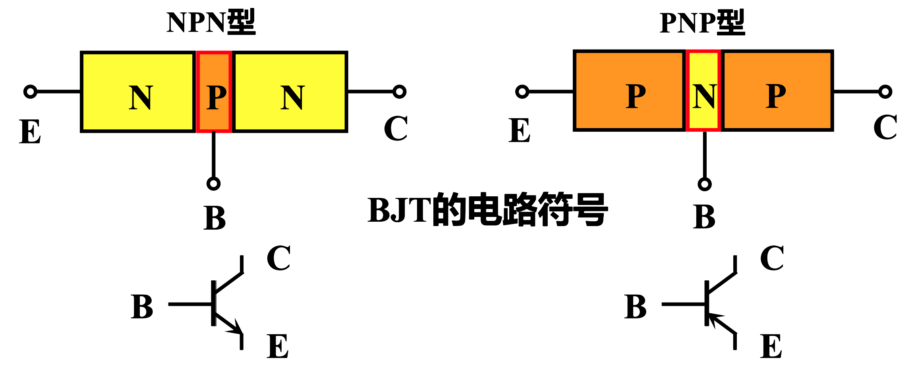
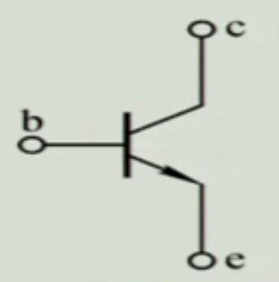
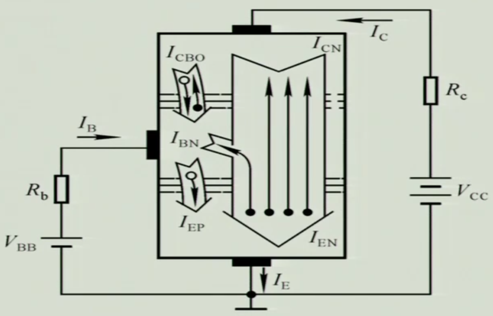
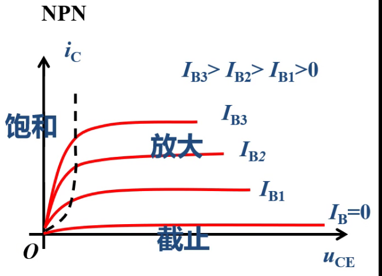
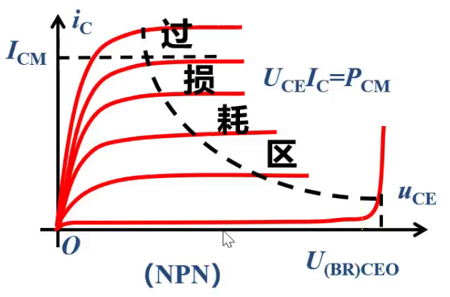

# 第二节 双极型晶体三极管及其电路模型

## 一、双极型晶体三极管

### 1. 基本信息。

双极型晶体三极管，简称晶体管、三极管、BJT。

其由两个PN结构成，有PNP和NPN两种类型。  

### 2. 结构特点

1. 最基本 - 三个区：
   * 发射区：发射载流子的区域。  
     因为要发射载流子，故**掺杂浓度最高**。
   * 基区：为一个控制区。  
     **掺杂浓度最低**，并且**极其薄**。
   * 集电区：收集载流子。  
     要收集载流子，故**掺杂浓度不能太高**，同时**面积应该最大**。  
     *类似仓库装东西，需要面积大，并且里面不能装杂物。*
2. 对应三个极：
   * 发射极(Emitter) - 用E表示。
   * 基极(Base) - 用B表示。
   * 集电极(Collector) - 用C表示。
3. 形成两个PN结
   * 发射结(Je)
   * 集电结(Jc)

对应三极管的电路符号：

箭头代表发射结导通方向。  
因此箭头标出来后，其指向为P到N,便可确定三极管是PNP还是NPN。

## 二、晶体管电流分配及放大原理

### 1. 工作效果

晶体管是**对电流的放大**。

以NPN型为例，先看现象：  
  
当基极B有一个电流$i_b$时，一定条件下C和E会通过一个电流，  
集电极会进来一个电流$i_c$。  
在一定工作条件下，**$\frac{i_c}{i_b}$为一个常数**，$i_c$是$i_b$的放大。  
这个常数就是放大倍数。

是一个控制元件，电流并不是自身产生的，  
而是**控制能量重新分配**。

### 2. 本质原理

基本的电路图如下：  

* $V_{BB}$ - 用以导通发射结，并吸收基区复合的自由电子，**形成控制电流$I_b$**。
* $R_b$ - 限流电阻
* $V_{CC}$ - 提供发射区的自由电子，故**提供放大电流$i_c$的能量**

发射结导通、处于正向偏置，简称正偏。  
集电结截止、处于反向偏置，简称反偏。

---

分析晶体管内部，其内部载流子的运动：  

1. 发射区 - 提供自由电子  
   发射结正偏 - 做扩散运动

   发射区大量的自由电子$e^-$，会向基区扩散。  
   基区的多子为空穴$e^+$,也向发射区扩散。  

   形成上图的两个电流：
   * $I_{EN}$ - 自由电子从E扩散到B，**电流方向反向**。
   * *$I_{EP}$ - 空穴从B扩散到E，电流同向。但空穴极少，因此**电流极小**，可以忽略。

   故形成的整个电流为：$I_{EN}(+I_{EP})$
2. 基区 - 扩散、复合并产生  

   从发射区扩散过来的自由电子$e^-$远远多于本身的多子空穴$e^+$。  
   会继续扩散，到集电区。

   但基区本身是P型，其**空穴会与自由电子发生复合**。  
   但正因为一下两点，保证了自由电子$e^-$的生存：
   1. 基区的**长度极短**
   2. 基区的**掺杂浓度极低**
   所以绝大多数都会顺利通过基区。  
   基区的长度和掺杂浓度决定了**复合的百分比**。

   但发生复合后的自由电子与空穴，会被$V_{BB}$所抵消。  
   > 假如$100$个自由电子，复合的比率为$2\%$，  
   > 当这两个自由电子与空穴复合后，  
   > $V_{BB}$出会瞬间抽走两个自由电子$e^-$，在B极附近重新产生两个空穴$e^+$。（就像普通的二极管导通，会形成电流）  

   若复合比率记为$A$，$n$个自由电子中，就可以看成：  
   有$(1-A)\cdot n$的电子向集电结E扩散，形成电流$I_{CN}$；  
   有$A\cdot n$的电子向基极B扩散，形成电流$I_{BN}$。  
   正因为这种比率固定，所以可以**粗略看出$I_B$与$I_C$成比例**。
3. 集电结反偏 - 促进电子收集（漂移运动）  
   集电结 - 收集自由电子

   要保证电流稳定（复合比率一定），  
   基区中聚集在集电结处的自由电子，需要被快速移走到集电区，  
   否则浓度不断提高，扩散速度减慢，呆的时间更长，复合比率更高。

   而正因为其反偏，存在上图中一个向下的很大的电场，  
   则集电结中的自由电子$e^-$，会被很快的收集到集电区中。（此时是主要漂移运动）

   而集电区的少子空穴$e^+$，基区的少子自由电子$e^-$，会因反偏而做微弱漂移运动，形成反向电流$I_{CBO}$

因此得到：

* 控制电流：$I_B\approx I_{BN}=I_B+I_{CBO}(-I_{EP})$
* 输出电流：$I_C\approx I_{CN}=I_C-I_{CBO}$

且要正常使用（能放大电流），  
一定要满足“**发射结正偏**”、“**集电结反偏**”。

### 3. 参数

1. 放大系数$\bar\beta$
   * 直流放大系数$\bar\beta=\frac{I_{CN}}{I_{BN}}$  
     故：
     $$\bar\beta\approx\frac{I_C}{I_B}$$
   * 交流放大系数$\beta=\frac{\Delta I_C}{\Delta I_B}$

   虽然不一样，但数值比较接近$\beta\approx\bar\beta$，故可看作同一个。
2. 穿透电流$I_{CEO}$  
   定义为基极开路$I_B=0$时，集电极C和发射极E的电流。
  
   正常情况下$I_B=0\rightarrow I_C=0$，  
   但实际上还有个很小的电流$I_{CEO}$
3. 方向电流$I_{CBO}$  

> 拓展 - 共基(B)放大电路
>
> 共用什么极，即使在构成的控制回路与输出回路中，共同经过了哪个极。
> 如共射，两者共同经过了发射极E。
>
> 对于共基放大电路，放大系数为$\bar\alpha\approx\frac{I_C}{I_E}=\frac{\bar\beta}{1+\bar\beta}, \alpha\approx\bar\alpha$

## 三、晶体管的特性曲线

### 1. 输入特性曲线

### 2. 输出特性曲线

1. 截至  
   $I_B\le0$的区域。  
   特征：**发射结反偏**（或零偏）、集电结反偏。

   整个电流为$0$，  
   $C$和$E$相当于开路。
2. 饱和
   特征：发射结正偏、**集电结正偏**。

   饱和时$U_{CE}$电压记为$U_{CES}$。

   此时$I_B$失去了对$I_C$的控制作用，
   $C$和$E$相当于短路。
3. 放大  
   特征：**发射结正偏、集电结反偏**。（满足正常工作要求）  
   $I_C$唯一由$I_B$决定，为晶体管的恒流特性。

## 四、晶体管的主要参数

### 1. 电压放大系数

直流电流放大系数：
$$\bar{\beta}=\frac{I_C}{I_B}$$

交流电流放大系数：
$$\bar{\beta}=\frac{I_C}{I_B}$$

### 2. 反向击穿电压

$U_{(BR)CEO}$

### 3. 集电极最大允许电流

$I_{CM}$

### 4. 集电极最大允许耗散功率

$P_{CM}$

需要满足：$U_{CE}I_C=P_{CM}$

安全区：
集电极电流不能超过$I_{CM}$

  
