# 第三节 双极型晶体三极管放大电路

## 一、基本（共射）放大电路

### 1. 构成放大电路的基本条件

* 特征：输入信号功率的放大
* 本质：输出回路中能量的控制、转换、重新分配
* 必要元件：有源元件（晶体三极管）
* 前提：**不失真**
* 测试信号：正弦波

### 2. 基本放大电路的组成

目标：小功率信号输入 → 大功率信号输出

1. 放大器件：三极管
2. 偏置电路 - 使放大器件处于放大状态（正偏反偏）  
   原本的偏置电路该如下图：  
   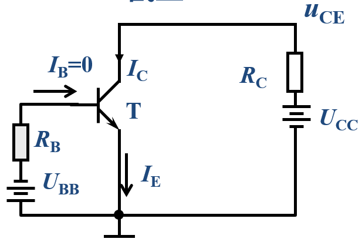  
   但这两个电源实际上可以简化成一个共同的电源，  
   只需要通过对$R_B$、$R_C$的控制，使得满足发射结正偏、集电结反偏即可。

   故偏置电路可以转化成下图：  
   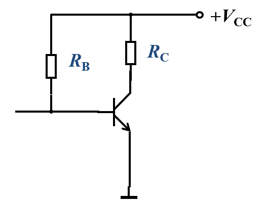  
   只用共同的电源$V_{CC}$。
3. 输入耦合电路 - 使输入信号源的信号顺利进入放大电路  
   即为小信号（交流）输入端的电路。

   为了防止直流信号$V_{CC}$影响输入端，  
   会在输入端处加个电容，排除其影响。

   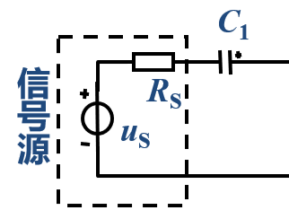
4. 输出耦合电路 - 使放大后的信号有效输出到负载上。  
   即为输出端的电路。

   对于输出，我们也希望只得到放大后的交流信号，  
   所以通常也加个电容，滤掉直流信号。

   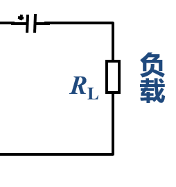

### 3. 基本放大电路的原理

$I_B$控制$I_C$，实际上**控制**的输出回路**电源**$V_{CC}$**输出多大电流**。

可以采用叠加定理分别分析大信号直流和小信号交流的情况。

对于大信号直流的分析，称为静态分析，其工作点称为$Q$点；  
对于小信号交流的分析，称为动态分析。

⭐基本放大电路图如图：  
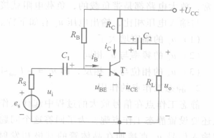

1. 对于直流：  
   电路中均为直流量，存在关系：  
   $U_{BE}$决定输入回路中的输入信号$I_B$，$I_B=\frac{U_{CC}-U_{BE}}{R_b}$，  
   然后根据放大倍数得$I_C=\bar\beta I_B$；  
   $I_C$又决定输出回路中电阻$R_C$的压降，  
   又可得$U_{CE}=U_{CC}-I_C\cdot R_C$。

   此时这输入输出回路分别的四个电流电压则为静态工作点，具体将在下面分析中讲解。
2. 对于交流：  
   当复合个交流信号$u_i$后，则会引起$u_{be}$的变化，  
   从而影响$i_b$的变化，  
   同样根据放大倍数得$i_c=\beta i_b$；  
   $i_c$又会引起电阻$R_C$压降的变化，  
   再使得$u_{ce}$变化，此时$u_{ce}$可以表示为$=(R_C||R_L)i_c$，  
   最终引起输出电压$u_o$的变化。  

*这一部分只用有个大概印象，具体看接下来的分析方法才会明白。*

### 4. 放大电路的工作波形

分别在输入输出端存在电压电流$2$个变量，即共有$4$个变量：

1. 输入电压$u_{BE}$
2. 输入电流$i_B$
3. 输出电流$i_C$
4. 输出电压$U_{CE}$

特性为：  

* $i_C$是$i_B$的倍数，  
* $U$是$U$的反相。

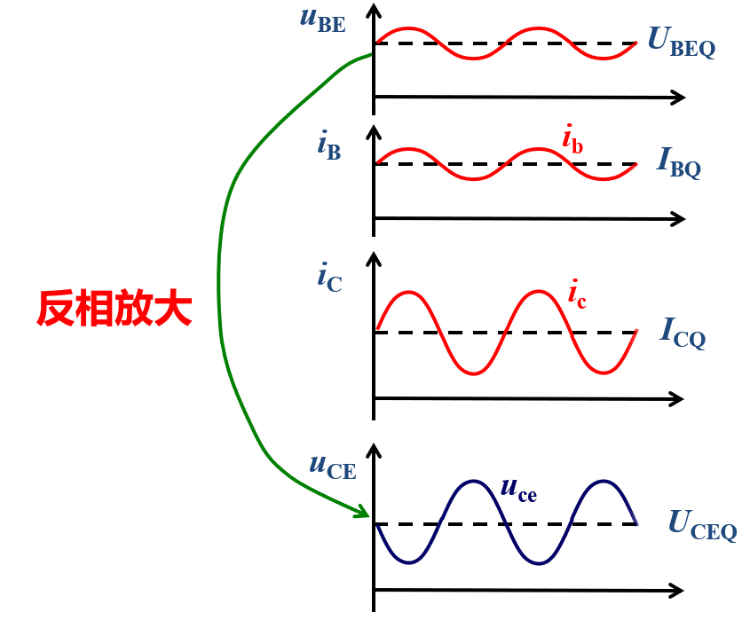

### 5. 放大电路的静态工作点设置

为了保证**输出波形不失真**，需要使放大电路中的晶体管始**终处于放大区**。  
故要设置合适的静态工作点，使得交流信号复加在其上时，不会因为变化而离开放大区。

* 如果静态工作点设置的过高（$I_{CQ}$过大） - 靠近饱和区  
  此时输入信号将可能在**正半周部分进入饱和区**，产生“饱和失真”。  
  表现在波形图中则是：输出波形底部失真（被削平或不是线性变化）。
* 如果静态工作点设置的过低（$U_{CEQ}$过大） - 靠近截至区  
  此时输入信号将可能在**负半周部分进入截至区**，产生“截至失真”。  
  表现在波形图中则是：输出波形顶部失真。

*也具体会在分析中讲原因。*

## 二、放大电路的分析

* 直流的来源：直流电源$V_{CC}$
* 交流的来源：被放大的信号$u_s$

按照上面的原理，  
这里分析也分成两个步骤：

1. 静态分析（直流） - 确定放大器件的工作状态  
   ⭐并确定静态工作点$Q$点。

   步骤：
   1. 画直流通路（只有直流量的等效电路）
   2. 求$I_B$、$I_C$、$I_E$、$U_{CE}$，确定静态工作点$Q$。
2. 动态分析（交流） - 分析放大电路性能

   步骤：
   1. 画交流通路（只有交流量的等效电路）
   2. 将三极管以“小信号模型”代替
   3. 求电压放大倍数$A_u$、输出电阻$R_i$、输出电阻$R_o$。

而两状态分析的方法均可以用：

* 图解分析 - 定性
* 等效电路分析 - 定量

### 1. 静态分析

静态：无信号输入，电路中只有直流电源作用。  
*故需将交流部分的信号源和负载擦去。*

1. 画直流通路
   * 电容$C$ → 开路  
     相当于把**信号源和负载擦除**。

   将电路转换为如下：  
   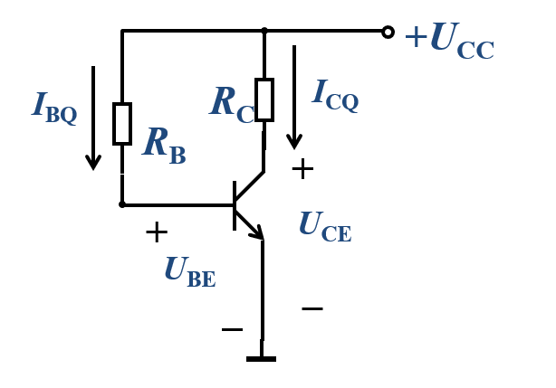
2. 求参数
   1. 图解法  
      

      求静态工作点$Q$点

      对于$U_{BE}$，其既满足本身的伏安特性曲线，也满足输入回路的KVL：
      $$U_{BE}=U_{CC}-R_BI_B$$

      在图像中，做出两条线，交点即求得$I_B$和$U_{BEQ}$  
      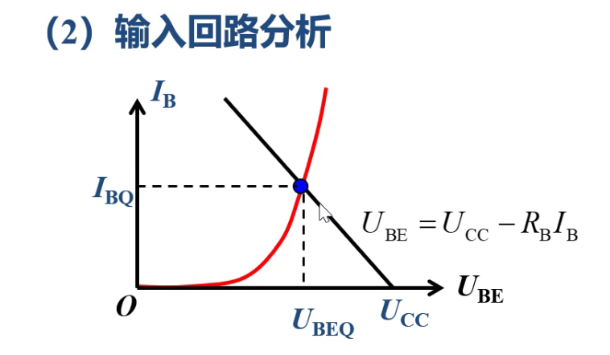

      对于输出回路同理，用输出特性曲线和输出回路的KVL：
      $$U_{CE}=U_{CC}-I_CR_C$$
      （这条线也称为直流负载线）

      然后再选择输入回路的中解得的$I_{BQ}$那条曲线，得到交点，求得$I_{CQ}$和$U_{CEQ}$，  
      而$I_{EQ}\approx I_{CQ}$。  
      
      > 直流负载线的变化：
      >
      > * $R_C\uparrow$：即$\frac{U_{CC}}{R_C}\downarrow$，纵轴交点向下移。
      > * $U_{CC}\uparrow$：横轴交点向右移，纵轴交点向上移。

      上两图中**两交点对应的$U$与$I$，即为我们要求解的量**。

   2. 等效电路分析  
      放大状态的三极管，其大信号模型为：  
      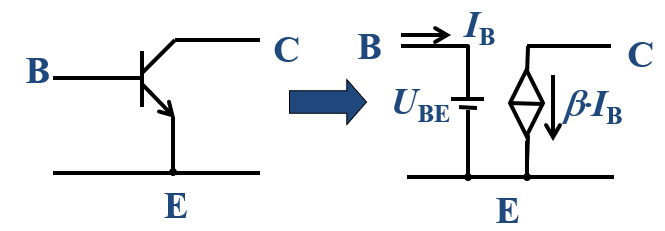

      故电路可以等效为：  
      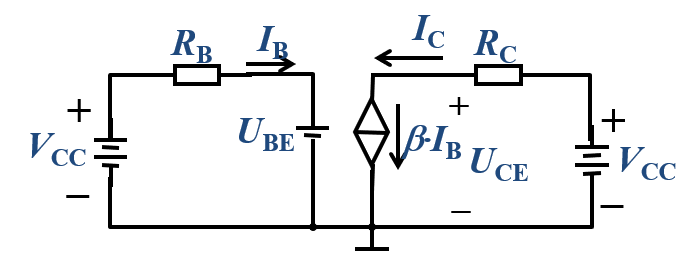

      1. 先根据三极管性质，把$U_{BE}$（导通压降）近似。  
         硅管$U_{BE}\approx0.7V$；锗管$U_{BE}\approx0.3V$。
      2. 算$I_{BQ}$
         $$I_{BQ} = \frac{U_{CC}-U_{BE}}{R_B}$$
      3. 算$I_{CQ}$
         $$I_{CQ} =\beta\cdot I_{BQ}$$
      4. 算$U_{CEQ}$
         $$U_{CEQ}=U_{CC}-R_C\cdot I_{CQ}$$

      *其实就按部就班的根据电路分析即可。*

      此时还可以**验证晶体管是否处于放大状态**：  
      * 如果$I_{BQ}<0$，处于截至区。
      * 如果$U_{CEQ}<U_{CES}(\approx0.3V)$，处于饱和区。

### 2. 动态分析

1. 画交流通路
   * 电容$C$ → 短路
   * 直流电源$U$ → 置零（对于端口等于接地）

   将电路转换为如下：  
   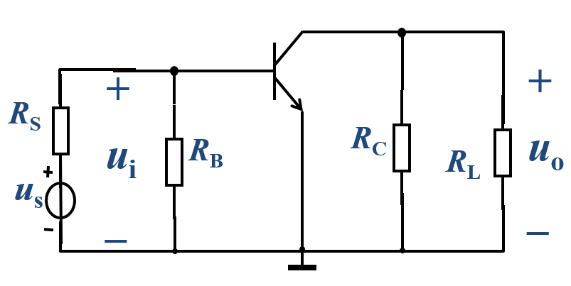  
   ⚠注意：对于[原电路](#3-基本放大电路的原理)直流电源接地后，$V_{CC}$连接的两点路$R_B$、$R_C$并不是擦除了。而是相当于**分别并联在了输入和输出回路**。
2. 求参数
   1. 图解法

      先分析输入回路中：  
      因为$U_{B'B}$附加上一个$u'_s$，所以对应的$I_{BQ}$、$U_{BEQ}$也会随之变化，  
      $I_{BQ}$的变化，会影响到输出回路中$U_{CEQ}$的变化。

      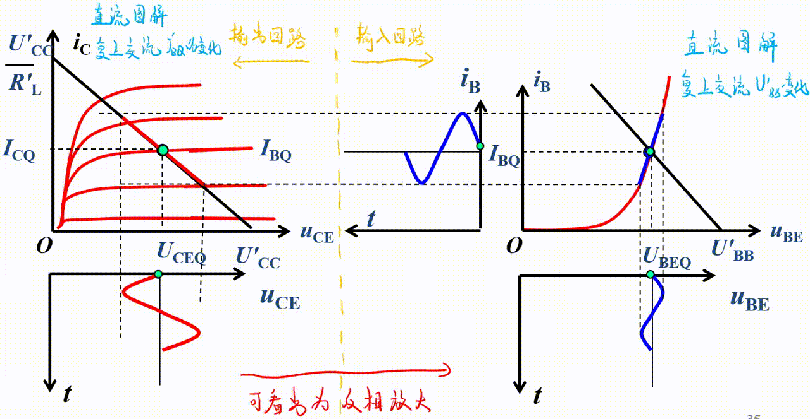  
      *图中的$U'_{BB}$、$U'_{CC}$意义为电阻并联后的电路总电压，详细见下分析2：*

      输出回路中，画的线也称交流负载线。

      > 分析1 - 失真：
      >
      > 由上图的输出回路中，交流负载线决定的$U_{CEQ}$可看出，  
      > 如果不失真，即要保证不被削顶削底。  
      > 所以最好**使得静态工作点的$U_{CEQ}$为交流负载线的中点**。
      >
      > 计算输出电压最大值：
      > $$U_{ce\max}=\min\{U_{CEQ}-U_{CES}, U'_{CC}-U_{CEQ}\}\le\frac{1}{2}(U'_{CC}-U_{CES})$$
      >
      > * $U_{CEQ}-U_ {CES}$，为到饱和区的距离。
      > * $U'_{CC}-U_{CEQ}$，为到截至区的距离。
      >
      > 如果$Q$点过低，输出信号顶部会被削去，称为“截止失真”。  
      > 此时为输入端所给电流$I_B$太小，或说输出端能提供的电流$I_{C\max}$太大。  
      > 解决方法：$R_C\uparrow$或$R_B\downarrow$
      >
      > 如果$Q$点过高，输出信号底部会被削去，称为“饱和失真”。  
      > 此时为输入端所给电流$I_B$太大，或说输出端能提供的电流$I_{C\max}$太小。  
      > 解决方法：$R_C\downarrow$或$R_B\uparrow$
      ---
      > 分析2 - 交流负载线的解析式，以及与直流负载线的区别：
      > 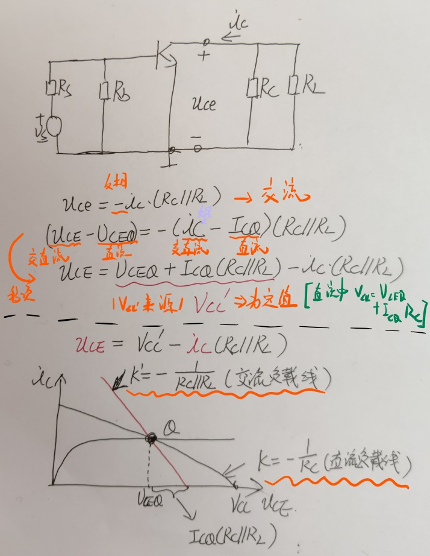
      >
      > 交流负载线与直流负载线不一样！  
      > 交流负载线会更陡一些。
      >
      > 同时可知：  
      > $U'_{CC}-U_{CEQ} = I_{CQ}(R_C||R_L)$  
      > 故最大不失真幅值还可以变化为：
      > $$⭐U_{ce\max}=\min\{U_{CEQ}-U_{CES}, I_{CQ}(R_C||R_L)\}$$

   2. 等效电路分析  
      用小信号模型，将三极管等效为两个回路。  
        
      基极和发射极之间等效为一个动态电阻，其阻值：
      $$⭐r_{be}=r_{bb'}+\frac{V_T}{I_{BQ}}$$
      其中$V_T=26mV$，$r_{bb'}$未给的话带$200\Omega$。

      集电极和发射极之间等效为一个受控源，其大小：
      $$i_c=\beta i_b$$
      注意$\beta i_b$与$i_b$的方向一致。

      开算：
      

      * 电压增益：
        $$A_u=\frac{\overset{\cdot}{U_o}}{\overset{\cdot}{U_i}}=\frac{-\beta i_b \cdot (R_C||R_L)}{i_b \cdot r_{be}}=-\beta\frac{R'_L}{r_{be}}$$
        符号只代表输入电压与输出电压反向。
      * 输入电阻：
        $$R_i=R_B||r_{be}$$
      * 输出电阻：
        $$r_o=R_C$$
        **注意与负载无关，需要先扔掉负载，再将输入信号短路（$\beta i_b=0$）**，则就是$R_C$。
      * 源电压放大倍数：  
        $A_{us}=\frac{U_o}{U_s}=\frac{U_o}{U_i}\cdot\frac{U_i}{U_s}=A_u\cdot\frac{U_i}{U_s}=A_u \cdot \frac{R_i}{R_i+R_S} = ...$
      * 最大不失真输出幅值：  
        $U_{o\max}=\min\{U_{CEQ}-U_{CES},R'_L\cdot I_{CQ}\}$  
        $U_{CEQ}$为静态分析所得；$U_{CES}$为器材性质，题上告诉。  
        $R'_L=R_L||R_C$；$I_{CQ}$为静态分析所得。

---

由此还可得到共射电路的一个特性：  
$A_u$为负数，输入与输出反相。

## 三、静态工作点稳定电路

为了保证放大电路的稳定工作，需要有合适、稳定的静态工作点。  
但实际上温度严重影响静态工作点。

因此需要改进。  
改进方法为利用负反馈。

---

需求：  
当$T\uparrow$，会使得$I_C\uparrow$，  
因此我们需要通过$I_B\downarrow$，来抑制$I_C$的增加。

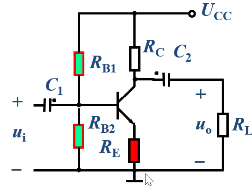  
相较于基本共射放大电路，多了$R_{B2}$和$R_E$。

当$I_C\uparrow$时，对应的$I_E\uparrow$，  
而因为$R_E$的加入，使得E极不再是接地$U_E=0$，而是$U_E=U_{R_E}$。

又因为$R_{B2}$的加入，使得B极不再直接与$U_{CC}$串联，  
此时$I_C$比较小，在$R_{B1}$、$R_{B2}$间就可以忽略，  
因此B极电位就是交点处的电位$\frac{R_{B2}}{R_{B1}+R_{B2}}U_{CC}$，记为$U_{BB}$，  
而这个不会随着温度的变化而变化。

因此B、E间的电位差$U_{BE}=U_{BB}-U_E$，会随温度升高而$\downarrow$，  
即会导致$I_B\downarrow$，从而导致$I_C\downarrow$√。

---

静态分析：

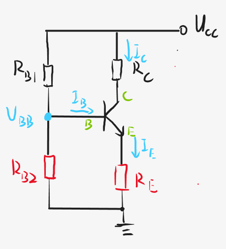

1. $$U_{BB}=\frac{R_{B2}}{R_{B1}+R_{B2}}U_{CC}$$
2. $$I_E=\frac{U_{BB}-U_{BE}}{R_E}$$
3. $$I_C\approx I_E=(1+\beta)I_B$$  
   注意$I_C$才等于$\beta I_B$，而$I_E=(1+\beta)I_B$
4. $$I_B=\frac{I_E}{1+\beta}$$
5. $$U_{CE}=U_{CC}-I_C\cdot R_C-I_E\cdot R_E$$

动态分析：

当电容短路，直流接地后，  
相当于$R_{B1}$翻下去与$R_{B2}$并联，$R_C$翻下去与$R_L$并联，  
记$R_B=R_{B1}||R_{B2}$，$R'_L=R_C||R_L$。

又因为集电极有一个电阻$R_E$，  
此时小信号模型代替的时候不能把集电极分开，而要都串上$R_E$。  
则等效如下：

* $$A_u=-\beta\frac{R'_L}{r_{be}+(1+\beta)R_E}$$
  $A_u=\frac{u_o}{u_i}$  
  $u_o=-\beta i_b\cdot R'_L$  
  $u_i$用$r_{be}$与$R_E$支路来算：$u_i=i_b\cdot r_{be}+(1+\beta)i_b\cdot R_E$。

  *虽然稳定了，但放大倍数小了。*
* $$R_i=R_B||[r_{be}+(1+\beta)R_E]$$
  因为$r_{be}$与$R_E$不同电流，不能直接串，  
  需要先转化为同电流，即将$R_E$扩大$(1+\beta)$倍。
* $$R_o=R_C$$

---

再次改进：  
使得直流时$R_E$保留，交流时不在。  
采用电容（直流开路、交流短路）。

* $A_u=-\beta\frac{R'_L}{r_{be}}$
* $R_i=R_B||r_{be}$
* $R_o=R_C$

## 四、射极输出器

是一个共集电极（共集）的放大电路，  
由发射极输出。

### 1. 静态分析

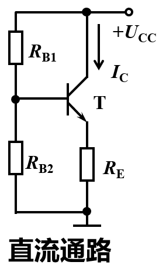

1. $$U_{BB}=\frac{R_{B2}}{R_{B1}+R_{B2}}U_{CC}$$
2. $$I_E=\frac{U_{BB}-U_{BE}}{R_E}$$
3. $$I_C\approx I_E=(1+\beta)I_B$$  
   注意$I_C$才等于$\beta I_B$，而$I_E=(1+\beta)I_B$
4. $$I_B=\frac{I_E}{1+\beta}$$
5. $$U_{CE}=U_{CC}-I_C\cdot R_C-I_E\cdot R_E$$

### 2. 动态分析

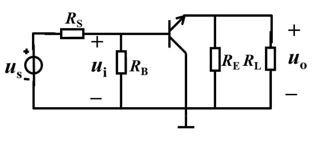  
*注意这里将发射机和集电极反了下。*

基极到射极是动态电阻，  
集电极到射极是受控源。