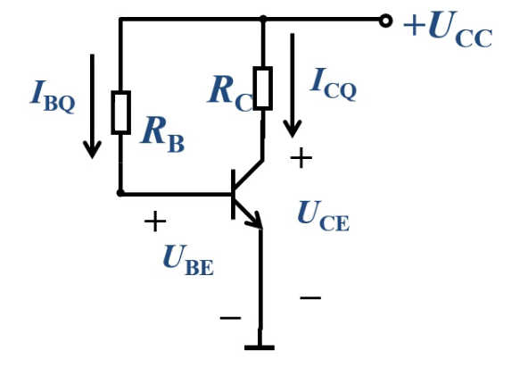
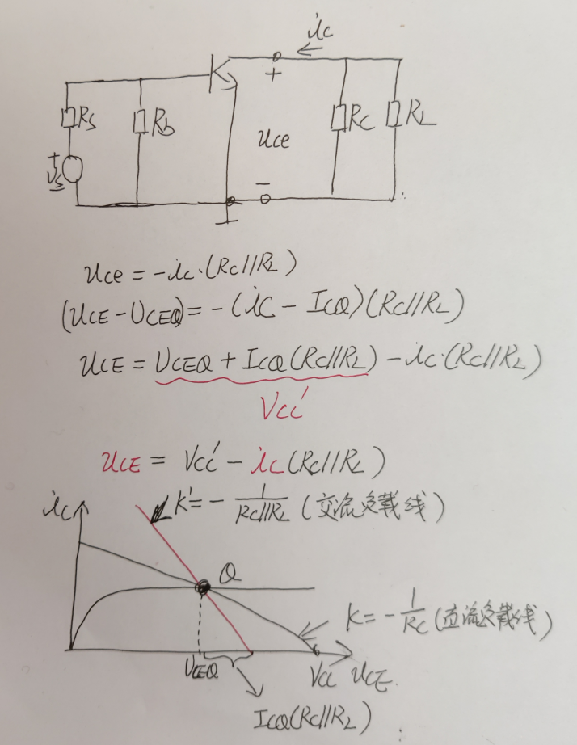

# 第三节 双极型晶体三极管放大电路

## 放大电路的组成

1. 放大器件
2. 偏置电路
3. 输入耦合电路
4. 输出耦合电路

## 放大电路的原理

## 放大电路的工作波形

$i_C$是$i_B$的倍数，  
$U$是$U$的反相。

## 二、放大电路的分析

* 直流的来源：电源
* 交流的来源：被放大的信号

分成两个步骤：

1. 静态分析（直流） - 确定放大器件的工作状态  
   静态工作点$Q$点。
   1. 画直流通路（只有直流量的等效电路）
   2. 求$I_B$、$I_C$、$I_E$、$U_{CE}$
2. 动态分析（交流） - 分析放大电路性能
   1. 画交流通路（只有交流量的等效电路）
   2. 将三极管以小信号模型代替
   3. 求电压放大倍数$A_u$、输出电阻$R_i$、输出电阻$R_o$

分析方法：

* 图解分析
* 等效电路分析

### 1. 放大电路的静态分析

静态：无信号输入，电路中只有直流电源作用。

1. 画直流通路
   * 电容$C$ → 开路  
     相当于把信号源和负载擦除。
2. 求参数
   1. 图解法：
      

      求静态工作点$Q$点

      对于$U_{BE}$，其既满足本身的伏安特性曲线，也满足输入回路的KVL$U_{BE}=U_{CC}-R_BI_B$。  
      在图像中，做出两条线，交点即求得$I_B$和$U_{BEQ}$  
      

      对于输出回路同理，用输出特性曲线和输出回路的KVL$U_{CE}=U_{CC}-I_CR_C$（这条线也称为直流负载线），  
      然后再选择输入回路的中解得的$I_{BQ}$，的交点，求得$I_{CQ}$和$U_{CEQ}$，  
      而$I_{EQ}\approx I_{CQ}$。  
      
      > 直流负载线的变化：
      >
      > * $R_C\uparrow$，下移？
      > * $U_{CC}\uparrow$，右移

   2. 等效电路分析
      

      主要把$U_{BE}$近似。  
      先算$I_{BQ} = \frac{U_{CC}-U_{BE}}{R_B}$，  
      然后算$I_{CQ}=\beta\cdot I_{BQ}$，  
      再算$U_{CEQ}=U_{CC}-R_C\cdot I_{CQ}$

### 2. 动态分析

1. 画交流通路
   * 电容$C$ → 短路
   * 直流电源$U$ → 置零（对于端口等于接地）
2. 求参数
   1. 图解法  

      先用输入回路中，因为$U_{B'B}$附加上一个$u'_s$，所以对应的$I_{BQ}$、$U_{BEQ}$也会随之变化，  
      $I_BQ$的变化，会影响到输出回路中$U_{CEQ}$的变化。

      > 分析 - 失真：
      >
      > 由上图的输出回路的交流负载线决定的$U_{CEQ}$可看出，  
      > 如果不失真，既要保证不被削顶。
      >
      > $U_{ce\max}=\min{U_{CEQ}-U_{CES}, U'_{CC}-U_{CEQ}}\le\frac{1}{2}(U'_{CC}-U_{CES})$
      >
      > 如果$Q$点过低，顶部会被削去，称为“截止失真”  
      > 解决方法：
      > 如果$Q$点过高，底部会被削去，称为“饱和失真”  
      > 解决方法：$R_C\downarrow$或$R_B\uparrow$

      画的线也称交流负载线
      > 分析 - 交流负载线：
      >   

   2. 等效电路分析
      用小信号模型，将三极管等效为两个回路。  
        
      关键：$r_{be}$、$i_b$、$\beta i_b$
      $$r_{be}=r_{bb'}+\frac{V_T}{I_{BQ}}$$
      其中$V_T=26mV$，$r_{bb'}$未给的话带$200\Omega$。  
      注意$\beta i_b$与$i_b$的方向一致。

      开算：
      

      * 电压增益
        $$A_u=\frac{\overset{\cdot}{U_o}}{\overset{\cdot}{U_i}}=\frac{-\beta i_b \cdot (R_C||R_L)}{i_b \cdot r_{be}}=-\beta\frac{R'_L}{r_{be}}$$
        符号只代表输入电压与输出电压反向。
      * 输入电阻
        $$r_i=R_B||r_{be}\approx r_{be}$$
      * 输出电阻  
        注意与负载无关，  
        需要先扔掉负载，再将输入信号短路（$\beta i_b=0$）
        $$r_o=R_C$$
      * 源电压放大倍数：$A_{us}=\frac{U_o}{U_s}=\frac{U_o}{U_i}\codt\frac{U_i}{U_s}=\A_u\cdot\frac{U_i}{U_s}=\frac{R_i}{R_i+R_S}$
      * 最大不失真输出幅值：$U_{o\max}=\min{U_{CEQ}-U_{CES},R'_LI_{CQ}}$

---

* 共射：输入回路和输出回路，公用发射极。  
  特征：$A_u$为负数，输入与输出反相。

## 三、静态工作点稳定电路

为了保证放大电路的稳定工作，需要有合适、稳定的静态工作点。  
但实际上温度严重影响静态工作点。

因此需要改进。  
改进方法为利用负反馈。

---

  
多了$R_{B2}$和$R_E$。

静态分析：

* $U_{BB}=\frac{R_{B2}}{R_{B1}+R_{B2}}U_{CC}$
* $R_B=R_{B1}||R_{B2}$
* $I_{CQ}=\frac{U_{BB}-U_{BE}}{R_E}$

动态分析：

  
等效电路

* $A_u=-\beta \frac{R'_L}{r_{be}+(1+\beta)R_E}$  
  虽然稳定了，但放大倍数小了。
* $R_i=R_B||[r_{be}+(1+\beta)R_E]$  
  因为$r_{be}$与$R_E$不同电流，不能直接串，  
  需要先转化为同电流，即将$R_E$扩大$(1+\beta)$倍。
* $R_o=R_C$

再次改进，  
使得直流时$R_E$保留，交流时不在。  
采用电容（直流开路、交流短路）。

---

* $A_u=-\beta\frac{R'_L}{r_{be}}$
