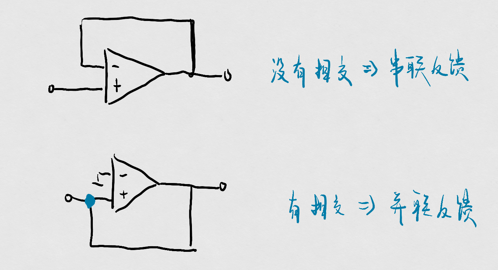
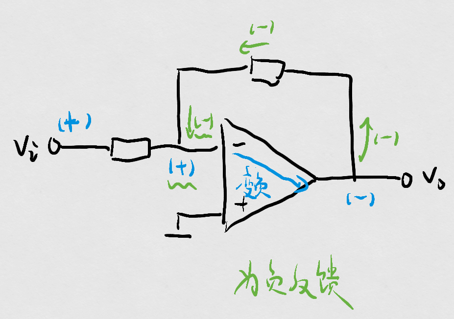
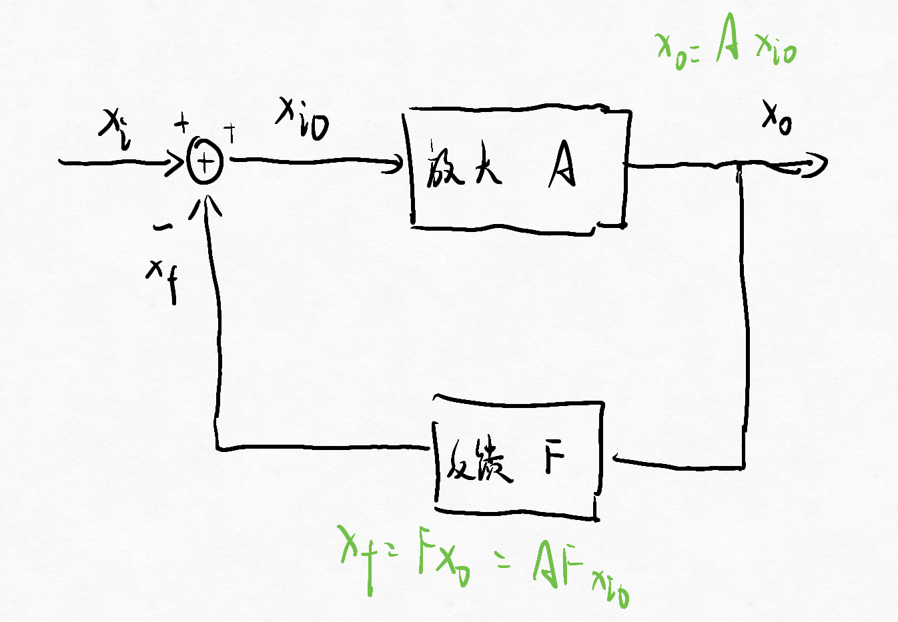

# 第四节 放大电路中的负反馈

拿到一个电路首先要判断：

1. 有没有反馈？
2. 是什么类型的反馈？
   1. 直流反馈/交流反馈
   2. 电压反馈/电流反馈
   3. 串联反馈/并联反馈
   4. 正反馈/负反馈
3. 负反馈对性能的影响？
4. 深度负反馈的计算。

## 一、有没有反馈

即输出通过反馈网络又介入到输入。

* 无反馈：开环。
* 有反馈：闭环。

反馈分为两种：

1. 局部反馈：自己与自己反馈。
2. 全局反馈：自己跟之前的反馈。

## 二、什么类型的反馈

### 1. 直流/交流反馈

把输出端的直流信号反馈回来就叫直流反馈，反之为交流反馈。  
如果两个都有，则为交直流反馈。

通常通过电容阻断直流、电感阻断交流实现。

---

如果有直流反馈，会影响静态工作点；  
如果有交流反馈，会影响$A,R_i,R_u$。

### 2. 电压/电流反馈（针对输出）

判断方法：负载短路法

将负载$R_L$短路，  
如果反馈量为$0$——电压反馈；  
如果反馈量还在——电流反馈。

**注意不是直接接地**，而只是把负载电阻给短路（擦去）。  
并且注意$v_o$所标的位置，把这部分短路。

### 3. 串联/并联反馈（针对输入）

就看反馈回来与输入端是否相交在一个节点（端口）上，  
如果没有相交，则为串联反馈；  
有相交，则为并联反馈。

### 4. 正/负反馈

看反馈引入后，对净输出量是增强还是减弱。  
**不能说送到哪个极就是哪个反馈。**

1. 反馈与输入接在同一端的判别方法 - 瞬时极性法：

   1. 把反馈通路断开
   2. 假设输入为$+$极性，然后通过输出后再通过反馈电路，并一直判断这条路上各处的极性。
   3. 如果反馈回来的与之前的极性相反，则为负反馈，反之为正反馈。

   
2. 反馈与输入接在不同端的判别方法 - 公式法：

   $$
   v_o=v_+-v_-
   $$
   当对应的输入增大时，若造成输出减小，则为负反馈，反之为正反馈。

### 5. 四种组态

对于正负反馈，会有四种组态：

1. 电压串联
2. 电压并联
3. 电流串联
4. 电流并联

全称为：**电压串联负反馈**放大电路。

对于输出端是输出什么，主要取决于是什么组态。

* 输入 - 串联/并联
  * 串联：输入端为电压求和
  * 并联：输入端为电流求和
* 输出 - 电压/电流
  * 电压：输出端为电压
  * 电流：输出端为电流

$x_{id}=x_{i}\pm x_{f}$  
正负反馈 - 决定正负号  
串并连 - 决定是电压还是电流

## 三、负反馈对增益的影响

没有反馈时，增益就是$A$，称为开环增益，  
当引入负反馈时，反馈系数$F=\frac{x_f}{x_o}$，  
$A_f=\frac{x_o}{x_i}=\frac{x_o}{x_{io}+x_f}$，最终得到：  
$$
A_f=\frac{A}{1+AF}
$$

一般$1+AF>1$，故增益会变小。

---

存在好处：

1. 提高增益稳定性  
   增益的相对变化量减小，增益稳定性提高。

   当$|1+AF|\gg 1$时，称为深度负反馈，此时$\dot A_f\approx\frac{1}{F}$，  
   并且$X_f\approx X_i$，反馈量近似等于输入量；  
   $X_{io}\approx0$，净输入量近似等于0。  
   *这也是虚断虚断的来源。*
2. 输入电阻变化
   * 并联 - 减小：$R_{if}=\frac{R_i}{1+AF}$
   * 串联 - 增大：$R_{if}=(1+AF)R_i$
3. 输出电阻变化
   * 电压 - 减小：$R_{of}=\frac{R_o}{1+AF}$
   * 电流 - 增大：$R_{of}=(1+A_sF)R_o$