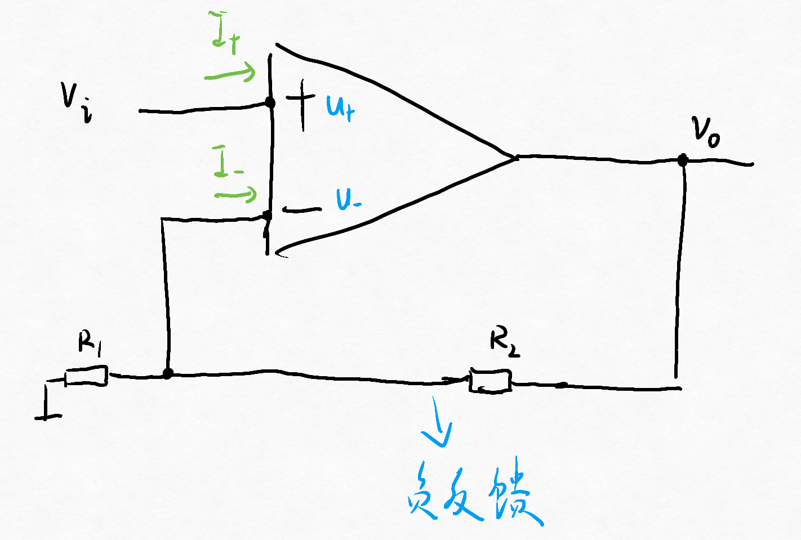
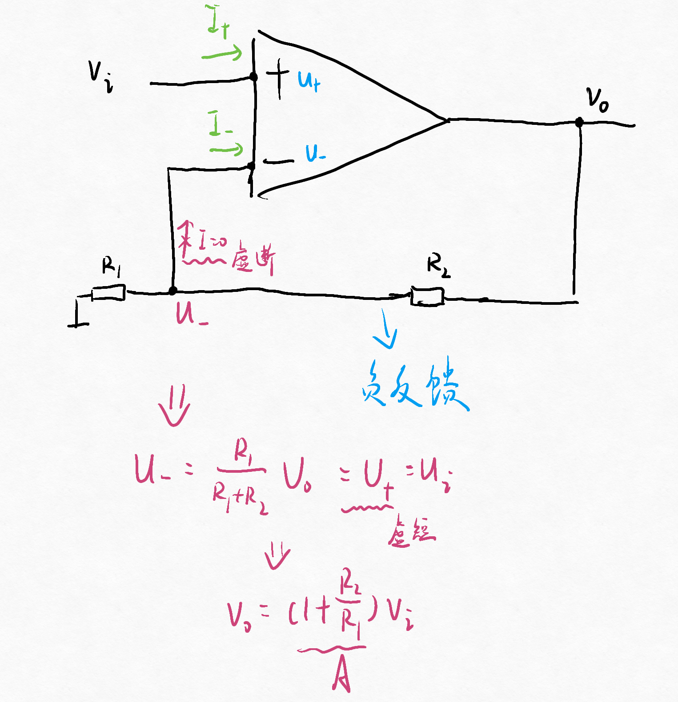
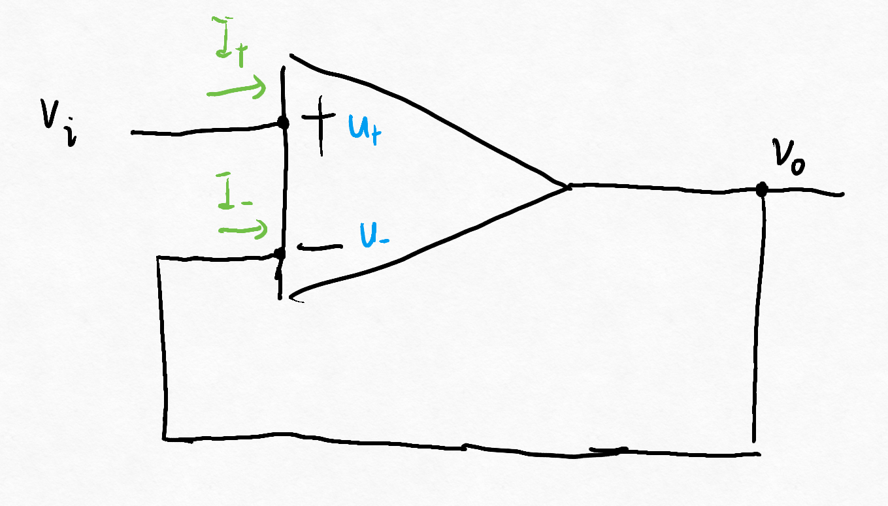
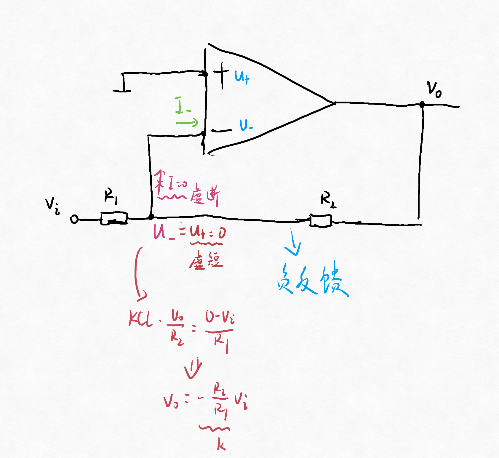
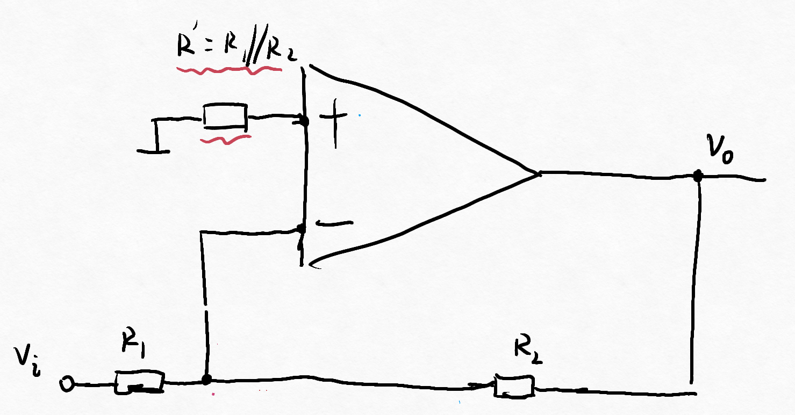

# 第二节 放大电路

## 一、同向放大电路

如果存在负反馈（输出反馈到负输入端时），则满足下两个性质：

1. 虚短：$U_+\approx U_-$
2. 虚断：$I_+\approx I_-\approx0$

下面用这两个性质进行分析：  

* 电压增益：$A=k=1+\frac{R_2}{R_1}$
* 输入电阻：$R_i=\frac{v_i}{i_i}=\infty$
* 输出电阻：$R_o\approx0$

> 特例 - 电压跟随器：
>
> 上图中输出直接连到负输入端。  
> 
>
> 此时电压增益$A=1$，故称电压跟随器。

## 二、反向放大电路

*即要使得$A<0$。*  
*注意不能直接将正负端对换，否则会变成正反馈电路。不满足虚断虚短*

* 电压增益：$A=k=-\frac{R_2}{R_1}$
* 输入电阻：$R_i=\frac{v_i}{i_i}=R_1$
* 输出电阻：$R_o\approx0$

比较简单，故一般选择反向放大电路。

> 拓展 - 实际电路：
>
> 有时候为了平衡，会在正输入端加个电阻，  
> 但不影响原电路。
>
> 