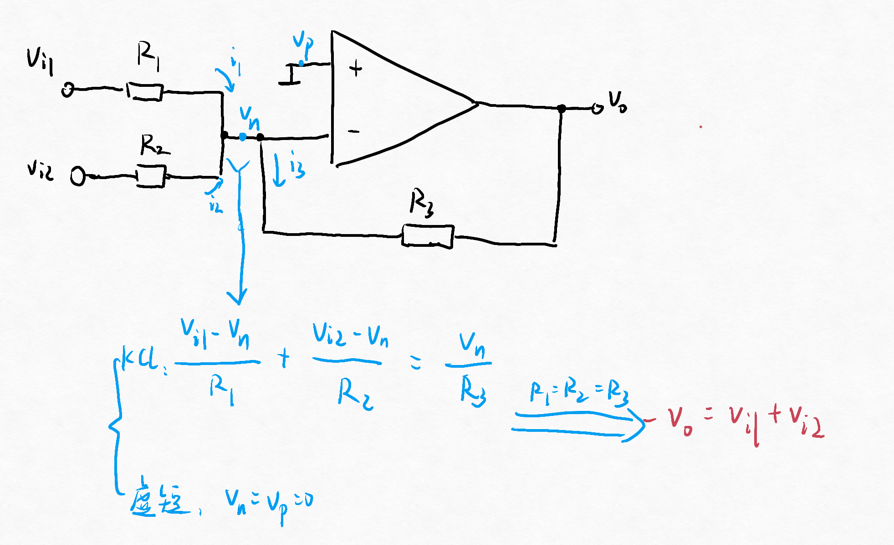
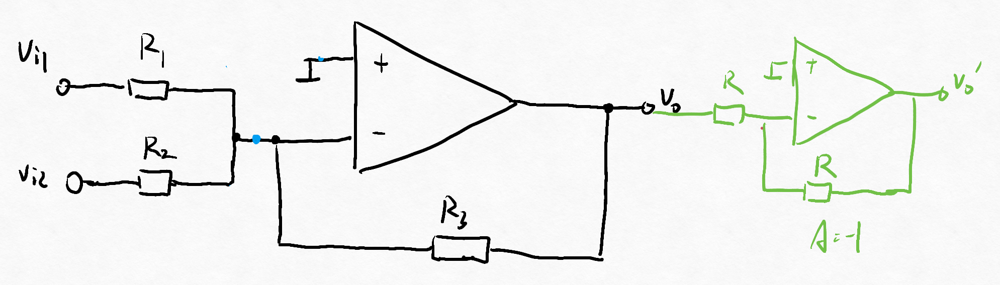
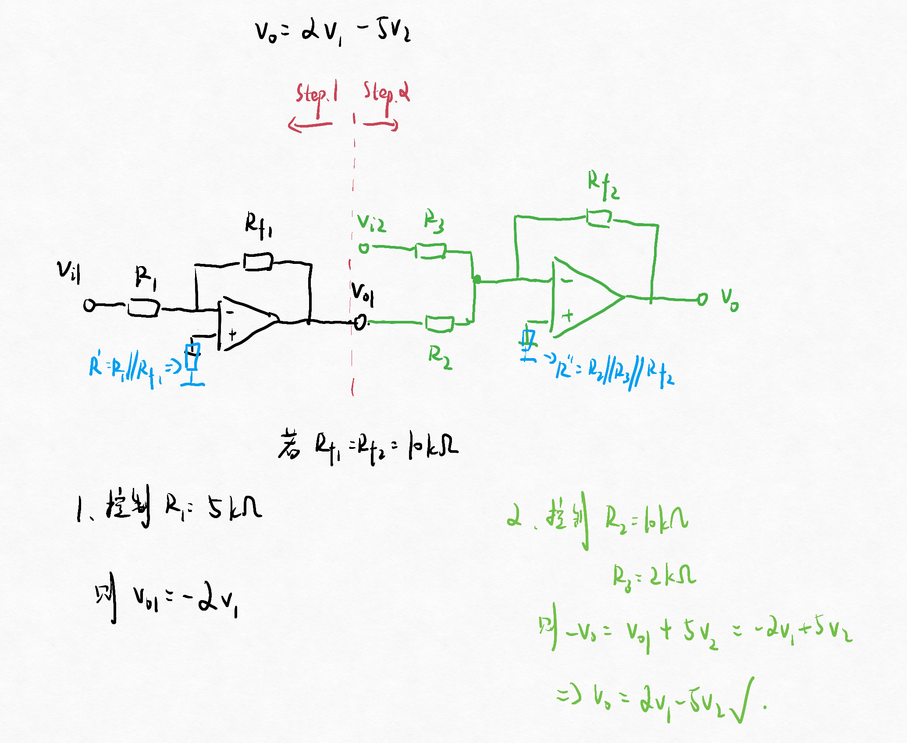
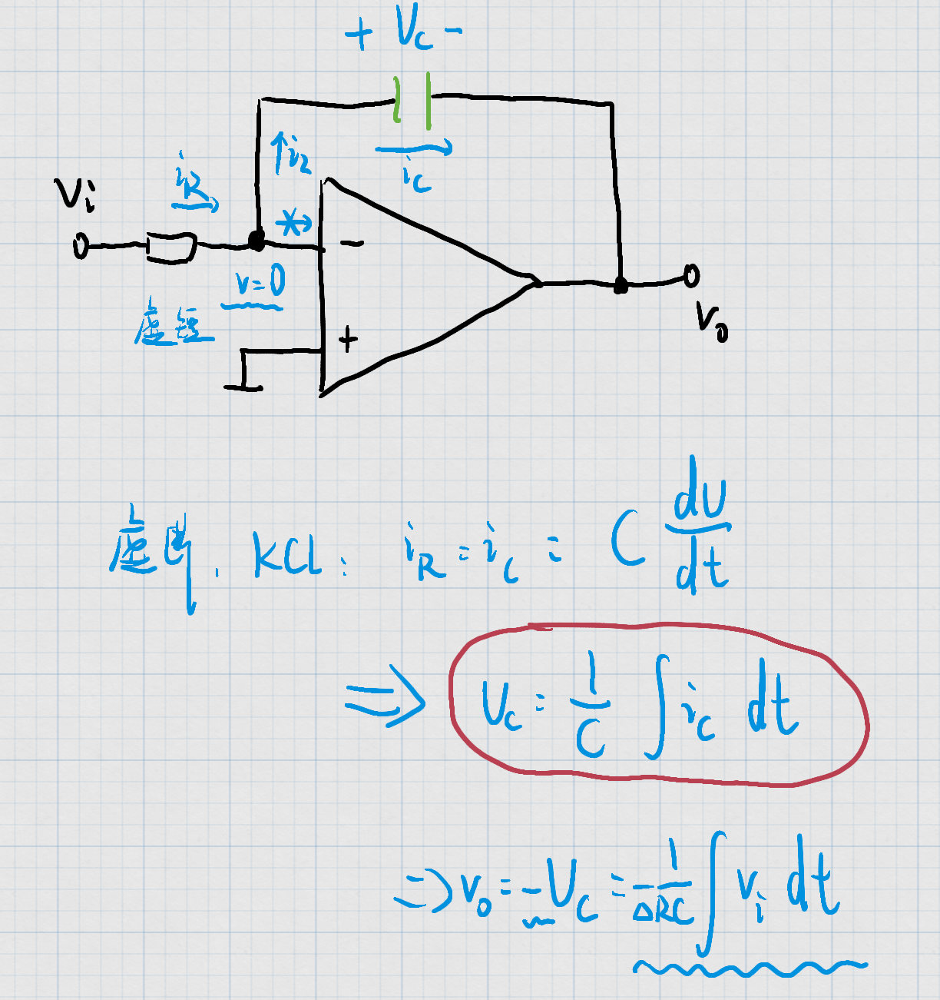
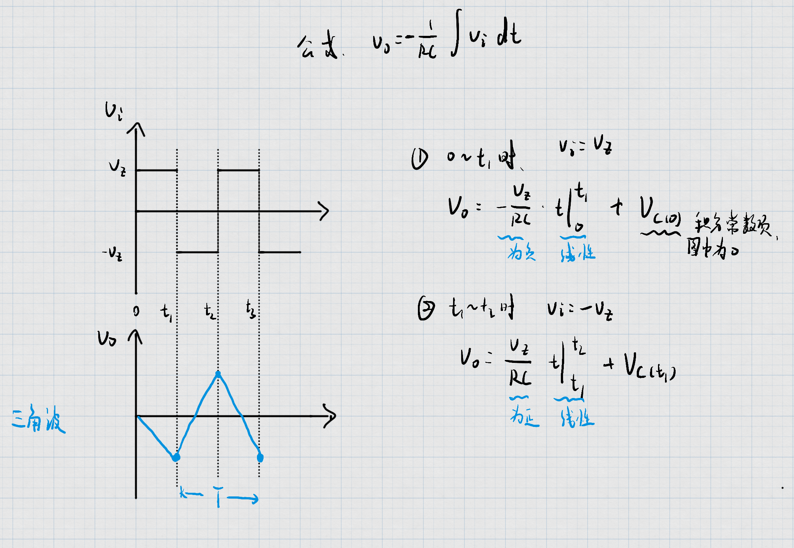

# 第三节 运算电路

基本都由反向放大器改装而成。

## 一、加法电路

可见输出电压是两个输入电压的和的负数。

要使输出电压为正数，可以再加个反向放大器。  
  
$v_o'=k_1v_1+k_2v2$，其中：

* $k_1=\frac{R_3}{R_1}$
* $k_2=\frac{R_3}{R_2}$

## 二、减法电路

$v_o=k_1v_1-k_2v_2 \Rightarrow -v_o=-k_1v_1+k_2v_2$，  
采用以下两步：

1. 先利用“反向放大电路”，将$v_1\rightarrow-k_1v_1$，  
2. 然后再利用“加法电路”，输出$-v_0=-k_1v_1+k_2v_2$

> 例 - 实现$v_o=2v_{i1}-5v_{i2}$：
>
> 

## 三、积分电路

电容的电流$i_c=C\cdot\frac{\textrm{d}U_c}{\textrm{d}t}$，为一个微分运算。  
所以可以用电容构成积分电路。

$$
v_o=-\frac{1}{RC}\int v_i \textrm{d}t
$$

若有变化（比如加了一个输入），主要运用红圈部分的公式。

以下考虑不同输入信号积分后的输出。

### 1. 方波输入

