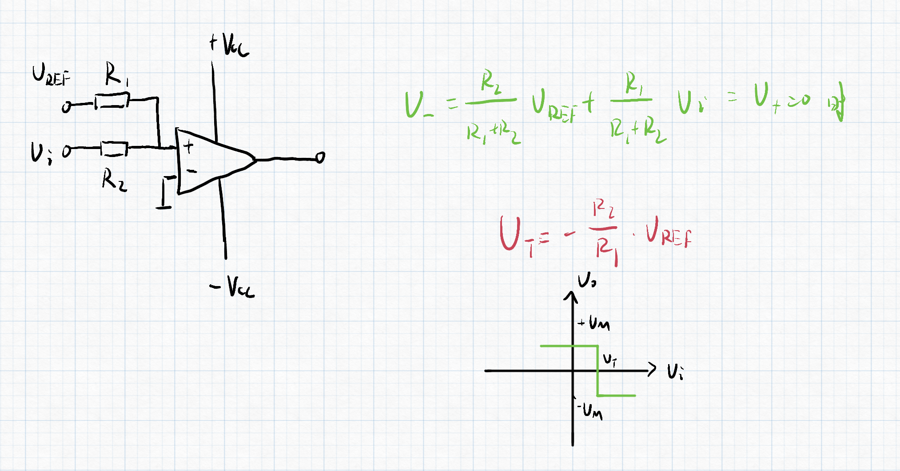

# 第四节 比较电路 - 电压比较器

为集成运算放大器的非线性运用。  
要工作在非线性区，要**构成开环**，或者**引入正反馈**。

## 一、概述

* 功能：就是比较电压的大小。  
  输入电压是模拟信号，输出电压表示比较的结果，只有高电平和低电平这二值信号。  
  故达成**模拟信号到数字信号的转变**。
* 描述方法：$u_o=f(u_i)$
* 传输特性的三个要素：
  1. 输出高电平$U_{OH}$和输出低电平$U_{OL}$
  2. 阈值电压$U_T$ - 使输出电压发生跃变所对应的输入电压。
  3. 输入电压超过阈值电压时，输出电压跃变的方向。

---

常用的电压比较器：

* 单限比较器：只有一个阈值电压。
* 滞回比较器：具有滞回特性。  
    
  正向和反向的阈值电压不同。

## 二、构成

### 1. 一般单限比较器（开环）

  

* 当$U_+>U_-$，即$U_I>0$时：$U_O=+U_{OM}>0$
* 当$U_+<U_-$，即$U_I<0$时：$U_O=-U_{OM}<0$

若为从左下到右上，则为正端输入；  
若为从左上到右下，则为负端输入。

如果没有给最大输出幅值$U_{OM}$，则取决于继承运放的电源电压$V_{CC}$。

1. 过零比较器
   
   * 阈值电压$U_T=0$
   * 输出高低电平$U_{OH}=+U_{OM}$，$U_{OL}=-U_{OM}$。

   在输出端后并联稳压管接地，可以控制高低电平。  
   但需要在之前加一个限流电阻$R$，否则烧坏稳压管。
2. 一般单限比较器  
   
   * 阈值电压$U_T=U_{REF}$  
     改变阈值，会改变占空比（一个周期内高电平占比），但**周期不变**。

   另一种一般单限比较器：  
     

### 2. 迟滞电压比较器（正反馈）

用于提高比较器的抗干扰能力，  
在阈值附近来回不稳定波动时，需要使得输出电平不变。

可以用迟滞电压比较器来消除干扰，电路图如下：  

---

分析：

  

---

改装：

1. 改变跃变方向（变为同相输入）  
   
2. 左右平移特性曲线  
   使上分析的$U_-\ne0$，则$|V_{T+}|\ne|V_{T-}|$
