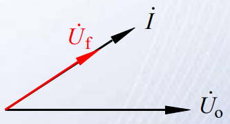

# 第一节 正弦波振荡电路

## 一、条件和电路组成

### 1. 条件

无外加信号，输出一定频率一定幅值的信号。  
信号的来源为电路中初始自带的微弱电扰动，需要对其放大。  
由于要自激（放大电扰动），需要引入**正反馈**，且振荡频率可控为$f_0$。

输入量就为反馈量，并且要使得电路稳定平衡，  
则要满足$\dot X_o=\dot A\dot F\dot X_o\Rightarrow \dot A \dot F =1$。

将向量转换为模和相位，可得两个平衡条件：

* 幅值平衡条件：$|\dot A \dot F|=1$
* 相位平衡条件：$\varphi_A+\varphi_F=2k\pi$

刚开始起振的时候，需要使$|\dot A\dot F|>1$，对噪音信号进行放大利用，  
再通过选频，只放大需要的信号，抑制不需要的信号。  
即为：

* 起振条件：$|\dot{A}\dot F|>1$

后面选出需要的信号并达到需要的幅值时，再控制$|\dot A\dot F|=1$

### 2. 基本组成部分

* 放大网络：放大作用
* 正反馈网络：满足相位条件
* 选频网络（放在正反馈网络里）：确定输出频率$f_0$，保证产生正弦波振荡
* 稳幅电路：**非线性环节**，稳幅（使$|\dot{A}\dot{F}|\to1)$

> 由输入输出图分析起振过程：
>
>   
> 对$F$来说，纵轴代表输入量$\dot X_o$，横轴代表输出量$\dot X_f$，  
> 对$A$来说，横轴代表输入量$\dot X_f$，纵轴代表输出量$\dot X_o$。
>
> 刚开始有一个$X_o$（电扰动），输入到$F$中，产生输出$X_f$，  
> 接下来$X_f$输入到$A$中，产生输出$X_o$。
>
> 如此往复，最终所有输入输出都会汇于$A,F$的交点。  
> 
>
> 因此，要能满足稳定振荡，必须两线存在交点，  
> 即“**非线性环节**”是十分重要的。
>
>   
> 对于这种电路，也能满足自激振荡。  
> 而如果为两直线没交点，不会产生自激振荡。

### 3. 分析方法

1. 是否有四个基本组成部分。
2. 放大电路 - 能否正常工作，有没有合适的Q点，信号是否正常传递，有没有被短路断路。
3. 是否满足相位平衡条件
4. 是否满足两个幅值条件，且能从放大幅值条件转化为平衡幅值条件。

### 4. 分类

1. RC正弦波振荡电路：产生低频信号。
2. LC正弦波振荡电路：频率更高。
3. 石英晶体正弦波振荡电路：振荡频率稳定，用于做时钟信号。

## 二、RC正弦波振荡电路 - RC串并连式

### 1. 正反馈网络x选频网络

*为RC的核心部分，也是名字的由来。*

  

**定性分析：**

1. 低频输入 - $C$的容抗很大  
   
   * 串联部分：只考虑$C$（$R$容抗相较于$C$忽略不计)
   * 并联部分：只考虑$R$（$C$容抗相较于$R$太大，电流很小）

     
   以$\dot{U_0}$为基准，此时因为存在电容$C$，电流$\dot{I}$一定超前于$\dot{U_0}$，  
   *Tip: 对于电容，电流超前电压$90°$*  
   又因为输出为电阻$R$上电压，所以$\dot{U_f}$同$\dot{I}$方向。

   当$f\to0$时：$|\dot{U_f}|\to0$且$\varphi_f\to+90°$，  
   则效果：**选低频中的高频**。
2. 高频输入 - $C$的容抗很小  
     
   * 串联部分：只考虑$R$（$C$容抗相较于$R$忽略不计)
   * 并联部分：只考虑$C$（$R$容抗相较于$C$太大，电流很小）

     
   以$\dot{U_0}$为基准，此时因为存在电容$C$，电流$\dot{I}$一定超前于$\dot{U_0}$，  
   又因为输出为电容$C$上电压，所以$\dot{U_f}$落后$\dot{I} 90°$。

   当$f\to\infty$时：$|\dot{U_f}|\to0$且$\varphi_f\to-90°$，  
   则效果：**选高频中的低频**。

**定量分析：**

最终得到公式：
$$
\dot{F}=\frac{1}{3+\textrm{j}(\frac{f}{f_0}-\frac{f_0}{f})}
$$
其中$f=\frac{1}{2\pi RC}$。

**当$f=f_0$时，$|\dot{F}|_{max}=\frac{1}{3}$，且$\varphi=0$**

### 2. 放大网络

起振时：  
由条件$|\dot{A}\dot F|>1$，以及正反馈网络的输出，  
得到放大网络$|\dot A|$条件：

* $|\dot A|>3$
* $\Delta\varphi=0$

同时因为选频部分（正反馈网络），$|\dot A|$还要满足：

* 输入电阻$R_i$很大，否则影响并联的$R$，影响$f_0$。
* 输出电阻$R_o$很小，否则影响串联的$R$，影响$f_0$。

选用共射还是共基还是共集还是其他：

* 共射：$|\dot A|$很大，但反相。
* 共集：$|\dot A|\approx1$，同相。
* 共基：虽然$|\dot A|$很大，且同相。但输入电阻小，输出电阻大。  

故先用两级共射（同相但$|\dot A|$很大），再引入电压串联负反馈，  
使得四个条件均满足。

*现在有集成运放，所以直接选运放即可。*

### 3. 最终构成

可以转化为：  
  
中间$-,+,\dot U_o$接运放。

#### 1. 分析

1. 起振 - $|\dot A|>3$  
   由运放性质（$A=k=1+\frac{R_2}{R_1}$）知，只需要满足：
   $$
   R_f\ge2R_1
   $$
2. 稳定 - $|\dot A|=1$
   1. $R_1,R_f$用热敏电阻，直接调$A$
   2. 用非线性器件  
      如二极管  
        
      二极管为一个动态电阻，且随着$U\uparrow\quad\rightarrow R\downarrow$

      或者加稳压管。

#### 2. 调振幅

$$
f_0=\frac{1}{2\pi RC}
$$

1. 调电容
2. 调电阻

#### 3. 调振幅

就加稳压管呗。
