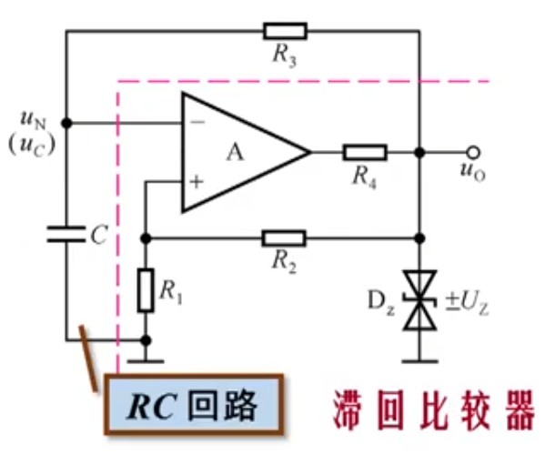
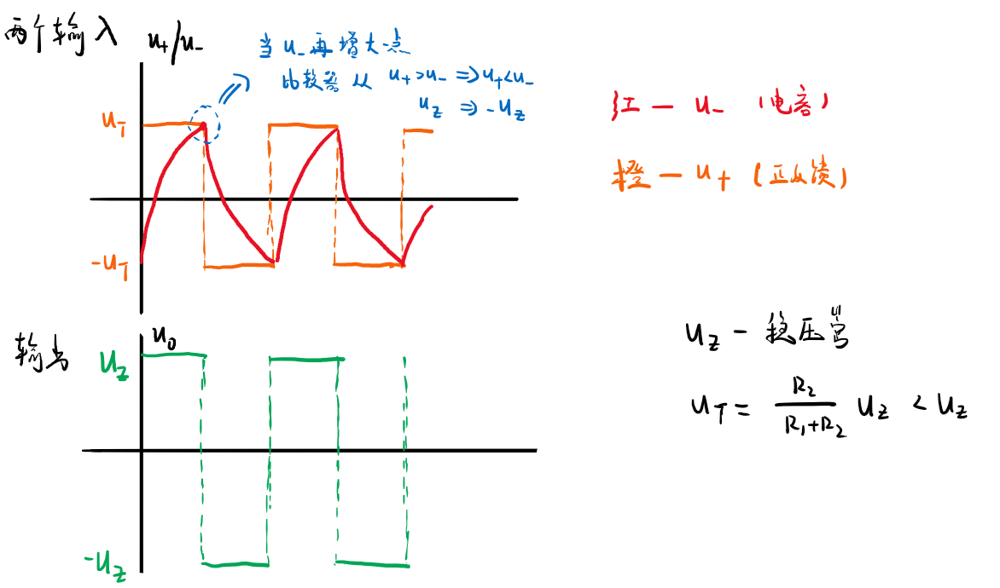
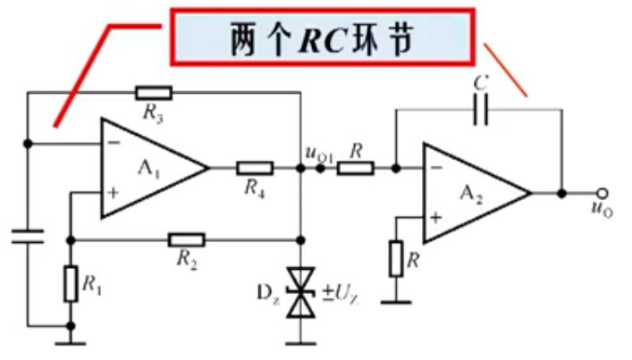
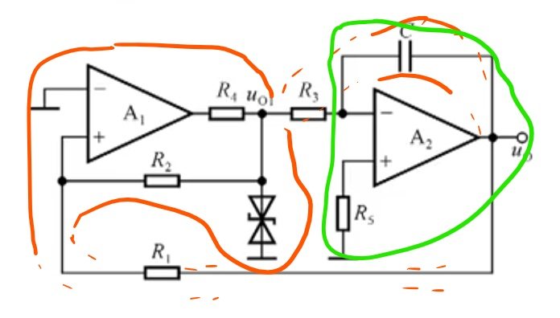
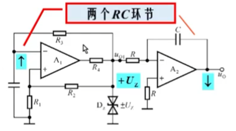
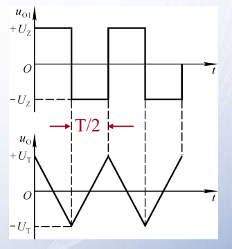

# 第二节 非正弦信号产生电路

## 一、方波发生器

*课程未讲，但为了后面内容的理解自学了这部分。*

### 1. 方波设计

之前的比较器，符合方波的输出模式，  
所以即采用“自激振荡+迟滞比较器”实现方波的产生。  
*因为自激振荡里要正反馈，所以只能用迟滞比较器。*

这里自激振荡采用正弦信号中的“RC振荡”。

---

可以设计出以下电路：

可以分为两个部分：

* 红线右下 - 滞回比较器
* 红线左上 - RC振荡回路  
  *但并不是典型的RC振荡。*

### 2. 方波分析

按之前的方法分析：

1. 电路刚刚合闸通电：
   假设$u_o$被扰动为微小的正电压。

   根据正反馈，正极端$u_+\uparrow\quad \rightarrow \quad u_o\uparrow\quad \rightarrow\quad u_+\upuparrows$  
   电路在极迅速间达到第一个暂态：
   * $u_o=+U_z$
   * $u_+=+U_T$（$U_T=\frac{R_1}{R_1+R_2}U_z$）
   * $u_-=0$
2. 电路已经开始振荡，且在第一个暂态：  
   此时$u_o$通过上面的电路，向电容$C$充电，  
   $u_C\uparrow$，即$u_-\uparrow$。

   当$u_-$增大到临界值$u_-=u_+=+U_T$时，再增大一个微小增量，  
   都会使得输出电压瞬间跃变到$u_o=-U_z$，完成跃变。

   而跃变后，电容会先放电，再反向充电，  
   则$u_-$又会不断减少至临界值$u_-'=u_+'=-U_T$，之后再次跃变回去。

故：可以振荡，产生的为方波。  
⚠*一定注意这里分析滞回比较器的时候，不要用$u_i-u_o$图像来分析，而要具体根据$u_+$和$u_-$的关系来分析。*

## 二、三角波发生器

### 1. 三角波设计

之前也提及到：对方波积分可以得到三角波。

但可以看到积分电路也有个电容，考虑能不能利用这个来简化电路。  
*【但我不知道为什么积分那个也叫RC环节，总感觉不是……但总之合并这两个电容部分来简化电路……*

最终化简电路为：  

* 橙色 - 方波部分 - 正反馈
* 绿色 - 积分部分 - 负反馈

> 拓展 - 为什么把方波部分的反相输入改为了同相输入：
>
> 利用积分电路的电容简化，首先要分析电容$C$，即积分电路输出端的极性：  
>   
> 若方波为$+U_Z$，对于方波电路的$u_-$需要为正反馈$\uparrow$，  
> 而对于积分电路输出$u_o$，是在减小$\downarrow$的！*（若忘记可看之前[[Integratedcircuit_3|积分电路]]笔记）*
>
> 因此需要把之前方波电路的反相输入（正反馈接到$u_-$），改成同相输入（正反馈接到$u_+$）。

### 2. 三角波分析

1. 判断能不能整流：
   1. 能不能翻转  
     $\begin{aligned}u_{o2}&=-\frac{1}{RC}\int u_{o1} \textrm{d}t \\ &= -\frac{U_z}{RC}t\end{aligned}$  
     为一个$k<0$的直线。  
     当$u_{o2}<U_{T-}$时，则$u_{o1}$反向，故可以完成翻转。
   2. 能不能翻转回去  
     当翻转后，$u_{o2}=\frac{U_z}{RC}t$，  
     为一个$k>0$的直线。
2. 波形：  
     
   这里三角波幅值为$U_T$，因为就是连接到方波的$u_+$处，最大到临界值$U_T$然后翻转。
3. 幅值:
   1. 方波幅值：$u_{o1}=U_Z$
   2. 三角波幅值：
      $$
      ⭐U_o=-\frac{R_1}{R_2}U_{o1}
      $$
      注意不是$\frac{R}{R+R}$，因为临界为$u_{+1}=\frac{R_1}{R+R}u_{o1}+\frac{R_2}{R+R}u_o=0$
4. 周期：
   $$
   T=\frac{4R_1R_3C}{R_2}
   $$
