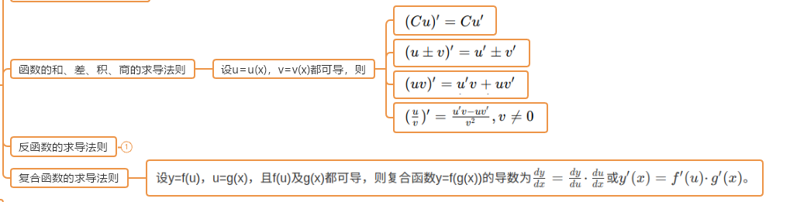
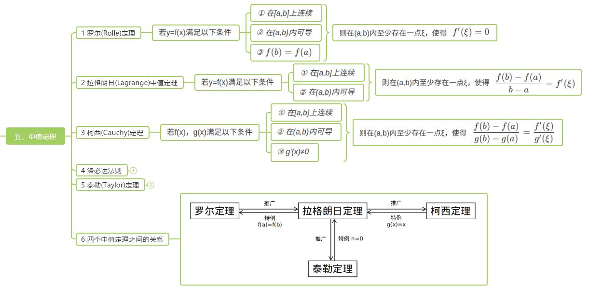
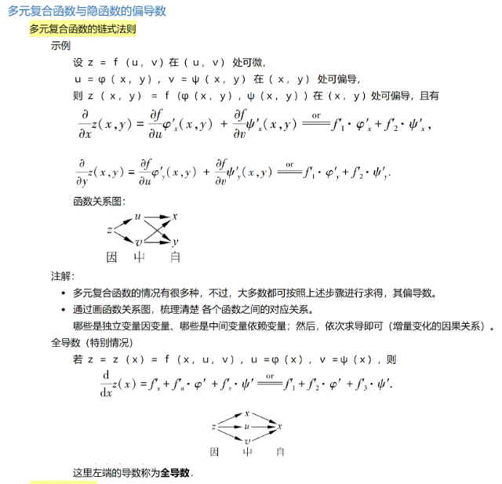
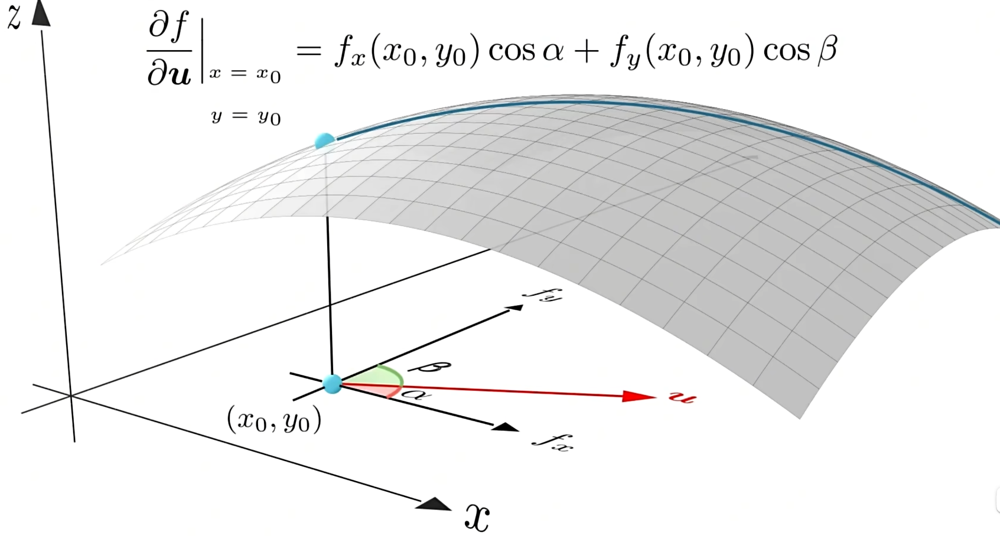
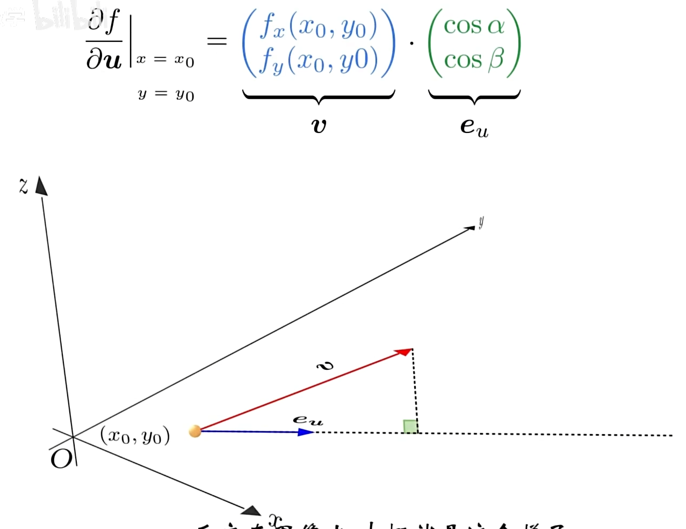

# Ep.0 基础知识

## 一、高数

### 1. 微分

以下部分针对“**一元函数**”。

#### (1) 有界

* 数列: $|x_i|\le M(i=1,\cdots, n)$
* 函数: $|f(x)|\le M(x \in l)$

#### (2) 极限

可针对数列($\lim_{n\to \infty}x_n$) / 函数($\lim_{x\to a} f(x)$)

* 性质
  * 唯一性：对于一个极限，若存在，则极限值唯一
  * 有界性：
    * 数列（全局）：数列必有界（注意：最开始的若干项不可能为无穷）
    * 函数（局部）：极限处附近的值有界
  * 局部保号性：极限处附近的值 跟 极限值 符号相同
* 判断
  * 单调有界准则：如果数列$\{x_a\}$单调增加、且有上界 $\to$ 存在极限（即收敛）

#### (3) 连续

**定义**：两侧极限 等于 函数值。

**闭区间 连续函数 性质**：

$$
f(x), x\in[a,b]
$$

* **有界性**：$f(x)$在区间内**存在上下界**($|f(x)|\le M$)
* **最值定理**：$f(x)$在区间内存在最小值$m$和最大值$M$
* 零点定理：若$f(a)\cdot f(b)<0$，则之间存在零点

#### (4) 拓展 - 光滑函数

在定义域内，任意阶的导数**都可求导**（故也一定连续）。

#### (5) 导数 / 微分

**关系**：**可微(即 可导) 一定 连续**。

**求法**：

**微分中值定理**：

  
[参考](https://zhuanlan.zhihu.com/p/47436090)

**函数展开**：

* 泰勒公式
  对于以$x_0$为中心的某个开区间$l$，有至$n+1$阶的导数，  
  则对任意$x\in l$
  $$
  f(x) = f(x_0) + f'(x_0)(x - x_0) + \frac{f''(x_0)}{2!}(x - x_0)^2 + \cdots + \frac{f^{(n)}(x_0)}{n!}(x - x_0)^n + R_n(x)
  $$
* 麦克劳林公式  
  即泰勒公式$x_0=0$

**函数性质**：

* （狭义 / 严格）单调性：$f(x_1) >/< f(x_2)$*（广义单调性可取等）*  
  $\Leftrightarrow f'(x) >/< 0 \quad (x \in l)$
* **极值**: $x_0$**领域内**，最大或最小
  * **极值点 一定是 驻点**
* **驻点**: **一阶导为 0** 的点（对于驻点$x_0$, $f'(x_0) = 0$）  
  驻点不一定是极值点（如$x^3$）
  * **驻点$x_0$是极值点条件**
    * $f'(x)(x-x_0) >/< 0 \quad (x \in \stackrel{o}{U}(x_0))$
    * $f''(x_0) >/< 0$
* 最值: 闭区间上，两端点、驻点、不可导点取最大/小
* **凹凸性**: 某区间上二阶导恒 大/小于 0
* 拐点
  * 拐点$x_0$ $\to$ $f''(x_0) = 0$
  * $f''(x_i) = 0$ 且 $f''(x_i)(x-x_i)\ne 0, x\in \stackrel{o}{U}(x_i))$（或$f'''(x_i)=0$） $\to$ $x_i$是拐点

#### (6) 多元函数

$$
f(x_1, x_2, \cdots, x_n) \to f(\boldsymbol{x})
$$

* *极限*  
  $$
  \lim_{x\to a, y\to b}f(x,y)=A
  $$

  需要(x,y)沿所有路径(简单理解为 360° 方向)趋向于$(a,b)$函数值均靠近$A$
* *连续*: 函数值等于极限值
* 偏导: 对某元$x_i$求导数，其它元视为常量。  
  偏导 **不一定** 连续。
  * 复合函数求偏导  
      
    （二重复合）根据函数图，第一层是原本函数的元；第二层则是最终元；对某一最终元求偏导则第一层所有指向第二层，然后各自求导相乘，再全部相加（下面一个图第二层的$x$不应该再指向$x$）
* *全微分*  
  $$
  \text{d}f(x,y) |_{a,b} = f'_x(a,b) \text{d}x + f'_y(a,b) \text{d}y  
  $$

  认识即可。
* 连续、偏导、全微的关系：  
  
* **驻点**：$\boldsymbol{x}$为驻点，即其所有偏导（梯度分量）均为 0
* 极值
  * 无约束条件的极值（全局极值）：  
    *类比于单元函数极值，要求一阶导为 0 + 二阶导 >/< 0*  
    $\Rightarrow$ 为驻点（梯度各分量为 0） + 海森矩阵正/负定($\succ/\prec$)
    > 正/负定判断方法:
    >
    > 各阶顺序主子式（即从左上角开始 1~n 阶行列式）都 $>/< 0$
  * 有约束条件的极值（条件极值）：*略*
* 最值
* **梯度**$\nabla$：为一个$n$维**向量**，由该点所有偏导数组成
  
  （二元函数）几何意义：指向该点函数值增长最快（变化率/方向导数最大）的方向  
  （注意是在$xOy$平面上，表示$x$和$y$改变的方向，而**不是图形切线**），其大小则是该方向的方向导数（变化率）
* 方向导数$\frac{\partial f}{\partial \boldsymbol{l}}$：为一个**数值**，表示函数从某点沿方向$\boldsymbol{l}$的变化率  
    

  **方向导数最大的方向 是 梯度所指方向 的原因**：  
    
  其中$\boldsymbol{v}$则是梯度的定义式（定向量）、$\boldsymbol{e_u}$是任意方向的单位向量；  
  点积表示投影，则方向导数最大的方向，则是$\boldsymbol{v}$的方向，且值就为$\boldsymbol{v}$的长度。

  **利用梯度的计算方式**：  
  $$
  \frac{\partial f}{\partial \boldsymbol{l}} = ||\nabla f(\boldsymbol{x})||\cos\theta
  $$
  其中$\theta$是$\boldsymbol{l}$方向向量与该点处的$\nabla f(\boldsymbol{x})$梯度向量的夹角。

  如果$l$是单位向量、或者只需要关注与0的大小关系，则可以写为：
  $$
  \frac{\partial f}{\partial \boldsymbol{e}}  = \nabla f(\boldsymbol{x})\cdot\boldsymbol{e} = \langle \nabla f(\boldsymbol{x}), \boldsymbol{e} \rangle
  $$
* **Hessian 矩阵**$\nabla^2$：为一个$n$阶方阵，由所有二阶偏导组成。

> 方法 - 多项式多元函数求梯度：
>
> * $\boldsymbol{c}^T\boldsymbol{x}$（其中$c$是常量向量） → $c$  
>   故$\boldsymbol{c}x$（$\boldsymbol{c}$为$1*n$行向量）求梯度为$\boldsymbol{c}^T$！
> * $\boldsymbol{x}^TA\boldsymbol{x}$ → $2A\boldsymbol{x}$

### 2. 积分

*略。*

### 3. 向量代数与空间

*这一部分可以在线性代数中详学。*

## 二、线性代数

### 1. 向量

$\boldsymbol{v_1}, \boldsymbol{v_2}$  

均由**列向量**表示。

* 运算
  * 加减$\boldsymbol{v_1}\pm\boldsymbol{v_2}$
  * 数乘$k\boldsymbol{v_1}$
  * 点积（内积、数量积）：$\boldsymbol{v_1}\cdot\boldsymbol{v_2}$，结果为标量  
    $$
    \boldsymbol{a}\cdot\boldsymbol{b}=\sum a_ib_i= |a||b|\cos(a,b)
    $$
    当$a\cdot b=0$时、$a\bot b$
  * 叉积（外积、向量积）：$\boldsymbol{v_1}\times\boldsymbol{v_2}$，一般只用于三维向量、结果为三维向量
  * *混合积*

### 2. 矩阵

$A$

也表示：线性变换、作用于向量元素的函数$f(\boldsymbol{x})$

* 运算
  * 加减
  * 数乘
  * 转置
  * 矩阵（向量）乘：$A_{m*k}\times B_{k*n}(/\boldsymbol{v^k}) \to C_{m*n}(/\boldsymbol{v}^m)$

#### () 行列式

**只适用于方阵**。

**几何意义**（行列式值的绝对值）：  
描述线性变换将空间 **拉伸 / 压缩** 了多少。

* $\text{R}^2$：面积如何变化
* $\text{R}^3$：提及如何变化

如果行列式为负，代表**将空间翻转**。

#### () 逆

**只适用于方阵**。

#### () 特征值、特征向量

**只适用于方阵。**

**几何意义**：  
特征向量是那些经过$A$变换后，仍然落在原来直线上的向量$\{\boldsymbol{x}_i\}$，即$A$只对$\boldsymbol{x}_i$进行伸缩；  
特征值则是其对应伸缩的比例。  
*根据几何意义，可以知道$0$向量一定是特征值，但没有意义，故不把这个算作特征向量。*

特征向量用**单位向量**来表示。

**求法**：
利用特征值多项式来求解。  
$\det(A-\lambda I)=0$。

$n$阶矩阵**最多有$n$个特征值和特征向量**。

* 可能没有特征值和特征向量（如旋转）
* 可能只有$1$个特征值，其对应无穷个特征向量（如缩放、但线性无关的只有$n$（维度）个）
* 可能为少于$n$个特征值（如二维中的剪切，只有一个特征值$1$、无穷个特征向量（$x$轴上所有向量）、线性无关的只有$1$个）  
  此时特征值多项式为$(1-\lambda)^2=0$，有重根。

因为可能有重复的，故有以下**概念**：

* 代数重数：某个特征值的代数重数是指它作为特征多项式根的出现次数。  
  例如，如果特征值$\lambda$是特征多项式的二重根，则其代数重数为 2。
* 几何重数：某个特征值的几何重数是指它对应的线性无关的特征向量的数量。  
  **几何重数$\le$代数重数**。

**性质 - $A$的特征值$\lambda$和对应特征向量$\boldsymbol{u}$**：

* $\boldsymbol{u}^TA\boldsymbol{u} = \lambda$  
  原因：$A\boldsymbol{u}=\lambda\boldsymbol{u}\Rightarrow\boldsymbol{u}^TA\boldsymbol{u}=\boldsymbol{u}^T\boldsymbol{u}\lambda\Rightarrow\boldsymbol{u}^TA\boldsymbol{u}=\lambda$

#### () 正定

**只适用于方阵**。

> **概念 - 半（正）定**：
>
> 来自于线性代数的“正定”、“半正定”矩阵，矩阵$A$首先是一个实对称矩阵$\mathcal{S}^n$。
>
> * 正定(positive definite)矩阵：对于任意$n$维非零向量$\boldsymbol{x}$，满足$\boldsymbol{x}^TA\boldsymbol{x}>0$  
>   此时$A$可记作$A\succ0$。
> * 半正定(positive semi-definite, 也叫正半定)矩阵：对于任意$n$维非零向量$\boldsymbol{x}$，满足$\boldsymbol{x}^TA\boldsymbol{x}\ge0$  
>   此时$A$可记作$A\succeq0$、也可记作$\mathcal{S}^n_+$代表$n$维半正定矩阵。
>
> **拓展 - 正定矩阵的意义**：
>
> 正定矩阵在几何意义上，可以看作变换$\boldsymbol{y}=A\boldsymbol{x}$的一个“**正系数**”，$\boldsymbol{x}$经过$A$变换后得到的$\boldsymbol{y}$方向不会相反（夹角小于$90\degree$）  
>（即类比于标量中的变换$y=ax$，$a$为正系数($a>0$)时，$x$与$y$的大小（符号/方向）相同）
>
> 要规定这样一个“正系数”（不能简单用$A>0$），使得变换后方向相同，即使得$\boldsymbol{x}\cdot\boldsymbol{y}\equiv \boldsymbol{x}^T\boldsymbol{y}\equiv \boldsymbol{x}^TA\boldsymbol{x}>0$（向量点积大于$0$代表同向），故正定矩阵的定义从此而来。

**性质（必要条件）**：

* 一定是对称**方阵**
* $\det A>0$  
  等于$0$则空间塌缩；小于$0$、一定导致有向量反向、从而不满足几何意义（可看[线性代数的本质 - 行列式](https://www.bilibili.com/video/BV1ib411t7YR?p=7)中3:56，当发生塌缩时的那条线，与之垂直的向量一定发生了翻转）  
* 一定**可逆**  
  因为$\det A>0$

**判据（充分必要条件）**：

* 特征值都大于0  
  *因为如果小于0，对应的特征向量一定反向。*  
* 主子式都大于0  
  主子式是矩阵从左上角开始的**各阶子矩阵的行列式**

**Tip. $A^TA$一定是半正定的**  
因为$\boldsymbol{x}^T(A^TA)\boldsymbol{x}=(A\boldsymbol{x})^T(A\boldsymbol{x})=||A\boldsymbol{x}||^2\ge0$

### 2. 线性方程组相关

#### (1) 线性方程组表示

首先是**非齐次**线性方程组：

**方程组形式**：

$$
\left\{\begin{array}{c}
a_{11} x_{1}+a_{12} x_{2}+\cdots+a_{1 n} x_{n}=b_{1} \\
a_{21} x_{1}+a_{22} x_{2}+\cdots+a_{2 n} x_{n}=b_{2} \\
a_{m 1} x_{1}+a_{m 2} x_{2}+\cdots+a_{m n} x_{n}=b_{m}
\end{array}\right.
$$

**向量形式**：

令$\boldsymbol{a_i}=(a_{1i}, a_{2i}\cdots, a_{mi})^T$表示方程组每一列，$\boldsymbol{b}=(b_1,\cdots,b_m)^T$  
则可以线性方程组表示为：
$$
\boldsymbol{a_1}x_1+\boldsymbol{a_2}x_2+\cdots+\boldsymbol{a_n}x_n = \boldsymbol{b} \\
$$

> 如果令$\boldsymbol{w_i}=(a_{i1}, a_{i2}, \cdots, a_{in})^T$表示方程组每一行，  
> 则可以线性方程组表示为：
>
> $$
> \left\{\begin{array}{c}
> \boldsymbol{w}_{1}^{T} \boldsymbol{x}=b_{1} \\
> \boldsymbol{w}_{2}^{T} \boldsymbol{x}=b_{2} \\
> \cdots \\
> \boldsymbol{w}_{m}^{T} \boldsymbol{x}=b_{m}
> \end{array}\right.
> $$

**矩阵形式**：

令$A=[a_1,\cdots, a_n]$

$$
A\boldsymbol{x} = \boldsymbol{b}
$$

**几何理解**：

由于$a_{i1}x_1+a_{i2}x_2+\cdots+a_{in}x_n=b$为一个超平面（$\mathbb{R}^3$中就为平面），  
则非齐次线性方程组，就相当于**若干个超平面求交点**。

---

**齐次线性方程组**：

$$
A\boldsymbol{x}=0
$$

相当于多个**过原点**超平面（下以$\mathbb{R}^3$为例，超平面则为平面）的交：

* 可能交成一个过原点的面（所有的都是一个平面）
* 可能交乘一个过原点的线（所有的面都绕着这个线）
* 可能交乘一个点，且必定是原点

Tip. 如果三个超平面，已经交成一个点（三个超平面线性无关），此时再给出一个超平面，则可以由已有三个超平面线性表示（因为三个线性无关的超平面已经包含$\mathbb{R}^3$的所有基的信息）

而某非齐次线性方程$A\boldsymbol{x} = \boldsymbol{b}$，则相当于对应的其次线性方程$A\boldsymbol{x}=0$进行了平移。  
但**注意**：平移的向量并不是$\boldsymbol{b}$（$\boldsymbol{b}$在几何上无意义），而是$A\boldsymbol{x}=\boldsymbol{b}$的一个特解$x_p$（可由高斯消元法求）。

> $\boldsymbol{b}$的每一个分量，本质上是影响$A\boldsymbol{x}=0$的对应的一个超平面进行平移（比如$\mathbb{R}^2$中，$x+y=0\to1$，相当于沿$y$向上平移1），  
> 但该平面平移了，不代表交集也这样平移（比如上例，与$x-y=0$交点$(0,0)$，平移后交点并非$(0,1)$而是$(-0.5,0.5)$）
>
> 尤其对于齐次有解而非齐次无解的情况，比如$\mathbb{R}^2$，齐次为相同两条直线$x+y=0$、非齐次为$x+y=1$和$x+y=0$，此时$\boldsymbol{b}=(1,0)$无任何意义。

#### (2) 线性组合

线性组合是一个**操作**，即对$k$个向量$\boldsymbol{u}$：

$$
v=c_1\boldsymbol{u_1}+c_2\boldsymbol{u_2}+\cdots+c_k\boldsymbol{u_k}
$$

$\boldsymbol{v}$称为其线性组合。

线性方程组的问题，可以转换为：  
“$\boldsymbol{b}$是否可以表示成$A$中各列向量$\boldsymbol{a}$的线性组合”。

#### (3) 张成空间（生成子空间）

张成空间是一个集合（空间），  
对于一个向量集$S$，其所有的线性组合结果向量组成的向量集$V$，则为$S$的**张成空间**，记为$Span(S)$。  
即由$S$中的所有向量，可以表示哪些向量。

线性方程组的问题，可以转换为：  
“$\boldsymbol{b}$是否在$A$中各列向量的张成空间中”。

对于一个$n$维向量的集合，其张成空间能表示的范围便是$0\sim n$维空间。

#### (4) 线性相关（无关）

对于一个**向量集**而言，  
如果其中**一向量可表示为其余向量的线性组合**，则该向量集线性相关；反之线性无关。  
*或者非零线性组合可以表示零向量（上述等价表示）。*

如果包含了**零向量**，则**一定**是线性相关的。

**Tip.** 一个$\mathbb{R}^n$的空间，最多只能有$n$个线性无关的向量（大于$n$时一定线性相关）

#### (5) 秩

对于一个**矩阵**而言，  
线性无关的列的最大数目，为该矩阵的秩$r(A)$

#### (6) 解的情况

### 3. 向量空间与子空间

> 首先需要明确：
>
> 空间是一个抽象概念，用来描述“对象”基于一定“规则”进行“操作”的场所（**集合**/空间），  
> 其最终是一个**元素的集合**。
>
> * 对象：该空间处理的元素，如实数、向量等
> * 操作：对象之间的操作、运算、映射（$f$），如加、乘
> * 规则：一些约束条件，如对象经过操作后还要在该空间中
>
> 拥有这三个基本定义，则称作一个空间。  
> 数学上的研究便是基于各种空间。

#### (1) 向量空间（线性空间）

是一个抽象的概念，其对象为“**标量（数字）和自定义向量**”、操作为“**向量加**”和“**数乘**”、规则为“**对象经过操作后还要在该空间中**”以及其它八条性质。  
*注意其中的自定义向量，你可以把$(x,y)$定义为向量、也可以把函数定义为向量*

只要满足这样的定义的，就可以称为向量空间，比如：

* 通常只用知道且只运用“欧几里得线性空间（欧式空间）”，其具有：
  * 加法、数乘、封闭性、结合律、交换律、零元、逆元、幺元
  * 具有范数（长度）的定义
  * 具有内积（角度）的定义
* 某种规格的矩阵可作为向量，从而所有该类矩阵则为一个向量空间  
  如所有$2*2$方阵。
* 某类函数可以作为“向量”，从而所有的该类函数则为一个向量空间
  * 函数可以加乘
  * 函数求导是一种线性变换（线性算子）、具有可加性$L(x+y)=L(x)+L(y)$和成比例$L(cx)=cL(x)$  
    线性变换就可以用矩阵描述，详细可见“[线性代数的本质 P15](https://www.bilibili.com/video/BV1ib411t7YR)”。

#### (2) 子空间

子空间是针对某个向量空间而言的，其**就是向量空间的一个子空间**。

> 定义为：
>
> 假设$V$是一个向量空间，  
> 如果$S$是$V$的子集，且$S$还是一个向量空间，  
> 则称$S$是$V$的一个子空间。

故其也是一个向量空间，满足其性质。  
注意：**必须具有零向量**（几何上代表**必须过原点**）。

如对于向量空间$R^n$，其$R^{0\sim n}$均为其子空间。

#### (3) 生成子空间（张成空间）

就是**对于一组向量**$V$（一般为有限个向量，其不是一个子空间），通过“线性组合”，从而得到$V$的一个子空间。

#### (4) 零空间、值空间

$\mathbb{R}^n$中，对于一个**线性变换**（矩阵）$A_{m*n}$。

* 零空间（核） - $N(A)$：$\{\boldsymbol{x}\in\mathbb{R}^n: A\boldsymbol{x}=0\}$  
  即向量$\boldsymbol{x}$变换后为零向量的$\boldsymbol{x}$集合，  
  为$\mathbb{R}^n$的子空间。
* 值空间 - $R(A)$：$\{A\boldsymbol{x}:\boldsymbol{x}\in\mathbb{R}^n\}$  
  即向量$\boldsymbol{x}$变换后的向量$\boldsymbol{x}'$集合，  
  为$\mathbb{R}^m$的子空间。

### 4. 范数

$\mathbb{R}^n$中，对于向量$\boldsymbol{x}$而言：

* 一范数
* 二范数 - $||\boldsymbol{x}||_2=\sqrt{x_1^2+\cdots+x_n^2}=\sqrt{\boldsymbol{x}^T\boldsymbol{x}}$
  * 存在性质 - 向量的**二范数平方**等于其**转置和自身的内积**