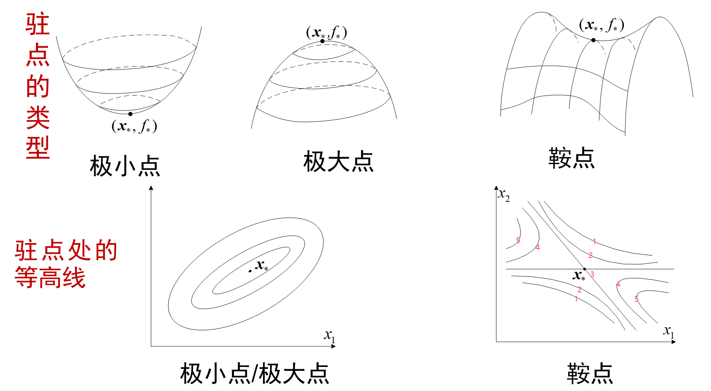
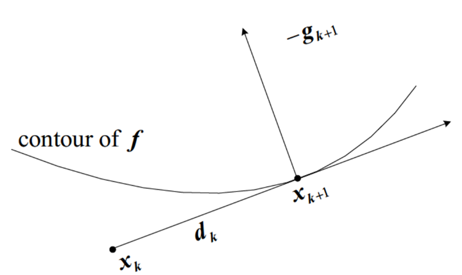

# Ep.3 最优解和算法的基本性质

本节主要学习怎么刻画最优解（即最优解的充分或必要条件）。

**总结**：

* 可行方向：$\boldsymbol{d}$
* 有关极小点$\boldsymbol{x}_*$的三种条件
  * 一阶必要条件：$\langle \nabla f(\boldsymbol{x}_*), \boldsymbol{d} \rangle \ge0$
  * 一阶必要条件（无约束 / 为内点）：$\nabla f(x_*)=0$
  * 二阶必要条件：$\langle \nabla f(\boldsymbol{x}_*), \boldsymbol{d} \rangle = 0 \to \boldsymbol{d}^T\nabla^2f(\boldsymbol{x}_*)\boldsymbol{d}\ge0$
  * 二阶必要条件（无约束 / 为内点）：$\nabla f(\boldsymbol{x}_*)=0 \text{并且} \nabla^2f(\boldsymbol{x}_*)\succeq0$
  * 二阶充分条件（无约束 / 为内点）：$\nabla f(\boldsymbol{x}_*)=0 \text{并且} \nabla^2f(\boldsymbol{x}_*)\succ0$（并且为严格极小点）
* 收敛速率
  * 线性$\frac{\delta_{k+1}}{\delta_k}\to q$  
    $q$越小越快
    * 次线性 - $q=1$
    * 线性
    * 超线性 - $q=0$
  * 二次收敛$\frac{\delta_{k+1}}{\delta_k}^2\le M$
* 多元函数的局部二次近似函数：$f(\boldsymbol{x})\approx f(\boldsymbol{x}_k)+\boldsymbol{g}_k^T(\boldsymbol{x}-\boldsymbol{x}_k)+\frac{1}{2}(\boldsymbol{x}-\boldsymbol{x}_k)^TB_k(\boldsymbol{x}-\boldsymbol{x}_k)$  
  故如果求下一个极小化点，则$\boldsymbol{x}_{k+1}=\underset{\boldsymbol{x}}{\argmin} f(\boldsymbol{x}_k)+\boldsymbol{g}_k^T(\boldsymbol{x}-\boldsymbol{x}_k)+\frac{1}{2}(\boldsymbol{x}-\boldsymbol{x}_k)^TB_k(\boldsymbol{x}-\boldsymbol{x}_k)$
* 线搜索格式 - $\boldsymbol{x}_{k+1}=\alpha\boldsymbol{x}_k+\boldsymbol{d}$  
  $\phi(\alpha)=f(\boldsymbol{x}_k+\alpha\boldsymbol{d}_k)$
  * 搜索方向 - 满足下降性$\phi'(0)=\boldsymbol{d}_k^T\boldsymbol{g}_k<0$  
    $\boldsymbol{d}_k$要跟函数值下降最快的方向（负梯度方向）夹角小于$90\degree$
  * 步长
    * 精确线搜索 - $\boldsymbol{d}_k^T\boldsymbol{g}_{k+1}=0$  
      只对$f$为二次函数好求解
    * 非精确线搜索  
      $\rho$线：$l(\rho)=\phi(0)+\rho\phi'(0)\alpha\quad(\rho\in(0,1))$
      * Armijo 条件：$\phi(\alpha)\le l(\alpha)$  
        下方都以 Armijo 条件为基础（都包含）
      * Armijo 法则：$\phi(\frac{\alpha}{\gamma})\ge l(\frac{\alpha}{\gamma})$
      * Goldstein 测验：$\phi(\alpha)\ge \phi(0)+(1-\rho)\phi'(0)\alpha$
      * Wolfe 准则：$\phi'(\alpha)\ge \sigma\phi'(0) \quad(\sigma\in(0,1))$
      * 强 Wolfe 准则：$|\phi'(\alpha)|\le -\sigma\phi'(0)$

## 一、预备知识 - 可行方向

> 问题背景：
>
> 已知实值函数$f\in C^1$（也可能为$C^2$），$S\in\mathbb{R}^n$，  
> 对于最优化问题：
>
> $$
> \underset{\boldsymbol{x}\in S}{\text{min}}f(\boldsymbol{x})
> $$
>
> 本节主要关注两种情况：
>
> 1. $S=\mathbb{R^n}$（无约束优化）  
>    **此时所有点$\boldsymbol{x}\in\text{int}S$**，隐含条件2.
> 2. 极小点为内点$\boldsymbol{x}_*\in\text{int}S$
>
> 但注意：本章没要求$f$是凸函数，故局部极小点$\ne$全局极小点。

对于一点$\boldsymbol{x}\in S$和一向量$\boldsymbol{d}$（代表$\boldsymbol{x}$处的某个方向），  
如果从$\boldsymbol{x}$出发，沿着$\boldsymbol{d}$方向，**存在一小段线段在$S$内**，  
则称该方向向量$\boldsymbol{d}$为$\boldsymbol{x}$处的“**可行方向**”。  

$\boldsymbol{x}$处所有的可行方向记为$F_S(\boldsymbol{x})$

> **数学定义 - 可行方向$\boldsymbol{d}$**：
>
> $\exist\bar{a}$使得：
> $$
> \{\boldsymbol{x}+a\boldsymbol{d}:0\le a\le\bar{a}\}\sube S
> $$

---
> 举例 - 对于第一象限定义域$\{(x_1,x_2):x_1,x_2\ge0\}$：
>
> * 对于内点：可行方向为所有方向
> * 对于$(0,0)$：可行方向为第一象限（右上侧）
> * 对于$(1,0)$：可行方向为上半平面

利用可行方向，可以将**多元函数的极值问题，转换为一元函数的极值问题**，即将多元函数限制在这一小段线段上。

对于**局部**极小值$\boldsymbol{x}_*$处，则可以转换为“过这点、以可行方向为方向的**部分线段上**（$0\le\alpha\le\bar{\alpha}$）”，即：
$$
\phi(\alpha)=f(\boldsymbol{x}_*+\alpha\boldsymbol{d})\quad(0\le\alpha\le\bar{\alpha})
$$

## 🌟二、最优解的各类条件

### 1. 一阶必要条件

#### 1.1. 普遍情况

> 推导 - 一阶必要条件：
>
> 对于上式$\phi(\alpha)=f(\boldsymbol{x}_*+\alpha\boldsymbol{d})\quad(0\le\alpha\le\bar{\alpha})$，  
> $\because \boldsymbol{x}=\boldsymbol{x}_*$是$f$的局部极小点，$\therefore \alpha=0$是$\phi$的局部极小点。  
> 对于一元函数$\phi(\alpha)(\alpha\in[0,\bar{\alpha}])$，在边界$0$上取得最小值，则说明$\phi'(0)\ge0$（反证，如果小于$0$，则往右走一定函数值减小，$\alpha=0$一定不是局部极小点）  
> 由 Ep 2.2 的一知：$\phi'(\alpha)=\boldsymbol{d}^T\nabla f(x_*)\ge0$，由此得到一阶必要条件。

$S\in\mathbb{R}^n$，$f\in C^1$是$S$上的函数，  
如果$\boldsymbol{x}_*$是$f$在$S$上的局部极小点，  
则对$\boldsymbol{x}_*$处任意可行方向$\boldsymbol{d}$，必须满足：

$$
\langle \nabla f(\boldsymbol{x}_*), \boldsymbol{d} \rangle(=\boldsymbol{d}^T\nabla f(\boldsymbol{x}_*)) \ge0
$$
*Tip. $\boldsymbol{d}^T\nabla f(\boldsymbol{x}_*)$是标量，两者可对调。*

#### 1.2. 极小点为内点、或无约束优化

此时条件变为：
$$
\nabla f(x_*)=0
$$
即：**$\boldsymbol{x}_*$为驻点**。

> 证：
>
> 因为内点的任意可行方向$\phi'(\alpha)\ge0$，故对于相反方向$\boldsymbol{d}^T\nabla f(\boldsymbol{x}_*)=-\boldsymbol{d}^T\nabla f(\boldsymbol{x}_*)=0$，  
> 可以推出$\boldsymbol{d}^T\nabla f(\boldsymbol{x}_*)=0$，即$\nabla f(\boldsymbol{x}_*)$跟任何向量都正交，只能是零向量，得证。

注意不是内点，不满足这一条件（但满足上面的通常条件）。  
而对于**无约束优化**（$\boldsymbol{x}\in\mathbb{R}^n$），任何点都是内点。

**该条件的运用方式**：  
该条件**用于选择点**，即满足该条件的为局部极小点的**候选点**（如果不满足，一定不是），  
得到这些候选点后，再用“二阶充分条件”进一步验证。

### 2. 二阶必要条件

#### 2.1. 普遍情况

> 推导 - 二阶必要条件：
>
> 对于一阶必要条件$\boldsymbol{d}^T\nabla f(\boldsymbol{x}_*)\ge0$，  
> 如果$>0$，则对二阶导数没有要求，其附近一定函数值都大于它；  
> 而如果$=0$，则二阶导数必须$\ge0$，否则附近会导致一阶导数$<0$，从而导致函数值小于它，矛盾。  
> 由 Ep 2.2 的一知：$\phi''(\alpha)=\boldsymbol{d}^T\nabla f(x_*)\boldsymbol{d}$，由此得到二阶必要条件。

$S\in\mathbb{R}^n$，$f\in C^2$是$S$上的函数，  
如果$\boldsymbol{x}_*$是$f$在$S$上的局部极小点，  
则对$\boldsymbol{x}_*$处任意可行方向$\boldsymbol{d}$，必须满足：

1. 包含一阶必要条件  
   $$
   \langle \nabla f(\boldsymbol{x}_*), \boldsymbol{d} \rangle \ge0
   $$
2. **如果上式为$0$**，则$\phi(\alpha)$二阶导数  
   $$
   \boldsymbol{d}^T\nabla^2f(\boldsymbol{x}_*)\boldsymbol{d}\ge0
   $$

#### 2.2. 极小点为内点、或无约束优化

此时条件变为：
$$
\nabla f(\boldsymbol{x}_*)=0 \text{并且} \nabla^2f(\boldsymbol{x}_*)\succeq0
$$
> 证：对任意方向$\boldsymbol{d}$，二次型都非负，故矩阵$\nabla^2$半正定。

二阶必要条件是对一阶必要条件的进一步补充，即补充了$\nabla=0$情况的条件，  
但要求$f\in C^2$（如果不满足，则不能用二阶必要条件）。  
其运用方式跟一阶必要条件一样，也是选点（并在一阶基础上进一步筛选）。

如果满足该条件，即海森矩阵$\nabla^2$半正定（前提），根据其行列式值（是否奇异）只有两种情况：

1. $|\nabla^2|=0$（奇异）  
   此时无法进行数学分析，故**一般不是这种情况**。
2. $|\nabla^2|\ne0$（非奇异）  
   上面说了，因为一般不是奇异情况，故如果满足了二阶必要条件$\nabla\succ0$，**基本上就是这种情况**  
   此时$\nabla^2$一定是还是正定的（半正定说明特征值都$\ge0$，这里说明特征值都$\ne0$）  
   因此还一定满足二阶充分条件（见下），即$\boldsymbol{x}_*$还一定是严格局部极小点

即：如果$\nabla^2\succ0$，基本上可以认同为$\nabla^2\succeq0$。

### 3. 二阶充分条件（极小点为内点或无约束情况）

> 说明：二阶充分条件很难给出一个通用条件，只能针对$\boldsymbol{x}$为内点（或$S\sube\mathbb{R}^n$）这种情况给出条件。

$S\in\mathbb{R}^n$，$f\in C^2$是$S$上的函数，  
$\boldsymbol{x}_0$是$f$在$\text{int}S$上的一点，  
如果满足：

1. $\nabla f(\boldsymbol{x}_0)=0$
2. $\nabla^2 f(\boldsymbol{x}_0)\succ0$（正定）

则$\boldsymbol{x}_0$是严格的局部极小点（也称非退化局部极小点）。

> **补充说明 - 退化局部极小点、非退化局部极小点**：
>
> * 非退化局部极小点：即严格的局部极小点（或说真正的局部极小点），其海森矩阵正定，故一定是一个“真正的低谷”
> * 退化局部极小点：海森矩阵非正定（有些特征值为0甚至负），即附近有相同函数值的点、甚至更低函数值的点（即鞍点）。

## Ex. 驻点的类型

**驻点就是$\nabla=0$的点**（梯度消失点）。

上面的各类条件涉及到驻点，这里给出驻点的类型。  
  
可以看到对于鞍点（非极值的驻点），其在部分可行方向函数值减小，部分可行方向函数值增加。

## 三、最优化算法的基础

在最优化里，算法都是**迭代算法**，  
即：给个初值点（最优解的猜测），基于某种更新规则、迭代公式（算法的核心），产生一个逐渐逼近最优解的序列，直至获得 / 逼近最优解（终止条件）

大部分方法利用**目标和约束的函数值**，如果只利用函数值，称为“无导数优化”，适用于规模很小的问题，  
通常还会利用**一阶导数**（大规模）和**二阶导数**（中等规模）。

算法的**基本要求就是收敛**。
算法通常收敛到：

* 目标函数的**驻点**（无约束问题）
* **KKT 点**（约束问题的极大 / 极小 / 鞍点）

如果问题是**凸优化**，则可以保证算法收敛到全局极小点。  
（如果没有收敛到最优解，并不是算法的问题，而是问题本身的问题（不是凸优化））

### 1. 收敛与收敛速率

#### (1) 定性描述 - 收敛  

能稳定地接近局部极小点（想要的理想点，如驻点、KKT点）$x_*$；  
即便不收敛，退而求其次需要子列收敛（即有聚点）。

**要求**：

* 每次迭代后目标函数值减小（除个别情况外）
* $\{x_k\}$的聚点是 驻点 或 KKT点 等

如果不要求初始点$\boldsymbol{x}_0$充分接近$\boldsymbol{x}_*$，则称算法“大范围收敛”。

#### (2) 定量描述 - **收敛速率**

首先引入误差度量$\delta(\boldsymbol{x})$，用来描述$\boldsymbol{x}$与最优解的差距。  
有很多种定义方式，如：

* $\delta(\boldsymbol{x})=||\boldsymbol{x}-\boldsymbol{x}_*||$  
  即$\boldsymbol{x}$到极小点$\boldsymbol{x}_*$的距离。  
  如果问题**只有一个极小点**（凸优化），则该误差度量定义**合理**；  
  但如果有多个极小点（极小点为集合）（比如极小点附近为平的），则不适用，可用下一个。  
  并且只适用于**无约束问题**。
* $\delta(\boldsymbol{x})=\underset{\boldsymbol{x}_*\in S_*}{\min}||\boldsymbol{x}-\boldsymbol{x}_*||$  
  即有多个极小点（集合为$S_*$），则求$\boldsymbol{x}$到最近极小点的距离。  
  但是有时候最优点可能不可行，并且只适用于**无约束问题**，因此不满足条件可用下一个。
* $\delta(\boldsymbol{x})=\max\{f(\boldsymbol{x})-f_*, g_{1\sim p}^T(\boldsymbol{x}), |h_{1\sim m}(\boldsymbol{x})|\}$  
  第一个为函数值与最优值的差异，后面的为违反约束的一种度量（$g$为不等式约束，$h$为等式约束）。
* 拓展 - $\delta(\boldsymbol{x})=||\nabla f(\boldsymbol{x})||$  
  当为**凸优化问题**时，因为梯度为0即到极小点，故可用梯度范数作为误差度量。

因此，可用$\delta(\boldsymbol{x})\to0$的速率，来描述收敛速率。  
引入误差序列$\delta_k=\delta(\boldsymbol{x}_k)$：

* 线性  
  $\frac{\delta_{k+1}}{\delta_k}\to q$，因前提是算法收敛，则可知$q\in[0,1]$  
  $q$越小收敛越快。
  * 线性收敛 - $q\in(0,1)$  
    （如$\delta_k=\frac{1}{2^k}$）  
    注：线性收敛，实际上指的误差减小的比例恒定，故误差可能是指数下降的。
  * 超线性收敛 - $q=0$  
    收敛比线性更快（如$\delta_k=\frac{1}{k!}$）
  * 次线性收敛 - $q=1$  
    收敛比线性更慢（如$\delta_k=\frac{1}{k}$）
* 二次收敛  
  $q=\frac{\delta_{k+1}}{\delta_k^2}\le M$（即$\delta_{k+1}\le M\delta_k^2$，如某一次误差$\delta_k=10^{-2}$，则迭代后$\delta_{k+1}=10^{-4}$乘一个常数，下一次又为$10^{-8}$）  
  收敛超快的（如$\delta_k=(\frac{1}{2})^{2^k}$）。

这只是理论上分析，实际上还要依赖于实验，即用各种测试函数来评判。

#### (3) 终止准则

* 理想：$f(\boldsymbol{x}_k)-f_*)\le\epsilon$或$||\boldsymbol{x}-\boldsymbol{x}_*||\le\epsilon$  
  但不现实，因为实际运用中并不知道真正的$f_*$和$\boldsymbol{x}_*$。
* 实际
  * **点**：$f(\boldsymbol{x}_{k})-\boldsymbol{x}_{k+1}\le\epsilon$  
    （Tip. $f(\boldsymbol{x}_{k})\ge\boldsymbol{x}_{k+1}$）
  * **函数值**：$||\boldsymbol{x}_k-\boldsymbol{x}_{k+1}||\le\epsilon$ 或 $\forall i,|x_i^{(k)}-x_i^{(k+1)}|\le\epsilon$（给每个分量设置不同的$\epsilon$）
  * **梯度**：$||g_k||\le\epsilon$（其中$g_k=\nabla f(\boldsymbol{x}_k)$）  
    适用于“最速下降法”、“共轭梯度法”。
  * **基于$f$的预测下降量（海森矩阵）**：$\boldsymbol{g}_k^TH_k\boldsymbol{g}_k\le\epsilon$（其中$H_k=\nabla^2f(\boldsymbol{x}_k)^{-1}$（海森矩阵的逆）或其近似）  
    适用于“牛顿法”、“拟牛顿法”

#### Ex. 变量的尺度问题

在以后实际求解优化问题的时候，需要注意把各变量通过量纲的设置，**让数量值尽可能相等（数量级相差不大）**，类似于归一化，  
否则会导致“病态问题”，求解困难。

### 2. 重要思想 - 多元函数的局部二次近似函数

对于一元函数，利用泰勒展式，将原函数转化为简单的多项式函数来近似分析是很有用的手段，  
因此对于多元函数，也有必要了解其局部的二次近似函数。

$$
f(\boldsymbol{x})\approx f(\boldsymbol{x}_k)+\boldsymbol{g}_k^T(\boldsymbol{x}-\boldsymbol{x}_k)+\frac{1}{2}(\boldsymbol{x}-\boldsymbol{x}_k)^TB_k(\boldsymbol{x}-\boldsymbol{x}_k)
$$
其中$\boldsymbol{g}_k,B_k$分别为$\nabla f(\boldsymbol{x}_k), \nabla^2f(\boldsymbol{x}_k)$的估计/近似。

用二次函数作为模型（目标函数）的**好处**：

* 如果$\nabla^2\succ0$，则是最简单的 具有**唯一极小值** 的 **光滑**（$C^\infty$）函数。
* 对于极小化一般非线性函数的迭代法，一般在函数在局部极小点$\boldsymbol{x}_*$可以用二次函数近似，  
  即便原理极小点，采纳二次信息在很大程度上也比放弃直接这些信息好。
* 许多算法具有**二次终止性**，即：将算法应用于二次函数时，可以迭代有限次后终止。

故如果以**极小化局部二次近似函数**为目标，则**下一个极小化**点可表示为：
$$
\boldsymbol{x}_{k+1}=\underset{\boldsymbol{x}}{\argmin} f(\boldsymbol{x}_k)+\boldsymbol{g}_k^T(\boldsymbol{x}-\boldsymbol{x}_k)+\frac{1}{2}(\boldsymbol{x}-\boldsymbol{x}_k)^TB_k(\boldsymbol{x}-\boldsymbol{x}_k)
$$

### 3. 基本算法格式 - 线搜索法

> 说明 - 线搜索法的思想：
>
> 线搜索法是基本的优化算法的格式，其核心思想为：  
> 在当前迭代点处，根据收集到的信息（即函数值、一阶二阶导数），确定下一步的搜索方向，  
> 然后在这个方向上进行一维（线）搜索，选择合适的步长，迭代到下一个点。
>
> 其可以把一个多元函数的极值问题，转化为一系列一元函数的极值问题。

一般用于求解**无约束问题**，即：
$$
\underset{\boldsymbol{x}\in\mathbb{R}^n}{\min} f(\boldsymbol{x})
$$
*但对于约束优化也有对应线搜索格式，但不是本课重点。*

**基本格式为**：

已知初始点$\boldsymbol{x}_0$，迭代次数$k=0$：

1. （终止条件）如果$\boldsymbol{x}_k$处的梯度$\boldsymbol{g}_k\ne0$，则继续下述步骤（继续迭代）；否则终止迭代
2. 根据某种近似函数，确定$\boldsymbol{x}_k$处的搜索方向$\boldsymbol{d}_k$
3. （线搜索）求解关于$\alpha$的一元函数的极小化问题
   $$
   \underset{\alpha>0}{\min}\phi(\alpha)=f(\boldsymbol{x}_k+\alpha\boldsymbol{d}_k)
   $$
   得到步长$\alpha_k$
4. （迭代）置$\boldsymbol{x}_{k+1}=\boldsymbol{x}_k+\alpha_k\boldsymbol{d}_k$，返回步骤(1)。

第三步则利用之前 Ep 2.2 的 一、重要思想 ，将多元函数极值问题，在确定方向后转化为一元函数极值问题。

**几何理解**：  
可以想象一个$y=x_1^2+x_2^2$的函数图像（向上开头的二元二次函数），其上任意一点，  
步骤(2)找方向，如指向圆心（梯度最小）；  
然后从这点向该方向做射线，步骤(3)则找到这条射线上的最小值处的点；然后步骤(4)选择该点进行下一次迭代。

Tip. **$\phi$的导数**（证明见 Ep 2.2 的一）：

* $\phi'(\alpha)=\boldsymbol{d}^T \nabla f(\boldsymbol{x}+\alpha\boldsymbol{d})$
* $\phi''(\alpha)=\boldsymbol{d}^T \nabla^2 f(\boldsymbol{x}+\alpha\boldsymbol{d})\boldsymbol{d}$

#### (1) 要点1 - 确定搜索方向

有很多种确定的方法，但有一个基本要求：  
**搜索方向必须是“下降方向”（函数值在小领域内减小）**，即满足**下降性**：
$$
🌟\phi'(0)=\boldsymbol{d}_k^T\boldsymbol{g}_k<0
$$
通常让$\boldsymbol{d}_k$为单位向量，则$\boldsymbol{d}_k^T\boldsymbol{g}_k$代表方向导数。

同时，上式可以写为$\boldsymbol{d}_k^T(-\boldsymbol{g}_k)>0$，  
负梯度$-\boldsymbol{g}_k$向量的几何意义是函数值下降最快的方向，  
即搜索方向$\boldsymbol{d}_k$要跟函数值下降最快的方向 夹角小于$90\degree$。

各种线搜索法主要区别在于$\boldsymbol{d}_k$的选取方式。  
*接下来的几章（梯度下降法、牛顿法、共轭梯度法、拟牛顿法、次梯度法），就是不同的**确定搜索方向**的方法。*

#### (2) 要点2 - 确定步长

即求解$\min\phi(\alpha)$。  
存在两种想法，即“精确线搜索”和“非精确线搜索”。

由于涉及到一些重要准则，故单独列一节如下以说明。

## 四、确定步长的两类方法

### 1. 精确线搜索

直接求该一元函数$\phi(\alpha)$的极小点，找到精确的步长。  
即求一元函数$\phi'(\alpha_k)=\boldsymbol{d}_k^T\boldsymbol{g}_{k+1}$的零点（Tip. 注意不是$\boldsymbol{g}_k^T\boldsymbol{d}_k$），  
即**求解如下方程**：

$$
\boldsymbol{d}_k^T\boldsymbol{g}_{k+1}=0
$$

上式的几何意义表示：下一点$\boldsymbol{x}_{k+1}$的**梯度**要与**搜索方向**$\boldsymbol{d}_k$**正交**，如下图所示（contour 是等高线）。  

这通常**并不容易**（一元函数也有很复杂的形态，其梯度$\boldsymbol{g}$不容易有解析解）。

---

**但如果$f$是（严格凸的）二次函数**，则$\boldsymbol{g}$有解析表达式：
$$
f(\boldsymbol{x})=\frac{1}{2}\boldsymbol{x}^TG\boldsymbol{x}-\boldsymbol{b}^T\boldsymbol{x}
$$
其中：⚠️$\boldsymbol{G}$**是正定矩阵**（用于确保开口向上有极小值）（Tip. 正定矩阵一定是对称方阵），$\boldsymbol{b}$是一个确定的常向量。  
此时$\phi(\alpha)$是一个开头线上一元二次函数，并可得出$f$的梯度$\boldsymbol{g}$的解析表达式$\boldsymbol{g}_k=\nabla f=G\boldsymbol{x}_k-\boldsymbol{b}$。（Tip. $\boldsymbol{x}_{k+1}=\boldsymbol{x}_k+\alpha\boldsymbol{d}_k$）

则要求解的方程：
$$
\begin{array}{ll}
  & \boldsymbol{d}_k^T\boldsymbol{g}_{k+1}=0 \\
  \Rightarrow & \boldsymbol{d}_k^T[G(\boldsymbol{x}_k+\alpha\boldsymbol{d}_k)-\boldsymbol{b}]=0 \\
  \Rightarrow & \boldsymbol{d}_k^TG\boldsymbol{x}_k+\boldsymbol{d}_k^TG\alpha\boldsymbol{d}_k-\boldsymbol{d}_k^T\boldsymbol{d}=0 \\
  \Rightarrow & \alpha=\frac{-\boldsymbol{d}_k^T(G\boldsymbol{x}_k-\boldsymbol{d})}{\boldsymbol{d}_k^TG\boldsymbol{d}_k} \\
  \Rightarrow & \alpha=-\frac{\boldsymbol{d}_k^T\nabla f(\boldsymbol{x}_k)}{\boldsymbol{d}_k^TG\boldsymbol{d}_k}
\end{array}
$$

可直接得到精确步长$\alpha$。

### 🌟2. 非精确线搜索

> 说明 - 没有必要适用精确线搜索的原因：
>
> 1. 很难求解。
> 2. 在迭代最开始的阶段，搜索方向不一定是最优点的方向，因此即便解得精确步长，也并没有太大意义。
>
> 因此找一个近似的步长也可以，即“非精确线搜索”。

非精确线搜索，只用确保每次迭代**函数值能减小**即可，即$f(\boldsymbol{x}_{k+1})<f(\boldsymbol{x})$。  
但如果迭代方式（搜索方向、**步长**（尤其重要））设置不合理，容易造成**求解失败**（收敛过慢、收敛错误、振荡）。

> 举例 - 求解失败：
>
> 1. 步长太大导致振荡、并导致收敛错误  
>    
>    此时序列存在两个聚点$x=-1,x=1$，但并不是极值点。
> 2. 步长太小导致收敛过慢
>      
>    虽然最后会收敛到极值点$0$，但极慢。

---

因此仅仅让$f(\boldsymbol{x}_{k+1})<f(\boldsymbol{x})$还不够，  
还要提出一些**准则**，避免求解失败的情况。

**准则的基本要点**：

令：$\bar{\alpha}=\min\{\alpha>0:f(\boldsymbol{x}_{k+1})=f(\boldsymbol{x}_k)\}\quad(\boldsymbol{x}_{k+1}=\boldsymbol{x}_k+\alpha\boldsymbol{d}_k)$  
上式的意义是：沿搜索方向$\boldsymbol{d}_k$上 首次函数值相等的点，其步长作为$\bar\alpha$。  
要点则是：**尽可能避开$(0,\bar\alpha)$的端点两侧**。  
该区间内的函数值均小于两端点。

在定义各种准则前，引入一直线称为“$\rho$线”，记作$l(\rho)$，其定义如下：
$$
l(\rho)=\phi(0)+\rho\phi'(0)\alpha\quad(\rho\in(0,1))
$$
因此，当$\rho=0$时为水平面；$\rho=1$时为切线。

#### (0) 基础 - Armijo 条件 - 只保证步长不会太大

> **定义 - Armijo 条件**：
>
> 给定一个$\rho(\rho\in(0,1))$的值后，$\alpha$需要满足：
>
> $$
> \phi(\alpha)\le l(\alpha) \\
> \Rightarrow \phi(\alpha)\le \phi(0)+\rho\phi'(0)\alpha
> $$

即选取的步长，要使得**函数图形在$\rho$线下方**。  
如上图，对于$l(\rho_0)$，则可接受区间$为[0,c]$。

该条件作为下述准则的基本条件，用于保证步长不会太大。

#### (1) Armijo 法则

**思想**：

要让步长不太小，则对于满足 Armijo 条件的某步长$\alpha$，  
如果其扩大$n$倍（向右移）后不满足 Armijo 条件，则说明该步长离$\rho$线交点较近，即离左边界较远。

故定义一个“扩大系数”$\gamma\in(0,1)$，$\alpha$除以$\gamma$则为扩大。

> **定义 - Armijo 法则**：
>
> 给定一个$\rho(\rho\in(0,1))$和$\gamma(\gamma\in(0,1))$的值后，$\alpha$需要满足：
>
> 1. $$
>    \phi(\alpha)\le l(\alpha)
>    $$
> 2. $$
>    \phi(\frac{\alpha}{\gamma})\ge l(\frac{\alpha}{\gamma})
>    $$

如上图的$l(\rho_0)$，则可接受区间为$[c,\frac{c}{\gamma}]$。  

通常取$\rho=0.01$，$\gamma=0.1$或$0.9$。

#### (2) Goldstein 法则（测验）

利用$\rho$再产生一条直线（个人称为$1-\rho$线），用这两条直线去夹。  
在$\rho$线的下方，在$1-\rho$线的上方。  
此时$\rho$的范围为$(0,\frac{1}{2})$。

> **定义 - Goldstein 法则**：
>
> 给定一个$\rho(\rho\in(0,\frac{1}{2}))$的值后，$\alpha$需要满足两个条件：
>
> 1. $$
>    \phi(\alpha)\le \phi(0)+\rho\phi'(0)\alpha
>    $$
> 2. $$
>    \phi(\alpha)\ge \phi(0)+(1-\rho)\phi'(0)\alpha
>    $$

当$\rho=0\to\frac{1}{2}$时，则两条直线从两端不断向中间重合。  
如上图的$l(\rho_1)$和$l(\rho_2)$，则可接受区间为$[a,b]$。

**存在缺陷**：

精确极小点可能不满足条件(2)（即精确极小点不位于可接受区间内）。

#### (3) Wolfe 准则

**思想**：

首先基本事实有：

* $\phi'(0)<0$，$\alpha$从$0$出发函数值会减小
* 精确极小点是$\phi'(\alpha)=0$的点

如果对于$\phi'(\alpha)$，让其等于$[\phi'(0), 0]$中靠近$0$的一值（如果就是$0$则为精确线搜索），即导数值$\phi'(\alpha)$不能太小，则能尽量远离左侧。

故定义一个“精确系数”（自命名）$\sigma\in(0,1)$，$\phi'(0)$乘以$\sigma$则能变大（注意$\phi'(0)$为负数）  
当$\sigma=1\to0$时，则越来越精确。

但为了确保可接受点存在（区间非空），且可在有限步内找到，  
故$\sigma$需要满足$\sigma>\rho$，即$\sigma\in(\rho,1)$【原因未知……

> **定义 - Wolfe 法则**：
>
> 给定一个$\rho(\rho\in(0,1))$和$\sigma(\sigma\in(\rho,1))$的值后，$\alpha$需要满足：
>
> 1. $$
>    \phi(\alpha)\le l(\alpha)
>    $$
> 2. $$
>    \phi'(\alpha)\ge \sigma\phi'(0)
>    $$

如上图的$\phi'=0.2\phi'(0)$，即$\sigma=0.2$，如果$\rho$线选$l(\rho_0)$（$\rho=0.1$），则可接受区间为$[w,c]$。

**存在缺陷**：

$\phi'(\alpha)\ge \sigma\phi'(0)$只给了个下界（即$\phi'(\alpha)$不会太小，不靠近左侧）；但没有上界（即$\phi'(\alpha)$可能很大）。

#### (4) 强 Wolfe 准则

**思想**：

针对 Wolfe 准则缺陷的修正，即增加一个上界。  
即$-\sigma\phi'(0) \ge \phi'(\alpha)\ge \sigma\phi'(0)\Rightarrow|\phi'(\alpha)|\le -\sigma\phi'(0)$

> **定义 - 强 Wolfe 法则**：
>
> 给定一个$\rho(\rho\in(0,1))$和$\sigma(\sigma\in(\rho,1))$的值后，$\alpha$需要满足：
>
> 1. $$
>    \phi(\alpha)\le l(\alpha)
>    $$
> 2. $$
>    |\phi'(\alpha)|\le -\sigma\phi'(0)
>    $$

**$\sigma$典型值**：

* $\sigma=0.1$ - 很精确的线搜索  
  如共轭梯度法
* $\sigma=0.9$ - 比较弱的线搜索  
  如牛顿法、拟牛顿法

### 3. 具体算法 - 回溯 Armijo 线搜索

是一个具体的算法，用来**找到满足 Armijo 法则的点**。

思想：设置法则系数$\rho$和缩放系数$\gamma$，选定一个尽量大的初始步长$\alpha_0$，  
如果$\alpha$**不满足“Armijo 条件”**，则迭代$\alpha_{k+1}=\gamma\alpha_{k}$，直至找到**第一个满足**“Armijo 条件”的步长$\alpha_k$。  
此时对于 Armijo 法则的条件(2)也一定满足。

伪代码如下：  

即找到一个$k$，$\alpha_{k}=\gamma^k\alpha_0$，其中$k$是使得下式成立的**最小**非负整数。
$$
\phi(\alpha)\le l(\alpha) \\
\Rightarrow f(\boldsymbol{x}_k+\gamma^k\alpha_0\boldsymbol{d}_k)\le f(\boldsymbol{x}_k)+\rho\gamma^k\alpha_0\boldsymbol{d}^k\nabla f(\boldsymbol{x})
$$

**注意**：对于约束优化问题，可能选择某步长$\alpha$，会使得迭代点$\boldsymbol{x}_{k+1}=\boldsymbol{x}_k+\alpha\boldsymbol{d}_k$并不在函数定义域里，  
故需要同时验证$\alpha$满足条件、**以及$\boldsymbol{x}_k+1$在定义域内**。
