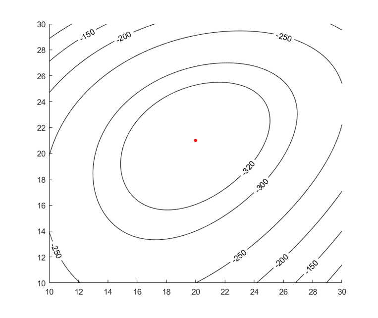

# Ep.4 梯度下降法(GD)

是线搜索法格式中，确定**搜索方向**$\boldsymbol{d}_k$的一种方法。  
即为线搜索的迭代格式：$\boldsymbol{x}_{k+1}=\boldsymbol{x}_k+\alpha_k\boldsymbol{d}_k$。

是一种**一阶方法**（因为只用了一阶梯度）。  
因为用到了一阶梯度，所以$f\in C^1$。

**总结**：

* $L-$光滑与$l-$强凸  
  针对$f$而言，描述了其曲率$\nabla^2$的上下界，  
  **$L$一定大于等于$l$**（由下面的不等式可知）
  * $l-$强凸：函数二次下界，$f(\boldsymbol{y})\ge f(\boldsymbol{x})+\nabla f(\boldsymbol{x})^T(\boldsymbol{y}-\boldsymbol{x})+\frac{l}{2}||\boldsymbol{y}-\boldsymbol{x}||^2\quad(l>0)$  
    $l$可以理解为二阶导数（曲率）的下界，即最小曲率
  * $L-$光滑：函数二次上界，$f(\boldsymbol{y})\le f(\boldsymbol{x})+\nabla f(\boldsymbol{x})^T(\boldsymbol{y}-\boldsymbol{x})+\frac{L}{2}||\boldsymbol{y}-\boldsymbol{x}||^2\quad(L\ge0)$  
    $L$可以理解为二阶导数（曲率）的上界，即最大曲率  
    也可以说是**梯度**为 $L-$Lipschitz 连续的
  * 特殊情况 - $\nabla^2$为对称矩阵：  
    对于$\nabla^2 f$为对称正定矩阵$G\in\mathcal{S}^n_{++}$，则$f$**一定是$L-$光滑与$l-$强凸的**，且取值：
    * $L-$光滑：$L\ge\lambda_{\max}(G)$，取$G$最大特征值
    * $l-$强凸：$l\le\lambda_{\min}(G)$，取$G$最小特征值
* GD 算法定义：  
  线搜索方法
  * 下降方向$\boldsymbol{d}$：负梯度方向$-\nabla f(\boldsymbol{x}_k)$
  * 步长$\alpha$：各种方法确定。特别的，如果$f$是$L-$光滑的，一般取$\alpha=\frac{1}{L}$。
  * 迭代公式：$\boldsymbol{x}_{k+1}=\boldsymbol{x}_k-\alpha_k\nabla f(\boldsymbol{x}_k)$
* 性质
  * 收敛性：全局收敛（任意初始值都可以收敛） - 下降性、有界性、聚集性（一定有聚点，且就为驻点）
  * 充分下降性：如果$f$是$L-$光滑的
    * 如果步长$\alpha\in(0,\frac{2}{L})$，则：GD 是迭代下降的  
      $f(\boldsymbol{x}_{k+1})\le f(\boldsymbol{x}_k)$。
    * 如果如长$\alpha\in(0,\frac{1}{L}]$，则：至少会下降$\frac{\alpha}{2}||\nabla f(\boldsymbol{x}_k)||^2$  
      $f(\boldsymbol{x}_{k+1})\le f(\boldsymbol{x}_k) - \frac{\alpha}{2}||\nabla f(\boldsymbol{x}_k)||^2$
  * 收敛速率  
    只能对以下三种情况分析。
    * $f$是$L-$光滑的任意函数、步长为$\frac{1}{L}$：$\underset{s\in[0,k)}{\min}||\nabla f(\boldsymbol{x}_s)||\le\sqrt{\frac{2L}{k}(f(\boldsymbol{x}_0)-f_*)}=O(\frac{1}{\sqrt{k}})$
    * $f$是$L-$光滑的凸函数、步长为$\frac{1}{L}$：$f(\boldsymbol{x}_k)-f(\boldsymbol{x}_*)\le\frac{L||\boldsymbol{x}_0-\boldsymbol{x}_*||^2}{2k}=O(\frac{1}{k})$
    * $f$是$L-$光滑、$l-$强凸的函数、步长为$\frac{1}{L}$：$||\boldsymbol{x}_k-\boldsymbol{x}_*||^2\le (1-\frac{l}{L})^k||\boldsymbol{x}_0-\boldsymbol{x}_*||^2$
* 条件数$\kappa$ 与 标架依赖性（GD 的问题）  
  对于$L-$光滑和$l-$强凸的函数：$\kappa(f)=\frac{L}{l}\in[1,+\infty)$，  
  也可以$\kappa(f)=\kappa(\nabla^2 f)$，当$\nabla^2 f$为正定矩阵时，$\kappa(\nabla^2 f)=\frac{\lambda_{\max}}{\lambda_{\min}}$  
  * 问题 - 标架依赖性：$\kappa(f)$越大，问题的收敛性质越差。  
  * 应对：可以通过渐近行为，用$\kappa(\nabla^2 f(\boldsymbol{x}_*))$以及其对角线元素来表示，  
    此时用伸缩变换调整对角线相近，使得对之后调整超参数再次求解的收敛速度变快。

> 一些帮助理解的东西：
>
> 一定要知道这个概念，对于梯度下降法，每次都选局部最优解，不等于全局最优解。  
> 虽然对于某点$\boldsymbol{x}_0$，沿负梯度走一小段距离$\alpha\to0$是对于函数值下降最快的，但其不一定是全局下降的方向。
>
> 比如对于下图的二次函数$\frac{17}{2}x^2+\frac{3}{2}y^2$：  
>   
> 对于A点，其负梯度方向是横截面（等高线圈）的切线的垂线，  
> 即便用极限的方法，每次都沿着新的负梯度方向下降无穷小步长，最终也只能得到一条如红线所示的曲线（如果更远一些，红线应该先趋向贴近于y轴，然后沿y轴下降）。  
> 而最优的下降路径，应该是如橙线所示的到原点的直线路径。
>
> 这是因为虽然对于$x_0$，其沿梯度方向下降一小段$\alpha$是函数值减小的最大的；而沿橙线所示并不是最大的，即：$f(x_0+-\nabla\alpha)<f(x_0+d_{\text{橙}}\alpha$，  
> 但这之后，他们两来到了不同的点（梯度方向下降的到$x_1$，橙线下降的到x_2$），此时$x_1$沿梯度的函数下降量，可能就没有$x_2$沿橙线的函数下降量多了，没有可比性，  
> 即虽然第一步赢了，但之后完全到了不同的环境，“函数值减小最大”这句话，对另一环境中的点无效。  
>
> 这就**相当于贪心算法**：  
> 你有 6 块（函数初始值），要用面值为4、3、1的硬币拼凑起来（不同方向带来的函数下降量），要求用最少数量的硬币（即迭代次数最小），  
> 如果用贪心（梯度下降），及最开始选4的（最开始看起来下降最多）、然后只能选两个1的（后面下降的不一定多），故用了3枚；  
> 而实际上最优解是选2个3的，用2枚。

## 一、方法定义

> 问题背景 - 有一阶梯度的无约束极小化问题：
>
> $$
> \underset{x\in \mathbb{R}^n}{\min}f(x)
> $$
> **其中$f\in C^1$。**

🌟**GD 的搜索方向**：
$$
\boldsymbol{d}_k=-\nabla f(\boldsymbol{x_k})
$$
搜索方向定义为 **负梯度**的方向。

**GD 的迭代公式**：
$$
\boldsymbol{x}_{k+1}=\boldsymbol{x}_k-\alpha_k\nabla f(\boldsymbol{x}_k)
$$
*其中步长$\alpha_k$由其它方法（各种准则）确定。*

## 二、方法动机（理解）

现在只有当前点$\boldsymbol{x}_k$的一些局部信息（梯度、周围的二阶近似），不知道全局信息（极小点在哪）。  
可以从两个视角理解，为什么方向要选择负梯度方向：

### 1. 极小化方向导数

即要找到函数值下降最快的方向。

对于方向$\boldsymbol{d}$，其方向导数为$\boldsymbol{d}^T\nabla f(\boldsymbol{x}_k)$，即要“极小化方向导数”$\underset{\boldsymbol{d}}{\min} \boldsymbol{d}^T\nabla f(\boldsymbol{x}_k)$。  
但方向必须有一个限制条件，否则就有无限个。  
故**通常**将$\boldsymbol{d}$定为**方向向量**，即**加上约束条件：其二范数为$1$**，$s.t. ||\boldsymbol{d}||_2=1$。
> 举例：
>
> 比如对于$f(\boldsymbol{x})=\frac{1}{2}(x_1^2+x_2^4)$，其梯度为$\nabla=(x_1,4x_2)$，  
> 假如当前点$\boldsymbol{x}_k=(1,1)$，则“极小化方向导数”问题为$\min d_1+4d_2$，这是$\R^3$一个的平面，故如果$\boldsymbol{d}$没有约束，则无解。

此时，由 Cauchy-Schwartz 不等式（**对于二范数**，$\boldsymbol{x}\cdot\boldsymbol{y}\ge-||\boldsymbol{x}||_2\cdot||\boldsymbol{y}||_2$，仅当$\boldsymbol{x}$与$\boldsymbol{y}$方向相反取等），  
可知“极小化方向导数”问题的最优解为$\boldsymbol{d}$为$-\nabla$方向的单位向量。

⚠️**注意**：  
仅当$\boldsymbol{d}$**限定为单位向量**（即二范数取$1$），才可以直接说明$\boldsymbol{d}$**取负梯度方向**，因为 CS 不等式只对二范数成立；  
否则$\boldsymbol{d}$可能取别的方向。
> 举例：
>
> 比如限定为1范数，即$s.t. |x_1|+|x_2|=1$，此时最优解与2范数不同，可见下图。  
>   
> 2范数的交点为黄色，1范数的交点为粉色。

### 2. 极小化二阶信息常数化的二阶近似

新的迭代点可以看成$f$在$\boldsymbol{x}_k$处的一个二阶近似（极小化$f$在$\boldsymbol{x}_k$处的二阶近似），并令二阶近似系数$B_k$为一个常数（不使用二阶信息），然后极小化它。

利用之前[Ep.3 中的 三、2重要思想 - 多元函数的局部二次近似函数](../Ep.3%20最优解和算法的基本性质/3.md#2-重要思想---多元函数的局部二次近似函数)，  
让$\boldsymbol{g}_k=\nabla f(\boldsymbol{x}_k)$、$B_k\approx\nabla^2 f(\boldsymbol{x}_k)=\frac{1}{\alpha_k}I$  
（这里为什么$B_k\approx\frac{1}{\alpha_k}I$，是因为之后求解这个问题能刚好推出 GD 的迭代公式，是迭代公式决定了这里是这个近似值、并无其他深层原因）  
（并且：因为让$B_k\approx\frac{I}{\alpha_k}$为一个常数，故不要求$f$有二阶导数，没有用到$f$的二阶导数信息）  
则新的迭代点为$\boldsymbol{x}_{k+1}=\underset{\boldsymbol{x}}{\argmin} f(\boldsymbol{x}_k)+\nabla f(\boldsymbol{x})^T(\boldsymbol{x}-\boldsymbol{x}_k)+\frac{1}{2\alpha_k}||\boldsymbol{x}-\boldsymbol{x}_k||_2^2$

记方程$q(\boldsymbol{x})=\frac{1}{2\alpha_k}||\boldsymbol{x}-\boldsymbol{x}_k||_2^2+\nabla f(\boldsymbol{x})^T(\boldsymbol{x}-\boldsymbol{x}_k)+f(\boldsymbol{x}_k)$，明显为一个二次函数。  
则$\nabla q=\frac{1}{\alpha_k}(\boldsymbol{x}-\boldsymbol{x}_k)+\nabla f(\boldsymbol{x})$，  
$\nabla^2 q=\frac{1}{\alpha_k}\succ0$（$\alpha_k>0$），故$q(\boldsymbol{x})$为严格凸函数（见[Ep2.2 的 一些凸函数的快捷判断](../Ep.2%20凸性/2.2.%20凸函数、凸优化.md#ex-一些凸函数的快捷判断)），只有一个极值点，为驻点，  
   则求解$\nabla q=0$，得到$\boldsymbol{x}_{k+1}=\boldsymbol{x}_k-\alpha_k\nabla f(\boldsymbol{x}_k)$，即迭代公式。

## 三、前置知识 - L-Lipschitz 连续（L-光滑）

在下方的“相关性质”的分析中，根据$f$梯度性质的不同，会有不同的复杂性。  
因此首先在给出**适用于梯度的 $L-$Lipschitz 性质**。

*Tip. 有关$L-$光滑和$l-$强凸的几何直观理解，在更后面的[四、3.(3)节中“对 $L-$光滑、 $l-$连续中$L,l$的理解”](#3-f-是-l-光滑-和-l-强凸-的函数)。*

### 1. 定义

$L-$Lipschitz 性质原本是**针对函数$f$而言**，  
但该概念可以扩展，即不仅针对函数$f$，还可以针对$f$的梯度（向量）和$f$的 Hasse 矩阵（矩阵）。  
（本节后面就都说的是梯度是 $L-$Lipschitz 连续的）

#### (1) 针对函数的定义

> 定义 - **Lipschitz 连续性**：
>
> 是对**函数**$f:\R^n\to\R$而言的一种性质。  
> 其指：函数的改变量 可以被 自变量的改变量的线性函数 控制。
>
> 设$L\ge0$，如果在开集$U$上的函数$f$满足：
> $$
> |f(\boldsymbol{x}) -  f(\boldsymbol{y})| \le L||\boldsymbol{x}-\boldsymbol{y}||\quad \forall\boldsymbol{x},\boldsymbol{y}\in U
> $$
> 则称$f$在开集$U$上是 L-Lipschitz 连续的函数。

*Lipschitz 连续是一种比“一致连续”还强的连续性质（故包含该性质）。*

如果写成$\frac{\Delta f}{\Delta \boldsymbol{x}}\le L$，则对应函数的变量率不会超过某个固定的速率。

对一元函数而言则是：**导数（斜率）不能无限大**，最大的斜率则为$L$。  
（如$y=\sqrt{x}$，在$x=0$处斜率无限，则不是 Lipschitz 连续的）

#### (2) 针对梯度

如果将$f(\boldsymbol{x})$换为$\nabla f(\boldsymbol{x})$，并且度量方式改为向量的二范数，即：
$$
||\nabla f(\boldsymbol{x}) - \nabla f(\boldsymbol{y})|| \le L||\boldsymbol{x}-\boldsymbol{y}||\quad \forall\boldsymbol{x},\boldsymbol{y}\in U
$$
则称：$\nabla f(\boldsymbol{x})$是 $L-$Lipschitz 的。  
同时可以**等价表示为$f$是 $L-$光滑** 的。  
*Tip. 光滑指的是可以函数图形作切线/切平面，即为可微函数；如果说梯度 $L-$Lipschitz，则指梯度是连续可微的，则等价。*

*这个概念则用于 GD 法的性质分析中对$\nabla f$的假设。*

#### (3) 针对 Hasse 矩阵

如果将$f(\boldsymbol{x})$换为$\nabla^2 f(\boldsymbol{x})$，并且度量方式改为矩阵的谱范数（二范数），即：
$$
||\nabla^2 f(\boldsymbol{x}) - \nabla^2 f(\boldsymbol{y})|| \le M||\boldsymbol{x}-\boldsymbol{y}||\quad \forall\boldsymbol{x},\boldsymbol{y}\in U
$$
则称：$\nabla^2 f(\boldsymbol{x})$是 $M-$Lipschitz 的。（为了跟梯度是$L-$Lipschitz的区分，这里换了个字母为$M$）  
同时可以**等价表示为$\nabla f$是 $M-$光滑** 的。（但一般不这么说）

*这个概念则用于 NT 法的性质分析中对$\nabla^2 f$的假设。*

### 2. 判定方法

最重要的是“针对梯度的判定方法”——利用梯度的导数（即 Hasse 矩阵）是否有上界判定，  
然后可以由此推及到其他的。

#### (1) 针对函数的判定方法

这里只给出对于一元函数的导数（即$f'(x)$）的判定方法：

即判断其二阶导数$f''(x)$是否有上界。

> 举例 - $f(x)=\sqrt{x^2+1}$
>
> * 一阶导：$f'=\frac{x}{\sqrt{x^2+1}}$
> * 二阶导：$f''=(1+x^2)^{-\frac{3}{2}}$  
>   是对称函数，$x=0$取最大为$1$、$x$越向两边走值越小趋于$0$。
>
> 其二阶导有上界为$1$，所以$f'$是 $1-$Lipschitz 连续的，即$f$是 $1-$光滑 的。
>
> 拓展：可以分析出$f''\to0$，此时$f$不是$l-$强凸的；但如果说存在一个约束$|x|<a$，则$f''$有一个下界为$x=a$时，则可以说$f$是$l-$强凸的。

#### (2) 🌟针对梯度的判定方法

**判定方法为**：  
对于$f\in C^2$，$\nabla^2 f(\boldsymbol{x})$的**谱范数不超过$L$** $\Leftrightarrow$ $\nabla f$是$L-$Lipschitz 的（$f$是$L-$光滑的）。

> 补充 - 矩阵$A$的谱范数：
>
> 矩阵$A$的谱范数，也可称为二范数，记为$||A||_2$。  
> 对于一个矩阵，其谱范数是指：矩阵$A$对任意非零向量$\boldsymbol{x}$施加线性变换时，其最大可能输出向量长度$||A\boldsymbol{x}||_2$与输入向量长度$||\boldsymbol{x}||_2$的比例。  
> 对于海森矩阵来说，其谱范数是其**最大特征值的绝对值**。
> $$
> ||G||_2=\max|\lambda_{}(G)|
> $$
>
> 也可见[Ep.0 中有关矩阵的范数](../Ep.0%20基础知识/0.md#9-范数)。

🌟**推论**：  
故如果$f$的 Hasse 矩阵是对称矩阵$G\in\mathcal{S}^n$，  
则$f$**一定是**$L-$光滑（梯度是 $L-$Lipschitz 的）的，其中$L\ge\max|\lambda(G)|$（一般直接取$\lambda_{\max}$）。

#### (3) 针对 Hasse 矩阵的判断方法

类似于

### 3. 性质 - 二次上界

> **定义 - $L-$光滑的二次上界**：
>
> 如果$f$是$L-$光滑的，则：
>
> $$
> f(\boldsymbol{y})\le f(\boldsymbol{x})+\nabla f(\boldsymbol{x})^T(\boldsymbol{y}-\boldsymbol{x})+\frac{L}{2}||\boldsymbol{y}-\boldsymbol{x}||^2\quad(\forall\boldsymbol{x},\boldsymbol{y}\in\R^n)
> $$

记：右侧的二次函数为$g_L(\boldsymbol{y})$，  
则对于$f$，其不一定凸（波浪函数），但对于任意一个定点$\boldsymbol{x}$，可以**确定一个**过$\boldsymbol{x}的$关于$\boldsymbol{y}$的**二次函数**$g_L$，其作为$f$的**上界**。  

易知$\nabla^2 g_L(\boldsymbol{y})=LI$。

> 证：
>
> 用“[用凸函数形式将多元函数转化为一元函数](../Ep.2%20凸性/2.2.%20凸函数、凸优化.md#ex-另一种形式---用凸函数形式将多元函数转化为一元函数)”的思想：$\varphi(\theta)=f(\boldsymbol{x}+\theta(\boldsymbol{y}-\boldsymbol{x}))$，  
> 则：$\varphi(0)=f(x)$，$\varphi(1)=f(y)$，  
> $\varphi'(\theta)=\nabla f(\boldsymbol{x}+\theta(\boldsymbol{y}-\boldsymbol{x}))^T(\boldsymbol{y}-\boldsymbol{x})$
>
> 由微积分基本定理：  
> $\varphi(1)-\varphi(0)$  
> $=\int_0^1 \varphi'(\theta) \text{d}\theta$，加一项减一项$\varphi'(0)$，  
> $=\int_0^1\varphi'(0)\text{d}\theta+\int_0^1 (\varphi'(\theta)-\varphi'(0))\text{d}\theta$，其中左侧$\int_0^1\varphi'(0)\text{d}\theta=\varphi'(0)(1-0)$，右侧将$\varphi'(\theta)$代入  
> $=\varphi'(0)+\int_0^1(\boldsymbol{y}-\boldsymbol{x})^T(\nabla f(\boldsymbol{x}+\theta(\boldsymbol{y}-\boldsymbol{x}))-\nabla f(\boldsymbol{x}))\text{d}\theta$
>
> 对于右侧积分内部，由 Cauchy-Schwarz 不等式，可替换成$\le||\boldsymbol{y}-\boldsymbol{x}||\cdot||\nabla f(\boldsymbol{x}+\theta(\boldsymbol{y}-\boldsymbol{x}))-\nabla f(\boldsymbol{x})||$，  
> 又因为积分的单调性，即如果积分范围的内部恒$\ge0$，则积分结果也$\ge0$，故等式可以缩放为不等式：  
> $\le\varphi'(0)+\int_0^1||\boldsymbol{y}-\boldsymbol{x}||\cdot||\nabla f(\boldsymbol{x}+\theta(\boldsymbol{y}-\boldsymbol{x}))-\nabla f(\boldsymbol{x})||\text{d}\theta$，由$L-$光滑的性质知：  
> $\le\varphi'(0)+\int_0^1 ||\boldsymbol{y}-\boldsymbol{x}||\cdot L||\boldsymbol{x}+\theta(\boldsymbol{y}-\boldsymbol{x})-\boldsymbol{x}||\text{d}\theta$，因为$\theta\in(0,1)>0$，可以提到二范数外面，  
> $=\varphi'(0)+\int_0^1 L||\boldsymbol{y}-\boldsymbol{x}||^2\theta\text{d}\theta$  
> $=\varphi'(0)+\frac{L}{2}||\boldsymbol{y}-\boldsymbol{x}||^2$。
>
> 再把$\varphi(1)-\varphi(0)$、$\varphi'(0)$带入，得要证式。

## 四、相关性质

即分析 GD 的收敛性和收敛速率。

### 1. 收敛性 - 全局收敛

全局收敛性质指：**对初始值要求不高**（可以是任意位置）。

> **性质 - GD 的全局收敛性**：
>
> 如果 GD 满足以下条件：
>
> 1. 初始点$\boldsymbol{x}_0$，其下水平集$S=\{\boldsymbol{x}:f(\boldsymbol{x})=f(\boldsymbol{x}_0)\}$是紧的（有界闭集）
> 2. $f$在包含$S$的某开集上**连续可微**（即偏导数存在且连续，即$C^1$）
> 3. 步长$\alpha$满足 Armijo 法则
>
> 则该 GD 具有全局收敛性，即具有以下性质：
>
> * 下降性：除非得到驻点，否则$f(\boldsymbol{x}_i)$严格单调递减
> * 有界性：迭代轨迹不离开$S$（所有迭代点都在$S$里）
> * 聚集性：轨迹一定有聚点，并且每个聚点都是$f$的驻点
>
> ---
>
> 证明：
>
> 方向$\boldsymbol{d}_k=-\nabla f(\boldsymbol{x}_k)$
>
> 因为满足 Armijo 法则，即$f(\boldsymbol{x}_k+\alpha\boldsymbol{d}_k)<f(\boldsymbol{x})+\rho\nabla f(\boldsymbol{x}_k)^T\boldsymbol{d}_k\alpha$  
> $\Rightarrow f(\boldsymbol{x}_{k+1})<f(\boldsymbol{x})-\rho\alpha||\nabla f(\boldsymbol{x}_k)||^2_2$，  
> 当梯度非0时，$\because \rho,\alpha,||...||^2_2>0$，故$f(\boldsymbol{x}_{k+1})<f(\boldsymbol{x})$，证得性质(1)，同时也可说明性质(2)。  
> $\because$序列点都在$S$里，$S$有界，无限有界序列一定有聚点，$\therefore$证得性质(3)。

因为找到的是驻点，所以：

* 对于凸函数，则对应**全局**极小点。
* 对于非凸函数，则可能是**局部**极小点、也可能是**鞍点**。

*究极特殊的情况：如果初始点是局部极大点，此时梯度无法下降，故找到的是局部极大点，但概率超小。*

### 2. 充分下降性（对于 L-光滑 函数而言）

如果$f$**是$L-$光滑**的，则 GD 法具有“**充分下降性**”。

> **定义 - GD 的充分下降性**：
>
> 如果$f$是$L-$光滑的，则：
>
> * 如果步长$\alpha\in(0,\frac{2}{L})$，  
>   则：GD 是迭代下降的（$f(\boldsymbol{x}_{k+1})\le f(\boldsymbol{x}_k)$）。  
> * 🌟额外的，如果步长$\alpha\in(0,\frac{1}{L}]$，  
>   则：GD 是迭代下降的，且至少会下降$\frac{\alpha}{2}||\nabla f(\boldsymbol{x}_k)||^2$，即：
>   $$
>   f(\boldsymbol{x}_{k+1})\le f(\boldsymbol{x}_k) - \frac{\alpha}{2}||\nabla f(\boldsymbol{x}_k)||^2
>   $$
>
> ---
>
> 证：
>
> 利用上面的二次上界$f(\boldsymbol{y})\le f(\boldsymbol{x})+\nabla f(\boldsymbol{x})^T(\boldsymbol{y}-\boldsymbol{x})+\frac{L}{2}||\boldsymbol{y}-\boldsymbol{x}||^2$，  
> 其中$\boldsymbol{x}$相当于$\boldsymbol{x}_k$，$\boldsymbol{y}$相当于$\boldsymbol{x}_{k+1}=\boldsymbol{x}_k-\alpha\nabla f(\boldsymbol{x}_k)$，部分代入：  
> $f(\boldsymbol{x}_{k+1})\le f(\boldsymbol{x}_k)+\nabla f(\boldsymbol{x}_k)^T(\boldsymbol{x}_k-\alpha\nabla f(\boldsymbol{x}_k)-\boldsymbol{x}_k)+\frac{L}{2}||\boldsymbol{x}_k-\alpha\nabla f(\boldsymbol{x}_k)-\boldsymbol{x}_k||^2$，整理：  
> $f(\boldsymbol{x}_{k+1})\le f(\boldsymbol{x}_k)-||\nabla f(\boldsymbol{x}_k)||^2\alpha+\frac{L}{2}||\nabla f(\boldsymbol{x}_k)||^2\alpha^2$（右侧为一个开口向上的一元二次函数，对称轴为$-\frac{b}{2a}=-\frac{1}{L}$，可以如此简单理解），  
> $f(\boldsymbol{x}_{k+1})\le f(\boldsymbol{x}_k)-(1-\frac{L}{2}\alpha)\alpha||\nabla f(\boldsymbol{x}_k)||^2$  
> 对于$1-\frac{L}{2}\alpha$，当$\alpha\in(0,\frac{2}{L})\to>1$，故下降；$\alpha\in(0,\frac{1}{L})\to>\frac{1}{2}$，故至少下降。

步长$\alpha\in(0,\frac{1}{L}]$时，越大下降的越多；但超过$\frac{1}{L}$后则越大反而下降的越少。  
故**通常让$\alpha=\frac{1}{L}$**。

*这个性质作为下面的复杂性分析的前置性质（复杂性分析也要默认$f$是$L-$光滑的），即在复杂性分析当中，步长$\alpha=\frac{1}{L}$。*

### 3. 收敛速率 - 复杂性分析

这里要对$f$做出不同的假设（但最基础的是$f$为$L-$光滑），从而得到不同的定量分析。

#### (1) f 是 L-光滑 的 任意函数（可能非凸）

> 性质 - 前$k$次的最小梯度逐渐减小：
>
> $f$是$L-$光滑的，且存在极小点$\boldsymbol{x}_*$，  
> 则对于初始值为$\boldsymbol{x}_0$、步长为$\frac{1}{L}$的 GD，其迭代满足：
>
> $$
> \underset{s\in[0,k)}{\min}||\nabla f(\boldsymbol{x}_s)||\le\sqrt{\frac{2L}{k}(f(\boldsymbol{x}_0)-f_*)}
> $$
>
> ---
>
> 证：
>
> 由充分下降性、且$\alpha=\frac{1}{L}$知：$\frac{1}{2L}||\nabla f(\boldsymbol{x}_k)||^2\le f(\boldsymbol{x}_k) - f(\boldsymbol{x}_{k+1})$  
> 对$s=0\sim k-1$求和，得$\frac{}{}$：$\frac{1}{2L}\sum_{s=0}^{k-1}||\nabla f(\boldsymbol{x}_k)||^2\le f(\boldsymbol{x}_0)-f(\boldsymbol{x}_k)$，  
> $\because \sum_{s=0}^{k-1}||\nabla f(\boldsymbol{x}_k)||^2\ge k\cdot\underset{s\in[0,k)}{\min}||\nabla f(\boldsymbol{x}_k)||^2$（$k$个值求和肯定大于等于$k$个其中最小值求和）；  
> $\because f(\boldsymbol{x}_0)-f(\boldsymbol{x}_k)\le f(\boldsymbol{x}_0) - f_*$  
> $\therefore \frac{k}{2L}\underset{s\in[0,k)}{\min}||\nabla f(\boldsymbol{x}_k)||^2\le f(\boldsymbol{x}_0) - f_*$，整理后得上式。

可用大 O 表达式，记右侧为$O(\frac{1}{\sqrt{k}})$，即：
$$
\underset{s\in[0,k)}{\min}||\nabla f(\boldsymbol{x}_s)||\le O(\frac{1}{\sqrt{k}})
$$

如果令**误差序列等于上式左侧**，即$\delta_k=\underset{s\in[0,k)}{\min||\nabla f(\boldsymbol{x}_s)||\approx\frac{1}{\sqrt{k}}}$，  
则收敛速率$\frac{\delta_{k+1}}{\delta_{k}}\approx\frac{\sqrt{k}}{\sqrt{k+1}}\to1$，  
故为**次线性收敛**。

#### (2) f 是 L-光滑 的 凸 函数

额外的，如果$f$还是**凸函数**，  
则满足：
$$
f(\boldsymbol{x}_k)-f(\boldsymbol{x}_*)\le\frac{L||\boldsymbol{x}_0-\boldsymbol{x}_*||^2}{2k}=O(\frac{1}{k})
$$

令**误差序列为最优值之差**，即$\delta_k=f(\boldsymbol{x}_k)-f(\boldsymbol{x}_*)$，  
则收敛速率$\frac{\delta_{k+1}}{\delta_{k}}\approx\frac{k+1}{k}\to1$，  
**仍为次线性收敛**，但比上面快。

*证明可见第 4 章的 PPT 的 P8-9。*

#### (3) f 是 L-光滑 和 l-强凸 的函数

> 回顾 - $l-$强凸函数：
>
> 关于强凸函数的定义可见[Ep 2.2 的 二、Ex](../Ep.2%20凸性/2.2.%20凸函数、凸优化.md#4-拓展---l-强凸函数)，  
> 其存在关键性质：强凸函数$f$具有二次**下界**（而 L-光滑 具有二次上界）。
>
> 同时根据$l-$强凸的性质：  
> 对于二次型函数$f(\boldsymbol{x})$，如果其$\nabla^2=G$对称**正定**，则$f$**一定为$l-$强凸**，只要让$l\le\lambda_{\min}(G)$（$l$最大可以取到$\lambda_{\min}(G)$）。  
> 同时，其还**一定是$L-$光滑**，$L$最小取到$\lambda_{\max}(G)$。

额外的，如果$f$还是$l-$强凸函数，  
则满足：
$$
||\boldsymbol{x}_k-\boldsymbol{x}_*||^2\le (1-\frac{l}{L})^k||\boldsymbol{x}_0-\boldsymbol{x}_*||^2
$$

等式右侧可以看作一个等比数列$(1-q)^n a_0$，由于$L$（上界）一定大于等于$l$（下界），$\frac{l}{L}\in(0,1]$，公比$(1-q)\in[0,1)$，其**越小收敛越快**。  
可利用条件数，将公比记为$(1-\frac{1}{\kappa})^k$。

令**误差序列为与极小点点距离**，即$\delta_k=||\boldsymbol{x}_k-\boldsymbol{x}_*||^2$，  
则收敛速率$\frac{\delta_{k+1}}{\delta_{k}}\approx\frac{c^{k+1}}{c^k}=c$。

* 当$L=l$时，$c=1-\frac{l}{L}=0$，$\boldsymbol{x}_k=\boldsymbol{x}_*$  
  即超线性收敛，即**只需一步**就一定能迭代到极小点。
* 当$L\ne l, L\not\gg l$时，$c\in(0,1)$  
  即线性收敛。
* 当$L\gg l$时，$c\to1$  
  即迭代很慢，退化成次线性收敛。

*证明听不懂，暂时摸之。*

> 拓展 - 对 $L-$光滑、 $l-$连续中$L,l$的理解：
>
> 这两者都描述了$f$的梯度的变化程度，即曲率：
>
> * $L$：表示函数$f$的梯度变化不能过快，它限制了函数梯度变化的上界。换句话说，函数的二阶导数（曲率）不能超过$L$，即**最大曲率**。
> * $l$：表示函数$f$的梯度变化不能过慢，它限制了函数梯度变化的下界。换句话说，函数的二阶导数（曲率）不能小于$l$，即**最小曲率**。
>
> 几何上，$L$和$l$是对函数曲率的约束。它们告诉我们，函数曲线既不能“太平缓”（因为有$l$限制）也不能“太陡峭”（因为有$L$限制）。
>
> 当$L=l$时，意味着函数的曲率在每一点都是相同的，梯度**均匀变化**，并且沿着梯度走到新的一点，梯度还是这个方向，故可以一步到位（一直沿梯度走的方向即是指向圆心的方向，可见最上方总结的“一些帮助理解的东西”）。  
> 这样（$L=l$）的函数只能是一个**很简单的二次函数**（如$f=\frac{\lambda}{2}||\boldsymbol{x}||^2$），因为只有这样其二次函数的曲率（海森矩阵）$\nabla^2=\lambda I$是恒定的。
>
> 如果$L\ne l$，则函数的曲率在不同点会有变化，收敛会收到曲率受到影响，其收敛过程应如下图所示：
>   
> *也可见上方总结的“一些帮助理解的东西”。*  
> 同时也说明，该函数可以被两个二次函数夹逼，可以很好的用二次函数近似，即如下图：  
> 
>
> 对于等高线图中，还可以这样理解$L$和$l$：
>
> * $L$相当于等高线图中一圈，其外接圆的半径（最大曲率）
> * $l$相当于等高线图中一圈，其内接圆的半径（最小曲率）

### 4. GD 的渐近行为

> 定义 - **渐近行为**：
>
> 渐近行为(Asymptotic Behavior)指的是算法在接近解（比如局部极小点）时的表现方式。  
> 也就是说，当梯度下降法逐步收敛到局部极小点$\boldsymbol{x}_*$时，其迭代过程表现出的特征。

**对于 GD 法**而言，  
如果知道其收敛到$f$的非退化局部极小点（即[真正的局部极小点](../Ep.3%20最优解和算法的基本性质/3.md#3-二阶充分条件极小点为内点或无约束情况)）$\boldsymbol{x}_*$，  
则对于极小化$f$的渐近行为，和用 GD 极小化二次函数（强凸二次型）$q(\boldsymbol{x})=\frac{1}{2}(\boldsymbol{x}-\boldsymbol{x}_*)^T\nabla^2 f(\boldsymbol{x}_*)(\boldsymbol{x}-\boldsymbol{x}_*)+C$类似。  
*即靠近局部极小点时，其收敛过程类似于收敛这个二次函数，能很快收敛且稳定。*

因此，**可用极小点$\boldsymbol{x}_*$处的行为，来近似描述整个极小化问题的行为**。  
（比如收敛速率，其跟$f$的条件数，即海森矩阵的条件数有关（见下），可用$\boldsymbol{x}_*$处的海森矩阵来近似描述整个问题的收敛速率）

## 五、条件数、标架依赖性

在这里先给出有关“条件数”的定义（并不是独属于 GD 的），然后讲解其“标架依赖性”以及应对方法。

### 1. 条件数

对于**满足$L-$光滑和$l-$强凸的**函数$f$，  
记$\kappa=\frac{L}{l}$，称为函数$f$的“**条件数**”。  
可知：$\kappa\ge1$。

> 拓展 - 如何理解条件数$\kappa(f)$：
>
> 可以理解为函数在不同方向上的**曲率变化程度**。
>
> * 如果条件数$\kappa$很大，说明函数的曲率在某些方向上变化非常快，而在其他方向上变化很慢。  
>   这意味着问题的解**对方向特别敏感**，导致优化过程收敛较慢。  
>   所以$\kappa$也可以描述优化问题中$f$的**敏感度**。
> * 条件数越小，说明函数的曲率在各个方向上都比较一致，优化过程会更加稳定和高效
>
> ---
>
> 还存在“矩阵的条件数$\kappa(G)$”，其为矩阵的最大奇异值比上最小奇异值$\kappa(G)=\frac{\sigma_{\max}(G)}{\sigma_{\min}(G)}$，  
> （如果$G\in\mathcal{S}^n$，则奇异值等价于特征值）  
> 其衡量的是矩阵$G$的拉伸或缩放程度在不同方向上的差异。如果条件数很大，说明矩阵沿某些方向拉伸得很多，而在其他方向上几乎没有拉伸。
>
> 同时也描述一个矩阵的病态性（类似于奇异的概念，奇异（行列式为0）代表坏人、非奇异代表好人，而病态则是好人中坏的程度），  
> 病态则描述行列式接近于0的程度（即会把整个空间变化得很畸形（一方很大另一方很小）、差一点点就可能导致空间塌缩）。

对于正定二次函数$f(\boldsymbol{x})=\frac{1}{2}\boldsymbol{x}^TG\boldsymbol{x}+\cdots$（$G$**是正定矩阵**，$G\in\mathcal{S}^n_{++}$），  
其$\nabla^2=G$，其条件数$\kappa(G)=\frac{\lambda_{\max}}{\lambda_{\min}}$（只有正定矩阵$\mathcal{S}^n_{++}$才能这么说），  
即$f$**的条件数就是矩阵$G$的条件数**。

推广，对于**一般$L-$光滑和$l-$强凸的函数$f$**，则**函数的条件数等于海森矩阵的条件数**，  
$$
\kappa(f)=\kappa(\nabla^2 f)
$$
其越接近1，问题越好解（等于1时只用一步）；  
其越大，问题越难解，解的时候就如上图“L不等于l”的收敛过程，来回迭代，称为"**Zig-Zag 现象**"，且越大越严重。

### 2. 标架依赖性（GD 的缺陷）

> 定义 - 标架、标架依赖性：
>
> 标架(Basis)指的是坐标系或基底，也就是描述向量的参考系统。  
> 在优化问题中，函数的表示和梯度的计算都是基于某个坐标系来进行的。  
> 通常$f(\boldsymbol{x})$的梯度计算都是基于标准正交坐标系（即笛卡尔坐标系）来表示的。
>
> 故“GD 有标架依赖性”表示：GD 的梯度下降的过程和收敛行为依赖于这个坐标系。  
> 如果我们改变坐标系，重新表示函数和梯度，优化路径、效率可能会发生变化。  
> 故**可以通过变换坐标系**，让 GD 的**效率变得更好**。  
> 所以 GD 具有标架依赖性（与坐标系有关，改变坐标系可以变得更好）。

对于最小化问题：
$$
\underset{\boldsymbol{x}\in\R^n}{\min}f(\boldsymbol{x})
$$

如果$f$存在条件数，但$\kappa(f)=\kappa(\nabla^2 f)$很大于1（因渐近行为，可以用$\kappa(\nabla^2 f(\boldsymbol{x}_*))$这一确值来近似），即函数曲率变化很大，  
会导致等高线图形较扁、弯曲程度不一致，从而导致"Zig-Zag 现象"很严重，如下图：  
  
当选择左下红色点为初始点时，可以看到按其梯度方向搜索，会远远偏移好的搜索方向。

但如果我们对坐标系进行拉伸缩放变换（比如上图，对纵轴拉长），也就是“**基变换**”而改变坐标系，变为$g(\boldsymbol{y})$  
则可以得到更好函数图像，**各等高线能更接近同心圆**，如下图：  
，  
此时变化会导致$\kappa(h)$很接近1，使得函数性质很好。

*因此个人也称这个为“条件数$\kappa$相关性”。*

### 3. 标架依赖性的简单应对方法 - 拉伸压缩变换

上面也提到了，可以对函数进行拉伸压缩变换。

如果一个函数性质很不好（根据渐近行为，即$\kappa(\nabla^2 f(\boldsymbol{x}_*))$很大，即其特征值比值很大，而在矩阵性质很坏情况下（有极大和极小的极端特征值），**特征值就可以直接看成对角线的值**），  
可以通过缩放变换，让其性质变好（即**对角线的值差不多近似**）。

因此可以用可逆矩阵$T$表示一个变换，令$\boldsymbol{x}=T\boldsymbol{y}$，  
则对应问题转化为：
$$
\underset{\boldsymbol{y}\in\R^n}{\min} h(\boldsymbol{y})=f(\boldsymbol{x})=f(T\boldsymbol{y})
$$

* 一阶梯度：$\nabla h(\boldsymbol{y})=T^T\nabla f(T\boldsymbol{y})$
* 二阶梯度：$\nabla^2 h(\boldsymbol{y})=T^T\nabla^2 f(T\boldsymbol{y})T$  
  局部极小点的二阶梯度则为$\nabla^2 h(\boldsymbol{y}_*)=T^T\nabla^2 f(\boldsymbol{x}_*)T$

故：设计一个缩放变换矩阵$T$，让$T^T\nabla^2 f(\boldsymbol{x}_*)T$的**对角线值近似**。

---

这种方法的收益并不在于对第一次求解进行效率提高（通常第一次求解之前都无法知道$\boldsymbol{x}_*$，上述对$\nabla^2 f(\boldsymbol{x}_*)$缩放也就无从谈起了），  
而在于当求解了第一次后，可以进行缩放，在接下来**小范围调整参数后再次求解时**（因为求解最优化问题通常有参数，比如下面举例，要多次调参来求解问题（对应于机器学习的超参数，是需要手动调整的参数，而非内部学习调整的参数）），能极大提升优化效率。

**举例**：

对于极小化$f(\boldsymbol{x})=x_1^2-5x_1x_2+x_2^4-ax_1-bx_2$（有两个超参数$a,b$）。

首先设超参数$a=25, b=8$，取初始点$\boldsymbol{x}_0=\boldsymbol{0}$，  
用 GD 求解第一次，经过了80次迭代（迭代了很多次），得到$x_*=(20,3)$。

因此求极值点处的梯度$\nabla^2f(\boldsymbol{x}_*)=\begin{bmatrix}2&-5\\-5&108\end{bmatrix}$，用渐进行为来评估函数整体  
可以发现对角线元素相差很大，即$f$性质很不好，函数图像如上面的“很坏的 f”，也应证了为什么性能差。

接下来还需要小幅度调整超参数来迭代，
因此考虑采用伸缩变换$T=\begin{bmatrix}1&0\\0&t\end{bmatrix}$（$t$待定），让$T^T\nabla^2 f(\boldsymbol{x}_*)T$的对角线元素变得近似，  
$T^T\nabla^2 f(\boldsymbol{x}_*)T=\begin{bmatrix}2&\cdots\\\cdots&108t^2\end{bmatrix}$，即让$108t^2\approx2$，得$t\approx\frac{1}{7}$（即$y$轴拉伸7倍）。

这样变换之后，函数图像变成上面的“很好的 g”，性质很好，  
这样，再次以同样的超参数和初始点求解时，迭代次数变为了个位数。  
但意义不在于对同样的超参数进行求解，而在于：对于其它相近的超参数($a,b$)值，也可以有类似的速率进行求解。  
*因为用了很多层近似，如果超参数变化很大，那么就无法得到类似的速率了，有可能重新变慢了，需要**重新按新的$\nabla^2h(T\boldsymbol{x}_*)$进行重新调整**。*

## 六、GD 的扩展

GD 是“一阶方法（也叫梯度法）”当中最具代表性（也是约束最小、函数性质最好的一个）的一个，即

* 约束最小：可行域$S=\R^n$
* 函数性质最好：$f$为光滑函数（或至少$f\in C^1$）

针对不同的约束、或性质更差的函数，有不同的方法。

### 1. 投影梯度法

**变化**：**函数的可行域不再是$\R^n$**，而是在一个约束集上，即$S\ne\R^n$。  
如：$S$为第一象限$\R_{++}$、限制在一个盒子包围，等。

此时直接采用迭代公式$\boldsymbol{x}_{k+1}=\boldsymbol{x}_k-\alpha_k\nabla f(\boldsymbol{x}_k)$则会有问题，比如下图：  
  
$\boldsymbol{x}_0$迭代后到$\boldsymbol{y}_1$，导致迭代后的点脱离定义域。

**因此很简单的一个想法就是**：  
如果迭代后了$\boldsymbol{y}_1$离开定义域，就选择这条方向线上 正好位于定义域边上的点（**最远的没有离开定义域的点**），即$\boldsymbol{x}_1$作为迭代点。  
这个点$\boldsymbol{x}_1$则称为点$\boldsymbol{y}_1$到可行域$S$的“投影点”。

故投影梯度法，仍跟 GD 一样，只不过每次迭代出$S$的点，要使用投影将其变回到$S$内。

对于点$\boldsymbol{x}_k$，使用梯度迭代的，称为“梯度步”$\boldsymbol{y}_{k+1}=\boldsymbol{x}_k-\alpha_k\nabla f(\boldsymbol{x}_k)$，  
再进行投影的，称为“投影步”$\boldsymbol{x}_{k+1}=\Pi_{s}(\boldsymbol{y}_{k+1})$。  
其中$\Pi_S$表示$S$上的投影算子（在这里还未定义，根据实际情况具体定义），  
$\Pi_S(\boldsymbol{y})$表示集合$S$中距离向量$\boldsymbol{y}$最近的点（本身投影操作就是找最近的点）。

5
### 3. 投影次梯度法

**变化**：$f\not\in C^1$，且$S\ne\R^n$（上面两个的融合）。

因此则将“次梯度法”+“投影梯度法”→“投影次梯度法”。
