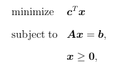

# 全局总结

~~考核的重点就是“最优解的刻画”（一阶二阶必要充分条件）：~~

* ~~无约束优化 - 5个（4个可微函数、1个不可微函数）~~
* ~~约束优化 - 4个（均要可微）~~

---

## 一些经典的问题以及涉及知识

### 1. 最小二乘

$$
\min \|A\boldsymbol{x}-\boldsymbol{b}\|^2
$$

$$
\min \sum r_i(x)^2
$$

$$
\min r(x)^Tr(x)
$$

可见[作业总结2中的Q1](作业总结/2/index.md#q1最小二乘法相关)。

* 梯度：$2\nabla r(x)^T r(x)$
* 海森矩阵：$2(A(x)^TA(x) +\sum(r_i(x)\nabla^2 r_i(x)))$

### 2. 线性规划标准型

问题定义：

涉及知识：

* 为图规划
* 约束品性：满足 LCQ

KKT条件（$\lambda$可任意转换正负）：

$$
Ax=b\\
x\ge0 \\
c - \lambda A^T - \mu = 0 \\
\mu^Tx=0
$$

### 3. 标准二次型+单位球最小特征值

*来源于[作业4的Q2](作业总结/4/记录.md#q2-对称矩阵最小特征值变分表示)。*

$$
\begin{array}{ll}
  \min & x^TAx \\
  s.t. & x^Tx=1
\end{array}
$$

则：

* $f_*=\lambda_{\min}(A)$
* $x_*=$对应的特征向量$A x_* = \lambda_{\min}x_*$

证明思路：

* 充分性：设$x_*$为最优解，首先说明满足LICQ、即$\nabla h(x)\ne0$，易证。  
  然后满足一阶二阶条件：
  * 一阶：$Ax_*-\lambda x_* = 0$（$\lambda$可以取为负数，故这里可以改为$-$）  
    首先说明：$x_*$是特征向量、$\lambda$是特征值  
    其次：$f_*=x_*^TAx_*=\lambda x_*^Tx_*=\lambda$，故部分证明了$f_*$和$x_*$，这里只需要说明$\lambda$是最小特征值，则能完成证明。
  * 二阶：对于$\forall d, d^Tx_*=0$，$d^T(A-\lambda I)d\ge0$

  然后证的思路：
  1. 证$f_*=\lambda_{\min}(A)$：  
     目前有$f_*=\lambda$，则证$\lambda$是最小特征值：  
     即证$(A-\lambda I)\succeq0$，则证明$A$的最小特征值$\lambda_{\min}\ge\lambda$，而$\lambda$就是特征值，故就是最小特征值。
  2. 证$A-\lambda I\succeq0$：要用一个任意向量$y$来说明，可以表示为$y=tx_*+d$（因为$x_*$与$d$正交），带入即可证。
* 必要性：记最小特征值$\lambda_0$，对应特征向量$x_0$，证其为最优值和最优解
  * 最小特征值，故满足$\forall y, y^T(A-\lambda_0 I)y\ge0$、$Ax_0=\lambda_0 x_0$、特征向量自然满足$\|x\|^2=1$、为可行点。
  * 证$x_0$最优，即证$\forall f(x)\ge f(x_0)$。
  * $x$带入唯一推导式，并结合约束$x^Tx=1$化简，可得$x^T(A-\lambda_0I)x = x^TAx-\lambda_0\ge0$，即$f(x)\ge\lambda_0$
  * 接下来则要证$f(x_0)=\lambda_0$，即可完全证明。
  * $x_0^T(A-\lambda_0 I)x_0 = x_0^TAx_0 - \lambda_0x_0^Tx_0= 0 = x_0^TAx_0 - \lambda_0 = f(x_0)-\lambda_0$，得证

## 常见问题的对偶形式

### 1. ⭐线性规划

#### 1. 标准型

**原问题**：

$$
\begin{array}{ll}
  \underset{x}{\text{minimize}} & c^Tx \\
  \text{subject to} & Ax=b \\
  & x\ge0
\end{array}
$$

**对偶问题**：

$$
\begin{array}{ll}
  \underset{y}{\text{maximize}} & b^Ty \\
  \text{subject to} & A^Ty\le c
\end{array}
$$

**互补松弛条件**：

$$
x_i(a_i^Ty-c_i)=0
$$

> **分析**：
>
> $$
> \mathcal{L} = c^Tx +\lambda^T(Ax-b)-\mu^T x \\
> \nabla\mathcal{L} = c +A^T\lambda-\mu
> $$
>
> 易知$\mathcal{L}$关于$x$为凸，则$\nabla\mathcal{L}=0$时取$\min\mathcal{L}$，  
> 因为$\mathcal{L}$相当于$y=ax+b$的形式（$\mathcal{L}=\nabla x-\lambda^Tb$），> $\nabla=0$则$y=b$，  
> 故：$q(\lambda,\mu)=-\lambda^Tb$，这里让$\lambda$取反消去符号，则得到对偶问题的目标函> 数。
>
> 则为：
> $$
> \begin{array}{ll}
>   \text{maximize} & b^T\lambda \\
>   \text{subject to} & \mu\ge0 \\
>   & c+A^T\lambda-\mu=0
> \end{array}
> $$
>
> 再消去$\mu$，变$\lambda$为$y$。

#### ⭐2. 求解方法——互补松弛条件

*这里只能简单硬记：*  
> 原问题的不等式，与对偶问题的**对应的不等式**，成一对互补松弛条件。  

*注意“对应的”这个词，因为不等式可能有多组。*

对于标准型，$x\ge0$与$A^Ty-c\le0$对应，  
则互补松弛条件有一对
$$
x_i(a_i^Ty-c_i)=0
$$

**这个式子的理解**：

对于$x_i\ge0$和$a_i^Ty-c_i\le0$，

* 已知$x$，可得到$y$新的约束
  * 如果$x_i>0$，则$a_i^Ty=c_i$
  * 如果$x_i=0$，则$a_i^Ty\le c_i$
* 已知$y$，可得到$x$新的约束
  * 如果$a_i^Ty<c_i$，则$x_i=0$
  * 如果$a_i^Ty=c_i$，则$x_i\ge0$

注意：对于对偶问题和原问题，可能有无穷个最优解！不是恒为1个。

**运用方式**：

1. **已知$x_0$，验证其为原问题最优解**  
   根据$x_0$，利用互补松弛条件，得到有关$y$的新的约束（将部分$\le c$变为$=c$），  
   然后对于新的约束，找到任意一个可行解$\bar{y}$（自己凑），此时必定$q(y)=f(x_0)$（自己验算就完事），  
   根据“弱对偶性”，当$q(y)=f(x_0)$时，则两者都是对应最优解。  
   *即对于新的约束，如果存在解，则可证明。*
2. **可解$y_*$（如$\R^2$，图解法），以此求出原问题最优解**  
   同样的，根据$y_*$，得到有关$x$的新的约束，然后求解即可。  
   注意：可能为无穷个，而非只有1个。

#### 3. 另一种格式（约束为不等式，有两对互补松弛条件）

**原问题**：

$$
\begin{array}{ll}
  \underset{x}{\text{minimize}} & c^Tx \\
  \text{subject to} & Ax\le b \\
  & x\ge0
\end{array}
$$

**对偶问题**：

$$
\begin{array}{ll}
  \underset{y}{\text{maximize}} & b^Ty \\
  \text{subject to} & A^Ty\le c \\
  & y\ge0
\end{array}
$$

**有两对互补松弛条件**：

$$
(a_ix-b_i)y_i=0 \\
x_j(a_j^Ty-c_j)=0
$$

## 两种重要的一元辅助函数

证明题常用。

### 1. 线搜索形式

$$
\varphi(\alpha)=f(\boldsymbol{x}+\alpha\boldsymbol{d})
$$

* 导数：$\varphi' = \boldsymbol{d}^T\nabla f(\boldsymbol{x}+\alpha\boldsymbol{d})$
* 二阶导：$\varphi''=\boldsymbol{d}^T \nabla^2 f(\boldsymbol{x}+\alpha\boldsymbol{d})\boldsymbol{d}$  
  二次型。

### 2. 凸组合形式

对于$\boldsymbol{x},\boldsymbol{y}\in S$：
$$
\varphi(\theta) = f(\boldsymbol{x} + \theta (\boldsymbol{y} - \boldsymbol{x}))\quad(\theta\in[0,1])
$$

* 导数：$\varphi'=\nabla f(\boldsymbol{x} + \theta (\boldsymbol{y} - \boldsymbol{x}))^T(\boldsymbol{y} - \boldsymbol{x})$  
  *跟上一个形似类似，都是把变元的系数拿出来点积*。
* 积分：通常对0到1积分：$f(\boldsymbol{y})-f(\boldsymbol{x})=\varphi(1)-\varphi(0)=\int_0^1\varphi'(\theta)\text{d}\theta$

## 一些需记住的小式子

* 最小二乘法：$\|A\boldsymbol{x}-\boldsymbol{b}\|^2$  
  $=\boldsymbol{x}^TA^TA\boldsymbol{x}-2\boldsymbol{b}^TA\boldsymbol{x}+\boldsymbol{b}^T\boldsymbol{b}$