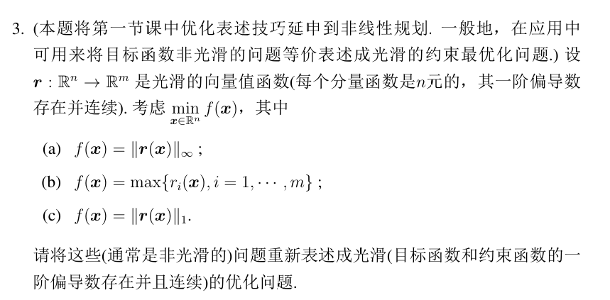
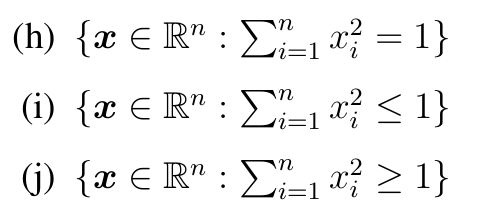

# 作业记录

## Q1、求梯度和海森矩阵

* **核心重点**：记得多用要求得的向量/矩阵规模来凑运算转置，验证是否正确。

---

对于其中(d)，求得梯度还是容易：

$$
\boldsymbol{r}(\boldsymbol{x})^T\boldsymbol{r}(\boldsymbol{x}) = \sum_{i} r_i(\boldsymbol{x})^2 \\

\nabla = 2\sum_i r_i(\boldsymbol{x})\nabla r_i(\boldsymbol{x})
$$

可以用$\boldsymbol{a}^T\boldsymbol{b}$的形式来表示一个$\sum ab$，故可以继续整理，  
但需要注意，对于一个$\R^n\to\R^m$的向量函数$\boldsymbol{r}(\boldsymbol{x})=(r_1(\boldsymbol{x}),\cdots,r_m(\boldsymbol{x}))^T$，为$m*1$维向量，  
其$\nabla\boldsymbol{r}(\boldsymbol{x})^T = (\nabla r_1(\boldsymbol{x}), \cdots, \nabla r_m(\boldsymbol{x}))$，是$n*m$矩阵（注意先用$\nabla$算子，得到$(\nabla\cdots)^T$，再用$T$，得到$(\nabla\cdots)$，最后各个梯度向下扩展，变成$n*m$）；  
所以对于$\nabla$，其最后要得到一个$n*1$维向量，只能为$n*m\times m*1$，即$\nabla \boldsymbol{r}(\boldsymbol{x})^T \boldsymbol{r}(x)$。

⭐**故：如果不能确定先后转置顺序，则通过矩阵乘法后的维度来判断。**

$$
\nabla = 2 \nabla \boldsymbol{r}(\boldsymbol{x})^T \boldsymbol{r}(\boldsymbol{x})  = 2 A^T\boldsymbol{r}(\boldsymbol{x})
$$

---

但对于海森矩阵，可能就有点困惑了：  
首先对整理后的式子难求，则看整理前的分量式子$r_i(\boldsymbol{x})\nabla r_i(\boldsymbol{x})$，  
很容易想到乘法求导，$(uv)'=u'v+uv'$，  
但$\nabla r_i(\boldsymbol{x}) \nabla r_i(\boldsymbol{x}) + r_i(\boldsymbol{x})\nabla^2 r_i(\boldsymbol{x})$，第一项两个向量相乘是什么鬼？

于是这里又只能**通过乘法后的维度来凑**：要得到$n*n$维矩阵，第二项肯定已经是$n*n$维矩阵了，则第一项也必须形成一个$n*n$矩阵，  
故只能是$n*1\times 1*n$，则要写成：

$$
\nabla^2 = 2\sum_{i} (\nabla r_i(\boldsymbol{x}) \nabla r_i(\boldsymbol{x})^T + r_i(\boldsymbol{x})\nabla^2 r_i(\boldsymbol{x})) \\
= 2A(x)^TA(x) + 2\sum_i(r_i(\boldsymbol{x})\nabla^2 r_i(\boldsymbol{x}))
$$

## Q2、证明最优化问题解存在 - 魏尔施特拉斯定理 - 重点是有界

证明**带某些性质**的某优化问题：

$$
\min_{\boldsymbol{x}\in S} f(\boldsymbol{x})
$$

是否存在最优解。（其中$f$基本上就是连续的）

⭐**则要使用“魏尔施特拉斯定理”**。  
通过给出的性质，将集合约束加上并集，转化为：

$$
\min_{\boldsymbol{x}\in S} f(\boldsymbol{x}) = \min_{\boldsymbol{x}\in S \cup \cdots} f(\boldsymbol{x})
$$

证：$\boldsymbol{x}\in S \cup \cdots$为非空、有界、闭集。  

⭐而**重点又是有界**，有界的定义是：$\|\boldsymbol{x}\|\le M(M>0, \boldsymbol{x}\in S)$，  
故如果能并上$\|x\|\le r$这一集合约束，则可以说明有界。

---

这里例题给出了“强制的”这一条件，用人话即是：越远的点，越接近无穷。即**超远**处的点一定比内处的点函数值大。  
可以得到：对于$\bar{x}\in S$（没有任何意义，就是随便取$S$的一点），则存在$r>0$，使得对于$\|x\|\ge r$（超远的体现），$f(x)\ge f(\bar{x})$，  
所以最优值不可能在$\|x\|\ge r$的地方取到（函数值大于$f(\bar{x})$），  
则得到范围约束：$\|x\|\le r$。

---

⭐：以后可以直接用强制函数（暗含有界），则只需要说明非空闭集即可。

## Q3、非光滑目标函数 用辅助变量替代

**统一这种策略**：

$$
\min_{\boldsymbol{x}} h(\boldsymbol{x})
$$
其中$h$为非光滑函数。

则可转化为：
$$
\Rightarrow
\begin{array}{ll}
    \underset{\boldsymbol{x}, t}{\min} & t \\
    \text{s.t.} & t\ge h(x)
\end{array}
$$

---

如果是
$$
\min \sum h_i(x)
$$

则转换为：

$$
\begin{array}{ll}
  \underset{x, t}{\min} & \sum t_i \\
  \text{s.t.} & t_i\ge h_i(x), i=1\cdots m
\end{array}
$$

## Q4、判断凸集

**方法汇总**：

* **（其他都用不了就用）定义**：$x^{(1)}, x^{(2)}\in S, \theta\in[0,1]$, 证$x=\theta x^{(1)} + (1-\theta) x^{(2)}\in S$
* 常见凸集：就两大类4种（还有个$n$维单纯形、标准单纯形，就是$n$个点的凸包）
  * 超平面$w^Tx=b$, 半空间$w^Tx<b$
  * 仿射集$Ax=b$, 多面体$Ax<b$
* 保凸运算（基于常见凸集运算）
  * **（最常用）并**
  * 仿射变换$Ax+b$
  * 笛卡尔积
  * 加（各个元素相加）
  * 伸缩$\beta x$
* **（最常用）凸函数的下水平集是凸集**，$\{x: f(x)\le C\}$
* **（最后可以用）凸函数的上镜图是凸集**：$\{(x, r): r \ge f(x)\}$

### 1. 形式 - 二次型

(a)~(e)首先都是同一形式的并集，故只用分析保留$i$的形式即可。  
然后：都是“二次型$x^TAx+b^Tx+c$”的形式，而$x^TAx\le C$形成的范围只有椭圆/直线是凸集，在这里汇总：

需要注意：只有二次项影响形状，一次/常数项只进行旋转/平移/缩放。

* 只有二次项$x^TAx$
  * **椭圆**：$\nabla^2$半正定
  * 双曲线：$\nabla^2$不定，只能举特例证明不是凸集。
  * **直线**：$\nabla^2$为0矩阵
* 有任意一个/多个的一次/常数项
  * **椭圆**和双曲线同上（只要$\nabla^2\ne0$，一定为椭圆/双曲线）
  * **抛物线**：$\nabla^2$为0（只要不全是二次项，$\nabla^2=0$时则为双曲线）

### 2. 形式 - 上镜图

像(f)~(g)这种，不等式里某一个变元的，则可以转换为上镜图的形式$\{(\boldsymbol{x},r):r\ge f(\boldsymbol{x})\}$。

对于(f)：可以将右侧的$x_2$当作$r$，则$f(x)=e^{x_1}$（会少一个元），则：$\{(x_1, r): r\ge e^{x_1}\}$，构造出上镜图的形式，  
然后证$f(x)$为凸函数即可，易证。

---

(g)则反之，代表“下镜图”，只能举特例证明不是凸集。   
可以结合“下镜图”，即$f(x)=e^x$，然后举特点$(0,1), (2, e^2)$，取中点$(1, (1+e^2)/2)$，证其不满足即可。

### 3. 形式 - 范数（单位球）

对于$\sum x_i^2$，是二范数的平方$\|\boldsymbol{x}\|^2_2$，**$\|\boldsymbol{x}\|_2=c$表示一个球**。  
故直接可以联想图形说明：$\le 1$是凸集，可以直接转化为$S=\{\boldsymbol{x}\in\R^n:\|\boldsymbol{x}\|_2\le1\}$说范数球是凸集；  
而$=1, \ge1$都不是，举反例说明。

---

拓展：对于1范数（$\sum|x_i|$）/无穷范数（$\max\{|x_i|\}$），  
$\le C$也一样可以直接说为（单位）正多面体/正方体，是凸集。  
然后其他两个举反例。

### 4. 形式 - 二维画图考虑

可以取$i=2$，然后画图分析（用$=1$的形式，画复合的线段）。

**需要注意**：这些没有绝对值，**不是中心对称**的！  

$\max x_i=1$是这种形式：  
  
故$\le1$为凸集，可用定义说明。

而$\min x_i=1$是这种形式：  
  
故$\ge1$为凸集，可用定义说明。

## Q5、判断凸函数

按优先级排序如下。

### 1. 上镜图凸

利用典型的凸集上镜图——**半空间**（函数为**线性函数**$wx+b$）、多面体（函数为仿射集$Ax+b$），则可直接说明。

### 2. 海森矩阵半正定 / 二阶导大于等于0

### 3. 保凸运算（尤其是函数复合）

* **函数复合**：$f, g$凸，$f$单增，则$f(g(x))$凸
* 仿射替换：$f(x)$凸，则$f(Ax+b)$也凸  
  如$-\ln(x)$凸，故$-\ln(a^Tx)$也凸。
* 加法（只能是凸函数直接相加）
* 非负线性组合
* ⭐**若干凸函数的逐点上确界**$\max\{f_i\}$，其中$f_i$均凸  
  比较重要：对于非光滑函数判断凸函数很有用。

### 4. 利用定义判断

设：$x^{(1)}, x^{(2)}\in S, \theta\in[0, 1]$，  
证：
$$
f(\theta x^{(1)} + (1-\theta) x^{(2)}) \le \theta f(x^{(1)} ) + (1-\theta) f(x^{(2)})
$$

**常用定理**：

* **范数的三角不等式**：$\|x + y\| \le \|x\| + \|y\|$  
* 范数的正齐次性（非负系数可提出去）：$\|\theta x\| = \theta \|x\|\;(\theta\ge0)$
* 点积的柯西不等式：$(\|\langle\boldsymbol{u},\boldsymbol{v}\rangle\|=)\|\boldsymbol{u}\cdot\boldsymbol{v}\|\le \|\boldsymbol{u}\|\cdot\|\boldsymbol{v}\|$

## Q6.1、判断凹函数

则判断$-f(x)$是凸函数即可。

## Q6.2、凸函数性质——梯度不等式 GI

$$
f(y) \ge f(x) + \nabla f(x)^T (y-x)
$$

GI 可用于证明。  
出现有关凸函数的**梯度的不等式**证明题时，考虑该性质，用$x\Leftrightarrow y$。

对于必要，引入辅助函数$\phi(\alpha)=f(x+\alpha(y-x))$，证$f(y)=\phi(1)=\phi(0)+\int_0^1\phi'(\alpha)\text{d}\alpha$。
