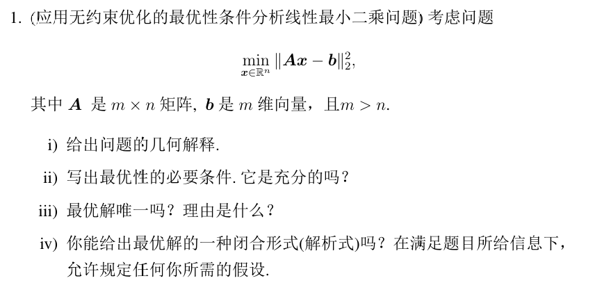
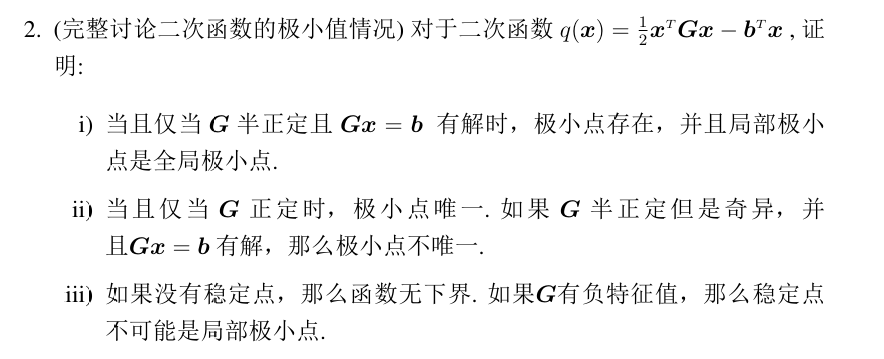
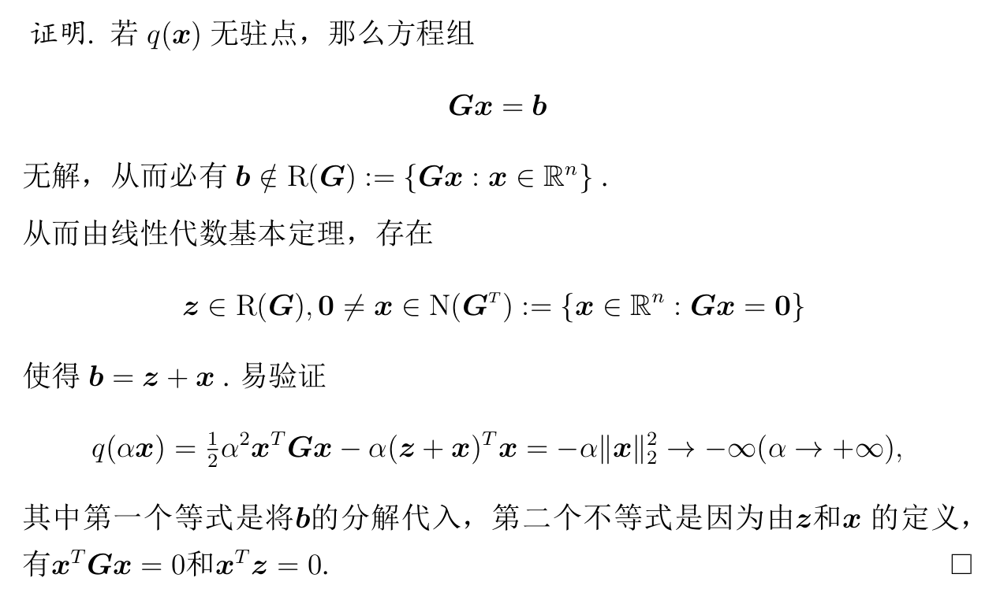
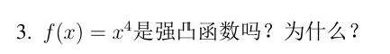
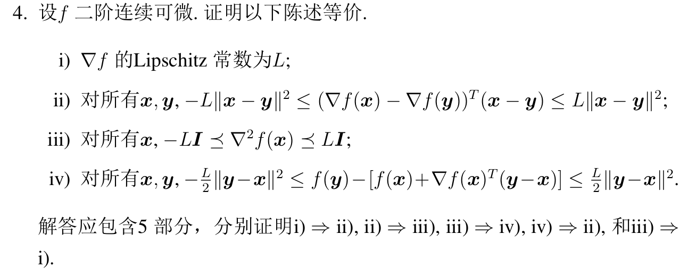
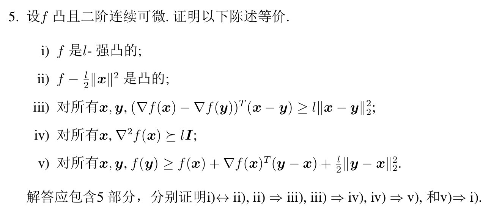
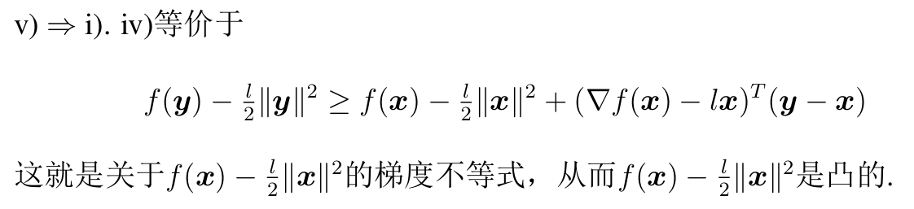
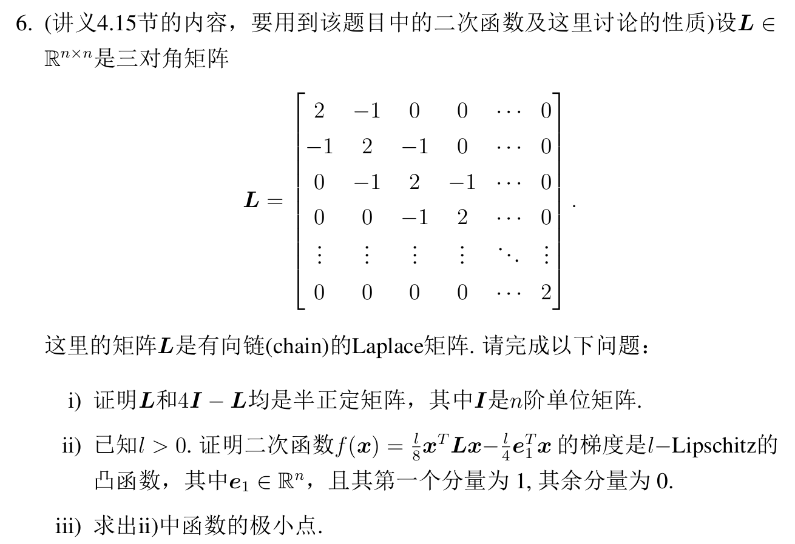
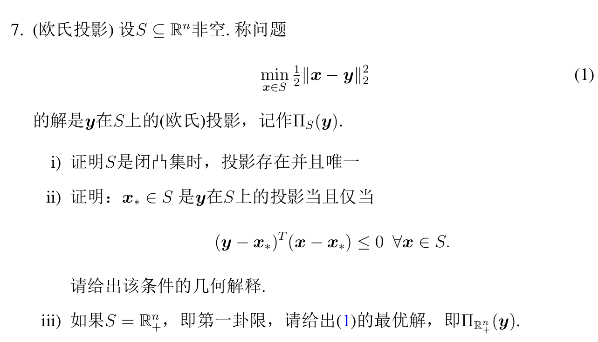
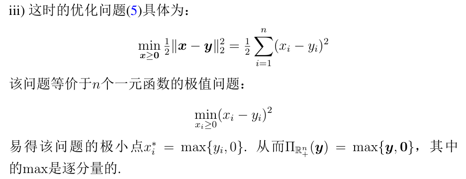

# 作业2

**总结——判断（证明）l-强凸/L-光滑**：  

就求$\nabla^2$：  

* l-强凸：$\nabla^2\succ0$，则可证明（此时可取$\lambda_{\min}$）
* L-光滑：得求$\lambda_{\max}$了，如果是有界的（即自然数，一般都是），则可证明  
  有时候可能很难求，但部分题目已知$A\succ0$，还会**求得形如$cI-A$的式子是半正定**的（**或者自己证**），  
  此时可用$cI-A$半正定说明（**转化为证l-强凸**）：$\lambda_{\min}(cI-A)\ge0 \Rightarrow \lambda_{\max}(A)\le c$，从而得证。

## Q1、最小二乘法相关

* **几何解释**：求$b$到$A$的值空间（$R(A)=\{Ax:x\in\R^n\}$）的最小距离。【*虽然我也不懂，记着吧……*  
  设$b$在$R(A)$上的投影为$c$，则满足$Ax=c$的解$x_*$则为最优解。
* **ii)重点**：$\|Ax-b\|^2=x^TA^TAx-2b^TAx+b^Tb$  
  梯度和海森矩阵很好求，**最优性条件则为一阶必要条件$\nabla=0\Rightarrow A^TAx=A^Tb$**，  
  并且因为$\nabla^2=A^TA\succeq0$，为**凸优化**，故$\nabla=0$是极小点，是充分的。
* **最优解不唯一**：$A^TAx=A^Tb$，如果$rank(A)<n$，则不满足，有无穷个解。  
  注：当不满秩时，$|A^TA|=0$，绝对的not正定，无法求逆
* **iv)**：如果$A$满秩（$rank(A)=n$，或说$A^TA\succ0$、则可求逆），则$x=(A^TA)^{-1}A^Tb$

## Q2、二次函数极小值情况

第一题，首先$G\succeq0$，**则为凸优化**，$\nabla=0$的点就是极值点。  
然后又因$\nabla=0\Rightarrow Gx=b$有解，则$\nabla=0$存在解，解为极值点。

第二题，用$Gx=b$这一方程说明：$G\succ0$时、代表可逆(det>0)，有唯一解$G^{-1}b$；  
半正定但奇异，则根据线性方程组理论，方程有无穷个解。

第三题第一问：有点复杂，请对下面的解有点印象。（稳定点指驻点）  
*TODO: 死记硬背，考到就G。*  

第三题第二问：主要证驻点$G\bar{x}=b$，存在$q(\text{附近的其他点})<q(\bar{x})$；用线搜索表示其他点，则证$\exist\boldsymbol{u},\alpha>0, q(\bar{x}+\alpha\boldsymbol{u})<q(\bar{x})$。  
然后题目中提到负特征值，那就用到对应的单位特征向量$\boldsymbol{u}$，存在性质$\boldsymbol{u}^TG\boldsymbol{u}=\lambda<0$。  
然后带入进去，可得：$q(\bar{x}+\alpha\boldsymbol{u})=q(\bar{x})+\frac{1}{2}\alpha^2\boldsymbol{u}^TG\boldsymbol{u}+\alpha\boldsymbol{u}^TG\bar{x}=q(\bar{x})+\frac{1}{2}\alpha^2\lambda<q(\bar{x})$，得证。

## Q3、判断l-强凸

就用$\nabla^2\succ0$，则$l=\lambda_{\min}$（或二阶导$f''>0=l$）。

**拓展——如果不是强凸，怎么限制定义域后是强凸**：  
如果要为强凸，则$f''=12x^2\ge l\;(l>0)$，故若$x\ge\sqrt{l/12}$或$x\le\sqrt{l/12}$，则为$l$强凸。

## Q4、L-光滑相关性质证明

L-光滑的直接定义：
$$
|\nabla f(x)-\nabla f(y)|\le L\|x-y\|
$$

⭐总结，三种有用方法：

* **拉格朗日中值定理**：原函数与一阶导（或者一阶导与二阶导）两者建立关系  
  $f(x)-f(y)=f'(\xi)(x-y)$
* **泰勒展式**：原函数、一阶导与二阶导三者建立关系  
  $f(\boldsymbol{y})=f(\boldsymbol{x})+\nabla f(\boldsymbol{x})^T(\boldsymbol{y}-\boldsymbol{x})+\frac{1}{2}(\boldsymbol{y}-\boldsymbol{x})^T\nabla^2f(\boldsymbol{\xi})(\boldsymbol{y}-\boldsymbol{x})$
* **柯西不等式**：有关乘法范数  
  $|(\nabla f(\boldsymbol{x})-\nabla f(\boldsymbol{y}))^T(\boldsymbol{x}-\boldsymbol{y})|\leq\|\nabla f(\boldsymbol{x})-\nabla f(\boldsymbol{y})\|\|\boldsymbol{x}-\boldsymbol{y}\|$

还可以用二次上界，$x\Leftrightarrow y$相加：  
$$
f(\boldsymbol{y})\le f(\boldsymbol{x})+\nabla f(\boldsymbol{x})^T(\boldsymbol{y}-\boldsymbol{x})+\frac{L}{2}||\boldsymbol{y}-\boldsymbol{x}||^2
$$

### 1. i) → ii)

这个形式就是**内积的形式**，用**柯西不等式**：$|(\nabla f(\boldsymbol{x})-\nabla f(\boldsymbol{y}))^T(\boldsymbol{x}-\boldsymbol{y})|\leq\|\nabla f(\boldsymbol{x})-\nabla f(\boldsymbol{y})\|\|\boldsymbol{x}-\boldsymbol{y}\|$，  
结合L-光滑定义：$\|\nabla f(\boldsymbol{x})-\nabla f(\boldsymbol{y})\|\le L\|\boldsymbol{x}-\boldsymbol{y}\|$得。

### 2. ii) → iii)

由ii)的一阶导和iii)的二阶导**两者关系**，考虑**拉格朗日中值定理**$f(x)-f(y)=f'(\xi)(x-y)$。  
得到：$\nabla f(x)-\nabla f(y) = \nabla^2 f(\xi)(x-y)$。

由ii)：$(\nabla f(x)-\nabla f(y))^T(x-y) \le L\|x-y\|^2$，上式同乘$(x-y)$代入：  
$\nabla^2 f(\xi)\|x-y\|^2\le L\|x-y\|^2$，划掉$\|x-y\|^2$，让$y\to x$得证。

### 3. iii) → iv)

由iii)的二阶导建立iv)的一阶导和原函数的**三者关系**，考虑**泰勒展式**：  
$f(\boldsymbol{y})=f(\boldsymbol{x})+\nabla f(\boldsymbol{x})^T(\boldsymbol{y}-\boldsymbol{x})+\frac{1}{2}(\boldsymbol{y}-\boldsymbol{x})^T\nabla^2f(\boldsymbol{\xi})(\boldsymbol{y}-\boldsymbol{x})$，其中$\xi=x+\theta(y-x),\theta\in(0,1)$。

可以看到直接得到要证式形式。

### 4. iv) → ii)

对iv)$x\Leftrightarrow y$得到两式相加即可。

### 5. iii) → i)

要得到L-光滑常数为$L$，则需要证$\|\nabla f(x)-\nabla f(y)\|\le L\|x-y\|$，  
iii)给的是二阶导，要建立二阶导与一阶导**二者关系**，考虑**拉格朗日中值定理**（在两侧加绝对值）：  
$\|\nabla f(x)-\nabla f(y)\| = \|\nabla^2f(\xi)(x-y)\|$，乘积范数，用**柯西不等式**（并且从等式得到不等式，用柯西不等式）：  
$\|\nabla^2f(\xi)(x-y)\|\le \|\nabla^2f(\xi)\|\cdot\|x-y\|$，再将iii)带入，最终得：  
$\|\nabla f(x)-\nabla f(y)\| \le L\|x-y\|$，得证。

## Q5、l-强凸相关性质证明

l-强凸的直接定义：
$$
f(\theta x_1 +(1-\theta)x_2)\le \theta f(x_1) + (1-\theta)f(x_2) -\frac{l}{2}\theta(1-\theta)\|x_1-x_2\|^2
$$

还可以用二次下界，$x\Leftrightarrow y$相加：  
$$
f(y)\ge f(x) + \nabla f(x)^T(y-x) + \frac{l}{2}\|y-x\|^2
$$

### 1. i) ↔ ii)

要证两等价，看两**定义式是否相同**：

$f$是l-强凸：$f(\theta x^{(1)} + (1-\theta) x^{(2)}) \le \theta f(x^{(1)}) + (1-\theta) f(x^{(2)}) - \frac{l}{2}\theta(1-\theta)\|x^{(1)}-x^{(2)}\|^2$

要证$f-\frac{l}{2}\|x\|^2$是强凸的，即证：  
$f(\theta x^{(1)} + (1-\theta) x^{(2)}) - \frac{l}{2}\|\theta x^{(1)} - (1-\theta) x^{(2)}\|^2 \overset{?}{\le} \theta f(x^{(1)}) - \theta\frac{l}{2}\|x^{(1)}\|^2 + (1-\theta) f(x^{(2)}) - (1-\theta)\frac{l}{2}\|x^{(2)}\|^2 - \frac{l}{2}\theta(1-\theta)\|x^{(1)}-x^{(2)}\|^2$

从要证式出发，首先整理为已知式的形式：  
$A \overset{?}{\le} B + C - D - \frac{l}{2}[\theta\|x^{(1)}\|^2 + (1-\theta)\|x^{(2)}\|^2 - \|\theta x^{(1)} - (1-\theta) x^{(2)}\|^2]$  
其中$A,B,C,D$与要证式部分对应，只有最后有不同。

看到这不要慌，想到**二次方（二范数）可以拆开**：  
$A \overset{?}{\le} B + C - D - \frac{l}{2}[\theta\|x^{(1)}\|^2 + (1-\theta)\|x^{(2)}\|^2 - \theta^2\|x^{(1)}\|^2 - 2\theta(1-\theta)\|x^{(1)}\|\|x^{(2)}\| - (1-\theta)^2\|x^{(2)}\|^2]$，  
然后整理，会惊奇的发现$\theta - \theta^2 = \theta(1-\theta), (1-\theta)-(1-\theta)^2 = (1-\theta)\theta$  
$A \overset{?}{\le} B + C - D - \frac{l}{2}[\theta(1-\theta)\|x^{(1)}\|^2 + (1-\theta)\theta\|x^{(2)}\|^2 - 2\theta(1-\theta)\|x^{(1)}\|\|x^{(2)}\|]$  
$A \overset{?}{\le} B + C - D - \frac{l}{2}\theta(1-\theta) [\|x^{(1)}\|^2 + \|x^{(2)}\|^2 - 2\|x^{(1)}\|\|x^{(2)}\|]$  
$A \overset{?}{\le} B + C - D - \frac{l}{2}\theta(1-\theta) \|x^{(1)} - x^{(2)}\|^2$，  
得到已知式，证明两式等价。

### 2. ii) → iii)

二次下界相加。

### 3. iii) → iv)

类似Q4，用拉格朗日中值定理。

### 4. iv) → v)

类似Q4，用泰勒展式。

### 5. v) → i)

硬记吧。  

## Q6、对规律形式矩阵进行分析

### 1. 证明矩阵半正定（利用定义x^TAx，式子全转化为A^2累加）

方法：

* 二三阶（计算题常用）：主子式
* 高阶，**定义证**：$x^TAx\ge0$
* *规律的可求特征值，但不常用*：$\det(A-\lambda I)=0$

对于$L$，$x^TLx=2x_1^2-2x_1x_2+2x_2^2-2x_2x_3+\cdots+2x_{n-1}^2-2x_{n-1}x_n+2x_n^2$，  
要整半正定，**考虑全部转化为$A^2$的形式**，则得到：$=(x_1-x_2)^2+(x_2-x_3)^2+\cdots+(x_{n-1}+x_n)^2+x_1^2+x_n^2$，得证。

对于$4I-L$同理。

### 2. 证明L-光滑（用-A证λmin≥0，得到A得λmax≤C）

算得$\nabla^2=\frac{l}{4}L$，因为$l>0, L\succeq0$，凸函数可证。  
结合(1)中$4I-L\succeq0$，则得到：$\lambda_{\min}(4I-L)\ge0$，故：$\lambda_{\max}(L)\le 4$，从而得证L-光滑。

### 3. 求解极小点（规律形式矩阵，直接干）

$\nabla=0$，得到$Lx=e_1$。  
遇到后不要慌，肯定是有规律和通项的。  
依次带入，得到$x_i$与$x_1$的关系，最后再求$x_1$。

得到$x_i = ix_1 - (i-1)$，  
最后求$x_1$，利用最后一项$x_n=nx_1-(n-1)$，对全式累加可得$x_1+x_n=1$，带入得$x_1=\frac{n}{1+n}$，再代入通项得$x_i=1-\frac{i}{n+1}$。

## Q7、约束优化问题——投影问题的分析

### 1. 最优解存在 + 唯一

* 存在：闭集 + **强制函数**（二次函数$\|x\|^2$形式，易知）
* 唯一：严格凸函数（二次函数$\|x\|^2$形式，易知）

### 2. 证明是最优解

即证最优解与下式的解等价。

**注意：这里是约束优化，只能用一般形式**，不能用$\nabla=x-y=0$。

* 对于凸优化，解的充分条件（一般形式）：
  $$
  \nabla f(\boldsymbol{x}_0)^T(y-\boldsymbol{x}_0)\ge0
  $$
  故给出下式，则满足充分条件，为最优解。
* 解的一阶必要条件（一般形式）：
  $$
  \langle f(\boldsymbol{x}_*), \boldsymbol{d} \rangle\ge0
  $$  
  如对于最优解$\boldsymbol{x}_*$，其一定满足该等式，而$\boldsymbol{d}$即是$\boldsymbol{x}-\boldsymbol{x}_*$，故满足下式。

几何解释，是内积，$\le0$代表夹角 $\ge$ 90°，直接说：
$y-x_*$与$x-x_*$的夹角 $\ge$ 90度。

### 3. 求解

第一卦限，结合$\R^2$几何理解：对于$y$，如果就在第一卦限里，就是本身；如果不在：对于某一分量$y_i$，如果$\ge0$就是本身、$<0$则是0。  

## （选做）Q8
