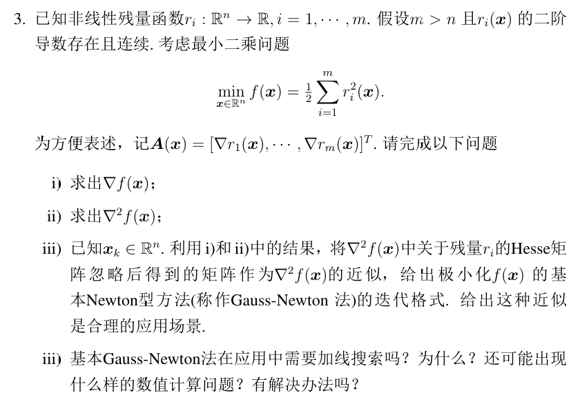
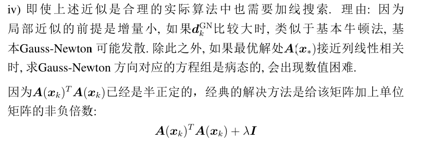
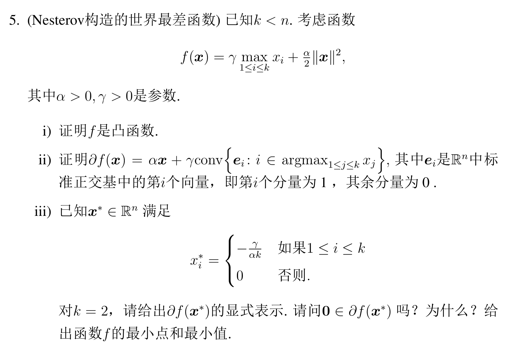
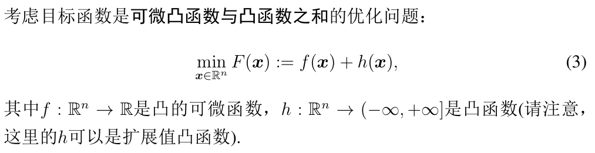
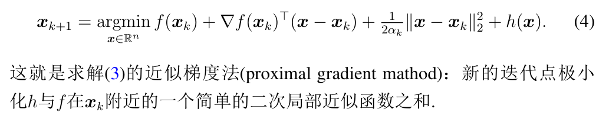
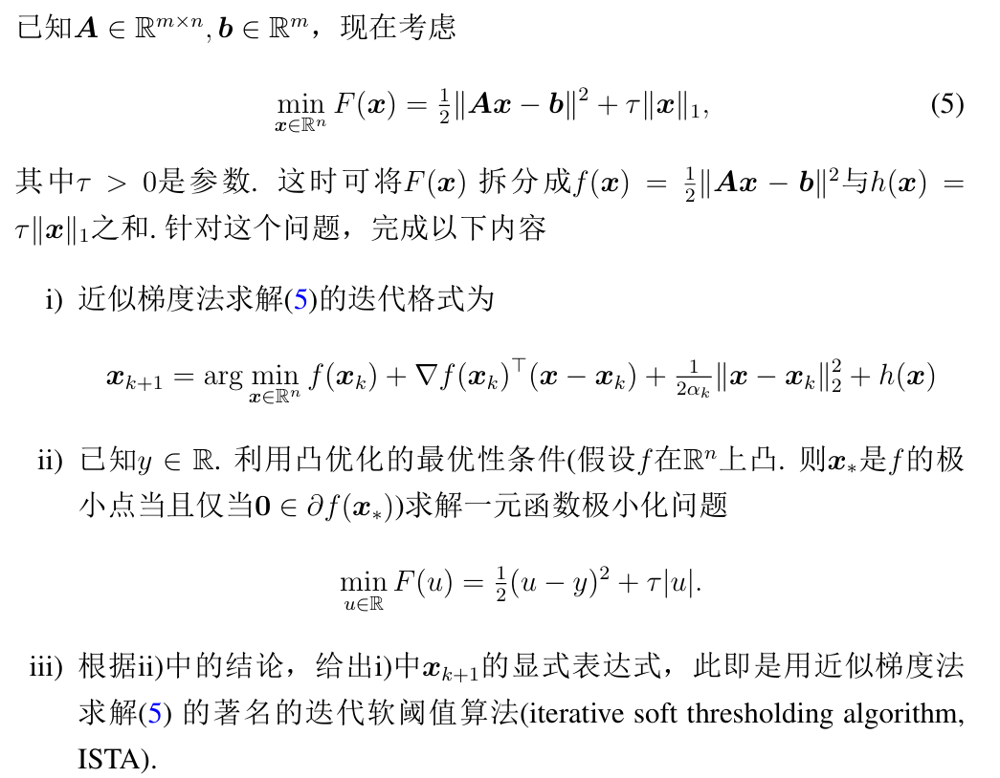
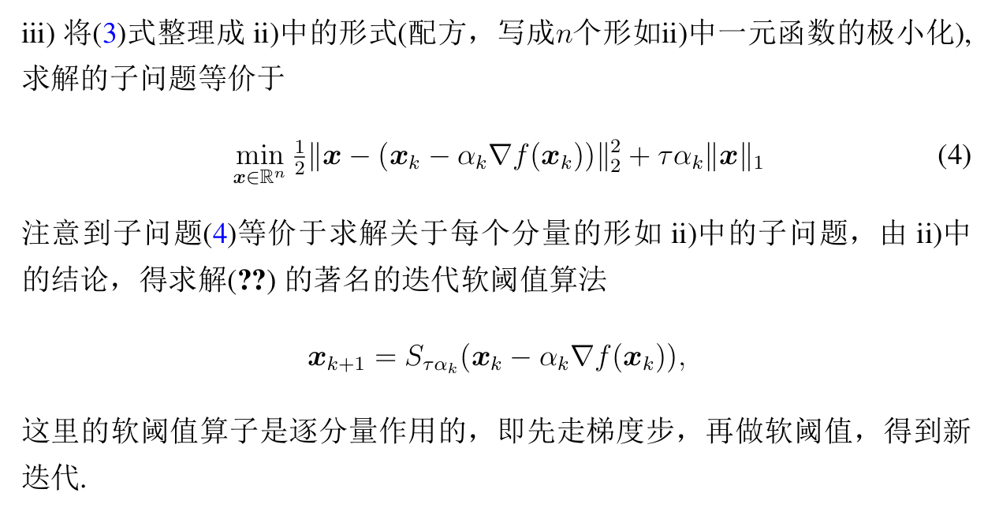

# 作业3 —— NT 法、CG 法、次梯度法

## Q1、修正 NT 法的基本运用

简单，没有问题。

NT法迭代公式：

$$
x_{k+1}=x_k-\nabla^2 f(x_k)^{-1}\nabla f(x_k)
$$

## （选做）Q2

## Q3、最小二乘问题 + NT 法

### 1,2. 求梯度和海森矩阵

有点犹豫了，这个问题很常见，需要重点关注和记忆：

$$
\nabla f = \sum^{m}(\nabla r_i(x) \cdot r_i(x)) = \boldsymbol{A}(x)^T\boldsymbol{r}(x)
$$

$$
\nabla^2 f = \sum^{m}(\nabla^2 r_i(x) \cdot r_i(x) + \nabla r_i(x) \cdot \nabla r_i(x)^T) = A(x)^TA(x) + \sum (\nabla^2 r_i(x) r_i(x))
$$

### 3. 给出迭代公式、应用场景

省略后，$\nabla^2=A(x)^TA(x)$

比较简单，直接给出：

$$
x_{k+1} = x_k - (A(x)^TA(x))^{-1}A(x)^Tr(x)
$$

注意这里省略了残量项$\nabla^2 r_i(x) r_i(x)$，但可不能随便省略。  
故**应用场景**：

1. 小残量问题：即解处的残量$r(x)$小
2. 残量函数$r_i(x)$几乎是线性的，则$\nabla^2$小。

### 4. 基本 NT 法的缺陷

肯定是需要的，因为基本 NT 法在远离解时增量很大，可能导致发散。  
故需要加线搜索变成阻尼 NT 法。

另外的缺陷——方程组可能是病态的，解决方法如下图。

## Q4、使用 CG 法

⭐**重点注意**：CG的二次型格式为：
$$
f(x)=\frac{1}{2}x^TGx-b^Tx
$$
故如果给出$f(x)=ax_1^2+bx_1x_2+cx_2^2$的形式，注意$\frac{1}{2}$项！  
即$G=[2a, b; b, 2c]$

其余带公式即可，考前复习遍公式。

## Q5、非光滑函数（驻点上确界函数）

为一个“光滑函数”$\|x\|^2$与“逐点上确界函数”$\max x_i$的非负线性组合。

### 1. 证明凸函数

对于非光滑的函数，不用慌，也是那几个方法，不过不能用求$\nabla^2$来证而已。

**方法**：

* 上镜图凸：这个函数不好想象，无法用。
* 保凸运算：这个函数是两个函数的非负线性组合，故**证两个函数$\max x_i$和$\|x\|^2$是凸函数**。
* *定义*

---

对于$\|x\|^2$，显然；对于$\max x_i$，其为⭐**凸函数组$f_i(x)=x_i$的逐点上确界函数，直接是凸函数**。  
为两者非负线性组合故得证。

### 2. 求次微分

利用次微分运算性质：分别求两者的次微分：

* $\partial \frac{\alpha}{2}\|x\|^2=\alpha x$
* $\partial \gamma \underset{1\le i\le k}{\max} x_i$  
  利用逐点上确界求次微分的结论：$\partial = \text{conv}\{\nabla f_i:i\in I(x)\}$，  
  其中：  
  $f_i(x) = e_i^Tx, \nabla f_i(x) = e_i$  
  $I(x)=\argmax_{1\le j\le k} x_j$

故：
$$
\partial f(x)=\alpha x+ \gamma\text{conv}\{e_i: i\in \argmax_{i\le j\le k}x_j\}
$$

### 3. 问题特例

根据$x_*$的形式，当$k=2$时，则$x_*=(-\frac{\gamma}{2\alpha}, -\frac{\gamma}{2\alpha}, 0, \cdots, 0)$，  
可知：$I = \{1, 2\}$，故：$\partial f(x_*) = \alpha x_* + \gamma \text{conv}\{e_1, e_2\}$  
其中$\text{conv}\{e_1, e_2\}$，即两点形成的线段（以$\R^3$联想），可以表示为$(\theta, 1-\theta, 0, \cdots, 0)(\theta\in[0,1])$，  
故：
$$
\partial f(x_*) = (-\frac{\gamma}{2}+\theta\gamma, -\frac{\gamma}{2}+(1-\theta)\gamma, 0, \cdots, 0)
$$

判断$0$是否在其中，则让前两式均为0，可得当$\theta=\frac{1}{2}$时满足，故在其中。

$f_*$带进去即可。

## Q6、近似梯度法（GD的极小化二级近似，加上一个非光滑凸函数）

题目较长，可看原文档。

对近似梯度法的介绍：  
  

题目：  

### 1. 定义原问题

题目没说完，就是让你根据这个式子，写出原问题：

$\nabla f(x) = A^T(Ax-b)$
照着写
$$
\min_{x\in\R^n} \frac{1}{2}\|Ax_k-b\|^2+(Ax_k-b)^TA(x-x_k)+\frac{1}{2\alpha_k}\|x-x_k\|^2_2+\tau \|x\|_1
$$

### 2. 利用非光滑凸优化的最优性条件求解问题

非光滑**凸优化**的最优性条件（**充要条件**）：
$$
0\in\partial f(x_*) \Leftrightarrow x_*\text{是最优解}
$$
> 联系：对于光滑**凸优化**（注意一定是凸优化），最优解也存在充要条件，也即$\nabla=0$（首先是凸优化的充分，再结合一阶必要条件）。

首先求解$\partial F(u)=(u-y)+\tau \text{sign}(u)=\begin{cases} u-y+\tau & u>0 \\ [u-y-\tau, u-y+\tau] & u=0 \\ u-y-\tau & u<0 \\ \end{cases}$，  
然后分$u?0$情况讨论$0\in\partial F(u)$：

* $u>0$时，要使$0\in\partial F(u)$，则$u-y+\tau=0$，故$u=y-\tau>0$，此时对应$y>\tau$
* $u<0$时，要使$0\in\partial F(u)$，则$u-y-\tau=0$，故$u=y+\tau<0$，此时对应$y<-\tau$
* $u=0$时，此时根据上面两个情况，得到$y$为剩下的情况$y\in[-\tau, \tau]$

再整理得：

$$
u=\begin{cases}
    y-\tau & y>\tau \\
    0 & y\in[-\tau, \tau] \\
    y+\tau & y<-\tau
\end{cases}
$$

*此即软阈值算子$u=S_{\tau}(y)$。*

### 3. 迭代软阈值算法

不知道怎么归类，有个印象即可。  
  
*TODO:没看懂，考到就G。*
