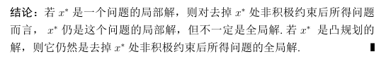
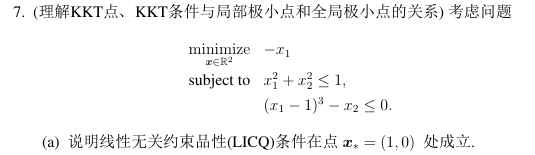

# 第四次作业记录

## 总结

### 0. 注意事项

如果要对极小点$x_*$，说明其满足KKT条件（一阶必要）或二阶必要，  
则必须先说明满足某CQ。  
*但如果不是借用极小点必要条件，比如任一点$x_0$，则不用。*

如果验证了是凸优化，要使用KKT求解极小点，  
则必须说明整个规划满足某CQ，此时才能求出所有极小点（否则只是部分）。

### 1. 是否存在KKT点

* 直接解KKT条件，能否找到$\lambda, \mu\ge0$
* **无法显式解，则说明**：
  1. 存在极小值——魏尔斯特拉斯定理
  2. 满足某CQ$\Rightarrow$极小值是KKT点，故证明。

### 2. 验证任一点（非最优解）是否满足KKT条件

主要是找到$\lambda,\mu$存在，并**验证$\mu>0$**：

1. 首先简单验证原始可行性，并找到积极约束指标$A(x)$  
2. 根据互补松弛条件，非积极约束的$\mu=0$；然后**主要是根据$\nabla_xL=0$求解积极约束对应的$\mu$**（本题没有$\lambda$，有的话都要求），验证其$\mu\ge0$

### 3. 验证最优解是否满足KKT条件

即说明满足某CQ即可。

### 4. 说明KKT点是最优解（充分条件）

1. 证明是凸优化，则：$x_{KKT}\xRightarrow{凸优化}$极小点  
   凸优化判断，主要判断凸函数，简单回顾：
   * 上镜图凸
   * $\nabla^2\succeq0$
   * 保凸运算
   * *定义判断*

   如果不是凸优化，则只能用下面的方法
2. 一般方法：证明$f(x_K)\le f(x),\forall x$
3. 对于简单的问题，可用几何分析（$\R^3$中等高线）
4. *二阶充分条件*（最次，对于确定式才用）

### 5. 证明(凸规划)最优解的充要条件为KKT条件

说明：

1. 凸规划
2. 满足某种CQ

则KKT与最优解是充要的。

### 6. 证明非凸规划的最优解的充要条件为KKT条件 + 额外条件

*与上面的区别：明确了是**非凸规划**。*

所给条件一般为KKT+某额外条件。

**方法**：

分充分、必要说明。*详见Q2, Q3。*

* 充分——最优解$x_*$，其满足所给条件：  
  首先$x_*$已经满足KKT条件了，只用证$x_*$，额外条件成立。  
  *可以分情况讨论（部分情况明显成立，比如约束二阶必要条件，可行方向$\nabla^2\mathcal{L}\succeq0$），拿部分分*
* 必要——满足KKT条件+额外条件的点$x_0$，是最优解：  
  证$f(x_0)\le f(x)$。

**对于必要证明的思想**：

1. KKT点$x_K$恒为$L$的驻点（$\nabla_xL=0$），  
   如果$L$凸（题目给出），则$x_K$为$L$的极小点，即$L(x_{K})\le L(x)$
2. KKT点$x_K$，$f(x_K) = L(x_K,\cdot,\cdot)$  
   因为$L=f(x)+\lambda^Th(x)+\mu^Tg(x)$，其中$h(x_K)=0, \mu^Tg(x_K)=0$
3. 任意点$x$，$f(x) \ge L(x,\cdot,\cdot)$  
   同上，$h(x)=0$，$\mu>0, g(x)\le0$

故：如果**额外条件说明$\mathcal{L}$凸**，则$f(x_{KKT})=\mathcal{L}(x_{KKT},)\le\mathcal{L}(x,)\le f(x)$，得证。

## 涉及内容

* 约束优化的最优性刻画
  * 带约束品性(CQ，基本用 LICQ)的一阶、二阶必要条件  
    这个条件包含了无约束优化的条件（此时可行方向$M=\R^n$，转化为$\nabla^2\succeq0$），但为了简单，可以分别讨论内点情况（无约束优化的必要条件）和边界情况
    * LICQ: 即“线性无关约束品性”，点$x_*$处的等式约束和活跃的不等式约束的梯度向量线性无关
    * 一阶必要条件：设(MP)中𝑓,𝒉,𝒈∈𝐶^1，且可行点$𝒙_∗$∈int 𝑋处LICQ成立. 若$𝒙_∗$是(MP)的局部极小点, 则$𝒙_∗$是(MP)的KKT点.
    * 二阶必要条件：(MP)中𝑓,𝒉,𝒈∈𝐶^2且可行点𝒙_∗∈int 𝑋处LICQ成立. 若𝒙_∗是(MP)的局部极小点, 则𝒙_∗是(MP)的KKT点，且𝒅^𝑻 𝑾_∗ 𝒅≥0, ∀ 𝒅∈𝑀，  
      其中：$𝑾_∗=∇_𝑥^2 𝐿(𝒙_∗,𝝀,𝝁)$, %𝑀={𝒅∈ℝ^𝑛:∇ℎ_𝑖 (𝒙_∗ )^𝑻 𝒅=𝟎∀𝑖,〖∇𝑔_𝑗 (𝒙_∗ )〗^𝑻 𝒅=𝟎∀𝑗∈𝐴(𝒙_∗ )}$

## 各题分析、理解、问题

### Q1. 图解法+使用一阶二阶必要条件验证

⭐**图解法方法**：

对于二元函数，则用等高线图分析。  
对于$f(x)=x_1x_2$，一时半会想不出来函数图形。  
关键思想——画等高线图、令$f(x)=c$，即：  
**$x_1x_2=c$，得到$x_2=\frac{c}{x_2}\Rightarrow y= \frac{c}{x}$，得到对于$c$的等高线图**为双曲线。

**使用一阶二阶条件验证**：

1. 首先说满足LICQ（因为对于可行点，$h(x)$均不为$0$）
2. 然后求 KKT 点和对应的$\lambda$，有四个$x^{(i)}, \lambda_i$
3. 验证其满足二阶条件吗？发现右上左下不满足  
   $$
   d^T\nabla^2_xd\ge0
   $$
   其中：$d\in M=\{d^Th(x_*)=0\}$（与所有积极约束正交）  
   但注意！求$\nabla^2_x$的时候，是对**含$\lambda$的**$\nabla_x$再微分，这也是为什么要求$\lambda$。

### Q2. 对称矩阵最小特征值变分表示（一个等式约束，证明极小点充要条件）

**问题**：

$$
\begin{aligned}&\underset{d\in\mathbb{R}^n}{\operatorname*{minimize}}\quad d^TQd\\&\mathrm{subject~to}\quad1-d^Td=0.\end{aligned}
$$
其中：$Q\in\mathcal{S}^n$。

**解答**：

就是“二次型在单位球上的问题”，对应[Ep.8.1 的“对称矩阵最小特征值的变分刻画”](../../大类%203、约束优化相关/Ep.8%20约束优化%20-%20最优解的刻画/8.1.%20等式约束.md#3-最小特征值的变分刻画二次型约束在单位球上问题)。

**核心结论**：

🌟如果$\nabla h(x)=\boldsymbol{x}$，则常用$\boldsymbol{y}=t\boldsymbol{x}_*+\boldsymbol{d}$。  
因为对于$d\in M=\{d\in\R^n:d^T\nabla h=0\}$，$\boldsymbol{d}^T\nabla h(\boldsymbol{x}_*)=\boldsymbol{d}^T\boldsymbol{x}_*=0$，则$\boldsymbol{d}$在$\boldsymbol{x}_*$的正交面上，故可用上式表达一个任意向量。

* 二阶必要条件可进一步推广  
  本来是：  
  $$
  (A-\lambda I)\boldsymbol{x}_*=0\\d^Tx_*=0\Rightarrow d^T(A-\lambda\boldsymbol{I})\boldsymbol{d}\geq0
  $$
  因为$\boldsymbol{d}$为$\boldsymbol{x}_*$正交面的任一向量，故任意向量$\boldsymbol{y}$可以表示为$t\boldsymbol{x}_*+\boldsymbol{d}$，  
  代入，则上式可推广为（对于$y^T(A-\lambda I)y\ge0$，带入$y=tx_*+d$拆开即可证明）：  
  $$
  (\boldsymbol{A}-\lambda\boldsymbol{I})\boldsymbol{x}_*=0\\\boldsymbol{y}^T(\boldsymbol{A}-\lambda\boldsymbol{I})\boldsymbol{y}\geq0\quad\forall\boldsymbol{y}.
  $$

### Q3. 信赖域子问题（一个不等式约束，证明极小点充要条件）

**问题**：

*相较于上一个问题（问题2），主要变化就是把等式约束（在单位球上）变成了不等式约束（在单位球内）。*

#### 2. 局部极小点二阶条件

**方法**：对于只有一个不等式约束，要说明其二阶必要条件，则可以分情况讨论：

1. $x_*$为内点：则满足无约束的二阶必要条件
2. $x_*$在边界上，则一般满足LICQ（$x\ne0$），然后可用约束的二阶必要条件

#### 3. 解的充要条件

⭐**重要思想**：

1. KKT点$x_K$恒为$L$的驻点（$\nabla_xL=0$），如果$L$凸（题目给出），则$x_K$为$L$的极小点。
2. KKT点$x_K$，$f(x_K) = L(x_K,\cdot,\cdot)$  
   因为$L=f(x)+\lambda^Th(x)+\mu^Tg(x)$，其中$h(x_K)=0, \mu^Tg(x_K)=0$
3. 任意点$x$，$f(x) \ge L(x,\cdot,\cdot)$  
   同上，$h(x)=0$，$\mu>0, g(x)\le0$

对于(1a)~(1c)就是KKT条件，而对于(1d)是莫名其妙窜出来的条件，需要特殊处理。  
观察到其形式$B+\lambda I\succeq0$，就是拉格朗日函数的$\nabla^2_xL$，故说明：**$L$为凸函数**。

则通过$L$为媒介进行证明：

* 右证左（必要性）：已知$x_0$满足(1a)~(1d)和$\lambda>0$，证$f(x_0)\le f(x),\forall x$  
  根据上面分析的，$L$凸，则又因为KKT中的对偶可行性(1a)，说明$x_*$为$L$极小点，$L(x_*,\lambda)\le L(x,\lambda)$  
  然后$f(x_*)=L(x_*,\lambda)\le L(x,\lambda) \le f(x)$，得证
* 左证右（充分性）：(1a)~(1c)都是KKT条件，自然满足，主要证(1d)，即$B+\lambda I\succeq0$  
  * 对于任意$d$，由ii)知：当$x_0d^T=0$时，$d^T(B+\lambda I)d\ge0$，满足
  * 那就要讨论$x_0d^T\ne0$的情况  
    *比较复杂，不做了，考到就G*

### （简单）Q4. 求解有约束的一元函数极值

一元函数，可直接求$f'=0$的点，  
得到解后，再判断$f''$是否$>0$：小于的一定不是，$>0$的则为局部极小点（等于的再看、一般很难碰到）。

### Q5. 理解KKT条件

#### 1. 写出KKT条件、⭐验证点（非最优解）满足KKT条件

写就完事。

然后验证点满足KKT条件，主要是找到$\lambda,\mu$存在，并**验证$\mu>0$**：

1. 首先简单验证原始可行性，并找到积极约束指标$A(x)$  
2. 根据互补松弛条件，非积极约束的$\mu=0$；然后**主要是根据$\nabla_xL=0$求解积极约束对应的$\mu$**（本题没有$\lambda$，有的话都要求），验证其$\mu\ge0$

#### 2. 几何意义

在这里只有一个积极的不等式约束，就是$\nabla g_1(x)$与$-\nabla f(x)$（负梯度）共线且在同一方向。

#### ⭐3. 总结——说明KKT点是最优解方法（充分条件）

总结：

1. 证明是凸优化，则：$x_{KKT}\xRightarrow{凸优化}$极小点  
   如果不是凸优化，则只能用下面的方法
2. 一般方法：证明$f(x_K)\le f(x),\forall x$
3. 对于简单的问题，可用几何分析（$\R^3$中等高线）
4. *二阶充分条件*（最次，对于确定式才用）

### Q6. 点到直线距离公式的推广

还是比较简单的，直接做即可。

因为是凸优化，求KKT点则是最优解。  
得到最优解之后$\|x-x_0\|$就是最短距离。

当$A$变为$a$后，重新写$\mathcal{L}$函数，重新求KKT点，  
可得$\lambda=\frac{b-a^Tx_0}{\|a\|^2}$，然后得$\|x-x_0\|=|\lambda|\cdot\|a\|=\frac{|a^Tx_0-b|}{\|a\|}$

### Q7. 非凸优化的KKT条件运用

  

#### 2. 非凸优化中，说明KKT点是全局极小点

注意，本问题非凸优化！  
因为$g_2(x)=(x_1-1)^3-x_2\le0$，$\nabla^2=\begin{bmatrix}6(x_1-1) & 0 \\ 0 & 0\end{bmatrix}$，一阶主子式并非恒$\ge0$。

故参考上面总结的方法，这里可使用几何方法说明。

#### 3.1. ⭐总结——是否存在KKT点

证明是否存在KKT点：

* 直接解
* **无法解，则说明**：
  1. 存在极小值——魏尔斯特拉斯定理
  2. 满足某CQ$\Rightarrow$极小值是KKT点，故证明。

#### 3.2. KKT点是否是非凸优化问题的最优解

答：不是……  
~~就是因为非凸优化，KKT点只是最优解的必要条件，而非充分条件。~~  
感觉要举简单例子说明

* 如果是凸优化（$f(x)$是凸函数），则是全局最优解
* 如果满足二阶充分条件，则是严格的局部极小点
* 对于这个问题，因为说了极小点一定是KKT点，  
  问题出在KKT点可能不唯一，导致有的KKT点不是极小点；  
  那如果KKT点唯一，则一定是全局最优解。

### Q8. 一个特例问题

#### 2. 验证点是否满足KKT

与上面验证是否满足KKT一样的，求解$\lambda=2$，接下来验证$\mu>0$，  
方法比较凑巧：有个印象：  

#### 3. 验证KKT点是最优解

判断凸优化：  
约束显然满足。  
对于$f(x)$，注意到：$-\ln x$是凸的，**仿射替换后**$-\ln(w^Tx)$也是凸的，两凸相加，故凸。

#### 4. 放弃！

### Q10. 最优解的充要条件——恒满足某CQ，则为KKT条件
