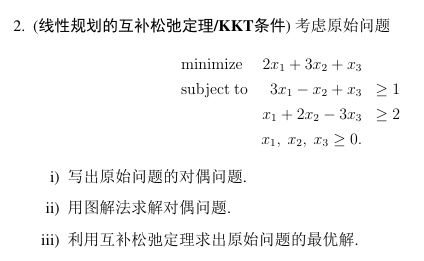
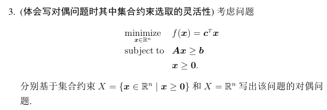
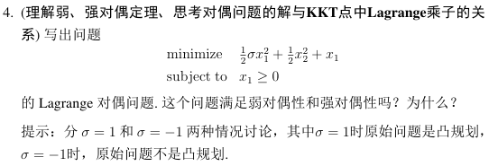

# 作业5

## ⭐Q1,2. 线性规划与对偶问题中 互补松弛条件的运用

**标准型**：

**不等式约束型**：

有关两种形式的对偶问题形式，以及如何用互补松弛条件证明/求解，可见“内容小结”文档。

这里额外提一个小点：对于Q1的ii)，可以先验证$f(\hat{x})<f(\bar{x})$，则只用证$\hat{x}$是最优解即可。

## Q3. 原问题有集合约束的对偶问题

即第一个原问题为：

$$
\begin{array}{ll}
    \underset{x\ge0}{\min} & c^Tx \\
    \text{s.t.} & Ax\ge b
\end{array}
$$

第二个原问题为：

$$
\begin{array}{ll}
    \underset{x\in\R^n}{\min} & c^Tx \\
    \text{s.t.} & Ax\ge b \\
    & x\ge0
\end{array}
$$

对解答有个印象即可。  

## Q4. 凸规划+Slater/非凸规划中：弱强对偶性是否成立，KKT点的λ,μ与对偶问题的联系

结论：

* 凸规划+Slater：强对偶性成立，对偶问题最优解$(\lambda^*,\mu^*)$就是KKT的拉格朗日乘子$(\lambda_*,\mu_*)$。
* 非凸规划：弱对偶性仍然成立，但对偶问题可能无解，而KKT的拉格朗日乘子可能有解，故两者没关系。

## Q5. 不满足Slater，但强对偶性仍成立（凸规划+松弛Slater本质→对偶解存在）

iv)问求的时候，最后可以得到如下形式。  
  
先别忙把$x(\mu)$带入，对$q(\mu)$变形$=(1+\mu_1+\mu_2)(x_1^2+x_2^2)-2(\mu_1+\mu_2)x_1-2(\mu_1-\mu_2)x_2+\mu_1+\mu_2$，然后再带，则好化些。

然后可以得到有$q^*=1=f_*$，但不存在$\mu^*$。

对于iv)问，虽然不满足Slater条件，但仍满足强对偶性，因为$f_*=q^*$  

**对偶问题解的存在性——凸规划+Slater条件。**

## Q6. 对偶问题相关性质验证

### 2. 证明弱对偶性

就是证：

$$
f_*\ge\mathcal{L}(x,\lambda,\mu)
$$

记住：$\forall x, f(x)\ge\mathcal{L}(x,\cdot,\cdot)$

### 3. 证明对偶函数为凹函数（对偶问题对凸优化）

$q(\lambda)=\min \mathcal{L}(x,\lambda)$凹，即证$-q(\lambda)=\max -\mathcal{L}$凸，  
其中$-\mathcal{L}$是一组仿射函数，$\max -\mathcal{L}$则是凸函数的逐点上确界，故其凸。

### 4. 证明强对偶性

这道题1问解出了$x$，可在外部根据$x(\mu)$求得$\mu$。  
然后在内部，因为凸优化，根据$\nabla q(\mu)=0$，求得$\mu$（最终的解则为外部求得的$\mu$）  
然后验证$f_*=q^*$

## Q7. 支持向量机问题（多优化元、多组不等式约束）

### 1. 求拉格朗日函数

首先有**3个优化元**$w, b, \xi$，  
然后有**两组不等式约束**，用$\alpha_i, \beta_i$分别代表每一组约束。

则写拉格朗日函数为：
$$
\mathcal{L}(w, b, \xi, \alpha) = f + \alpha_i(1-\xi_i-y_i(w^Tx_i-b)) - \beta_i\xi_i
$$

然后为了方便求$\nabla_{w,b,\xi}$，要整理成$Aw+ Bb+ C\xi$的形式，则：

$$
\begin{aligned}
L(\boldsymbol{w}, b, \boldsymbol{\xi}, \boldsymbol{\alpha}, \boldsymbol{\beta})
= & \frac{1}{2}\|\boldsymbol{w}\|_{2}^{2}+C \sum_{i=1}^{m} \xi_{i}+\sum_{i} \alpha_{i}\left[1-\xi_{i}-y_{i}\left(\boldsymbol{w}^{T} \boldsymbol{x}_{i}-b\right)\right]-\sum_{i} \beta_{i} \xi_{i} \\
= & \frac{1}{2}\|\boldsymbol{w}\|_{2}^{2}+\sum_i[C\xi_i + \alpha_i -\alpha_i\xi_i-\alpha_iy_i\boldsymbol{x}_i^T\boldsymbol{w}+\alpha_iy_ib-\beta_i\xi_i]\\
= & \frac{1}{2}\|\boldsymbol{w}\|_{2}^{2}-\left(\sum_{i} \alpha_{i} y_{i} \boldsymbol{x}_{i}\right)^{T} \boldsymbol{w}+\sum_{i}\left(C-\alpha_{i}-\beta_{i}\right) \xi_{i}+\left(\sum_{i} \alpha_{i} y_{i} \right) b + \sum_i\alpha_i
\end{aligned}
$$

### 2. 求KKT条件

上面的形式，很方便求得$\nabla_w, \nabla_b, \nabla_\xi$，三者都为0则是对偶可行性

KKT：
$$
\begin{aligned}
\boldsymbol{w}-\sum_{i} \alpha_{i} y_{i} \boldsymbol{x}_{i} & =0 \\
C-\alpha_{i}-\beta_{i} & =0, \forall i \\
\sum_{i} y_{i} \alpha_{i} & =0 \\
\alpha_{i} \geq 0, y_{i}\left(\boldsymbol{w}^{T} \boldsymbol{x}_{i}-b\right) \geq 1-\xi_{i}, \alpha_{i}\left[1-\xi_{i}-y_{i}\left(\boldsymbol{w}^{T} \boldsymbol{x}_{i}-b\right)\right] & =0, \forall i \\
\beta_{i} \geq 0, \xi_{i} \geq 0, \beta_{i} \xi_{i} & =0, \forall i .
\end{aligned}
$$

前三个是对偶可行性中$\nabla=0$；  
第四、五个分别是对偶可行性中的$\mu>0$、原始可行性、互补松弛条件。

### 3. 写出对偶问题，并说明求解方法

看到不要虚，对偶问题中$q=\min\mathcal{L}$，  
基本上$\mathcal{L}$都是凸的，然后通过求$\nabla\mathcal{L}=0$化简，即：  

由ii)可以知道$\nabla_w=0,\nabla_b=0,\nabla_{\xi}=0$的表达式，带入$\mathcal{L}$，则得到：
$$
q(x)=\frac{1}{2}\|w\|^2-w^Tw+0+0+\sum_i\alpha_i \\
q(x)=-\frac{1}{2}\|\sum_i\alpha_iy_ix_i\|^2+\sum_i\alpha_i \\
q(x)=-\frac{1}{2}\alpha_iy_iy_jx_i^Tx_j\alpha_j+\sum_i\alpha_i
$$

记$G=y_iy_jx_i^Tx_i$，则对偶问题为：
$$
\begin{array}{ll}
    \underset{\alpha,\beta}{\max} & -\frac{1}{2}\alpha^TG\alpha+\sum_i\alpha_i \\
    s.t. & \alpha\ge0, \beta\ge0 \\
    & C-\alpha_i-\beta = 0 \\
    & \sum_i y_i\alpha_i = 0
\end{array}
$$
注：不含$w-\sum_i=0$这个式子，因为并没有限定$\alpha,\beta$的关系，可以删去。

后续的看答案：  

