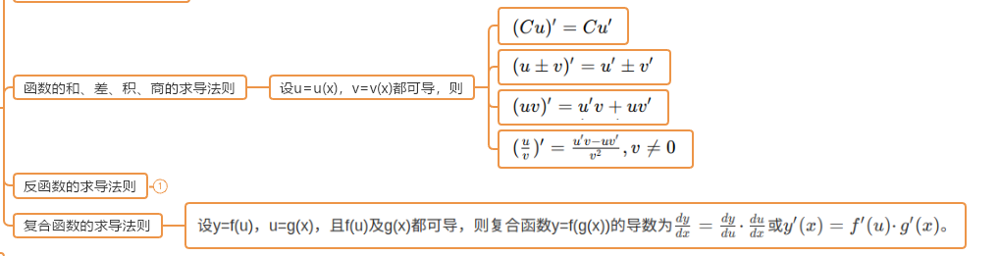
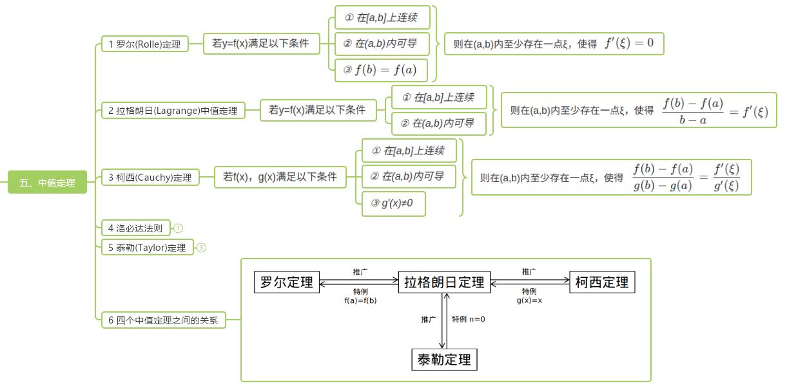
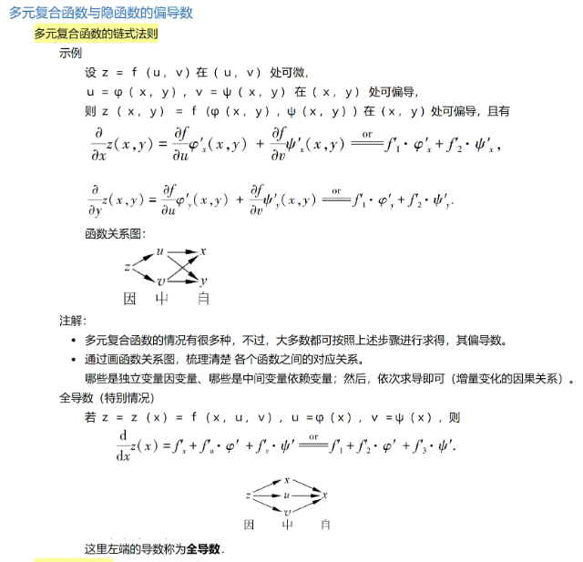
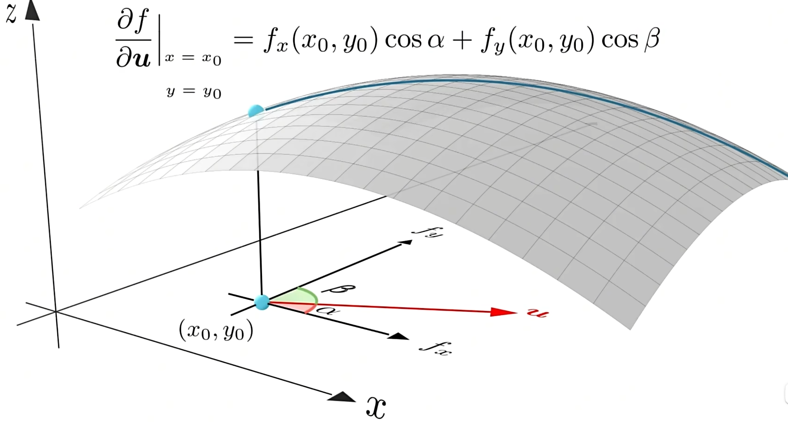
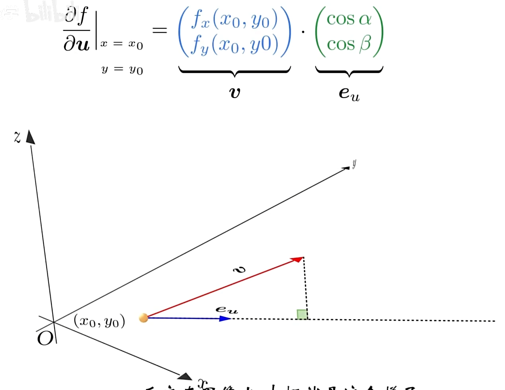
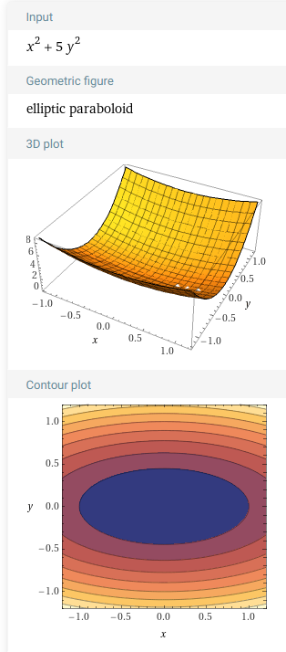
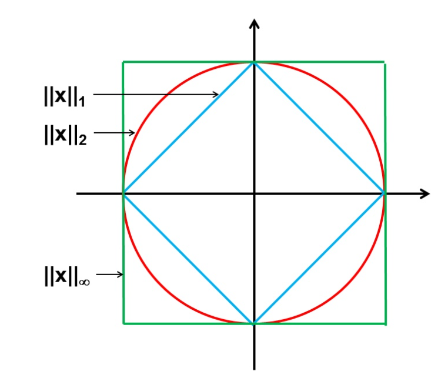
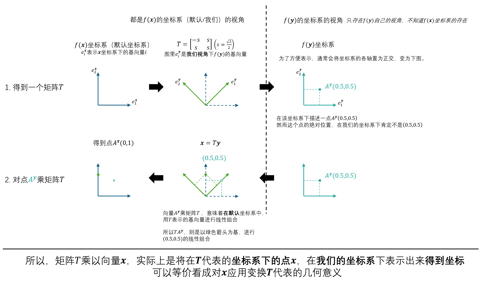

# Ep.0 基础知识

## 一、高数

### 1. 微分

以下部分针对“**一元函数**”。

#### (1) 有界

* 数列: $|x_i|\le M(i=1,\cdots, n)$
* 函数: $|f(x)|\le M(x \in l)$

#### (2) 极限

可针对数列($\lim_{n\to \infty}x_n$) / 函数($\lim_{x\to a} f(x)$)

* 性质
  * 唯一性：对于一个极限，若存在，则极限值唯一
  * 有界性：
    * 数列（全局）：数列必有界（注意：最开始的若干项不可能为无穷）
    * 函数（局部）：极限处附近的值有界
  * 局部保号性：极限处附近的值 跟 极限值 符号相同
* 判断
  * 单调有界准则：如果数列$\{x_a\}$单调增加、且有上界 $\to$ 存在极限（即收敛）

#### (3) 连续

**定义**：两侧极限 等于 函数值。

**闭区间 连续函数 性质**：

$$
f(x), x\in[a,b]
$$

* **有界性**：$f(x)$在区间内**存在上下界**($|f(x)|\le M$)
* **最值定理**：$f(x)$在区间内存在最小值$m$和最大值$M$
* 零点定理：若$f(a)\cdot f(b)<0$，则之间存在零点

#### (4) 拓展 - 光滑函数

在定义域内，任意阶的导数**都可求导**（故也一定连续）。

#### (5) 导数 / 微分

**关系**：**可微(即 可导) 一定 连续**。

**求法**：

**微分中值定理**：

  
[参考](https://zhuanlan.zhihu.com/p/47436090)

**函数展开**：

* 泰勒公式  
  对于以$x_0$为中心的某个开区间$l$，有至$n+1$阶的导数，  
  则对任意$x\in l$
  $$
  f(x) = f(x_0) + f'(x_0)(x - x_0) + \frac{f''(x_0)}{2!}(x - x_0)^2 + \cdots + \frac{f^{(n)}(x_0)}{n!}(x - x_0)^n + R_n(x)
  $$

  也可以写成$f(x+\Delta)=f(x)+f'(x)\Delta+\cdots+o(\Delta)$
* 麦克劳林公式  
  即泰勒公式$x_0=0$
  $$
  f(x) = f(0) + f'(0)x + \frac{f''(0)}{2!}x^2 + \cdots + \frac{f^{(n)}(0)}{n!}x^n + R_n(x)
  $$

  🌟在最优化中，通常运用该公式的二、三阶，有两种余项表示：
  * 皮亚诺余项
    * 二阶：$f(x)=f(0)+f'(0)x+o(x)$
    * 三阶：$f(x)=f(0)+f'(0)x+\frac{1}{2}f''(0)x^2+o(x^2)$
  * 拉格朗日余项
    * 二阶：$f(x)=f(0)+f'(\theta x)x\quad(\theta\in(0,1))$
    * 三阶：$f(x)=f(0)+f'(0)x+\frac{1}{2}f''(\theta x)x^2\quad(\theta\in(0,1))$

**函数性质**：

* （狭义 / 严格）单调性：$f(x_1) >/< f(x_2)$*（广义单调性可取等）*  
  $\Leftrightarrow f'(x) >/< 0 \quad (x \in l)$
* **极值**: $x_0$**领域内**，最大或最小
  * **极值点 一定是 驻点**
* **驻点**: **一阶导为 0** 的点（对于驻点$x_0$, $f'(x_0) = 0$）  
  驻点不一定是极值点（如$x^3$）
  * **驻点$x_0$是极值点条件**
    * $f'(x)(x-x_0) >/< 0 \quad (x \in \stackrel{o}{U}(x_0))$
    * $f''(x_0) >/< 0$
* 最值: 闭区间上，两端点、驻点、不可导点取最大/小
* **凹凸性**: 某区间上二阶导恒 大/小于 0
* 拐点
  * 拐点$x_0$ $\to$ $f''(x_0) = 0$
  * $f''(x_i) = 0$ 且 $f''(x_i)(x-x_i)\ne 0, x\in \stackrel{o}{U}(x_i))$（或$f'''(x_i)=0$） $\to$ $x_i$是拐点

#### (6) 多元函数

$$
f(x_1, x_2, \cdots, x_n) \to f(\boldsymbol{x})
$$

* *极限*  
  $$
  \lim_{x\to a, y\to b}f(x,y)=A
  $$

  需要(x,y)沿所有路径(简单理解为 360° 方向)趋向于$(a,b)$函数值均靠近$A$
* *连续*: 函数值等于极限值
* 偏导: 对某元$x_i$求导数，其它元视为常量。  
  偏导 **不一定** 连续。
  * 复合函数求偏导  
      
    （二重复合）根据函数图，第一层是原本函数的元；第二层则是最终元；对某一最终元求偏导则第一层所有指向第二层，然后各自求导相乘，再全部相加（下面一个图第二层的$x$不应该再指向$x$）
* *全微分*  
  $$
  \text{d}f(x,y) |_{a,b} = f'_x(a,b) \text{d}x + f'_y(a,b) \text{d}y  
  $$

  认识即可。
* 连续、偏导、全微的关系：  
  
* 🌟**驻点**：$\boldsymbol{x}$为驻点，即其所有偏导（梯度分量）均为 0（即**一阶导数$\nabla$为0**）
* 极值
  * 无约束条件的极值（全局极值）：  
    *类比于单元函数极值，要求一阶导为 0 + 二阶导 >/< 0*  
    $\Rightarrow$ 为驻点（梯度各分量为 0） + 海森矩阵正/负定($\succ/\prec$)
    > 正/负定判断方法:
    >
    > 各阶顺序主子式（即从左上角开始 1~n 阶行列式）都 $>/< 0$
  * 有约束条件的极值（条件极值）：*略*
* 最值

#### (6+) 多元函数的梯度、方向导数、海森矩阵（曲率）、雅可比矩阵

*因为很重要所有单独拿出来。*

对于$n$元显函数：

$$
y=f(\boldsymbol{x})=\cdots(只含x_{1\sim n})
$$

* **梯度**$\nabla$：为一个$n$维**向量**，由该点所有偏导数组成
  
  （二元函数）几何意义：指向该点函数值增长最快（变化率/方向导数最大）的方向，其大小则是该方向的方向导数（变化率、斜率）  
  （注意二元函数中向量是在$xOy$平面上，表示$x$和$y$改变的方向，而**不是三维函数图像的切线**）

  > 对于隐函数$f(\boldsymbol{x})-y=0$（或更复杂的$g(\boldsymbol{x},y)=C$，将其视作一个$n+1$元函数）的意义：
  >
  > 此时梯度求导为$(\nabla f, -1)$（表示在原本$\nabla f$ 后增加一个$-1$）（更复杂的为$\nabla g$）  
  > **几何意义为：切平面的法向量**。
  >
  > 证明：  
  > 对$g(\boldsymbol{x},y)=C$两侧微分，  
  > 得$g'_{x_1}\text{d}x_1+\cdots+g'_{x_n}\text{d}x_n+g'_y\text{d}y=0$  
  > $\Rightarrow (g'_{x_1}, \cdots, g'_{x_n}, g'_y)\cdot \text{d}\vec{X}=0$  
  > $\Rightarrow \nabla g\cdot \text{d}\vec{X}=0$  
  > $\text{d}\vec{X}$代表任意方向的微小位移（即切面），跟$\nabla g$都垂直，所以$\nabla g$为法向量。
  >
  > 可参考[梯度、方向导数与切平面](https://www.doc88.com/p-4731311875633.html)。

  **切超平面表示**：  
  对于函数$f(\boldsymbol{x})$，其某点$\boldsymbol{x}_0$上的切线（一元）/切面（二元）的表示为（注意$\boldsymbol{y}$才是变元、相当于$\boldsymbol{x}$）：
  $$
  f(\boldsymbol{y})=\nabla f(\boldsymbol{x}_0)^T(\boldsymbol{y}-\boldsymbol{x}_0)+f(\boldsymbol{x}_0)
  $$
  即切线$y=k(x-x_0)+x_0$的推广。

  **切超平面的法向量表示**：  
  对于一个多元函数$f(\boldsymbol{x})$，如$\R^2$，其函数图形是一个三维空间的平面。  
  那么其某点$\boldsymbol{x}_0$处的切超平面（$\R^2$中为切面），其法向量为：
  $$
  \begin{pmatrix}
    \nabla f(\boldsymbol{x}) \\
    -1
  \end{pmatrix}
  $$
  对于$\R^2$，其$\nabla$也为二维向量，再填个$-1$才为三维向量代表法向量。
* 方向导数$\frac{\partial f}{\partial \boldsymbol{l}}$：为一个**数值**，表示函数从某点沿方向$\boldsymbol{l}$的变化率（斜率）  
    

  **方向导数最大的方向 是 梯度所指方向 的原因**：  
    
  其中$\boldsymbol{v}$则是梯度的定义式（定向量）、$\boldsymbol{e_u}$是任意方向的单位向量；  
  点积表示投影，则方向导数最大的方向，则是$\boldsymbol{v}$的方向，且值就为$\boldsymbol{v}$的长度。

  **利用梯度的计算方式**：  
  $$
  \frac{\partial f}{\partial \boldsymbol{l}} = ||\nabla f(\boldsymbol{x})||\cos\theta
  $$
  其中$\theta$是$\boldsymbol{l}$方向向量与该点处的$\nabla f(\boldsymbol{x})$梯度向量的夹角。

  如果$l$是单位向量、或者只需要关注与0的大小关系，则可以写为：
  $$
  \frac{\partial f}{\partial \boldsymbol{e}}  = \nabla f(\boldsymbol{x})^T\cdot\boldsymbol{e} = \langle \nabla f(\boldsymbol{x}), \boldsymbol{e} \rangle
  $$
* **Hessian 矩阵**$\nabla^2$：为一个$n$阶方阵，由所有二阶偏导组成。  
  海森矩阵反映“曲率”。  
  并且等高线图中，也可以粗略的反映曲率，如下  
    
  等高线一圈中，越弯曲，则曲率越大。
* **Jacobi 矩阵**$J$：是针对$f:\R^n\to\R^m$的函数而言的（也可以看成矩阵变换$\boldsymbol{y}=F\boldsymbol{x}$）  
  对于这样的函数，可以表示成方程组的形式
  $$
  \left\{\begin{array}{l}
  y_1 = f_1(x_1, \cdots, x_n) \\
  \cdots \\
  y_m = f_m(x_1, \cdots, x_n)
  \end{array}\right.
  $$
  其中$f_{1\sim m}$则是有关$\boldsymbol{x}$的不同方程，如$y_1=2x_1+3x_3;y_2=x_1^2+x_2x_3$  
  因此，雅各比矩阵则是：**每个方程的梯度作为行 向 量组合**（每一行为每个方程对各个变元求导（$n$个），一共$m$行）
  $$
  =\begin{bmatrix}\nabla f_1 \\\cdots \\\nabla f_m\end{bmatrix}
  =
  \begin{bmatrix}
   \frac{\text{d}f_1}{\text{d}x_1} & \cdots & \frac{\text{d}f_1}{\text{d}x_n} \\
   & \cdots & \\
   \frac{\text{d}f_m}{\text{d}x_1} & \cdots & \frac{\text{d}f_m}{\text{d}x_n}
  \end{bmatrix}
  $$

  特别的，针对 Hessian 矩阵，可以看作是“梯度算子$\nabla f = (\frac{\partial f}{\partial x_1},\cdots,\frac{\partial f}{\partial x_n})$这一运算（看作$\boldsymbol{y}=\nabla f$，则$y_i=\frac{\partial f}{\partial x_i}$）的雅各比矩阵”，即：
  $$
  =\begin{bmatrix}\nabla \frac{\partial f}{\partial x_1} \\\cdots \\\nabla \frac{\partial f}{\partial x_n}\end{bmatrix}
  =
  \begin{bmatrix}
   \frac{\text{d}^nf}{\text{d}x_1^n} & \cdots & \frac{\text{d}^nf}{\text{d}x_1\cdots\text{d}x_n} \\
   & \cdots & \\
   \frac{\text{d}^nf}{\text{d}x_n\cdots\text{d}x_1} & \cdots & \frac{\text{d}^nf}{\text{d}x_n^n}
  \end{bmatrix}
  $$

> 方法 - 多项式多元函数$f(\boldsymbol{x})=\boldsymbol{}{x}^TA\boldsymbol{x}+\boldsymbol{a}^T\boldsymbol{x}+C$求梯度：
>
> * $\boldsymbol{a}^T\boldsymbol{x}$（其中$a$是常量向量$\mathbb{R}^n$） → $a$  
>   故$\boldsymbol{a}x$（$\boldsymbol{a}$为$1*n$的行向量）求梯度为$\boldsymbol{a}^T$！
> * $\boldsymbol{x}^TA\boldsymbol{x}$ → $2A\boldsymbol{x}$（其中$A$为对称矩阵$S^n$）

🌟**一些记法和对应性质**：

* $f$的一阶偏导数存在且连续，记作$f\in C^1$（$f\in C$就代表$f$本身连续）  
  性质：此时$f$**连续可微**
* $f$的二阶混合偏导数存在且连续，记作$f\in C^2$  
  🌟性质：**此时$\nabla^2f(x)$为对称矩阵**。

#### (6++) 多元复合函数求微分

$f(\boldsymbol{x})$

* $\nabla f(A\boldsymbol{x})=A^T\nabla f(A\boldsymbol{x})$
* $\nabla^2 f(A\boldsymbol{x})=A^T\nabla^2 f(A\boldsymbol{x})A$

#### (6+++) 常见多元变量求微分

* $\boldsymbol{a}^T\boldsymbol{x}$（其中$a$是常量向量$\mathbb{R}^n$） → $a$  
  故$\boldsymbol{a}x$（$\boldsymbol{a}$为$1*n$的行向量）求梯度为$\boldsymbol{a}^T$！
* $\boldsymbol{x}^TA\boldsymbol{x}$ → $2A\boldsymbol{x}$（其中$A$为对称矩阵$S^n$）
* $A\boldsymbol{x}\to A$  
  注意，这个适用于前面是矩阵，如果是常数$\lambda\boldsymbol{x}$，则为$\lambda I$！

### 2. 积分

*略。*

### 3. 向量代数与空间

*这一部分可以在线性代数中详学。*

### 4. 数列相关知识

在最优化里，数列$\{a_n\}$一般有无穷多项。

**概念**：

* **子列**：即在数列中任选部分项（但必须也是无限个），作为原数列的子列  
  如隔三项选一个，则可以划分为$\{a_{3k}\},\{a_{3k}\},\{a_{3k+2}\}$
  * 数列收敛，所有子列一定收敛；  
    某子列收敛，数列不一定收敛。
* 聚点：可以简单理解为子列收敛到的值  
  如数列收敛到$x$，则只有一个聚点$x$  
  如数列$\{0,1,0,1,\cdots\}$，则有两个聚点$0, 1$。

**性质**：

* **有界**无限序列，一定有聚点（或收敛）。  
  因为有界代表值在无限项后一定会被穷举完，所以如果不震荡一定收敛；震荡的话一定有重复点、即有聚点。

## 二、集合论

补一些有关集合的知识。

对于集合$A$，其代表若干个**同质元素**的组合。  
其中同质则为处于同一个空间下，比如都是$\R^n$。

### 1. 集合运算

以$\R^2$为例：

* 交、并、补、差
* 加法 - $A+B=\{a+b:a\in A, b\in B\}$（$A,B\in R^n$）  
  需要注意在$\R^2$中表示一个线段，如$x$轴上$[-1,1]$这条线段，其表示为$\{(a,0):a\in[-1,1]\}$，  
  再来一个$y$轴上的$[-1,1]$的线段，即$\{(0,b):b\in[-1,1]\}$  
  则：$A+B=\{(a,b):a\in[-1,1],b\in[-1,1]\}$，**两条线段相加，变成一个平面**（故相加不保证图形维度不变化，可能不变、可能升维或降维）。

  故存在性质：如果$a\in A, b\in B$，则$a+b\in A+B$。
* 乘法（笛卡尔积） - $A\times B=\{(a,b):a\in A, b\in B\}$（$A\in R^n, B\in R^m$）  
  会将两个集合各元素给拼接起来，新集合维度为$\R^{n+m}$。  
  对于上例，则为$A\times B=\{(a,0,0,b):a\in[-1,1],b\in[-1,1]\}$

## 三、线性代数

### 1. 向量

$\boldsymbol{v_1}, \boldsymbol{v_2}$  

均由**列向量**表示。

* 运算
  * 加减$\boldsymbol{v_1}\pm\boldsymbol{v_2}$
  * 数乘$k\boldsymbol{v_1}$
  * 点积（内积、数量积）：$\boldsymbol{v_1}\cdot\boldsymbol{v_2}$，结果为标量  
    $$
    \boldsymbol{a}\cdot\boldsymbol{b}=\sum a_ib_i= |a||b|\cos(a,b)
    $$
    当$a\cdot b=0$时、$a\bot b$  
    ⚠️警告：对于$\boldsymbol{x}\cdot\boldsymbol{y}=\boldsymbol{x}\cdot\boldsymbol{z}$，一定要记住其不能推出$\boldsymbol{y}=\boldsymbol{z}$。  
    因为点积的几何意义是投影，投影长度相等的有无穷个向量，如$\boldsymbol{x}=(1,0),\boldsymbol{y}=(2,9),\boldsymbol{z}=(2,-2)$。
  * 叉积（外积、向量积）：$\boldsymbol{v_1}\times\boldsymbol{v_2}$，一般只用于三维向量、结果为三维向量
  * *混合积*
  * 范数  
    * 一范数 - $\|\boldsymbol{x}\|_1=|x_1|+\cdots+|x_n|=\sum|x_i|$
    * 二范数 - $\|\boldsymbol{x}\|_2=\sqrt{x_1^2+\cdots+x_n^2}=\sqrt{\boldsymbol{x}^T\boldsymbol{x}}$
      * 存在性质 - 向量的**二范数平方**等于其**转置和自身的内积**
    * 无穷范数 - $\|\boldsymbol{x}\|_\infty=\max\{x_1,\cdots,x_n\}$

    对于单位范数（$\|\boldsymbol{x}\|_i\le1$），其示意图如下（$\R^2$）：  
      

### 2. 矩阵

$$
A
$$

也表示：线性变换、作用于向量元素的函数$f(\boldsymbol{x})$

* 运算
  * 加减
  * 数乘
  * 转置
  * 矩阵（向量）乘：$A_{m*k}\times B_{k*n}(/\boldsymbol{v^k}) \to C_{m*n}(/\boldsymbol{v}^m)$

几种特殊记号：

* $\mathcal{S}^n$ - 对称矩阵
* $\mathcal{S}^n_{+}$ - 半正定矩阵
* $\mathcal{S}^n_{++}$ - 正定矩阵

重要：一个矩阵最本质的几何意义，是代表**基向量的去向**。  
比如在$\R^2$默认坐标系$\boldsymbol{x}$中，矩阵$\begin{bmatrix} 0&1\\-1&0 \end{bmatrix}$，代表我们原本的基向量$\boldsymbol{e}_i^{\boldsymbol{x}}=(1,0)$和$\boldsymbol{e}_2^{\boldsymbol{x}}=(0,1)$，变成$e_1^{\boldsymbol{y}}=(0,1)$和$e_2^{\boldsymbol{y}}=(-1,0)$。

**总结 - 矩阵几大概念的关系**：

* 行列式不为零$\Leftrightarrow$非奇异$\Leftrightarrow$可逆$\Leftrightarrow$满秩$\Leftrightarrow$各列向量线性无关  
  前三者只适用于**方阵**。（非方阵没有这些概念）  
* （正定$\Leftrightarrow$特征值都大于0）$\Rightarrow$行列式大于0（也有上面的等价关系）  
  正定$\Rightarrow$**对称方阵**。（即正定一定是对称方阵，而海森矩阵一定为对阵方阵）  
  正定只适用于**方阵**。（非方阵没有这个概念）

#### (1) 行列式

**只适用于方阵**。

**几何意义**（行列式值的绝对值）：  
描述线性变换将空间 **拉伸 / 压缩** 了多少。

* $\text{R}^2$：面积如何变化
* $\text{R}^3$：提及如何变化

如果行列式为负，代表**将空间翻转**。

#### (2) 逆

**只适用于方阵**。

**性质**：

* $A$可逆$\Leftrightarrow$$|A|\ne0$

**求法**：

* 二阶矩阵$A=\begin{bmatrix}a&b\\c&d\end{bmatrix}$：  
  $$
  A^{-1}=\frac1{|A|}\begin{bmatrix}d&-b\\-c&a\end{bmatrix}
  $$
* 三阶矩阵$A=\begin{bmatrix}a&b&c\\d&e&f\\g&h&i\end{bmatrix}$  
  用“**伴随矩阵**”，即：每项的**代数余子式**组成的矩阵**转置**  
  **代数余子式**：排除这行这列的行列式乘$-1^{i+j}$（如$b$的代数余子式为$-1(ei-fh)$）  
  结果为：
  $$
  \frac{1}{|A|}\cdot\text{伴随矩阵}=\frac{1}{|A|}\begin{bmatrix}ei-hf&-(di-fg)&eh-eg\\&\cdots&\\&\cdots&\end{bmatrix}^T
  $$

#### (3) 特征值、特征向量

**只适用于方阵。**

**几何意义**：  
特征向量是那些经过$A$变换后，仍然落在原来直线上的向量$\{\boldsymbol{x}_i\}$，即$A$只对$\boldsymbol{x}_i$进行伸缩；  
特征值则是其对应伸缩的比例。  
*根据几何意义，可以知道$0$向量一定是特征向量，但没有意义，故不把这个算作特征向量。*

特征向量用**单位向量**来表示。

**求法**：
利用特征值多项式来求解。  
$\det(A-\lambda I)=0$。

$n$阶矩阵**最多有$n$个特征值和特征向量**。

* 可能没有特征值和特征向量（如旋转）
* 可能只有$1$个特征值，其对应无穷个特征向量（如缩放、但线性无关的只有$n$（维度）个）
* 可能为少于$n$个特征值（如二维中的剪切，只有一个特征值$1$、无穷个特征向量（$x$轴上所有向量）、线性无关的只有$1$个）  
  此时特征值多项式为$(1-\lambda)^2=0$，有重根。

因为可能有重复的，故有以下**概念**：

* 代数重数：某个特征值的代数重数是指它作为特征多项式根的出现次数。  
  例如，如果特征值$\lambda$是特征多项式的二重根，则其代数重数为 2。
* 几何重数：某个特征值的几何重数是指它对应的线性无关的特征向量的数量。  
  **几何重数$\le$代数重数**。

**性质 - $A$的特征值$\lambda$和对应特征向量$\boldsymbol{u}$**：

* $\boldsymbol{u}^TA\boldsymbol{u} = \lambda$  
  原因：$A\boldsymbol{u}=\lambda\boldsymbol{u}\Rightarrow\boldsymbol{u}^TA\boldsymbol{u}=\boldsymbol{u}^T\boldsymbol{u}\lambda\Rightarrow\boldsymbol{u}^TA\boldsymbol{u}=\lambda$

**性质 - 对于对称矩阵，其特征向量都是正交的**。

#### (4) 特征值分解

对于方阵$A$，可利用特征值和特征向量，将其分解为：

$$
A=Q \Lambda Q^{-1}
$$

其中：

* $Q$的每列是特征向量
* $\Lambda$是对角矩阵，元素为特征值

如果$A$是对称矩阵（特征向量正交），并且所有特征向量的二范数都为$1$时，  
则$Q$是**正交矩阵**。  
满足$Q^TQ=I$（$Q^T=Q^{-1}$）  

正交矩阵具有“保长性”，即其作为变换应用到向量时，该向量的模长不变，  
即$||Q\boldsymbol{u}||^2_2=\boldsymbol{u}^TQ^TQ\boldsymbol{u}=\boldsymbol{u}^T\boldsymbol{u}$。

#### (5) 奇异值

奇异值一定非负。

只简单提一下：  
当矩阵是对称矩阵$\mathcal{S}^n$时，奇异值等于各个特征值的绝对值，$\sigma=|\lambda|$。  
当矩阵是正定矩阵$\mathcal{S}^n_{++}$时，奇异值等价于特征值。

#### (6) 正定

**只适用于方阵**。

> **概念 - 半（正）定**：
>
> 来自于线性代数的“正定”、“半正定”矩阵，矩阵$A$首先是一个实对称矩阵$\mathcal{S}^n$。
>
> * 正定(positive definite)矩阵（$\mathcal{S}^n_{++}$）：对于任意$n$维非零向量$\boldsymbol{x}$，满足$\boldsymbol{x}^TA\boldsymbol{x}>0$  
>   此时$A$可记作$A\succ0$。
> * 半正定(positive semi-definite, 也叫正半定)矩阵（$\mathcal{S}^n_{+}$）：对于任意$n$维非零向量$\boldsymbol{x}$，满足$\boldsymbol{x}^TA\boldsymbol{x}\ge0$  
>   此时$A$可记作$A\succeq0$。
>
> **拓展 - 正定矩阵的意义**：
>
> 正定矩阵在几何意义上，可以看作变换$\boldsymbol{y}=A\boldsymbol{x}$的一个“**正系数**”，$\boldsymbol{x}$经过$A$变换后得到的$\boldsymbol{y}$方向不会相反（夹角小于$90\degree$）  
>（即类比于标量中的变换$y=ax$，$a$为正系数($a>0$)时，$x$与$y$的大小（符号/方向）相同）
>
> 要规定这样一个“正系数”（不能简单用$A>0$），使得变换后方向相同，即使得$\boldsymbol{x}\cdot\boldsymbol{y}\equiv \boldsymbol{x}^T\boldsymbol{y}\equiv \boldsymbol{x}^TA\boldsymbol{x}>0$（向量点积大于$0$代表同向），故正定矩阵的定义从此而来。

**性质（必要条件）**：

* 一定是对称**方阵**
* $\det A>0$  
  等于$0$则空间塌缩；小于$0$、一定导致有向量反向、从而不满足几何意义  
  （可看[线性代数的本质 - 行列式](https://www.bilibili.com/video/BV1ib411t7YR?p=7)中3:56，当发生塌缩时的那条线，与之垂直的向量一定发生了翻转）  
* 一定**可逆**  
  因为$\det A>0$

**判据（充分必要条件）**：

* 特征值都大于0  
  *因为如果小于0，对应的特征向量经过变换一定反向。*  
  如果方阵还是对称的（比如$\nabla^2=G\in\mathcal{S}^n$）还有一种等价说法：$G\succcurlyeq lI(l>0)$（最小特征值大于$l$）
* 主子式都大于0  
  主子式是矩阵从左上角开始的**各阶子矩阵的行列式**

**常用 - $A^TA$一定是半正定的**（$A^{m\times n}$）：  
因为$\boldsymbol{x}^T(A^TA)\boldsymbol{x}=(A\boldsymbol{x})^T(A\boldsymbol{x})=||A\boldsymbol{x}||^2\ge0$。  
额外的：如果$A$各列线性无关（满秩），即$Ax=0$时只有$x=0$时成立，故$\|Ax\|>0$，为**正定**。

#### (7) 二次型

对于$\boldsymbol{x}^TA\boldsymbol{x}$，如果满足：

1. $\boldsymbol{x}$为单位向量（如写成$\frac{\boldsymbol{x}}{||\boldsymbol{x}||}$的形式）
2. $A$正定

则其值，大于$A$的最小特征值$\lambda_{\min}(A)$。

> 🌟**推广**（比较重要，可能常见）：
>
> 对于一个半正定矩阵$H\in S^n_+$（$S^n_+$代表所有$n$阶正半定矩阵），故其特征值$\lambda_i\ge0$，  
> 令$\lambda_{\max}\ge\lambda_2\ge\cdots\lambda_{\min}\ge0$，  
> 则$\forall \boldsymbol{u}\in\mathbb{R}^n$:
>
> $$
> \lambda_{\min}\boldsymbol{u}^T\boldsymbol{u}\le \boldsymbol{u}^TH\boldsymbol{u}\le \lambda_{\max}\boldsymbol{u}^T\boldsymbol{u}
> $$
>
> ---
>
> 证：  
> $H$可进行特征值分解，写成$H=Q^T\begin{bmatrix}\lambda_1 &  & \\ & \cdots & \\ &  & \lambda_n\end{bmatrix}Q$的形式（其中$Q$是正交矩阵），  
> 故$\boldsymbol{u}^TH\boldsymbol{u}=(Q\boldsymbol{u})^T[\cdots](Q\boldsymbol{u})=\sum\lambda_i(Q\boldsymbol{u})^2_i$（其中$(Q\boldsymbol{u})^2_i$表示向量$(Q\boldsymbol{u})^2$的$i$分量）（虽然我也不知道$(Q\boldsymbol{u})^2$是啥……  
> 故将$\lambda_i$都换成最大的$\lambda_{\max}$，则$\boldsymbol{u}^TH\le\lambda_{\max}||Q\boldsymbol{u}||^2_2$  
> $\because Q$为正交矩阵，所以$||Q\boldsymbol{u}||^2_2=\boldsymbol{u}^T\boldsymbol{u}$，故不等式右侧得证，不等式左侧同理。

#### (8) 矩阵不等式

由于正定可以理解为正系数，故矩阵可以做大小比较，形成“矩阵不等式”。

> 定义 - 矩阵大小：
>
> 如果**矩阵$A-B$半正定**，则记$A\succcurlyeq B$。

对于对称方阵（如海森矩阵），矩阵的半正定性可用特征值来判断，  
如果$\nabla^2 =G\succcurlyeq lI\quad(l>0)$，则相当于$G$的最小特征值大于等于$l$，则其半正定。

#### (9) 范数

任意矩阵也存在范数，也用来度量矩阵的“大小”（某种特性的大小）。

* 1范数 - $||A||_1$：各列的绝对值和的最大值，$\max\sum_{i}|a_{ij}|$
* 无穷范数 - $||A||_\infty$：各行的绝对值和的最大值，$\max\sum_{j}|a_{ij}|$
* **2范数（谱范数）** - $||A||_2$：$A^TA$最大特征值开根，$\sqrt{\lambda_{\max of A^TA}}$  
  （🌟常用）如果为**对阵矩阵（比如海森矩阵）**，则**为最大特征值**：$||G||_2=\lambda_{\max}(G)$。  
  也成为谱范数、最大奇异值（非方阵，$A$的奇异值则是$A^TA$的特征值（此时也称为非方阵$A$的特征值）开根）

*还有各种其它范数（如 F 范数），这里不列举。*

### 3. 线性方程组相关

#### (1) 线性方程组表示

首先是**非齐次**线性方程组：

**方程组形式**：

$$
\left\{\begin{array}{l}
a_{11} x_{1}+a_{12} x_{2}+\cdots+a_{1 n} x_{n}&=&b_{1} \\
a_{21} x_{1}+a_{22} x_{2}+\cdots+a_{2 n} x_{n}&=&b_{2} \\
a_{m 1} x_{1}+a_{m 2} x_{2}+\cdots+a_{m n} x_{n}&=&b_{m}
\end{array}\right.
$$

**向量形式**：

令$\boldsymbol{a_i}=(a_{1i}, a_{2i}\cdots, a_{mi})^T$表示方程组每一列，$\boldsymbol{b}=(b_1,\cdots,b_m)^T$  
则可以线性方程组表示为：
$$
\boldsymbol{a_1}x_1+\boldsymbol{a_2}x_2+\cdots+\boldsymbol{a_n}x_n = \boldsymbol{b} \\
$$

> 如果令$\boldsymbol{w_i}=(a_{i1}, a_{i2}, \cdots, a_{in})^T$表示方程组每一行，  
> 则可以线性方程组表示为：
>
> $$
> \left\{\begin{array}{c}
> \boldsymbol{w}_{1}^{T} \boldsymbol{x}=b_{1} \\
> \boldsymbol{w}_{2}^{T} \boldsymbol{x}=b_{2} \\
> \cdots \\
> \boldsymbol{w}_{m}^{T} \boldsymbol{x}=b_{m}
> \end{array}\right.
> $$

**矩阵形式**：

令$A=[a_1,\cdots, a_n]$

$$
A\boldsymbol{x} = \boldsymbol{b}
$$

**几何理解**：

由于$a_{i1}x_1+a_{i2}x_2+\cdots+a_{in}x_n=b$为一个超平面（$\mathbb{R}^3$中就为平面），  
则非齐次线性方程组，就相当于**若干个超平面求交点**。

---

**齐次线性方程组**：

$$
A\boldsymbol{x}=0
$$

相当于多个**过原点**超平面（下以$\mathbb{R}^3$为例，超平面则为平面）的交：

* 可能交成一个过原点的面（所有的都是一个平面）
* 可能交乘一个过原点的线（所有的面都绕着这个线）
* 可能交乘一个点，且必定是原点

Tip. 如果三个超平面，已经交成一个点（三个超平面线性无关），此时再给出一个超平面，则可以由已有三个超平面线性表示（因为三个线性无关的超平面已经包含$\mathbb{R}^3$的所有基的信息）

而某非齐次线性方程$A\boldsymbol{x} = \boldsymbol{b}$，则相当于对应的其次线性方程$A\boldsymbol{x}=0$进行了平移。  
但**注意**：平移的向量并不是$\boldsymbol{b}$（$\boldsymbol{b}$在几何上无意义），而是$A\boldsymbol{x}=\boldsymbol{b}$的一个特解$x_p$（可由高斯消元法求）。

> $\boldsymbol{b}$的每一个分量，本质上是影响$A\boldsymbol{x}=0$的对应的一个超平面进行平移（比如$\mathbb{R}^2$中，$x+y=0\to1$，相当于沿$y$向上平移1），  
> 但该平面平移了，不代表交集也这样平移（比如上例，与$x-y=0$交点$(0,0)$，平移后交点并非$(0,1)$而是$(-0.5,0.5)$）
>
> 尤其对于齐次有解而非齐次无解的情况，比如$\mathbb{R}^2$，齐次为相同两条直线$x+y=0$、非齐次为$x+y=1$和$x+y=0$，此时$\boldsymbol{b}=(1,0)$无任何意义。

#### (2) 线性组合

线性组合是一个**操作**，即对$k$个向量$\boldsymbol{u}$：

$$
v=c_1\boldsymbol{u_1}+c_2\boldsymbol{u_2}+\cdots+c_k\boldsymbol{u_k}
$$

$\boldsymbol{v}$称为其线性组合。

线性方程组的问题，可以转换为：  
“$\boldsymbol{b}$是否可以表示成$A$中各列向量$\boldsymbol{a}$的线性组合”。

#### (3) 张成空间（生成子空间）

张成空间是一个集合（空间），  
对于一个向量集$S$，其所有的**线性组合**结果向量组成的向量集$V$，则为$S$的**张成空间**，记为$Span(S)$。  
即由$S$中的所有向量，可以表示哪些向量。

线性方程组的问题，可以转换为：  
“$\boldsymbol{b}$是否在$A$中各列向量的张成空间中”。

对于一个$n$维向量的集合，其张成空间能表示的范围便是$0\sim n$维空间。

**注**：张成空间核心就是线性组合，不过其代表“结果”（所有线性组合的结果）而非“动作/过程”。

#### (4) 线性相关（无关）

对于一个**向量集**$\{\boldsymbol{a}_i\}$而言，  
如果其中**一向量可表示为其余向量的线性组合**，则该向量集线性相关。  
*或者非零线性组合可以表示零向量（上述等价表示）（即$\boldsymbol{a}_1x_1+\cdots+\boldsymbol{a}_nx_n=A\boldsymbol{x}=0$有非零解）。*  
反之，则线性无关。

即：如果张成空间包含了**零向量**，则**一定**是线性相关的。

**Tip.** 一个$\mathbb{R}^n$的空间，最多只能有$n$个线性无关的向量（大于$n$时一定线性相关）

#### (5) 秩

对于一个**矩阵**而言，  
线性无关的列的最大数目，为该矩阵的秩$r(A)$

#### (6) 解的情况

……

### 4. 向量空间与子空间

> 首先需要明确：
>
> 空间是一个抽象概念，用来描述“对象”基于一定“规则”进行“操作”的场所（**集合**/空间），  
> 其最终是一个**元素的集合**。
>
> * 对象：该空间处理的元素，如实数、向量等
> * 操作：对象之间的操作、运算、映射（$f$），如加、乘
> * 规则：一些约束条件，如对象经过操作后还要在该空间中
>
> 拥有这三个基本定义，则称作一个空间。  
> 数学上的研究便是基于各种空间。

#### (1) 向量空间（线性空间）

是一个抽象的概念，其对象为“**标量（数字）和自定义向量**”、操作为“**向量加**”和“**数乘**”、规则为“**对象经过操作后还要在该空间中**”以及其它八条性质。  
*注意其中的自定义向量，你可以把$(x,y)$定义为向量、也可以把函数定义为向量*

只要满足这样的定义的，就可以称为向量空间，比如：

* 通常只用知道且只运用“欧几里得线性空间（欧式空间）”，其具有：
  * 加法、数乘、封闭性、结合律、交换律、零元、逆元、幺元
  * 具有范数（长度）的定义
  * 具有内积（角度）的定义
* 某种规格的矩阵可作为向量，从而所有该类矩阵则为一个向量空间  
  如所有$2*2$方阵。
* 某类函数可以作为“向量”，从而所有的该类函数则为一个向量空间
  * 函数可以加乘
  * 函数求导是一种线性变换（线性算子）、具有可加性$L(x+y)=L(x)+L(y)$和成比例$L(cx)=cL(x)$  
    线性变换就可以用矩阵描述，详细可见“[线性代数的本质 P15](https://www.bilibili.com/video/BV1ib411t7YR)”。

#### (2) 子空间

子空间是针对某个向量空间而言的，其**就是向量空间的一个子空间**。

> 定义为：
>
> 假设$V$是一个向量空间，  
> 如果$S$是$V$的子集，且$S$还是一个向量空间，  
> 则称$S$是$V$的一个子空间。

故其也是一个向量空间，满足其性质。  
注意：**必须具有零向量**（几何上代表**必须过原点**）。

如对于向量空间$R^n$，其$R^{0\sim n}$均为其子空间。

#### (3) 生成子空间（张成空间）

就是**对于一组向量**$V$（一般为有限个向量，其不是一个子空间），通过“线性组合”，从而得到$V$的一个子空间。

#### (4) 零空间、值空间

$\mathbb{R}^n$中，对于一个**线性变换**（矩阵）$A_{m*n}$。

* 零空间（核） - $N(A)$：$\{\boldsymbol{x}\in\mathbb{R}^n: A\boldsymbol{x}=0\}$  
  即向量$\boldsymbol{x}$变换后为零向量的$\boldsymbol{x}$集合，  
  为$\mathbb{R}^n$的子空间。
* 值空间 - $R(A)$：$\{A\boldsymbol{x}:\boldsymbol{x}\in\mathbb{R}^n\}$  
  即向量$\boldsymbol{x}$变换后的向量$\boldsymbol{x}'$集合，  
  为$\mathbb{R}^m$的子空间。

### 5. 本门课涉及到的一些定理

在本门课可能出现的一些定理，  
可能在这里进行详细讲解（如果感觉常用），也可能在出现的地方讲解。

#### (1) Cauchy-Schwartz 不等式 - 内积关系

> 对于内积存在关系：  
> 在**二范数**关系下，两向量内积的绝对值，小于等于，两向量长度的乘积，即：
>
> $$
> |\boldsymbol{x}\cdot\boldsymbol{y}|\le||\boldsymbol{x}||\cdot||\boldsymbol{y}||
> $$
>
> 注意**左侧为绝对值**，即展开为：$-||\boldsymbol{x}||\cdot||\boldsymbol{y}||\le\boldsymbol{x}\cdot\boldsymbol{y}\le||\boldsymbol{x}||\cdot||\boldsymbol{y}||$  
> Tip. 内积$\boldsymbol{x}\cdot\boldsymbol{y}$可写成$\boldsymbol{x}^T\boldsymbol{y}$
>
> 对上展开式，仅当：  
>
> * $\boldsymbol{x}$与$\boldsymbol{y}$方向**相同**时，右侧取等（即$\boldsymbol{x}\cdot\boldsymbol{y}$值**最大**）
> * $\boldsymbol{x}$与$\boldsymbol{y}$方向**相反**时，左侧取等（即$\boldsymbol{x}\cdot\boldsymbol{y}$值**最小**）

也可以用平方消除绝对值，即$(\boldsymbol{x}\cdot\boldsymbol{y})^2\le||\boldsymbol{x}||^2\cdot||\boldsymbol{y}||^2$。

注意：仅**适用二范数表示长度**，如果是其它范数（如$||\boldsymbol{x}||_1$则不满足）。

#### (2) Wielandt-Hoffman 定理 - 描述矩阵特征值差异

该定理涉及矩阵的特征值（或一般的，奇异值）之间的关系。  
它描述了当两个矩阵的差异较小时，它们的特征值（或奇异值）差异也很小。

一般的公式如下：
$$
\sum_{i=1}^n|\lambda_i(A)-\lambda_i(B)|^p\leq\|A-B\|_p^p
$$

通常取$p=2$，则得到：
$$
\sum_{i=1}^n|\lambda_i(A)-\lambda_i(B)|^2\leq\|A-B\|_2^2
$$

## 四、数学分析

*数分没学过，但本课又出现到一些数学分析的知识，因此在出现的地方会着重讲解，这里只做一个简单记录。*

### 1. l-强凸

首次出现在[Ep2.2 二、Ex](../Ep.2%20凸性/2.2.%20凸函数、凸优化.md#ex-l-强凸函数)

### 2. L-Lipschitz 连续（L-光滑）

首次出现在[Ep4 三、2.(0.1)](../../大类%202、无约束优化相关/Ep.4%20梯度下降法(GD)/4.md#01-l-光滑lipschitz-连续二次上界)

对两者进行一个总结：

* $L-$光滑与$l-$强凸  
  **$L$一定大于等于$l$**（由下面的不等式可知）
  * $l-$强凸：函数二次下界，$f(\boldsymbol{y})\ge f(\boldsymbol{x})+\nabla f(\boldsymbol{x})^T(\boldsymbol{y}-\boldsymbol{x})+\frac{l}{2}||\boldsymbol{y}-\boldsymbol{x}||^2$  
    $l$可以理解为二阶导数（曲率）的下界，即最小曲率
  * $L-$光滑：函数二次上界，$f(\boldsymbol{y})\le f(\boldsymbol{x})+\nabla f(\boldsymbol{x})^T(\boldsymbol{y}-\boldsymbol{x})+\frac{L}{2}||\boldsymbol{y}-\boldsymbol{x}||^2$  
    $L$可以理解为二阶导数（曲率）的上界，即最大曲率
  * 特殊情况 - $\nabla^2$为对称矩阵：  
    对于$\nabla^2 f$为对称矩阵$G\in\mathcal{S}^n$，则$f$**一定是$L-$光滑与$l-$强凸的**，且取值：
    * $L-$光滑：$L\ge\lambda_{\max}(G)$，取$G$最大特征值
    * $l-$强凸：$l\le\lambda_{\min}(G)$，取$G$最小特征值

## 五、杂项

其它涉及到的概念。

### 1. 多面体函数

多面体函数是指其图形由有限个多面体(polyhedrons)组成的凸函数。  
具体来说，多面体函数可以表示为**有限个线性函数的最大值**（逐点上确界）形式：

$$
f(\boldsymbol{x})=\max\{\boldsymbol{a}_1^T\boldsymbol{x}+\boldsymbol{b}_1,\boldsymbol{a}_2^T\boldsymbol{x}+\boldsymbol{b}_2,\ldots,\boldsymbol{a}_m^T\boldsymbol{x}+\boldsymbol{b}_m\}
$$

就相当于若干个简单的分段函数。

### 2. Lagrange 乘数法

是高数里，求一个函数在等式约束下的极值点。  
在[Ep.8.1 等式约束](../../大类%203、约束优化相关/Ep.8%20约束优化%20-%20最优解的刻画/8.1.%20等式约束.md)中有详细讲解。