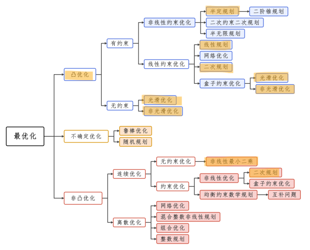
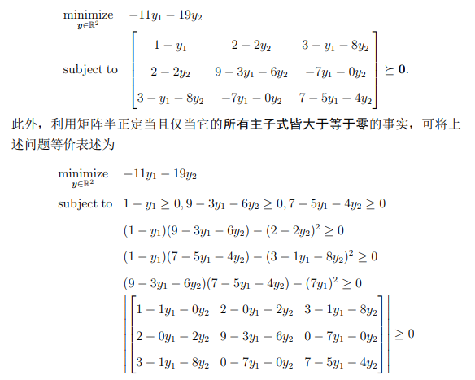
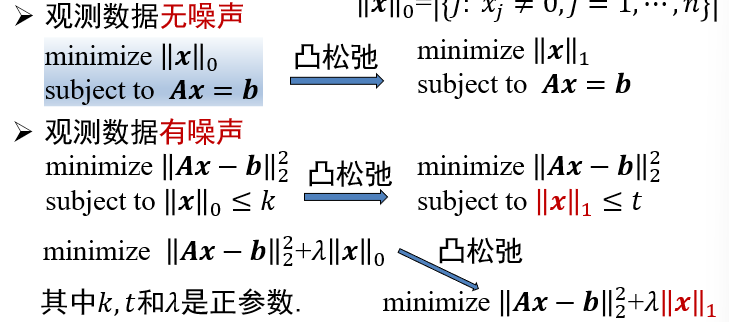

# Ep.1 概论

## 一、基本概念

有限维优化问题的标准形为：

$$
\begin{array}{cl}
\underset{\boldsymbol{x} \in X}{\operatorname{minimize}} & f(\boldsymbol{x}) \\
\text { subject to } & h_{i}(\boldsymbol{x})=0, i=1, \cdots, m \\
& g_{j}(\boldsymbol{x}) \leq 0, j=1, \cdots, p
\end{array}
$$

**其中**：

* $\boldsymbol{x}=(x_1,\cdots,x_n)$： 为$n$维向量，称为“**决策（优化 / 设计）变量**”
* $X\in\mathbb{R}^n$： 称为“**简单集合约束**”
* $f,h_i,g_i： \mathbb{R}^n\to\mathbb{R}$: $f$称为“**目标函数**”，$h_i(x)=0$为“**等式约束**”、$g_i(x)\le0$为“**不等式约束**”

**对于上式的一些概念**：

* 可行解$\boldsymbol{x}$： 满足所有约束条件的点。
* 可行域$S$： 所有可行解组成的集合。  
  该集合即表示了**约束**，此时上式可以表示为
  $$
  \underset{\boldsymbol{x}\in S}{\text{min}}f(\boldsymbol{x})
  $$

数学规划(Mathematical Programming, MP)（或说数学优化(Mathematical Optimization, MO)）问题有两种解：

* *全局解*
  * 全局极小点$\boldsymbol{x}_*$($\boldsymbol{x}_*\in S$)： 定义为所有$f(\boldsymbol{x})\ge f(\boldsymbol{x}_*)$
  * 最优值$f_*$： 定义为$f(\boldsymbol{x})$的最大下界（下确界），即  
    $f_*=f(x_*)=\inf\{f(\boldsymbol{x}):\boldsymbol{x}\in S\}$  
    > 补充 - 下确界：  
    > 下确界指最大的下界（所有的$x\ge m$，则$m$为一个下界），而下界有无限个（如$(-1,1)$，下届有$-1, -2, \cdots$，而下确界为$-1$）  
    > 同时，其与最小值的区别是，最小值一定存在于集合中（可能没有最小值），而下确界不一定，故不一定能取到（如上例，则没有最小值，而有下确界）
    >
    > 当下界能取到时，可以用$\min$代替$\inf$
* *局部解*
  * 局部(相对)极小点
  * 局部解

**注意**：当不存在全局极小点$x_*$时，最优值$f_*$也可能存在（如：$\underset{x>0}{\min}\frac{1}{x}$, $f_*=0$但$x_*$不存在）

对于 MP 问题解的情况：

1. $S=\emptyset$： $f_*=+\infty$
2. $S\ne\emptyset$：
   1. 无(下)界： $f_*=-\infty$
   2. 有(下)界：
      1. 有最优解： $f_*=f(x_*)$
      2. 无解

## 二、解的存在性

> **Weierstrass 定理（魏尔施特拉斯定理）**：
>
> 如果$S$是非空的紧集（即有界闭集），且$f$在$S$上连续，则$f$在$S$上能取到最大值和最小值。
>
> * 有界：可以理解为所有维$x_i$不会取到无穷
> * 闭集：即闭包（可见Ep.2.1）等于自身的集合（可以简单理解为闭区间）

*而对于优化问题，基本上都要保证$f$连续，否则不在本课程讨论范围内。*

## 三、全局和局部的选取

* 理想：要求解全局极小点
* 实际：可以求解局部极小点
  1. 函数具有“**凸性**”： 局部极小点 即为 全局极小点
  2. 有范围约束： 范围区间内只有一个局部极小点

## 四、类型

1. 根据是否有约束
   * 无约束优化： 如$S=\mathbb{R}^n$
   * 约束优化
2. 根据离散或连续
   * 离散优化: 如$X=\{0,1\}^n$ -> 0-1规划
   * **连续优化**: $S$为连续的集合，如$X=[0,1]^n$,$\mathbb{R}^n$
3. 根据是否线性
   * 线性优化: 优化函数$f$是线性函数
   * 非线性优化

求解优化问题，需要先确定优化函数类型，然后寻找对应方法。

  
*图中标注出来的则为本课程重点内容。*

### 1. 线性规划(Linear Programming, LP)

满足两点：

1. $f(\boldsymbol{x})$为**线性函数**，即：  
   $$
   f(\boldsymbol{x}) = c_1x_1+c_2x_2+\cdots+c_nx_n\equiv \boldsymbol{c}^T\boldsymbol{x}
   $$  
   其中：$\boldsymbol{c}=(c_1,\cdots,c_n)\in\mathbb{R}^n$
2. $S$为**线性不等式**定义的集合，即：  
   $$
   S=\{x\in\mathbb{R}^n:\boldsymbol{a_i}^T\boldsymbol{x}\le b_i, i=1,\cdots,m\}
   $$
   其中：$\boldsymbol{a}_i\in\mathbb{R}^n,b_i\in\mathbb{R}$

该类形式可表示为：

$$
\begin{array}{cl}
\underset{\boldsymbol{x}\in \mathbb{R}^n}{\text{minimize}} & \boldsymbol{c}^T\boldsymbol{x} \\
\text{s.t.} & \boldsymbol{a_i}^T\boldsymbol{x}\le b_i \quad (i=1,\cdots,m)
\end{array}
$$

不等式约束也可以写成矩阵形式$\boldsymbol{Ax}\le \boldsymbol{b}$，  
其中：$\boldsymbol{A}$为$m\times n$矩阵，第$i$行为$\boldsymbol{a_i}^T$；$\boldsymbol{b}=(b_1,\cdots,b_m)$。

> 拓展 - 非线性连续优化问题(Nonlinear Continuous Optimization, NCO)：  
> 指$f,h_i,g_i$中至少有一个时非线性的、且$S$连续。

### 2. 二次规划(Quadratic Programming, QP)

*即在线性优化的基础上，在$f$中加上若干项二次函数$q_{ij}x_iy_j$*（$i,j$为$x$的任意指代，$q_{ij}$为这一项的系数）。

$$
f(\boldsymbol{x})=\sum_{i=1}^{n} \sum_{j=1}^{n} q_{i j} x_{i} x_{j}+\sum_{j=1}^{n} c_{j} x_{j} \equiv \boldsymbol{x}^{T} \boldsymbol{Q} \boldsymbol{x}+\boldsymbol{c}^{T} \boldsymbol{x}
$$

其中：$\boldsymbol{Q}\in \mathcal{S}^n$（$\mathcal{S}^n$表示$n*n$的实对称矩阵），以表示所有系数（$Q$是对称矩阵原因是$\boldsymbol{x}^{T} \boldsymbol{Q} \boldsymbol{x}=\boldsymbol{x}^{T} (\frac{\boldsymbol{Q}+\boldsymbol{Q^T}}{2}) \boldsymbol{x}$）。

### 3. 半定规划(SemiDefinite Programming, SDP)

> **概念 - 半（正）定**：
>
> 来自于线性代数的“正定”、“半正定”矩阵，矩阵$A$首先是一个实对称矩阵$\mathcal{S}^n$。
>
> * 正定(positive definite)矩阵：对于任意$n$维非零向量$\boldsymbol{x}$，满足$\boldsymbol{x}^TA\boldsymbol{x}>0$  
>   此时$A$可记作$A\succ0$。
> * 半正定(positive semi-definite, 也叫正半定)矩阵：对于任意$n$维非零向量$\boldsymbol{x}$，满足$\boldsymbol{x}^TA\boldsymbol{x}\ge0$  
>   此时$A$可记作$A\succeq0$、也可记作$\mathcal{S}^n_+$代表$n$维半正定矩阵。
>
> **拓展 - 正定矩阵的意义**：
>
> 正定矩阵在几何意义上，可以看作变换$\boldsymbol{y}=A\boldsymbol{x}$的一个“**正系数**”，$\boldsymbol{x}$经过$A$变换后得到的$\boldsymbol{y}$方向不会相反（夹角小于$90\degree$）  
>（即类比于标量中的变换$y=ax$，$a$为正系数($a>0$)时，$x$与$y$的大小（符号/方向）相同）
>
> 要规定这样一个“正系数”（不能简单用$A>0$），使得变换后方向相同，即使得$\boldsymbol{x}\cdot\boldsymbol{y}\equiv \boldsymbol{x}^T\boldsymbol{y}\equiv \boldsymbol{x}^TA\boldsymbol{x}>0$（向量点积大于$0$代表同向），故正定矩阵的定义从此而来。

$$
\begin{array}{cl}
\underset{\boldsymbol{y}\in\mathbb{R}^m}{\text{minimize}} & \mathbb{b}^T\mathbb{y} \\
\text{s.t.} & C-\sum_{i=1}^m A_iy_i \succeq 0
\end{array}
$$

约束s.t.称为“线性矩阵不等式”(Linear Matrix Inequality, LMI)。

因为：矩阵$X$半正定 $\Leftrightarrow$ $X$主子式非负，故可以表示很多个线性、二次、三次不等式约束的组合。  
如：  

> 复习 - $k$阶子式、主子式、顺序主子式：
>
> * 子式：任选k行、k列，其相交的元素组成的行列式
> * 主子式：任选相同k行、k列
> * 顺序主子式：必选前k行、前k列
>
> 注意：行列式代表一个数值。

## 五、表述示例里的技巧

* 分段线性优化（如最大化极小值问题）  
  可以转化为线性优化：  
  
* 进行数据拟合  
  问题：已知$m$对$\boldsymbol{x}_i,y_i$，求拟合的函数$f(x)=\boldsymbol{a}^T\boldsymbol{x}+t$，其中$\boldsymbol{a}\in\mathbb{R}^n$  
  根据样本数和待定参数个数，分为两种情况：
  1. $m\ge n$ - 样本数大于待定参数个数  
     目标：求残差向量最小  
     方法：
     * 最小二乘法（二维范数），等价于解方程
     * 极小化绝对偏差之和（一维范数），等价于线性规划
     * 极小化最大绝对偏差（极限范数），等价于线性规划
  2. $m\ll n$ - 样本数远小于待定参数个数  
     存在先验知识：$\vec{x}$是稀疏向量（很多元素为 0）  
     引入“零范数”概念：$\left \|x\right\|_0=|\{j:x_j=0, j=1,\cdots,n\}|$
       
     左侧均为组合优化，很困难，故通常采用“凸松弛”的方法，将$\left \|x\right\|_0 \to \left \|x\right\|_1$。
