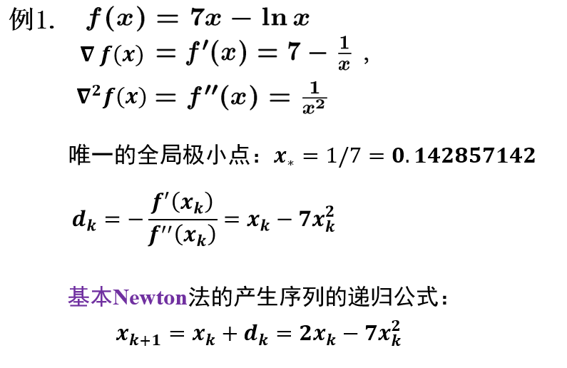
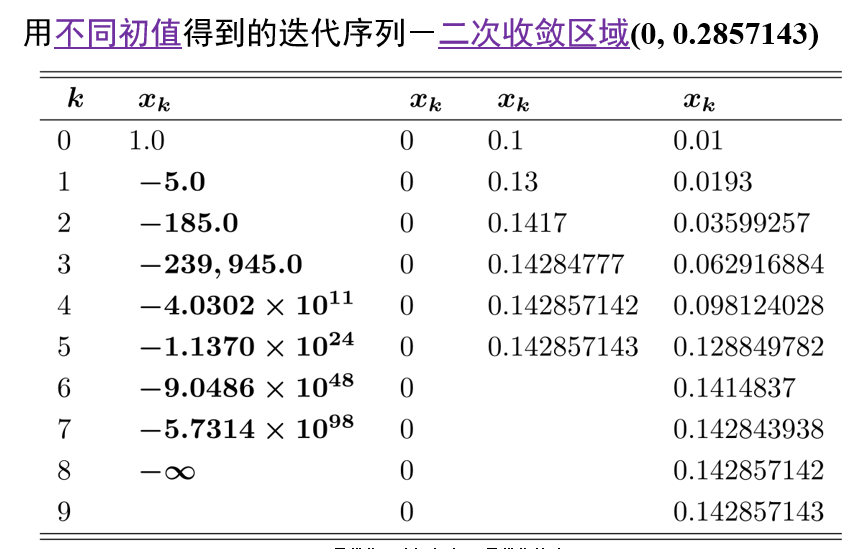
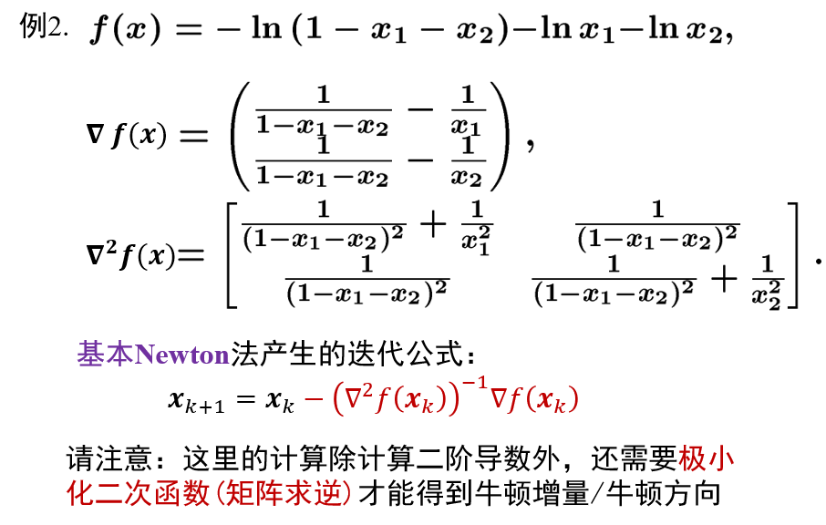
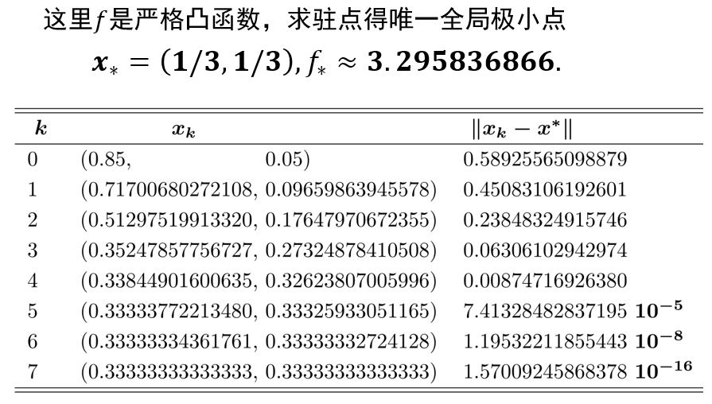
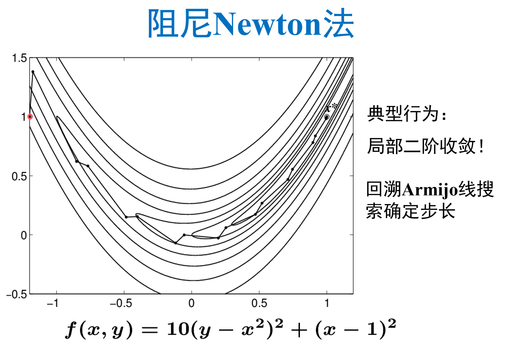
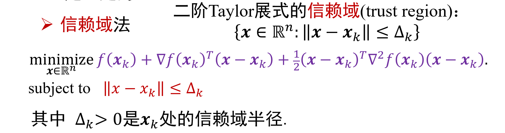
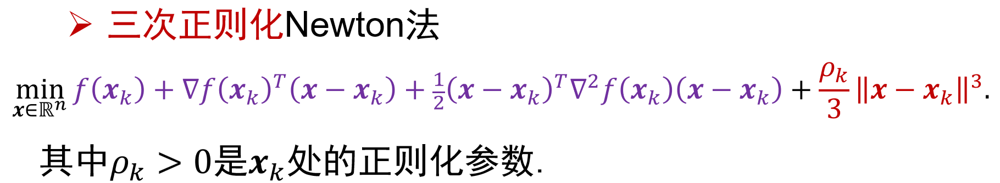

# Ep.5 牛顿法(Newton, NT)

> GD 是一阶方法，NT 则与之相对、是二阶方法。

用到了二阶梯度，所以需要$f\in C^2$。  
即当$f$更好时（有二阶梯度信息），能否**利用这些信息**，设计新的方法，使其**比 GD 的收敛效果（速率）更好**。  
（Tip. 虽然上一章大部分举例时都有二阶梯度信息，但只是这那么举例的，或者说那些问题也完全可以用牛顿法；如果无法求得二阶梯度，则只能用 GD）

> 问题背景 - 有二阶梯度的无约束极小化问题：
>
> $$
> \underset{x\in \mathbb{R}^n}{\min}f(x)
> $$
> **其中$f\in C^2$。**
>
> 注：虽然这里写的无约束，但实际上有约束，但只要极小点$\boldsymbol{x}_*$为其内点也可以用（比如为开集）。

**总结**：

* 基本 NT 法的适用范围：无约束、$C^2$、强凸优化（**各点 Hasse 矩阵正定**）  
  *还有个一般形式，但只做了解。*
* 基本 NT 法的迭代公式：$\boldsymbol{x}_{k+1}=\boldsymbol{x}_k-\nabla^2f(\boldsymbol{x}_k)^{-1}\nabla f(\boldsymbol{x}_k)$  
  但**通常使用阻尼 NT 法**：$\boldsymbol{x}_{k+1}=\boldsymbol{x}_k-\alpha_k\nabla^2f(\boldsymbol{x}_k)^{-1}\nabla f(\boldsymbol{x}_k)$  
  其中阻尼系数$\alpha_k$可由“回溯 Armijo 线搜索”确定。
* 基本 NT 法的要求：
  1. **各迭代点**（包括极小点）的 **Hasse 矩阵正定**，$\nabla^2 f(\boldsymbol{x}_k)\succ0$。  
  2. 各迭代点**离极小点较近**，为$\left\|\boldsymbol{x}_k-\boldsymbol{x}_*\right\|\le\frac{l_*}{2M}$。  
     其中$l_*$为极值点的海森矩阵最小特征值、$M$为海森矩阵的$M-$Lipschitz常数（三阶导的上界）  
     （如果$M$不存在，则只是不好分析，可能收敛可能发散，不能说不能用）
* 性质 - 局部二次收敛
  * 条件
    1. $\nabla^2 f(\boldsymbol{x})$在$\R^n$上是 $M$-Lipschitz 的
    2. **局部极小点（自带$\nabla=0$）$\boldsymbol{x}_*$处**的 Hesse 矩阵$\nabla^2 f(\boldsymbol{x}_*)\succ0$，等价于：$\exist l_*>0:\nabla^2f(\boldsymbol{x}_*)\succcurlyeq l_*I$，  
       即极小点处满足**局部 $l-$强凸**，$l_*$取$\lambda_{\min}(\nabla^2 f(\boldsymbol{x}_*))$
    3. 初始点$\boldsymbol{x}_0$满足：$||\boldsymbol{x}_0-\boldsymbol{x}_*||\le\frac{l_*}{2M}$
  * 性质
    1. 对于$\forall k\ge0$，NT 法是“良定义”的（即**所有迭代点的 Hesse 矩阵正定$\nabla^2f(\boldsymbol{x}_k)\succ0$**）
    2. **一定可以迭代**（因为所有迭代点$\nabla^2$正定，行列式大于0，$\nabla^2$有逆），且迭代序列**二次收敛**到$\boldsymbol{x}_*$
* 缺陷与改进  
  因为基本 NT 法有两个基本要求，当不满足时会产生问题
  1. 问题：迭代点 Hasse 矩阵正定，但迭代增量很大，导致局部二次近似失效  
     改进：阻尼 Newton 法（见上）
  2. 问题：迭代点 Hasse 矩阵不正定  
     改进：
     * 修正 Newton 法：$\boldsymbol{x}_{k+1}=\boldsymbol{x}_k-\alpha_k M_k^{-1}\nabla f(\boldsymbol{x}_k)=\boldsymbol{x}_k-\alpha_k (\nabla^2 f(\boldsymbol{x}_k)+D)^{-1}\nabla f(\boldsymbol{x}_k)$
     * *信赖域法*
     * *三次正则化 Newton 法*

## 一、方法理解（推导）

### 1. 极小化二阶近似（精确的泰勒二阶展式）

新的迭代点可以看成$f$在$\boldsymbol{x}_k$处的一个二阶泰勒展式（而不是近似，区别于 GD），极小化该函数。

对$f\in C^2$，无约束优化问题$\min f(\boldsymbol{x})$，  
其在$\boldsymbol{x}_k$处的二阶泰勒展式为：
$$
f(\boldsymbol{x})\approx f(\boldsymbol{x}_k)+\nabla f(\boldsymbol{x}_k)^T(\boldsymbol{x}-\boldsymbol{x}_k)+\frac12(\boldsymbol{x}-\boldsymbol{x}_k)^T\nabla^2f(\boldsymbol{x}_k)(\boldsymbol{x}-\boldsymbol{x}_k)
$$
令右侧为$q_k(\boldsymbol{x})$（各种$\boldsymbol{x}_k$的为常数项），则：  
一阶导数$\nabla q_k(\boldsymbol{x})=\nabla f(\boldsymbol{x}_k)+\nabla^2f(\boldsymbol{x}_k)(\boldsymbol{x}-\boldsymbol{x}_k)$；  
二阶导数$\nabla^2q_k(\boldsymbol{x})=\nabla^2 f(\boldsymbol{x}_k)$，就是$f$在$\boldsymbol{x}_k$处的海森矩阵。

对于这样一个二次函数$q_k$，**当$\nabla^2 q_k\succ0$时，其为严格凸函数**，只有一个极值点为$\nabla=0$处（可见[Ep.2.2 的 Ex.一些凸函数的快捷判断](../Ep.2%20凸性/2.2.%20凸函数、凸优化.md#ex-一些凸函数的快捷判断)），  
故**🌟假设迭代点海森矩阵正定**，然后求解$\nabla=0$，得极小点$\boldsymbol{x}_*$即下一个迭代点为$\boldsymbol{x}_{k+1}=\boldsymbol{x}_{*}=\boldsymbol{x}_k-\nabla^2f(\boldsymbol{x}_k)^{-1}\nabla f(\boldsymbol{x}_k)$。

由此得到基本（局部/纯粹）牛顿法：
$$
\boldsymbol{x}_{k+1}=\boldsymbol{x}_k-\nabla^2f(\boldsymbol{x}_k)^{-1}\nabla f(\boldsymbol{x}_k)
$$
🌟**其必须要求$\nabla^2 f(\boldsymbol{x}_k)\succ0$**（否则开口可能向下，极小化时可为无穷小、或者有多个极小值点）

可以用线搜索法理解，即搜索方向$\boldsymbol{d}_k=\nabla^2f(\boldsymbol{x}_k)^{-1}\nabla f(\boldsymbol{x}_k)$，步长$\alpha_k=1$（这也是基本/局部/纯粹名字的由来，指$\alpha=1$）。

### 2. 求解非线性方程组 F(x)=0

*这个想法有点不好（我有地方没说清楚，比如转到基本形式后为什么相比上面的 1 没有要求$\nabla^2\succ0$？），最好看上面的。*

> 回忆 - 求一元方程的零点$\varphi(x)=0$:
>
> 用“牛顿法”求一元方程的零点，即用直线近似曲线，然后不断求解新的更近的零点。
>
> 如果目前知道一点$x_k$（与根比较接近），则一阶泰勒展式为：  
> $\varphi(x)=\varphi(x_k)+\varphi'(x_k)(x-x_k)+o(|x-x_k|)$，  
> 因为$x_k$已经很接近零点了，新的迭代点$x$也需要很接近零点，故$o(|x-x_k|)$可以忽略，得：
> $\varphi(x)=\varphi(x_k)+\varphi'(x_k)(x-x_k)$，  
> 如果$\varphi'(x_k)\ne0$，则求解$\varphi(x)=0$可得：
> $x_{k+1}=x=x_k-\frac{\varphi(x_k)}{\varphi'(x_k)}$
>
> 这里已经有$\boldsymbol{x}_{k+1}=\boldsymbol{x}_k-\nabla^2f(\boldsymbol{x}_k)^{-1}\nabla f(\boldsymbol{x}_k)$的味道了（即$\phi(x_k)\leftarrow\nabla f(\boldsymbol{x}_k)$）

推广到非线性方程组$F(\boldsymbol{x})=0$（$F:\R^n\to\R^n\in C^1$），  
目前知道一点$\boldsymbol{x}^{(1)}$，其不是方程的解（但比较靠近），由泰勒定理知：
$$
F(\boldsymbol{x}+\Delta)=F(\boldsymbol{x})+J_F(\boldsymbol{x})\Delta+ o(||\Delta||)
$$
（可类比一元函数的泰勒定理为$f(x+\Delta)=f(x)+f'(x)\Delta+o(\Delta)$）  
对于无穷小量$o$可以忽略。
> 补充 - 如果不理解上面的泰勒定理，也可以看下面的推导：
>
> 对于$\boldsymbol{y}=F(\boldsymbol{x}),F:\R^n\to\R^n$（可看作$n$个$n$元的线性方程组），以$n=2$为例，已知一点$\boldsymbol{x}^{(1)}$，  
> $F=\begin{bmatrix}F_1(\boldsymbol{x})\\F_2(\boldsymbol{x})\end{bmatrix}$，可分别为每个$F_i:\R^n\to\R$用一元的二阶近似：  
> $$
> \left\{\begin{array}{l}F_1(\boldsymbol{x}^{(1)})+\nabla F_1(\boldsymbol{x}^{(1)})^T(\boldsymbol{x}-\boldsymbol{x}^{(1)})=0\\F_2(\boldsymbol{x}^{(1)})+\nabla F_2(\boldsymbol{x}^{(1)})^T(\boldsymbol{x}-\boldsymbol{x}^{(1)})=0\end{array}\right.
> $$
> 表达为矩阵形式为：$F(\boldsymbol{x}^{(1)})+J_F(\boldsymbol{x}^{(1)})(\boldsymbol{x}-\boldsymbol{x}^{(1)})=0$，其中$J_F$为雅各比矩阵，如果忘记可以看[基础知识](../Ep.0%20基础知识/0.md#6-多元函数的梯度方向导数海森矩阵曲率雅可比矩阵)。  
> 把$\boldsymbol{x}-\boldsymbol{x}^{(1)}$看成$\Delta$，就可以得到上面差不多的形式了。

让其等于0求新的零点，然后求解增量$\Delta$，**需要$J_F$可逆**，当前点加上增量则是下一个迭代点，  
故**🌟假设$J_F(\boldsymbol{x})$可逆**，此时：
$$
\Delta=-J_F^{-1}(\boldsymbol{x})F(\boldsymbol{x})
$$
故可以得到牛顿法的**一般迭代公式**：
$$
\boldsymbol{x}_{k+1}=\boldsymbol{x}_k-J_F^{-1}(\boldsymbol{x}_k)F(\boldsymbol{x}_k)
$$

但注意：上面的是说，针对**求解$F(\boldsymbol{x})=0$这个线性方程组**的问题，可以用这样一个迭代公式来**得到零点**。  
而如何对应到极小化问题呢？

考虑$\min f(f:\R^n\to\R)$的一阶必要条件：$\nabla f=0$，  
故可将$F(\boldsymbol{x})=\nabla f(\boldsymbol{x})$代入上面的$F(\boldsymbol{x})=0$问题，  
（Tip. $\nabla$为一个算子，本身就可以看成一个函数/操作，或说$\nabla f=0$本身就是向量方程）  
代入可得到牛顿法的基本形式：$\boldsymbol{x}_{k+1}=\boldsymbol{x}_k-\nabla^2 f(\boldsymbol{x}_k)^{-1}\nabla f(\boldsymbol{x}_k)$  
（Tip. 对于$f$梯度的雅各比矩阵，就是海森矩阵，可见[基础知识](../Ep.0%20基础知识/0.md#6-多元函数的梯度方向导数海森矩阵曲率雅可比矩阵)）。

## 二、方法定义

可以采用线搜索的迭代格式来理解：$\boldsymbol{x}_{k+1}=\boldsymbol{x}_k+\alpha_k\boldsymbol{d}_k$。

### 1. 一般形式

*这个一般了解即可，重点是下面的基本形式。*

在这里，问题背景中函数变化为**多对多的映射**，即$F:\R^n\to\R^m$。  

> 重定义问题背景 - 有二阶梯度的无约束极小化问题：
>
> $$
> \underset{x\in \mathbb{R}^n}{\min}F(x)
> $$
> 其中，$F:\R^n\to\R^m$

**NT 的搜索方向**：
$$
\boldsymbol{d}_k=-J_F^{-1}(\boldsymbol{x}_k)F(\boldsymbol{x}_k)
$$

**NT 的迭代公式**：
$$
\boldsymbol{x}_{k+1}=\boldsymbol{x}_k-J_F^{-1}(\boldsymbol{x}_k)F(\boldsymbol{x}_k)
$$
*其中步长$\alpha_k$相当于恒为$1$。*

### 🌟2. 基本（局部/纯粹）形式

> 重申问题背景 - 有二阶梯度的无约束极小化问题：
>
> $$
> \underset{x\in \mathbb{R}^n}{\min}f(x)
> $$
> **其中$f\in C^2$。**
>
> 注：虽然这里写的无约束，但实际上有约束，但只要极小点$\boldsymbol{x}_*$为其内点也可以用（比如为开集）。

#### 🌟(1) 基本 Newton 的搜索方向

$$
\boldsymbol{d}_k=-\nabla^2f(\boldsymbol{x}_k)^{-1}\nabla f(\boldsymbol{x}_k)
$$
*相当于一般形式中$F=\nabla f$，而梯度的雅各比矩阵就是海森矩阵。*

通常为了方便计算，其中的$\boldsymbol{x}_k$可以取为一个很靠近极小值的**定点**，即搜索方向恒定（比如**就为极小值**，即$-\nabla^2f(\boldsymbol{x}_*)^{-1}\nabla f(\boldsymbol{x}_*)$）。

#### (2) 基本 Newton 的迭代公式

$$
\boldsymbol{x}_{k+1}=\boldsymbol{x}_k-\nabla^2f(\boldsymbol{x}_k)^{-1}\nabla f(\boldsymbol{x}_k)
$$
*其中步长$\alpha_k$相当于恒为$1$。*

#### 🌟(3) 基本 Newton 的使用条件

因为用了极小点处的二阶近似，进行凸优化，故要保证极小点处的二阶近似是凸函数，  
即极小点处海森矩阵正定$\nabla^2 f(\boldsymbol{x}_*)\succ0$

因为$\nabla^2f(\boldsymbol{x}_k)$要可逆才能有解，即$|\nabla^2|\ne0$、非奇异、没有$0$特征值。

同时，当迭代点离极小点很远时，二阶近似很不准确（可见下面的方法缺陷的例2），  
故还需要靠近极小点，可定量描述为下方的“局部二次收敛”，即$\left\|\boldsymbol{x}_k-\boldsymbol{x}_*\right\|\le\frac{l_*}{2M}$（具体含义可见局部二次收敛）。

即 NT 的**使用条件有两点**：

1. **各迭代点**（包括极小点）的 Hasse 矩阵正定，$\nabla^2 f(\boldsymbol{x}_k)\succ0$。  
   注：这个条件来自于方法推导 1 中的假设“迭代点海森矩阵正定”。
2. 各迭代点**离极小点较近**，可定量描述为$\left\|\boldsymbol{x}_k-\boldsymbol{x}_*\right\|\le\frac{l_*}{2M}$。

因为有这些条件，很容易不满足，  
🌟故**通常使用的是**“[阻尼 Newton 法](#2-修正方法---阻尼更新搭配回溯-armijo-线搜索)”。

## 三、方法举例

1. $f(x)=7x-\ln x$  
     
     
   注意这里对于$J_F^{-1}(\boldsymbol{x}_k)F(\boldsymbol{x}_k)$是**恒用**$\boldsymbol{x}_*$处的值，而非迭代一步就用新的$\boldsymbol{x}_*$的值。  
   故对于不同初值点的选择：很靠近$\boldsymbol{x}_*$的点（后面两个）才能收敛到$\boldsymbol{x}_*$（且越靠近收敛越快）；而远离$\boldsymbol{x}_*$的收敛错误甚至发散。
2. $f(x)=-\ln(1-x_1-x_2)-\ln x_1-\ln x_2$  
     
   Tip. 这里$f$明显有一个**对称性**（即把$x_1$和$x_2$互换，得到一样的函数），求梯度为0$\nabla f=0$也具有对称性，所以解一定是$x_1=x_2$的，可得$\boldsymbol{x}_*=(\frac{1}{3},\frac{1}{3})$。  
     
   *这里暂不清楚$J_F^{-1}$这些参数是不是采用的恒定值*  
   同时可以看到，当$\boldsymbol{x}_k$进入二次收敛域后，误差成倍减小，即$\boldsymbol{x}_k$的正确有效数字成倍增加。

## 四、方法性质

由上面的举例可以看到，NT 法具有以下性质：

### 🌟1. 局部二次收敛

**初步认识**：

由上例2可以看到，当迭代点$\boldsymbol{x}_k$离极小点$\boldsymbol{x}_*$很近时，收敛速度为二次收敛。  
如果很远，则没有这种性质，故称“**局部二次收敛**”。

> **具体定义 - 局部二次收敛**：
>
> 对于 NT 法，如果**满足以下三个条件**：
>
> 1. $\nabla^2 f(\boldsymbol{x})$在$\R^n$上是 $M$-Lipschitz 的（可见[Ep.4 有关 Hasse 矩阵是 Lipschitz 连续的讲解](../Ep.4%20梯度下降法(GD)/4.md#1-针对梯度)）
> 2. **局部极小点（自带$\nabla=0$）$\boldsymbol{x}_*$处**的 Hesse 矩阵$\nabla^2 f(\boldsymbol{x}_*)\succ0$（即为非退化/真正局部极小点）。  
>    即等价于：$\exist l_*>0:\nabla^2f(\boldsymbol{x}_*)\succcurlyeq l_*I$，  
>    即极小点处满足**局部 $l-$强凸**，$l_*$取$\lambda_{\min}(\nabla^2 f(\boldsymbol{x}_*))$（可见[Ep.2.2 中强凸函数](../Ep.2%20凸性/2.2.%20凸函数、凸优化.md#4-拓展---l-强凸函数)）  
>    注：原本$l$右下角没有$*$，但为了区分这是局部$l-$强凸而非全局$l-$强凸，个人在这里加上$*$方便区分。
> 3. 初始点$\boldsymbol{x}_0$满足：
>    $$
>    ||\boldsymbol{x}_0-\boldsymbol{x}_*||\le\frac{l_*}{2M}
>    $$
>    *定性描述为：初值点充分近。*  
>    注：如果条件$1$不满足，则对于$\nabla^2$不存在上界$M$，则相当于$M\to\infty$，那就得用其它方法了（比如局部$M-$Lipschitz等）。
>
> 则：  
>
> 1. 对于$\forall k\ge0$，NT 法是“良定义”的（即**所有迭代点的 Hesse 矩阵正定$\nabla^2f(\boldsymbol{x}_k)\succ0$**），  
>    *并且 Hasse 矩阵最小特征值$\lambda_{\min}(\nabla^2 f(\boldsymbol{x}_k))\ge\frac{l}{2}$*（这个很巧，也应该一般不会用到，但确实能证）。
> 2. **一定可以迭代**（因为所有迭代点$\nabla^2$正定，行列式大于0，$\nabla^2$有逆），且迭代序列**二次收敛**到$\boldsymbol{x}_*$。  
>    （一定可以迭代是因为$||\boldsymbol{x}_1-\boldsymbol{x}_*||\le\frac{1}{2}||\boldsymbol{x}_0-\boldsymbol{x}_*||$即迭代点越来越近；二次收敛是因为存在一个$||\boldsymbol{x}_1-\boldsymbol{x}_*||\le C||\boldsymbol{x}_0-\boldsymbol{x}_*||^2$）

**注意**：这里并不要求整个函数$f$凸，而只要求函数$f$**在极小点处附近局部凸**。

> 证明：  
> 🗨️**这个证明的过程不用掌握，但这个性质一定要掌握**。  
> *以下均用不加粗的$x$代表向量$\boldsymbol{x}$。*
>
> 证明的核心是证迭代时误差的变化（关系），即$||x_{k+1}-x_*||?||x_k-x_*||$，这个利用迭代式产生  
> 这里首先会给出两个断言（就是根据三个条件，先给你推论，后续再证）（也对应该性质的部分结论）：
>
> 1. 断言1：如果$||{x}-{x}_*||\le\frac{l}{2M}$（条件3）且$\nabla f(x_*)\succ0$（条件2），则$\Rightarrow\lambda_{\min}(\nabla^2 f(x))\ge\frac{l}{2}$（隐含了$\nabla^2f({x})\succ0$）  
> 等价于$\lambda_{\max}(\nabla^2 f(x)^{-1})=||\nabla^2f(x)^{-1}||_2\le\frac{2}{l}$（即两侧取倒数并导致大小对调）
>
>    *注：讲义上左侧并没有写条件2，因为是断言包含了所有基础条件，但如果不加可能导致错误理解，故这里要加上。*
>
>    这个很好理解，根据条件(1)$\nabla^2$是 Lipschitz 连续，即变化不会太突然、比较平缓；又$\because$$\lambda_{\min}\nabla^2f(x_*)=l$，  
>    $\therefore x$在$x_*$附近满足$\lambda_{\min}\nabla^2f(x)\ge\frac{l}{2}$很合理。
> 2. 断言2：对$\forall x\in\R^n$，$||\nabla^2f(x)(x-x_*)-[\nabla f(x) - \nabla f(x_*)]||\le\frac{M}{2}||x-x_*||^2$恒成立  
>    【这个看着很神奇，感觉完全没有任何规律格式和意义，只能佩服数学家的神奇……
>
> ---
>
> 拥有这两个断言后，可以先把基本迭代式往这两个断言靠，即：  
> $x_{k+1}=x_{k}-\nabla^2 f(x_k)^{-1}\nabla f(x_k)$  
> $\Rightarrow x_{k+1}-x_*=x_k-x_*-\nabla^2f(x_k)^{-1}\nabla f(x_k)$，$\because\nabla f(x_*)=0$（条件2）可以任意添加，同时左右两侧取二范数  
> $\Rightarrow||x_{k+1}-x_*||=||\nabla^2f(x_k)^{-1}[\nabla^2f(x_k)(x_k-x_*)-(\nabla f(x_k) - \nabla f(x_*))]||$，因为右侧$||A\boldsymbol{x}||\le||A||\cdot||\boldsymbol{x}||$（原来是向量这样，但矩阵可以理解为：向量沿特征向量方向才能得到最大缩放比例，其它方向都会小于）  
> $\Rightarrow||x_{k+1}-x_*||\le||\nabla^2f(x_k)^{-1}||\cdot||\nabla^2f(x_k)(x_k-x_*)-[\nabla f(x_k) - \nabla f(x_*)]||$，由于断言1和2，分别把等式右侧两项给缩放，得：  
> $\Rightarrow||x_{k+1}-x_*||\le\frac{M}{l}||x_k-x_*||^2$，代入$k=0$，  
> $\Rightarrow||x_1-x_*||\le\frac{M}{l}||x_0-x_*||^2$，得证性质2的二次收敛。接下来$\because$（条件3）$||\boldsymbol{x}_0-\boldsymbol{x}_*||\le\frac{l}{2M}$，缩放平方当中的一项，  
> $\Rightarrow||x_1-x_*||\le\frac{1}{2}||x_0-x_*||$，得证性质2的可以迭代。  
> 又$\because$性质2说明新的迭代点都离$x_*$越来越近，则新的迭代点也会满足条件3、从而满足断言1，故所有迭代点都$\nabla^2 f(x_k)\succ0$，得证性质1。
>
> 接下来分别证明两个断言。
>
> ---
>
> 证 - 断言1：
>
> 运用了“Wielandt-Hoffman 定理”（取$p=2$，原公式可见[预备知识中有](../Ep.0%20基础知识/0.md#2-wielandt-hoffman-定理---描述矩阵特征值差异)），可得到：  
> $\sum_{i=1}^n|\lambda_i(A)-\lambda_i(B)|^2\leq\|A-B\|_2^2$，令$A=\nabla^2 f(x), B=\nabla^2 f(x_*)$，且对于左侧，平方和一定大于等于其中一项的和（取最小的那项），然后两边开根号，  
> $\Rightarrow|\lambda_{\min}(\nabla^2 f(x))-\lambda_{\min}(\nabla^2 f(x_*))|\le||\nabla^2 f(x)-\nabla^2 f(x_*)||$，$\because\nabla^2 M-$Lipschitz 连续，即右侧$\le M||x-x_*||$  
> $\Rightarrow|\lambda_{\min}(\nabla^2 f(x))-\lambda_{\min}(\nabla^2 f(x_*))|\le M||x-x_*||$，要求证关于$\lambda_{\min}(\nabla^2 f(x))$的下界，故可以开绝对值并取下届侧：  
> $\Rightarrow \lambda_{\min}(\nabla^2 f(x))-\lambda_{\min}(\nabla^2 f(x_*))\ge-M||x-x_*||$，$\because\nabla^2f(x_*)\succ0$（条件2），即$l=\lambda_{\min}(\nabla^2 f(x_*))$，  
> $\Rightarrow \lambda_{\min}(\nabla^2 f(x))\ge l-M||x-x_*||$，又$\because||{x}-{x}_*||\le\frac{l}{2M}$（条件3），即$-M||x-x_*||\ge-\frac{l}{2}$  
> $\Rightarrow \lambda_{\min}(\nabla^2 f(x))\ge\frac{l}{2}$，得证。  
> 因为最小特征值都为正数，故$\nabla^2 f(x)\succ0$。
>
> ---
>
> 证 - 断言2：
>
> 用“[用凸函数形式将多元函数转化为一元函数](../Ep.2%20凸性/2.2.%20凸函数、凸优化.md#ex-另一种形式---用凸函数形式将多元函数转化为一元函数)”的思想：  
> 令$h_i({x})=\frac{\partial f}{\partial x_i}({x})$，$h_i$为一个多元函数，为求$f$的第$i$个分量的偏导作为函数，  
> 令$\varphi_i(\theta)=h_i(x_*+\theta(x-x_*))$，  
> 用积分：$\varphi_i(1)-\varphi_i(0)=\int_0^1 \varphi_i'(\theta)\text{d}\theta$  
> $\Rightarrow h_i(x)-h_i(x_*)=\int_0^1\nabla h_i({x}_*+\theta({x}-{x}_*))^T({x}-{x}_*) \text{d}\theta$
>
> 推广到$n$个方程：
> $$
> \left\{\begin{array}{l}
>   \frac{\partial f}{\partial x_1}(x)-\frac{\partial f}{\partial x_1}(x_*)=\int_0^1\nabla h_1(\cdots)^T(x-x_*)\text{d}\theta \\
>   \frac{\partial f}{\partial x_2}(x)-\frac{\partial f}{\partial x_2}(x_*)=\int_0^1\nabla h_2(\cdots)^T(x-x_*)\text{d}\theta \\
>   \cdots \\
>   \frac{\partial f}{\partial x_n}(x)-\frac{\partial f}{\partial x_n}(x_*)=\int_0^1\nabla h_n(\cdots)^T(x-x_*)\text{d}\theta \\
> \end{array}\right.
> $$
> 写成向量形式，其中各行方程的$\nabla h_i^T$，按行向量排列则会组成$\nabla^2 f$，故变成：  
> $\nabla f(x)-\nabla f(x_*)=\int_0^1\nabla^2f(x_*+\theta(x-x_*))\cdot(x-x_*)\text{d}\theta$，  
> 两边取负加上$\nabla^2 f(x)(x-x_*)$，再求模  
> $\Rightarrow \left\|\nabla^2 f(x)(x-x_*)-(\nabla f(x)-\nabla f(x_*))\right\|=\left\|\nabla^2 f(x)(x-x_*)-\int_0^1\nabla^2f(x_*+\theta(x-x_*))\cdot(x-x_*)\text{d}\theta\right\|$，  
> 在这里需要将积分$\int_0^1\nabla^2f(x_*+\theta(x-x_*))\cdot(x-x_*)\text{d}\theta$中$f(x_*+\theta(x-x_*))$的$x_*$和$x$变换以下顺序，即令$\theta=1-\theta'$  
> $\Rightarrow Left=\left\|\nabla^2 f(x)(x-x_*)-\int_0^1\nabla^2f(x+\theta(x_*-x))\cdot(x-x_*)\text{d}\theta\right\|$  
> 因为等式右侧$\nabla^2 f(x)(x-x_*)$不与$\theta$有关，积分区间又为$0\sim1$，即$\nabla^2 f(x)(x-x_*)=\int_0^1 \nabla^2 f(x)(x-x_*)\text{d}\theta$  
> $\Rightarrow Left=\left\|\int_0^1[\nabla^2f(x)-\nabla^2f(x+\theta(x_*-x))](x-x_*)\text{d}\theta\right\|$，  
> 存在基本不等式$||\int X||\le\int||X||$  
> $\Rightarrow Left\le\int_0^1\left\|[\nabla^2f(x)-\nabla^2f(x+\theta(x_*-x))](x-x_*)\right\|\text{d}\theta$，  
> $\because\nabla^2$是 $M-$Lipschitz 的，即$\left\|\nabla^2f(x)-\nabla^2f(x+\theta(x_*-x))\right\|\le M\theta(x-x_*)$，再将系数提出去  
> $\Rightarrow Left\le M\left\|x-x_*\right\|^2\int_0^1\theta\text{d}\theta$  
> $\Rightarrow \left\|\nabla^2 f(x)(x-x_*)-(\nabla f(x)-\nabla f(x_*))\right\|\le\frac{M}{2}\left\|x-x_*\right\|^2$，得证。

## 五、基本方法缺陷与改进

基本方法有两个要求：

1. **各迭代点**（包括极小点）的 Hasse 矩阵正定，$\nabla^2 f(\boldsymbol{x}_k)\succ0$。  
   注：这个条件来自于方法推导 1 中的假设“迭代点海森矩阵正定”。
2. 各迭代点**离极小点较近**，可定量描述为$\left\|\boldsymbol{x}_k-\boldsymbol{x}_*\right\|\le\frac{l_*}{2M}$。

如果不满足，会导致以下问题。

### 1. 迭代点 Hasse 矩阵正定，但迭代增量很大，导致局部二次近似失效

*Tip. 这里虽然说的是增量，但实际上是减小量（但在异常情况下，确实会增加）。*

这个问题可以看成不满足条件 2，即离极值点过远。

#### (1) 问题 1 举例

> 举例 - $f(x)=\sqrt{x^2+1}$：
>
> *Tip. 该函数再减1，可以看作非光滑函数$|x|$的光滑近似。*
>
> * $f'=\frac{x}{\sqrt{x^2+1}}$
> * $f''=(1+x^2)^{-\frac{3}{2}}$
>
> 可分析出：其二阶导数（类比于 Hasse 矩阵）有上界1，下界0，故$f$为$1-$光滑的，但不是$l-$强凸的（$l\ne0$）。
>
> 此时 NT 迭代公式为：$x_{k+1}=x_k-\frac{f'(x_k)}{f''(x_k)}$，即迭代增量$-\frac{f'(x_k)}{f''(x_k)}=-x^3$。
>
> 故：
>
> * 当$|x_k|<1$时，算法三次收敛
> * 当$|x_k|=1$时，算法在$-1$和$1$来回振荡
> * 当$|x_k|>1$时，算法发散。
>
> 故：虽然$\nabla^2\succ0(f''>0)$，但因$x_k$太远离$x_*$，导致迭代增量很大，会迭代失败。

故：即便$f$是光滑的强凸函数，也只能保证 NT 法是**局部收敛**的。

#### (2) 修正方法 - 阻尼更新（搭配回溯 Armijo 线搜索）

问题2原因在于：因为迭代量太大，导致振荡或发散。  
因此考虑：**加一个阻尼系数**、让迭代量不那么大（或者说原来步长$\alpha=1$，让$\alpha<1$）  

即迭代公式变为，即为“**阻尼更新**”：
$$
\boldsymbol{x}_{k+1}=\boldsymbol{x}_k-\alpha_k\nabla^2f(\boldsymbol{x}_k)^{-1}\nabla f(\boldsymbol{x}_k)
$$

对于步长的选择，可以采用“[**回溯 Armijo 线搜索法**](../Ep.3%20最优解和算法的基本性质/3.md#3-具体算法---回溯-armijo-线搜索)”。  
该方法可以找到一个满足 Armijo 条件，即函数值一定下降的点，从而保证迭代成功。  
通常取初始$\bar\alpha=1$（因为如果已经在二次收敛域（很近）了，步长直接取1就可以（并且以后步长恒取1）；如果不在，才要减小步长）。

#### (3) 阻尼 Newton 法的示例

  
图中红圈为初始点。

### 2. 迭代点 Hasse 不正定

这个问题即不满足条件 1，Hasse 直接不正定了，基本 NT 方法都没法用了。

#### (1) 修正方法 1 - 修正 Newton 法

> 思路：
>
> 本质是因为在极小化二阶泰勒展式：$f(\boldsymbol{x})\approx f(\boldsymbol{x}_k)+\nabla f(\boldsymbol{x}_k)^T(\boldsymbol{x}-\boldsymbol{x}_k)+\frac12(\boldsymbol{x}-\boldsymbol{x}_k)^T\nabla^2f(\boldsymbol{x}_k)(\boldsymbol{x}-\boldsymbol{x}_k)$  
> （是先利用二阶近似，不过都取地精确值）  
> 如果$\nabla^2\not\succ0$，可能导致开口向下则无法极小化（到无穷小）、也可能有多个极小点。
>
> 回想 GD 法，也利用过极小化二阶近似$f(\boldsymbol{x})\approx f(\boldsymbol{x}_k)+\boldsymbol{g}_k^T(\boldsymbol{x}-\boldsymbol{x}_k)+\frac{1}{2}(\boldsymbol{x}-\boldsymbol{x}_k)^TB_k(\boldsymbol{x}-\boldsymbol{x}_k)$，  
> 并且很大胆地直接令二次项系数$B_k$为一个常数（而 NT 法则是精确计算二次项系数）。  
> 故**二次项系数**并不一定需要那么精确，**可以进行调整**。  
> 这就是“修正 Newton 法”的思路。

**方法**：

给$\nabla^2 f(\boldsymbol{x}_k)$加上一个对角矩阵$D$，使得其正定，即：
$$
M_k=\nabla^2 f(\boldsymbol{x}_k)+D\succ0
$$  
$D$的确定有很多种办法，最简单粗略的就是单位矩阵的倍数$\lambda I$。

通常还搭配阻尼 NT 法，  
故**迭代公式**变为：
$$
\begin{array}{ll}
\boldsymbol{x}_{k+1}&=\boldsymbol{x}_k-\alpha_k M_k^{-1}\nabla f(\boldsymbol{x}_k) \\
&=\boldsymbol{x}_k-\alpha_k (\nabla^2 f(\boldsymbol{x}_k)+D)^{-1}\nabla f(\boldsymbol{x}_k)
\end{array}
$$

#### (2) 修正方法 2 - 信赖域法

*了解即可。*

即将迭代范围约束在离极小点很近的一片空间内，这样这个二阶泰勒展式就可信了。

把上面的优化问题求解，得到下个迭代点【即要求这个优化问题，还要解决另一个优化问题……

#### (3) 修正方法 3 - 三次正则化 Newton 法

*了解即可。*

信赖域法是加了个约束，这里是加了个“惩罚系数”。

  
要求增量不能太大，故对增量值增加了一个惩罚系数。
