# Ep.7.1 次梯度

**总结**：

* 背景知识
  * 可微凸函数的一阶梯度（梯度不等式）：$f(\boldsymbol{y})\ge f(\boldsymbol{x})+\nabla f(\boldsymbol{x})^T(\boldsymbol{y}-\boldsymbol{x})$
  * 扩展实值凸函数：$f(\boldsymbol{x})>-\infty, \forall\boldsymbol{x}$（不在定义域上则取$+\infty$）、有效域$\text{dom} f$
  * 指示函数$\delta_C(\boldsymbol{x})$：有效域就是$S$、$\partial \delta_C(\boldsymbol{x})=N_C(\boldsymbol{x})$（某点的次微分等于其法锥）
  * 法向量：满足$\boldsymbol{g}^T(\boldsymbol{y}-\boldsymbol{x})\le0\quad\forall\boldsymbol{y}\in C$的$\boldsymbol{g}$，定义为“$\boldsymbol{g}$为凸集$C$在$\boldsymbol{x}$处的法向量”  
    $\boldsymbol{0}$一定是所有点的法向量
  * 法锥：凸集$C$在$\boldsymbol{x}$的全体法向量，为$C$在$\boldsymbol{x}$的法锥，记作$N_C(\boldsymbol{x})$  
* 次梯度、次微分
  * 定义
    * 次梯度：满足$f(\boldsymbol{y})\ge f(\boldsymbol{x}_0)+\boldsymbol{g}^T(\boldsymbol{y}-\boldsymbol{x}_0),\quad\forall\boldsymbol{y}\in\R^n$的$\boldsymbol{g}$
    * 次微分：所有次梯度组成的**集合**，为$f$在$\boldsymbol{x}_0$处的“次微分”，记作$\partial f(\boldsymbol{x}_0)$
  * 性质
    * 次梯度与可微（梯度）的关系：不可微（非光滑点）处次梯度不唯一、可微（光滑点处）次梯度唯一且就为梯度
    * 次微分是闭凸集
    * 次微分的存在性
      * 如果$\boldsymbol{x}\not\in\text{dom}f$，则$\partial f(x)=\empty$
      * 如果$\boldsymbol{x}\in\text{rbd}(\text{dom}f)$，则$\partial f(x)$可能非空、也可能空
      * 如果$\boldsymbol{x}\in\text{ri}(\text{dom}f)$，则$\partial f(x)\ne\empty$  
        只要有改变方向（在相对内部），就一定有次微分（故也有该方向对应的方向导数，也保证了一定可用次梯度法）。
      * 如果$\boldsymbol{x}\in\text{int}(\text{dom}f)$，则$\partial f(x)$为非空有界闭凸集
    * 方向导数
      * 如果$\boldsymbol{x}\in\text{ri}(\text{dom}f)$，则$f$在此处沿某一方向$\boldsymbol{d}$的方向导数存在，  
        其为一个集合，为方向与所有次梯度（次微分各元素）的内积，$\{\boldsymbol{d}^T\boldsymbol{g}:\boldsymbol{g}\in\partial f(\boldsymbol{x})\}$。
      * 如果$\boldsymbol{x}\in\text{int}(\text{dom}f)$，则方向导数有界
    * 次梯度对应的超平面支撑下水平集（联系：超平面支撑上镜图，但下水平集是$n$维集合、上镜图是$n+1$维集合）
  * 运算规则
    * 正数可缩放（可提正常数）：当$\lambda>0$，$\partial (\lambda f)=\lambda\partial f$
    * 和的次微分等于次微分的和：$\partial f = \partial f_1+\partial f_2$  
      *一般情况下直接是这个，但是如果两个函数的定义域不相交，则为$\partial f\supseteq \partial f_1+\partial f_2$。*
    * 逐点上确界的次微分，为所取函数的次微分的凸包：$\partial f = \text{conv}\{\nabla f_i:i\in I(\boldsymbol{x})\}$  
      *通常直接用这个，但也存在特殊情况。*
  * 典型函数的次梯度
    * 一范数函数（绝对值求和）：$\partial\|\boldsymbol{x}\|_1=\{\boldsymbol{g}\in\R^n:g_i=\text{sign}(x_i)\}$  
      修**正符号函数**$\text{sign}(x_i)=\begin{cases}\{1\}&x_i>0\\ [-1,1]&x_i=0\\\{-1\}&x_i<0\end{cases}$
    * 二范数函数（欧氏距离）：$\partial \|\boldsymbol{x}\|_2=\begin{cases}\quad\left\{\frac {\boldsymbol{x}}{\|\boldsymbol{x}\|_2}\right\},&\text{当}\boldsymbol{x}\neq0\\\{\boldsymbol{g}\colon\|\boldsymbol{g}\|_2\leq1\},&\text{当}\boldsymbol{\boldsymbol{x}}=\boldsymbol{0}&\end{cases}$
  * 求法
    * 直接用定义求：$f(\boldsymbol{y})\ge f(\boldsymbol{x}_0)+\boldsymbol{g}^T(\boldsymbol{y}-\boldsymbol{x}_0),\quad\forall\boldsymbol{y}\in\R^n$的$\boldsymbol{g}$
    * 利用运算规则求
    * 利用[思想 - 次梯度（数值）与法向量（几何）的相互转换](#1-定义)：在函数图形上看出一个点的所有法向量，将其最后一个分量定为$-1$，则可以转换为所有次梯度。
* 不可微**凸优化**的最优性条件（类比于[Ep.3 的二最优解的各类条件](../Ep.3%20最优解和算法的基本性质/3.md#二最优解的各类条件)）
  * 无约束问题极小点充要条件：某点次微分中有$\boldsymbol{0}$$\Leftrightarrow$是全局极小点
  * *有约束问题极小点充分条件*：如果对某点$\exist \boldsymbol{u}\in\partial f(\boldsymbol{x}_*) \Rightarrow -\boldsymbol{u}\in N_C(\boldsymbol{x}_*)$，则其为极小点  
    *这个对于一般问题来说也通常是充要条件，只有在函数定义域的$\text{ri}$与约束$C$的$\text{ri}$没有交点时才不是。*
  * 有约束问题极小点充要条件：如果还满足$\text{ri}(\text{dom} f)$与$\text{ri} C$有交点（如果$C$是多面体则为$\text{ri}(\text{dom} f)$与$C$有交点），则上述条件为充要条件。
* 典例
  * [LASSO 问题](#1-lasso-的最优性条件)
  * [（更一般的 LASSO 问题）软阈值算子](#2-软阈值算子)

> 总述 - 对次梯度、次梯度法的整体认识：
>
> 次梯度是**梯度的扩展推广概念**，用来处理**非光滑函数**（$f\not\in C^1$）的优化问题。  
> 在传统的梯度下降法中，我们计算一个函数的梯度，并沿着负梯度方向移动，从而让函数值下降。  
> 然而，对于一些不光滑的函数（比如绝对值函数或一范数函数），这些点在某些位置上没有梯度。  
> 此时，就需要**用“次梯度”来代替“梯度”**。
>
> 因此：如果一个函数在某一点上没有定义明确的“斜率”（即没有梯度），  
> 我们就找到所有让该点附近的函数值不会增加的“方向向量”，这些向量集合就是该点的“次梯度集”（次微分）。  
> 然后利用这些次梯度作为搜索方向，进行类似 GD 的线搜索。

*这一节首先讲次梯度的整体认知，下一节才讲其在算法上的应用。*

---

> 背景知识 - 几何上理解梯度和[“可微凸函数的刻画”当中的梯度不等式](../Ep.2%20凸性/2.2.%20凸函数、凸优化.md#1-一阶梯度梯度不等式-gi)：
>
> 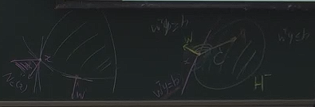  
> 上图是两个凸集、可以作为一个**凸函数的等高线图**。  
> 而右侧的是一个可微凸函数（处处光滑）、左侧则在三个交点处不可微。
>
> 之前“可微凸函数的刻画”当中的梯度不等式，即$f(\boldsymbol{y})\ge f(\boldsymbol{x})+\nabla f(\boldsymbol{x})^T(\boldsymbol{y}-\boldsymbol{x})$，可以用几何来理解为：
>
> * 梯度处的超平面$\boldsymbol{w}^T\boldsymbol{x}=\boldsymbol{b}$（其中$\boldsymbol{w}=\nabla f(\boldsymbol{x})$，即梯度就是超平面的法向量），分成正负半平面。  
>   其中**整个凸集一定位于负半平面**$H^-$（因为梯度的方向指向函数值增加的方向，因为是凸函数，即等高线外侧）。  
>   即：切超平面支撑整个凸集（函数图形，其上镜图肯定也支撑）
> * 在凸集内部的点$\boldsymbol{y}$，其与切点的连线$\boldsymbol{y}-\boldsymbol{x}$，一定与梯度（即法向量）方向形成钝角（或直角）。（如上面右图的$y$方向）  
>   即满足：
>   $$
>   \boldsymbol{w}^T(\boldsymbol{y}-\boldsymbol{x})\le0
>   $$
>
> 对于上面左图的交点处，其不存在明确的梯度。  
> 但是按照两条线各自的法向量，其对应切超平面均可以撑起整个凸集，
> 并且在**夹在其中的法向量**形成的超平面**均可以**。  
> 因此这些法向量称为该点处的“**法锥**”，即支撑凸集的所有超平面的法向量的集合。

## 零、次梯度需要的背景知识

次梯度的定义其实很简单：  
对于**凸函数**$f(\boldsymbol{x})$，如果某个向量$\boldsymbol{g}$跟梯度$\nabla f$一样：可以支撑起整个函数，即满足：
$$
\boldsymbol{x}_0\in S,\quad \forall\boldsymbol{y}\in S,\quad f(\boldsymbol{y})\ge f(\boldsymbol{x}_0)+\boldsymbol{g}^T(\boldsymbol{y}-\boldsymbol{x}_0)
$$  
那么就称$\boldsymbol{g}$为函数$f$在$\boldsymbol{x}_0$处的次梯度。

但为了更好描述次梯度，这里要定义一些背景知识（*主要是“扩展实值函数”，但这个也只是个工具性的概念*）。

### 1. 回忆 - 可微凸函数的刻画

*这里主要是对之前[“可微凸函数的刻画”当中的梯度不等式](../Ep.2%20凸性/2.2.%20凸函数、凸优化.md#1-一阶梯度梯度不等式-gi)重提回忆一下。*

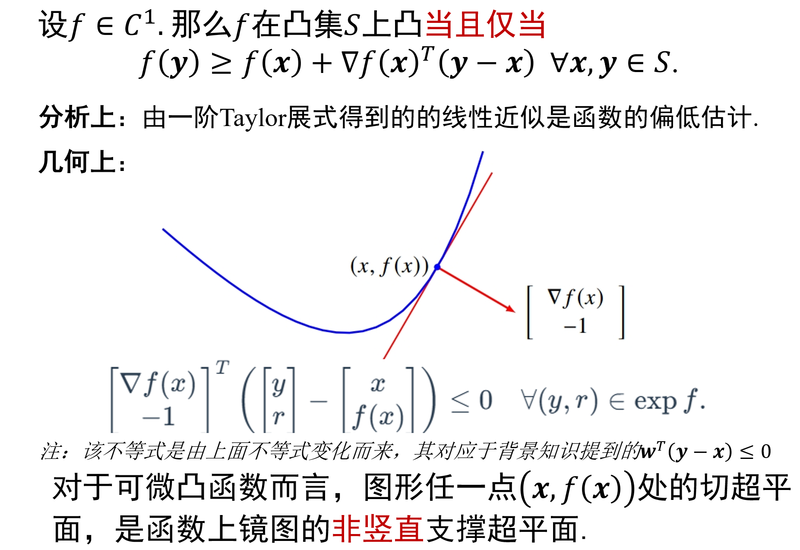

### 2. 扩展实值凸函数

*这个只是为了之后讨论方便，对原本的凸函数的定义进行一个扩展。*
*这一部分直接看定义可能很难理解，但考虑下面的例子就很好理解。*

引入“扩展实值函数”，其作用是：  
一个函数$f$本来不是凸函数，但其在某个定义域上凸，  
扩展实值函数$\tilde{f}$则将**该函数的定义域变为整个空间$\R^n$**，消除定义域的影响（不用再考虑定义域）。

* 说$\tilde{f}$是凸函数，跟说在定义域限制下的$f$是凸函数，是一回事。  
* 扩展实值函数的**上镜图**$\text{epi}\tilde{f}$，与原来函数的上镜图$\text{epi}f$，**是等价的**。  
  故如果$\text{epi}\tilde{f}$是凸集，则$f$是$S$上的凸函数。（回顾凸函数判断方法：上镜图为凸集）

> 举例：
>
> 对于$f(x)=x^3$，其本来不是凸函数，但当$S=\R_+$时是凸函数，则有定义域的限制。  
> 则定义其扩展实值函数：
> $$
> \tilde{f}(x)=\begin{cases}x^3,&x\geq0\\+\infty,&x<0\end{cases}
> $$
>
> 对于$\text{epi}\tilde{f}$，当$x<0$时，因为值是正无穷，不存在比正无穷还大的，故上镜图在这区间里没有，  
> 故说：扩展实值函数的上镜图等价于原函数的上镜图。

对扩展实值函数$f$有一个“**有效域**”的概念，  
其就是原函数$f$的定义域（原函数在哪才有效），  
记为$\text{dom}f$。  
> 对于上例，$\text{dom}\tilde{f}=\R_+$。

因此，在之后**对扩展实值函数的分析中**，  
则可以认为**函数的定义域为整个空间$\R^n$**，  
而我们**关心的区域则为其有效域**$\text{dom}f$。

*注：对于之前各种分析，都说的是“凸集$S$上的凸函数$f$”，引入扩展实值函数后，则不用再考虑凸集$S$。*

---

但在实际的应用中，扩展实值函数可以取成很多没有意义的函数（比如恒取正无穷，上镜图为空集，但空集为凸集），  
故需要给一些假设（约束），并**默认这个假设是成立的**，称为“**正常假设**”：

凸函数$f$满足$\text{dom} f\ne\emptyset$，且$f(\boldsymbol{x})>-\infty, \forall\boldsymbol{x}$。

该假设表明：凸函数的上镜图，其非空并且不包含竖直直线（即函数值不能取负无穷，否则最优化问题无解）。  
满足该假设的凸函数称为“正常凸函数”。

---

综上：扩展实值函数则为一个函数$f:\R^n\to(-\infty,+\infty]$。

### 3. 凸函数的扩展实值表示

那么对于一个有定义域$S$（为凸集）的凸函数$f(\boldsymbol{x})$，其可以表示为：

$$
\tilde{f}(\boldsymbol{x})=\begin{cases}f(\boldsymbol{x}),&\text{如果}\boldsymbol{x}\in S\\+\infty,&\text{否则}\end{cases}
$$
$\tilde{f}(\boldsymbol{x})$的定义域为$\R^n$，有效域为$\text{dom}\tilde{f}=S$。

### 4. 指示函数

*作为扩展实值凸函数的例子。*

**定义**：

对有一集合$S\in\R^n$，其指示函数为：
$$
\delta_{S}(\boldsymbol{x})=\left\{\begin{array}{ll} 0, & \text { 如果 } \boldsymbol{x} \in S \\ +\infty, & \text { 否则 } \end{array}\right.
$$

$\delta_{S}$的上镜图就是以$S$为边界的柱子，  
因此：**当且仅当$S$是凸集，$\delta_{S}(\boldsymbol{x})$是凸函数**（即如果$S$是凸集，则$\delta_{S}(\boldsymbol{x})$是一个扩展实值凸函数）。

指示函数的**有效域就是$S$**。

**作用**：

该函数可以**将有集合约束的优化问题，转换为无约束的优化问题**，  
即对于$\underset{\boldsymbol{x}\in S}{\min} f(\boldsymbol{x})$，可转换为$\underset{\boldsymbol{x}\in\R^n}{\min}f(\boldsymbol{x})+\delta_S(\boldsymbol{x})$。

## 一、次梯度、次微分

### 1. 定义

> **定义 - 次梯度**：
>
> 称向量$g$是（扩展实值）**凸函数**$f:\R^n\to(-\infty,+\infty]$在点$\boldsymbol{x}_0$处的次梯度，  
> 如果满足：
> $$
> f(\boldsymbol{y})\ge f(\boldsymbol{x}_0)+\boldsymbol{g}^T(\boldsymbol{y}-\boldsymbol{x}_0),\quad\forall\boldsymbol{y}\in\R^n
> $$
>
> ---
>
> **定义 - 次微分**：
>
> 次梯度不唯一，故称$f$在$\boldsymbol{x}_0$处的**所有次梯度组成的 集合**，为$f$在$\boldsymbol{x}_0$处的“**次微分**”，记作$\partial f(\boldsymbol{x}_0)$。

如果$\partial f(\boldsymbol{x}_0)\ne\empty$（存在次梯度），则称$f$在$\boldsymbol{x}_0$处“**次可微**”。

**几何理解**：

当$\boldsymbol{x}_0\in\text{dom}f$，则不等式右侧（仿射函数）$h(\boldsymbol{y})=f(\boldsymbol{x}_0)+\boldsymbol{g}^T(\boldsymbol{y}-\boldsymbol{x}_0)$的图形，  
是凸集$\text{epi}f$在$(\boldsymbol{x}_0,f(\boldsymbol{x}_0))$处的**非竖直支撑超平面**。  
*Tip. 非竖直可以理解为：因为函数值不能取负无穷，不存在竖直直线，故超平面肯定也非竖直的。*

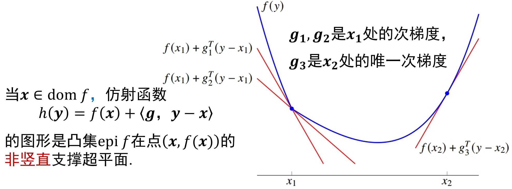
这是由两个光滑函数拼接的一个分段函数，  
对于右侧点，因为是光滑的，所以只有唯一次梯度；对于左侧点，因为是拼接点，所以有很多次梯度（两个边界范围内都算）。  
即：**非光滑点处次梯度不唯一、光滑点处次梯度唯一且就为梯度**（下面具体描述）。

🌟**关键思想 - 次梯度（数值）与法向量（几何）的相互转换**：

注意，**次梯度不能直接在函数图像上表示**（比如对于一元函数，函数图像为$\R^2$，但次梯度为一个一维值，如$0$），  
但，其在向量最后加上一个$-1$，**变成“法向量”**，再做出其**超切平面**，就可以在图像上表示了。

同理，在图上可以看出一个点的所有法向量，将其最后一个分量定为$-1$，则可以转换为所有次梯度。

比如对于一元绝对值函数$y=|x|$，在$x=0$处，其次微分为$-1\sim1$，那么这单个值的次梯度（如0）在图上是无法表示的，  
但如果变成法向量，如$0$变为$(0,-1)$，再做出其超切平面，就可以“在图上表示这个次梯度”了。

### 2. 举例

#### (1) 一元函数的绝对值函数

$$
f(x)=|x|
$$

首先求$f(x)=|x|$在$x=0$处的次梯度，  
即求满足$f(y)\ge f(0)+g(y-0)$的$y$。  
$\Rightarrow |y|\ge gy$，  
$\Rightarrow y\ge gy \And -y\ge gy$，  
$\Rightarrow y\in[-1,1]$，  
即次梯度为$\partial f(0)=[-1,1]$。

用几何来看：  
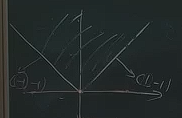  
*注意求两个临界的法向量，要让最后一个值为$-1$。*

然后整个次微分可表示为：
$$
\partial f(x)=\begin{cases}\{1\},&当x>0\\ [-1,1],&当x=0\\ \{-1\},&当x<0\\\end{cases}
$$
则次微分的图形为：  
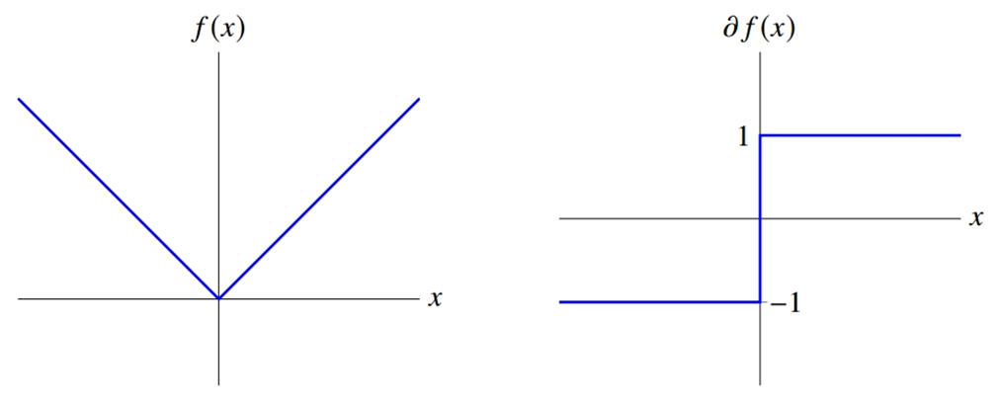  
*如果为微分的图形，那么在$x=0$处无定义。*

#### (2) 二范数函数

$$
f(\boldsymbol{x})=\|\boldsymbol{x}\|_2=\sqrt{\boldsymbol{x}_1^2+\boldsymbol{x}_2^2}
$$
*对于任意元均可，但为了方便画图这里定位二元函数。*  
其无法微分的点为$\boldsymbol{x}=\boldsymbol{0}$（开根在$x=0$处无法求导）。

跟上一个一样，求：  
$\|\boldsymbol{y}\|_2\ge\|0\|_2+\boldsymbol{g}^T(\boldsymbol{y}-0)$  
$\Rightarrow \|\boldsymbol{y}\|_2\ge\boldsymbol{g}^T\boldsymbol{y}$，由 CS 不等式，  
$\Rightarrow \|\boldsymbol{y}\|_2\ge\boldsymbol{g}^T\boldsymbol{y}\ge-\|\boldsymbol{g}\|_2\|\boldsymbol{y}\|_2$  
$\Rightarrow \|\boldsymbol{g}\|\le1$

整个次微分：
$$
\partial f(\boldsymbol{x})=\begin{cases}\quad\left\{\frac {\boldsymbol{x}}{\|\boldsymbol{x}\|_2}\right\},&\text{当}\boldsymbol{x}\neq0\\\{\boldsymbol{g}\colon\|\boldsymbol{g}\|_2\leq1\},&\text{当}\boldsymbol{\boldsymbol{x}}=\boldsymbol{0}&\end{cases}
$$  
在$0$处则为$[-1,1]$形成的正方形（对$\R^n$则为二范数单位球），在非$0$处则为对应的梯度（导数）。  
*Tip. 非$0$处的导数，以$\R^2$为例，每个分量挨个求，很好得出上式。*

#### (3) 一范数函数

其可以[利用次微分的基本运算规则求](#3-逐点上确界的次微分为所取函数的次微分的凸包)，在其中有说明，  
这里只记录结果：

令修正符号函数$\text{sign}(x_i)$为：
$$
\text{sign}(x_i)=\partial |x_i|=\begin{cases}\{1\}&x_i>0\\ [-1,1]&x_i=0\\\{-1\}&x_i<0\end{cases}
$$

则：
$$
\partial\|\boldsymbol{x}\|_1=\{\boldsymbol{g}\in\R^n:g_i=\text{sign}(x_i)\}
$$
可以直接记为$\text{sign}(\boldsymbol{x})$。

### 3. 法向量、法锥（指示函数的次微分）

*这里利用指示函数的次微分，重新说明了凸集的法向量和法锥。*

> 引入 - 求指示函数的次微分：
>
> 对于一个非空凸集$C\in\R^n$，其指示函数为：
> $$
> \delta_{C}(\boldsymbol{x})=\left\{\begin{array}{ll} 0, & \text { 如果 } \boldsymbol{x} \in C \\ +\infty, & \text { > 否则 } \end{array}\right.
> $$
> 由[上面](#4-指示函数)知：其为凸函数，且有效域就为$C$。
>
> *其实指示函数就相当于用函数来表示一个集合（图形区域），从而可以用函数的方法来分析（调用函数的分析方法，如求次梯度）。*
>
> 则求其次微分$\partial \delta_C(\boldsymbol{x})$（此时$\boldsymbol{x}$在有效域内）：  
> $\delta_C(\boldsymbol{y})\ge\delta_C(\boldsymbol{x})+\boldsymbol{g}^T(\boldsymbol{y}-\boldsymbol{x})$，因为> $\boldsymbol{y}\not\in C$时，$\delta_C(\boldsymbol{y})=+\infty$一定成立，故考虑$\boldsymbol{y}\in C$，  
> $\Rightarrow 0\ge0+\boldsymbol{g}^T(\boldsymbol{y}-\boldsymbol{x})$  
> $\Rightarrow \boldsymbol{g}^T(\boldsymbol{y}-\boldsymbol{x})\le0$  
> 代表：对于有效域内一定点$\boldsymbol{x}$，对于有效域内任意点$\boldsymbol{y}$，其连线与$\boldsymbol{g}$的点积均小于$0$。

**法向量**：

满足$\boldsymbol{g}^T(\boldsymbol{y}-\boldsymbol{x})\le0\quad\forall\boldsymbol{y}\in C$的$\boldsymbol{g}$，定义为“**$\boldsymbol{g}$为凸集$C$在$\boldsymbol{x}$处的法向量**”。  
🌟可以看到：**$\boldsymbol{0}$一定是所有点的法向量**。

分成两种情况：

* $\boldsymbol{x}$在内部中：只有$\boldsymbol{0}$这一个法向量（而不是不存在法向量！）
* $\boldsymbol{x}$在边界上：可能找到其它满足条件的非零向量$\boldsymbol{g}$，  
  其在几何上则表示为，对应的超平面可以支撑集合（不与集合图形相交）。

**法锥**：

因为边界上某些点，法向量（满足条件的$\boldsymbol{g}$）不止一个（光滑边界则一定只有一个非零法向量和$\boldsymbol{0}$法向量），  
故称：凸集$C$在$\boldsymbol{x}$的**全体法向量，为$C$在$\boldsymbol{x}$的法锥**，记作$N_C(\boldsymbol{x})$。  
*称为锥的原因，就是因为几何上是个锥形。*

注意：**法锥一定至少含有一个元素，即$\boldsymbol{0}$向量**。

对于指示函数的次微分：  
$\partial \delta_C(\boldsymbol{x})=N_C(\boldsymbol{x})$，指示函数某点处的次微分就是该点处的法锥。

### 4. 性质

#### (1) 次梯度和可微的关系

> **性质 - 次梯度和可微的关系**：
>
> 对于凸函数$f$，$\boldsymbol{x}_0\in\text{dom}f$，  
> 如果$f$在$\boldsymbol{x}_0$处**可微**，则次梯度$\partial f(\boldsymbol{x}_0)=\{\nabla f(\boldsymbol{x}_0)\}$;  
> 反之，如果说$f$在$\boldsymbol{x}_0$处**次梯度唯一**，则$f$在$\boldsymbol{x}$处可微。

即上面说的：不可微（非光滑点）处次梯度不唯一、可微（光滑点处）次梯度唯一且就为梯度。

#### (2) 微分性质的推广（次微分是闭凸集、次微分的存在性、次微分定义方向导数）

*这里虽然看起来比较复杂，但重点只要理解从微分的方向导数推广到次微分的方向导数即可。*

如果$f$是凸函数：

* $\forall\boldsymbol{x}$，$\partial f(\boldsymbol{x})$是闭凸集  
  闭集代表：边界也为次梯度（如$|x|$在$0$处、$-1,1$也为次梯度）；  
  凸集代表：边界的“加权平均”即**边界凸包也为次梯度**（如$|x|$在$0$处、$-1,1$之间的也为次梯度）。
* 根据$\boldsymbol{x}$与有效域$\text{dom}f$的关系
  * 如果$\boldsymbol{x}\not\in\text{dom}f$，则$\partial f(x)=\empty$  
    即**不在有效域的**$\boldsymbol{x}$，**次梯度不存在**。
  * 如果$\boldsymbol{x}\in\text{ri}(\text{dom}f)$，则$\partial f(x)\ne\empty$  
    首先要在相对内部里（不能在边界上），才能有空间定义改变方向；  
    然后这条性质保证了只要有改变方向，就一定有次微分（故也有该方向对应的方向导数，见下），也保证了一定可用次梯度法。
  * 如果$\boldsymbol{x}\in\text{int}(\text{dom}f)$，则$\partial f(x)$为非空有界闭凸集
* **方向导数**
  * 🌟如果$\boldsymbol{x}\in\text{ri}(\text{dom}f)$（即$\partial f(x)$非空），  
    则$f$在此处沿某一方向$\boldsymbol{d}$的**方向导数存在**，其为一个**集合**（**而非一个值**），为**方向与所有次梯度（次微分各元素）的内积**。  

    *就是原本方向导数的推广：原本方向导数就是“**方向与梯度的内积**”，但当梯度不存在时，则用次梯度。*  

    定义记$f'(\boldsymbol{x};\boldsymbol{d})$）表示方向导数中的最大值：
    $$
    f'(\boldsymbol{x};\boldsymbol{d})=\underset{\boldsymbol{g}\in\partial f(\boldsymbol{x})}{\max} \boldsymbol{d}^T\boldsymbol{g}
    $$  
    **所有方向中方向导数$f'(\boldsymbol{x};\boldsymbol{d})$最大的**（$\max$的$\max$），就是**函数上升最快的**。  
    反过来，要找下降最快的，就要找所有方向中方向导数最小的。
  * 如果$\boldsymbol{x}\in\text{int}(\text{dom}f)$，则方向导数有界。

对于$\boldsymbol{x}$在相对边界上的情况，则可能存在次梯度，也可能不存在。

> 举例 1.1 - 相对边界上不存在次梯度：
>
> 对于凸函数$f(x)=\begin{cases}1,&\text{当}x=0\\0,&\text{当}x>0&\end{cases}$，  
> 在相对边界$x=0$处，找不到一个不垂直的直线撑起整个函数，  
> 故其次梯度不存在，即$\partial f(x)=\begin{cases}\{0\},&\text{当}x>0\\\emptyset,&\text{当}x\leq0\end{cases}$
>
> ---
>
> 举例 1.2 - 相对边界上不存在次梯度：
>
> 对于凸函数$f(x)=-\sqrt{x}\quad(x\ge0)$（注：上面都是对于拓展实值凸函数成立的性质，但对于普通的有定义域约束的函数也成立），  
> 在相对边界$x=0$处，其导数无限趋向于$-\infty$，故也只有竖直直线才能支撑整个函数图形，故仍不存在。  
> 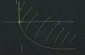
>
> ---
>
> 举例 2 -相对边界存在次梯度：
>
> 存在其实很好举例，直接让一个光滑函数限制一个有效域就行，如$f(x)=x\quad(x>0)$。

#### (3) 次梯度对应的超平面支撑下水平集

*Tip. 下水平集$\Gamma_c=\{\boldsymbol{x}\in S:f(\boldsymbol{x})\le c\}$，就是函数值小于常数$c$的$\boldsymbol{x}$取值集合。*

对于一定点$\boldsymbol{x}$，其函数值为$f(\boldsymbol{x})$，  
其对应的下水平集$\Gamma_{f(\boldsymbol{x})}$就是小于该点函数值的所有点集合，即$\Gamma_{f(\boldsymbol{x})}=\{\boldsymbol{y}:f(\boldsymbol{y})\le f(\boldsymbol{x})\}$。

存在性质：点$\boldsymbol{x}$的次梯度$\boldsymbol{g}$，其超平面，也支撑该点处的下水平集。  
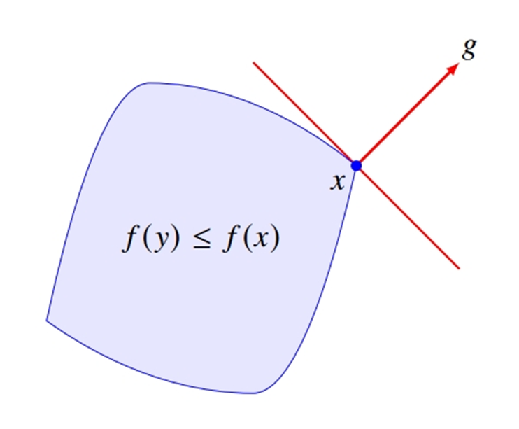

> 证明：
>
> 因为下水平集表示为$f(\boldsymbol{y})\le f(\boldsymbol{x})$（注意是关于$\boldsymbol{y}$的集合），  
> 又$\because f(\boldsymbol{x})+\boldsymbol{g}^T(\boldsymbol{y}-\boldsymbol{x})\le f(\boldsymbol{y})$，  
> 代入化简，得$\boldsymbol{g}^T(\boldsymbol{y}-\boldsymbol{x})\le0$。  
> 这就是支撑的定义（定点$\boldsymbol{x}$，$\boldsymbol{y}$是下水平集中的任意一点，$\boldsymbol{x}\to\boldsymbol{y}$的线段与$\boldsymbol{g}$内积均小于$0$）,  
> 支撑的超平面为$\boldsymbol{g}^T\boldsymbol{y}-\boldsymbol{g}^T\boldsymbol{x}=0$（$\boldsymbol{g}^T$看作$\boldsymbol{w}^T$，$\boldsymbol{y}$看作$\boldsymbol{x}$，$-\boldsymbol{g}^T\boldsymbol{x}$看作$\boldsymbol{b}$）。

### 5. 次微分的基本运算规则

以下都是针对$f$是（扩展实值）凸函数而言的：

#### (1) 正数可缩放（可提正常数）

**对于$\lambda>0$**，$\partial (\lambda f)=\lambda\partial f$。

*类比于$(cf)'=cf'$，但区别是要求$\lambda>0$，因为次梯度是按照不等式定义出来的，乘小于0会改变方向*。

#### (2) 和的次微分等于（包含）次微分的和

* 对于$f_1,f_2$，其和$f=f_1+f_2$的次微分，包含次微分的和，即$\partial f\supseteq \partial f_1+\partial f_2$（意思是$f$某点的次微分可能有更多的次梯度），  
* 🌟如果$\text{ri}(\text{dom} f_1)$与$\text{ri}(\text{dom} f_2)$有交集（两者相对内部有交集），  
  （如果$f_1$是[多面体函数](../Ep.0%20基础知识/0.md#1-多面体函数)，则可简化成$\text{dom}f_1$与$\text{ri}(\text{dom} f_2)$有交集）  
  则上式取等，
   $$
   \partial f = \partial f_1+\partial f_2
   $$
   *类比于$(f+g)'=f'+g'$。*

通常实际运用的时候**都直接用下面这个**（因为通常$\text{dom}f=\R^n$），*但也存在上面的有更多次梯度的情况，了解即可*。  
*可以这么理解上面的情况：如果$f_1$的有效域与$f_2$的有效域没有交集，则$f$全都是$+\infty$，完全无法分析了。*

#### (3) 🌟逐点上确界的次微分，为所取函数的次微分的凸包

对于逐点上确界函数$f=\max f_i$（该函数非常有用，**分段函数基本上都可以表示为这个**，如$|x|$、ReLU等），  
其有效域为各函数的交集$\cap\text{dom}f_i$，取一点$\boldsymbol{x}$，则：

* $\partial f\supseteq\text{conv}\{\cup_{i\in I(\boldsymbol{x})}\partial f_i\}$  
  其中$I(\boldsymbol{x})=\{i:f_i(\boldsymbol{x})=f(\boldsymbol{x})\}$称为$\boldsymbol{x}$处的**积极函数**（即：在$\boldsymbol{x}$处$f$选用了哪些函数$f_i$）  
  （*如ReLU，在$0$处则为$f=0,f=x$两个，在大于0处则为$f=x$*一个）  
  **理解**：在$\boldsymbol{x}$处的次微分，包含该点处所选择的函数$f_i$的所有次微分的凸包。
* 如果所有的$f_i$，在$\boldsymbol{x}$处连续，则：$\partial f = \text{conv}\{\cup_{i\in I(\boldsymbol{x})}\partial f_i\}$
* 🌟如果所有的$f_i$，在$\boldsymbol{x}$处可微。则：
  $$
  \partial f = \text{conv}\{\nabla f_i:i\in I(\boldsymbol{x})\}
  $$  
  **通常实际运用也是用这个。**  
  > 举例 - ReLU($f(x)=\max\{0,x\}$)：
  >
  > 则$f_1=0, f_2=x$，$f'_1=0, f'_2=1$。  
  > 对于$x<0$，$I(x)=\{1\}$，只有第一个函数被选用，故$\partial f=0$；对于$x>0$，$I(x)=\{2\}$，故$\partial f=1$；  
  > 对于$x=0, I(x)=\{1,2\}$，故$\partial f$为$\text{conv}\{0,1\}$，即$[0,1]$。

---

> 例子 - 利用基本运算规则求次梯度：
>
> 对于$f(\boldsymbol{x})=\|\boldsymbol{x}\|_1$，具体以$\R^2$为例（对于$\R^n$均适用）。  
> $f$可表示为：$f(\boldsymbol{x})=|x_1|+|x_2|=\max(-x_1,x_1)+\max(-x_2,x_2)=\max(x_1+x_2,x_1-x_2,-x_1+x_2,-x_1-x_2)$，分别记为$f_{1\sim4}$。
>
> * 对于点$\boldsymbol{x}_1=(1,0)$，则其积极函数$I(\boldsymbol{x}_1)=\{1,2\}$，  
>   故$\partial f(\boldsymbol{x}_1)=\text{conv}\{(1,1),(1,-1)\}=\{1\}\times[-1,1]$，为线段。
> * 对于点$\boldsymbol{x}_2=(0,0)$，则其积极函数值为$\{1,2,3,4\}$，  
>   故$\partial f(\boldsymbol{x}_2)=\text{conv}\{(1,1),(1,-1),(-1,1),(-1,-1)\}=[-1,1]\times[-1,1]$，为平面。
>
> 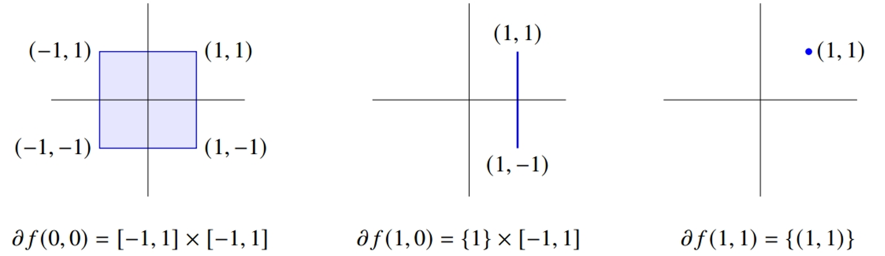  
> 其中对于$\R^n$，$(0,0)$处的次微分为“无穷范数下的一个单位正方体”。
>
> 对于$n$元，则是$n$个这样一元绝对值函数的次微分的笛卡尔积。
>
> 记某分量的绝对值函数的次微分结果为“修正符号函数$\text{sign}(x_i)$”：
> $$
> \text{sign}(x_i)=\partial |x_i|=\begin{cases}\{1\}&x_i>0\\ [-1,1]&x_i=0\\\{-1\}&x_i<0\end{cases}
> $$
>
> 则$\partial\|\boldsymbol{x}\|_1=\{\boldsymbol{g}\in\R^n:g_i=\text{sign}(x_i)\}$，  
> 或者说次微分是每个分量的修正符号函数的笛卡尔积。

## 二、不可微凸优化的最优性条件

*回顾 - [可微函数（不一定凸）的（无约束/为内点）局部最优解的一阶必要条件](../Ep.3%20无约束优化%20-%20最优解和算法的基本性质/3.md#12-极小点为内点或无约束优化)。*  
现在对于**不可微**函数，拓展这个一阶必要条件。

在这里我们研究凸函数，即凸优化问题，则**局部最优解就是全局最优解**，  
故为：**不可微凸优化的（全局）最优性条件**。

对于（扩展实值）凸函数
$$
f:\R^n\to(-\infty,+\infty]
$$
存在以下性质：

### 1. 无约束问题 极小点充要条件

> **定义 - （无约束）极小点充要条件**：
>
> $\boldsymbol{x}_*$是$f$的（全局）极小点，**当且仅当**$\boldsymbol{0}\in\partial f(\boldsymbol{x}_*)$。

即：次微分中有$\boldsymbol{0}$$\Leftrightarrow$是全局极小点。  

非常好证：因为$\boldsymbol{0}\in\partial \Leftrightarrow f(\boldsymbol{x})\ge f(\boldsymbol{x}_*)+0^T(\boldsymbol{x}-\boldsymbol{x}_*)$。

其几何直观理解如下：  
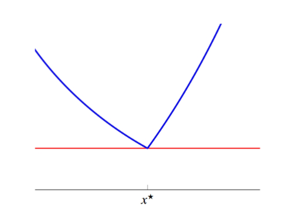

### *2. 有约束问题 极小点充分条件

*这个可以略过，因为通常直接**就是充要条件**，可见下 3。*

> **定义 - （有约束）极小点充分条件**：
>
> 一个非空凸集$C\in\R^n$（作为$f$的有效域），  
> 对于点$\boldsymbol{x}_*$是$f$在$C$上（即有约束极小化问题）的极小点的充分条件为：
>
> $$
> \exist \boldsymbol{u}\in\partial f(\boldsymbol{x}_*) \Rightarrow -\boldsymbol{u}\in N_C(\boldsymbol{x}_*)
> $$

即：存在一个次梯度，其反方向在该点的法锥里。

> 说明 - 当$\boldsymbol{x}_*$属于内部的点时：
>
> 对于$C$**内部的点**，其法锥就只有$\boldsymbol{0}$向量，  
> 故**条件变为**：$\boldsymbol{0}\in\partial f(\boldsymbol{x}_*)$，跟 1 中的条件相同。  
> 或者说：如果$\boldsymbol{0}\in\partial f(\boldsymbol{x}_*)$，则一定是全局极小点。
>
> 所以该条件主要指针对“边界上的点”而言的（因为有约束了，边界上的点可能是极小值，需要定义这样的条件，以同时包括内部的条件和边界的条件）。

证明也容易：

> 证明：
>
> 1. 首先通过指示函数，将这个有约束优化问题转换为无约束优化问题  
>    $\underset{\boldsymbol{x}\in C}{\min}f(\boldsymbol{x})\Leftrightarrow \underset{\boldsymbol{x}\in\R^n}{\min} f(\boldsymbol{x})+\delta_C(\boldsymbol{x})$  
>    则$\boldsymbol{x}_*$是$f$在$C$上的极小点 $\Leftrightarrow$ $\boldsymbol{x}_*$是$f+\delta_C$在$\R^n$上的极小点。
> 2. 对于无约束，存在充要条件，即：$(1) \Leftrightarrow\boldsymbol{0}\in\partial(f+\delta_C)(\boldsymbol{x}_*)$
> 3. 要证的是“$\exist \boldsymbol{u}\in\partial f(\boldsymbol{x}_*)$，使得$-\boldsymbol{u}\in N_C(\boldsymbol{x}_*)$成立”是充分条件（可以证(1)），  
>    因为$a\in A, b\in B\Rightarrow a+b\in A+B$，  
>    则$\boldsymbol{0}\in\partial f(\boldsymbol{x}_*)+N_C(\boldsymbol{x}_*)$，  
> 4. 因为法锥有性质：$N_C(\boldsymbol{x}_*)=\partial\delta_C(\boldsymbol{x}_*)$，  
>    并且“和的次微分包含次微分的和”，即$\partial(f+\delta_C)\supseteq \partial f+\partial \delta_C$，  
>    故可得：$\boldsymbol{0}\in\partial f(\boldsymbol{x}_*)+\partial\delta_C(\boldsymbol{x}_*)\subseteq\partial(f+\delta_C)(\boldsymbol{x}_*)$，可以证(1)。

### 3. 有约束问题 极小点充要条件

> **定义 - （有约束）极小点充要条件**：
>
> 对于条件 2，如过还额外满足：  
> $\text{ri}(\text{dom} f)$与$\text{ri} C$有交点（如果$C$是多面体，则简化为$\text{ri}(\text{dom} f)$与$C$有交点），  
> 则条件 2 为充要条件。

这个就相当于在“[和的次微分等于次微分的和](#2-和的次微分等于次微分的和)”里一样，当有交点时变为等式，故这里变为充要条件。  

实际情况下该额外条件通常满足（比如$f$的有效域为$\R^n$，则除非$C$为空，否则一定有交点），  
故**通常情况下直接为充要条件**，*但仍要知道不满足的情况存在，比如超复杂的分析中。*

## 三、具体应用

*这是对次微分的一个具体的应用，如对于 LASSO 问题，给出其最优性条件；对于软阈值算子，求出其闭式解。*

### 1. LASSO 的最优性条件

> 说明 - LASSO 问题：
>
> LASSO 问题，也称为“$\ell_1-$正则化的最小二乘”/“压缩感知问题”，定义如下：
>
> $$
> \underset{\boldsymbol{x}\in\R^n}{\argmin} f(\boldsymbol{x})=\frac{1}{2}\|\boldsymbol{b}-A\boldsymbol{x}\|^2_2+\tau\|\boldsymbol{x}\|_1
> $$
> 其中：$A\in\R^{m\times n}$，$\boldsymbol{b}\in\R^m$，$\tau>0$代表正则化参数。
>
> ---
>
> 理解：
>
> 其前面一项则是标准的最小二乘，而该问题要求最小二乘的解$\boldsymbol{x}_*$中有尽可能多的$0$分量（称为“稀疏解”），因此加上$\tau\|\boldsymbol{x}\|_1$，  
> 最后一项为各分量的绝对值之和，因此要极小化该问题，就要让各分量的绝对值尽量小，即很多分量为0，因此该部分称为“惩罚函数”。
>
> 求稀疏解的作用是：有时候有些数据可能有很多特征，但有可能只有很少的特征有用，故通过稀疏解可以忽略作用很小的分量。

对于上式的$f$，其肯定为一个凸函数，但因$\|\boldsymbol{x}\|_1$导致不可微，故为“不可微的凸优化问题”。

对$f$求次微分，则和的次微分为次微分的和：
$$
\boldsymbol{0}\in \partial f(\boldsymbol{x}_*)=\frac{1}{2}\partial(\|\boldsymbol{b}-A\boldsymbol{x}_*\|^2_2)+\tau\partial \|\boldsymbol{x}_*\|_1
$$

* 对于$\partial(\|\boldsymbol{b}-A\boldsymbol{x}\|^2_2)$：  
  因为其可微，就是对应的微分（梯度/导数），  
  即为：$-A^T(\boldsymbol{b}-A\boldsymbol{x}_*)$，  
* 对于$\partial \|\boldsymbol{x}_*\|_1$：  
  [上面求过](#3-一范数函数)，为$\text{sign}(\boldsymbol{x})$。

故，**极小点的充要条件为**：
$$
\boldsymbol{0}\in-A^T(\boldsymbol{b}-A\boldsymbol{x}_*)+\tau\text{sign}(\boldsymbol{x}_*)
$$

再令$A=[\boldsymbol{a}_1,\cdots,\boldsymbol{a}_n]$，则代入可得，对于每一个分量$\boldsymbol{x}^*_i$存在条件：

$$
\begin{cases}\boldsymbol{a}_i^T(\boldsymbol{b}-{A}\boldsymbol{x}^*)=\tau&&\text{当}x_i^*>0\\ |\boldsymbol{a}_i^T(\boldsymbol{b}-{A}\boldsymbol{x}^*)|\le\tau&&\text{当}x_i^*=0\\\boldsymbol{a}_i^T(\boldsymbol{b}-{A}\boldsymbol{x}^*)=-\tau&&\text{当}x_i^*<0\end{cases}
$$

> 说明 - 上面条件由来：
>
> 当将$A$写作向量形式时，再移项，得：  
> $\begin{bmatrix} \boldsymbol{a}_1^T(\boldsymbol{b}-A\boldsymbol{x}_*) \\ \cdots \\ \boldsymbol{a}_n^T(\boldsymbol{b}-A\boldsymbol{x}_*) \end{bmatrix} \in \{\tau\boldsymbol{g}\in\R^n:g_i=\text{sign}(x^*_i)\}$  
> 因此则为左侧第$i$项属于右侧第$i$项。  
> 再分情况代入即可（当$\boldsymbol{x}^*_i\ne0$，集合中只有一个数，故属于变等于）。

解释为：  
如果残量（即最终拟合出的$(\boldsymbol{b}-{A}\boldsymbol{x}^*)$）与$\boldsymbol{a}_i$的相关系数、相关性（即点积）等于$\tau$，才会出现在$\boldsymbol{x}_*$中且为正值（$=-\tau$同理）；  
如不等于$\pm\tau$，则不出现。

### 2. 软阈值算子

> 问题定义：
>
> 考虑这样的优化问题：
>
> $$
> \argmin_{\boldsymbol{x} \in \mathbb{R}^{n}} f(\boldsymbol{x})=\frac{1}{2}\|\boldsymbol{y}-\boldsymbol{x}\|_{2}^{2}+\rho\|\boldsymbol{x}\|_{1}
> $$
>
> 其中：$\boldsymbol{y}\in\R^n$**是已知向量**，$\rho>0$是参数。
>
> 该问题也可以具体表示为：$\sum[\frac{1}{2}(y_i-x_i)^2+\rho|x|]$。

相当于是 LASSO 问题更宽泛的一种形式（$A$为单位阵，$\boldsymbol{b}$取为已知向量$\boldsymbol{y}$）。  

> 求解思路：
>
> 那么根据 LASSO 问题可知，最优性条件为：
> $$
> \boldsymbol{0}\in-(\boldsymbol{y}-\boldsymbol{x}_*)+\rho\text{sign}(\boldsymbol{x}_*)
> $$
>
> 按照上面一样的思路，$\Rightarrow \boldsymbol{y}-\boldsymbol{x}_*\in\{\boldsymbol{g}\in\R^n:g_i=\text{sign}(x^*_i)\}$，  
> 故对于第$i$个分量：$y_i-x^*_i\in\rho\text{sign}(x^*_i)$，分情况讨论得：  
> $$
> \begin{cases}x^*_i=y_i-\rho&&\text{当}x_i^*>0\\ y_i\in[-\rho,\rho]&&\text{当}x_i^*=0\\x^*_i=y_i+\rho&&\text{当}> x_i^*<0\end{cases}
> $$
> 而对于条件如$x_i^*>0$，此时等价于$y_i=x^*_i+\rho>\rho$；小于同理。

在这里定义一个“软阈值算子”：
$$
S_\rho(y_i)=\begin{cases}y_i-\rho&当y_i>\rho\\0&当|y_i|\le\rho\\y_i+\rho&当y_i<-\rho\end{cases}
$$
其函数图形为：  
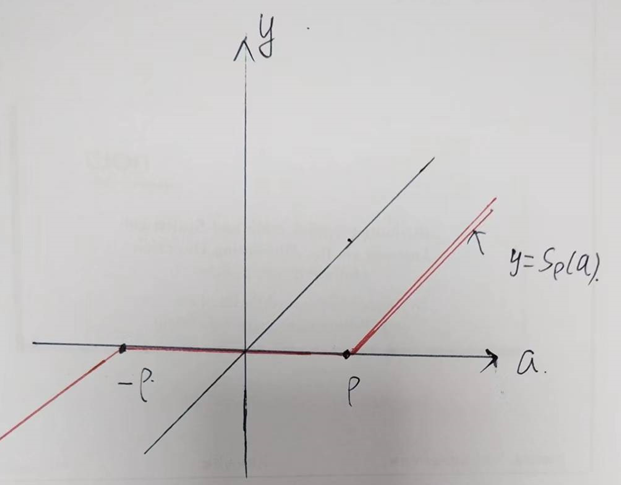

> 拓展 - 硬阈值算子：
>
> 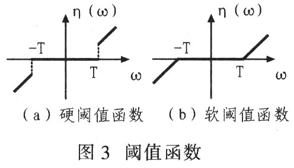

则最终$\boldsymbol{x}_*$的**闭式解可以表示为**：
$$
\boldsymbol{x}_*=S_\rho(\boldsymbol{y})
$$
代表将软阈值算子逐分量作用于已知向量$\boldsymbol{y}$，得到$\boldsymbol{x}_*$的分量。

> 举例 - 对于一元函数：
>
> $f(x)=\frac{1}{2}(x-a)^2+\rho|x|$  
> [可见示意图](https://www.geogebra.org/calculator/akgdg5qy)。
