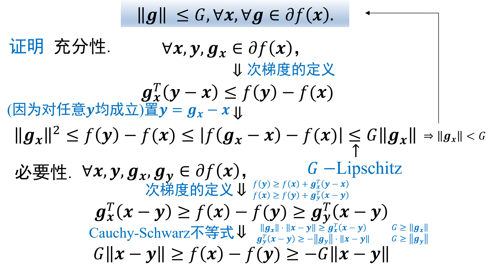
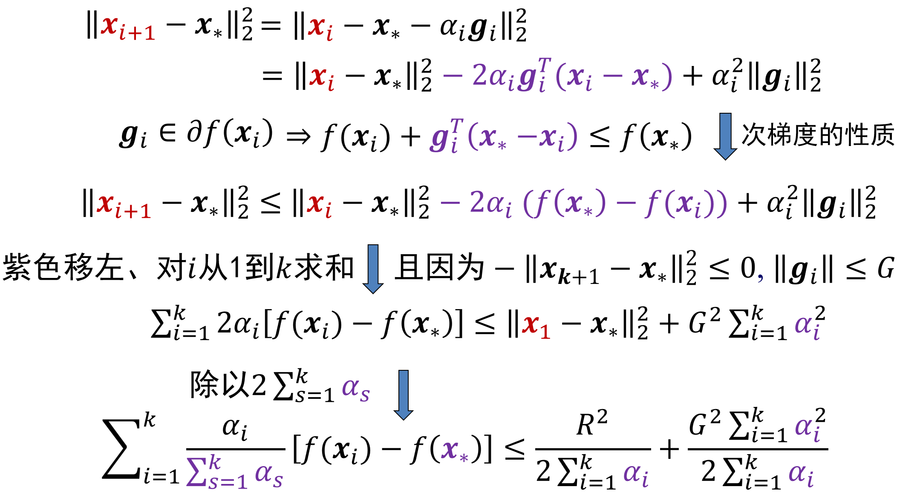
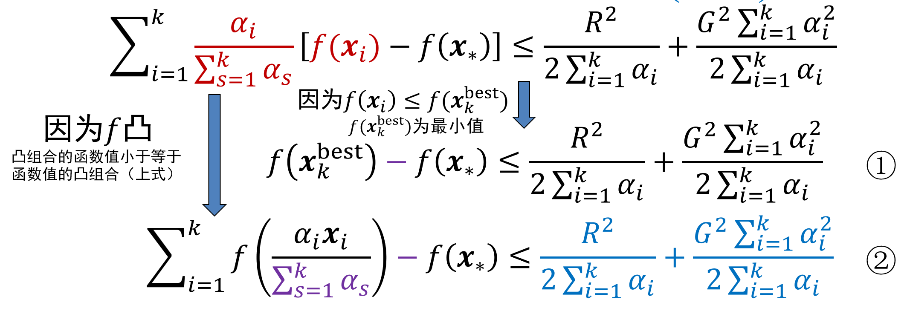
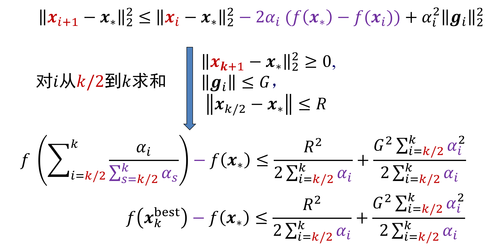
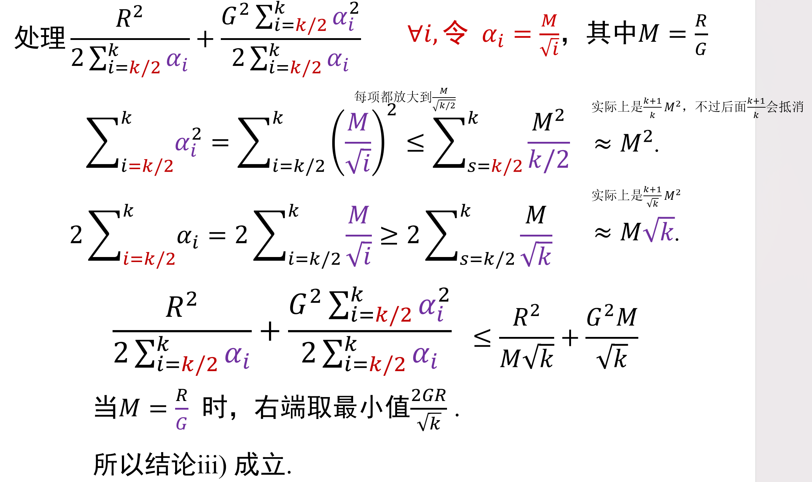
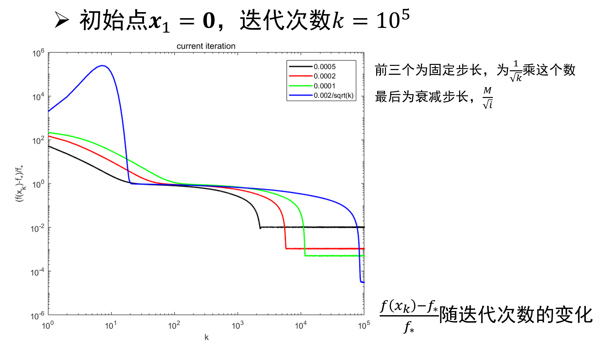
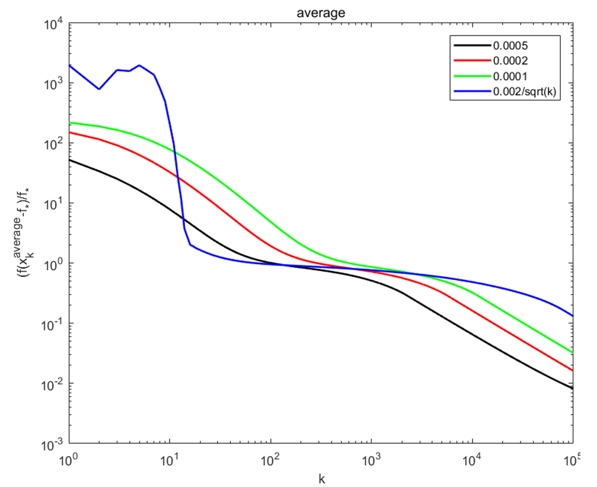
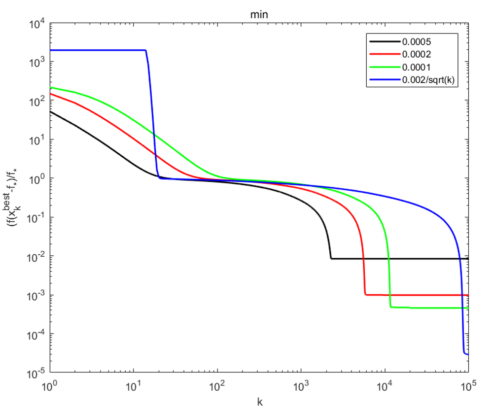

# Ep.7.2 次梯度法(SG)

**总结**：

* 适用：无约束、凸优化
* 迭代公式定义：$\boldsymbol{x}_{k+1}=\boldsymbol{x}_k-\alpha_k\boldsymbol{g}_k$  
  其中：$f$是凸函数但不可微，$\boldsymbol{g}_k$是$\boldsymbol{x}_k$处的一个次梯度，即$\boldsymbol{g}_k\in\partial f(\boldsymbol{x}_k)$。
* 一些性质总结
  * SG 与 GD 不同：负次梯度方向**不一定是下降方向**（可能不变甚至上升）
  * 不可微$f$的$G-$Lipschitz连续性：$\|\boldsymbol{g}\|\leq G\quad\forall x,\forall \boldsymbol{g}\in\partial f(x)$  
    对于任意点，其次微分的**绝对值**有上界$G$。
* 步长选择  
  如果总迭代次数定为$k$。
  * 固定步长：$\alpha\sim\frac{1}{\sqrt{k}}$，  
    如果$f$是$G-$Lipschitz连续的，初始点与极小点的距离上界为$R$（$\|\boldsymbol{x}_1-\boldsymbol{x}_*\|\le R$），  
    则一般取为$\frac{R}{G\sqrt{k}}$。
  * **衰减步长**：*满足两个条件*，但一般只考虑取两种典型值：
    * $\alpha_i=\frac{M}{i}$
    * 🌟$\alpha_i=\frac{M}{\sqrt{i}}$  
      如果$f$是$G-$Lipschitz连续的，$k$为偶数，中间的迭代点与极小点的距离上界为$R$（$\|\boldsymbol{x}_{k/2}-\boldsymbol{x}_*\|\le R$），  
      则一般取为$\frac{R}{G\sqrt{i}}$。
  * *固定增量步长*（不怎么用）：$\alpha_k\|\boldsymbol{g}_k\|_2=\|\boldsymbol{x}_{k+1}-\boldsymbol{x}_k\|=s$  
    让每次迭代的函数值改变量（增量），是一个固定的大小$s$，从而推算出相应的$\alpha_k$  
* 方法输出方式
  * 当前最好点：$\boldsymbol{x}_k^{best}$
  * 迭代点加权平均：$\sum_{i=k_0}^{k}\frac{\alpha_i}{\sum_{s=k_0}^k\alpha_s}\boldsymbol{x}_i$
  * 当前迭代点:$\boldsymbol{x}_k$（这个无法进行复杂度理论分析，但实际运用效果也可以）
* 复杂度  
  要求：$f$是$G-$Lipschitz连续的。
  * 固定步长：$\alpha=\frac{R}{G\sqrt{k}}$，其中$R$为初始点与极小点的距离上界  
    前两种输出均满足：$f(\boldsymbol{x}_k^{best})-f(\boldsymbol{x}_*)\le\frac{GR}{\sqrt{k}}$（$\boldsymbol{x}_k^{best}$可换成$\bar{\boldsymbol{x}}$）
  * *衰减步长*（没用，看后面一个）：步长满足衰减步长要求  
    $\lim_{k\to+\infty}f(\boldsymbol{x}_k^{best})=\lim_{k\to+\infty}f(\bar{\boldsymbol{x}})=f(\boldsymbol{x}_*)$  
    前两种输出的函数值均趋近于最优值
  * 经典的衰减步长：$\alpha_i=\frac{R}{G\sqrt{i}}$，其中$k$为偶数，$R$为**中间的迭代点**与极小点的距离上界（见上步长选择）  
    满足：$f(\boldsymbol{x}_k^{best})-f(\boldsymbol{x}_*)\le\frac{2GR}{\sqrt{k}}$（$\boldsymbol{x}_k^{best}$可换成$\tilde{\boldsymbol{x}}$，代表后一半的加权平均）

## 一、方法定义

> 问题定义：
>
> $$
> \min_{x\in\R^n} f(x)
> $$
>
> 其中：$f$是凸函数，但**不可微**（可能部分可微，但一定存在不可微点）。

次梯度法的迭代公式：

$$
\boldsymbol{x}_{k+1}=\boldsymbol{x}_k-\alpha_k\boldsymbol{g}_k
$$

其中：$\boldsymbol{g}_k$是$\boldsymbol{x}_k$处的一个次梯度，即$\boldsymbol{g}_k\in\partial f(\boldsymbol{x}_k)$。

*就是 GD，只不过无法求梯度，故用一个次梯度。*

**与 GD 有个最大不同是**：

* GD 中：负梯度方向，一定是下降方向（沿负梯度走一点函数值减小），并且是当前点下降最快的方向
* SG 中：负次梯度方向，**不一定是下降方向**，可能函数值不变、**甚至可能是上升方向**  
  > 举例 - 负次梯度方向并不是下降方向：
  >
  > $f(\boldsymbol{x})=|x_1|+2|x_2|$  
  > 
  >
  > 在$\boldsymbol{x}_1=(1,0)$处，$\partial f(\boldsymbol{x}_1)=\{(1,a):a\in[-2,2]\}$：
  >
  > * 对于$\boldsymbol{g}=(1,2)$，其相反方向不是下降方向（指向外部，函数值上升）
  > * 对于$\boldsymbol{g}=(1,0.5)$，其相反方向不是下降方向（沿着等高线走、函数值不变）
  > * 对于$\boldsymbol{g}=(1,0)$，其相反方向是下降方向（并且还是最速下降方向，因为其二范数最小）

## 二、步长规则

有以下三种确定步长的规则。

### 1. 固定步长

如果准备进行$k$次迭代（$k$是一个定值），其所有的步长$\alpha$为一个固定值：

$$
\alpha \sim \frac{1}{\sqrt{k}}
$$
是指$\alpha$是与$\frac{1}{\sqrt{k}}$是同阶的一个量。  
即如果准备迭代很多步，则步长应该更小。

存在问题（[见下复杂度分析](#3-经典的衰减步长)）：为了让误差很小，$k$要很大，步长很小且固定，导致初始迭代时很缓慢，效果不好。

### 🌟2. 衰减步长

对于第$k$次迭代，其步长$\alpha_k$要满足以下两个条件：

1. $$
   \frac{\sum_{k=1}^\infty\alpha_k^2}{\sum_{k=1}^\infty\alpha_k}\to0
   $$
   即步长本身是趋于$0$的，并且“平方和”比上“求和”要趋于0。
2. $$
   \sum_{k=1}^\infty\alpha_k\to\infty
   $$
   但是整个求和是趋于无穷的。

**这个步长是很好的一个选择**。

🌟**一些典型的衰减步长**：

* $\alpha_i=\frac{M}{i}$
* $\alpha_i=\frac{M}{\sqrt{i}}$

其中：$M$为一个正数。

### 3. 固定增量步长

对于第$k$次迭代，其步长$\alpha_k$要使得：

$$
\alpha_k\|\boldsymbol{g}_k\|_2=\|\boldsymbol{x}_{k+1}-\boldsymbol{x}_k\|=s
$$

即让每次迭代的函数值改变量（增量），是一个固定的大小$s$，从而推算出相应的$\alpha_k$。

## 三、方法输出

迭代方法最终都要输出一个点$\boldsymbol{x}$。  
次梯度法不像之前的方法，直接输出当前迭代点$\boldsymbol{x}_k$的话，无法进行复杂度分析，  
只能对以下两种额外的输出方法，进行理论分析。

### 1. 当前最好点

$$
\boldsymbol{x}_k^{best}=\argmin_{\boldsymbol{x}\in\{\boldsymbol{x}_1,\cdots,\boldsymbol{x}_k\}} f(\boldsymbol{x})
$$

### 2. 迭代点加权平均

也是各迭代点（所有迭代点、或者后一半迭代点）的凸组合，其凸组合系数**取决于步长**，如下：
  
$$
\bar{\boldsymbol{x}}=\sum_{i=k_0}^{k}\frac{\alpha_i}{\sum_{s=k_0}^k\alpha_s}\boldsymbol{x}_i
$$

其中：$k_0$通常取1或$k/2$。

> 特例：如果当$k_0=1$，$\alpha_i=\alpha$（所有步长都一样），则为$\bar{\boldsymbol{x}}=\frac1k\sum_{i=1}^k\boldsymbol{x}_i$

### *3. 当前迭代点

虽然直接输出当前迭代点$\boldsymbol{x}_k$，无法进行复杂度的理论分析，  
但实际使用表明，直接输出当前迭代点效果也很好（具体见后面的[算法实例](#五算法实例---lasso-问题)）。

## 四、复杂性分析

### 0. 预备知识 - 凸 Lipschitz 函数的等价刻画

*回顾之前[函数$f$是$L-$Lipschitz 连续的判断方法](../Ep.4%20梯度下降法(GD)/4.md#1-针对函数的判定方法)：看其导数是否有一个上界。*

对于凸函数$f:\R^n\to(-\infty,+\infty]$：  
$f$是$G-$Lipschitz的（即对$\forall\boldsymbol{x},\boldsymbol{y},|f(\boldsymbol{x})-f(\boldsymbol{y})|\le G\|\boldsymbol{x}-\boldsymbol{y}\|$）的充要条件是：
$$
\|\boldsymbol{g}\|\leq G\quad\forall x,\forall \boldsymbol{g}\in\partial f(x)
$$  
即对于任意点，其**次微分（所有次梯度）的绝对值有上界$G$**（注意是**绝对值有上界**，而导数判断是**本身有上界**）。

> 证明：
>
> 

### 1. 次梯度法的复杂性

*对于$G-$Lipschitz凸函数，对上面三种步长、两种输出分析复杂性。*

$f:\R^n\to\R$，其为 $G-$Lipschitz 的凸函数，极小点$\boldsymbol{x}_*$，  
则对于 SG 产生的序列（复杂性）：

#### (1) 固定步长

**前提**：

* 初始点与极小点的距离上界为$R$：$\|\boldsymbol{x}_1-\boldsymbol{x}_*\|\le R$
* 步长为固定步长：已知总迭代次数$k$，$\alpha=\frac{R}{G\sqrt{k}}$

**则**：

$$
f(\boldsymbol{x}_k^{best})-f(\boldsymbol{x}_*)\le\frac{GR}{\sqrt{k}} \\
f(\bar{\boldsymbol{x}})-f(\boldsymbol{x}_*)\le\frac{GR}{\sqrt{k}}
$$

即两种输出的复杂性均为$O(\frac{1}{\sqrt{k}})$。

#### (2) 衰减步长

**前提**：

* 步长为[衰减步长](#2-衰减步长)：即步长本身是趋于$0$的，并且平方和比上求和要趋于0；但是整个求和是趋于无穷的。

**则**：

$$
\lim_{k\to+\infty}f(\boldsymbol{x}_k^{best})=\lim_{k\to+\infty}f(\bar{\boldsymbol{x}})=f(\boldsymbol{x}_*)
$$

即两种输出的函数值都会趋于最小值。

#### (3) 经典的衰减步长

> 来源：
>
> 虽然第一种“固定步长”其形式简单好懂，但如果要达到很大的精度，$k$就要很大，从而导致最开始迭代的步长很小，进展很缓慢。  
> 故这里让步长取衰减步长典型$\frac{M}{\sqrt{i}}$，即刚开始步长很大、后面步长减小，可以得到与“固定步长”类似的形式。

**前提**：

* 总迭代次数$k$为偶数
* 中间的迭代点与极小点的距离上界为$R$：$\|\boldsymbol{x}_{k/2}-\boldsymbol{x}_*\|\le R$
* 步长为衰减步长的经典形式$\frac{M}{\sqrt{i}}$（取$M=\frac{R}{G}）$：
  $$
  \forall i,\quad \alpha_i=\frac{R}{G\sqrt{i}}
  $$

**则**：

$$
f(\boldsymbol{x}_k^{best})-f(\boldsymbol{x}_*)\le\frac{2GR}{\sqrt{k}} \\
f(\tilde{\boldsymbol{x}})-f(\boldsymbol{x}_*)\le\frac{2GR}{\sqrt{k}}
$$
其中：$\tilde{\boldsymbol{x}}$为**后一半的迭代点加权平均**，$\tilde{\boldsymbol{x}}=\sum_{i=k/2}^{k}\frac{\alpha_i}{\sum_{s=k/2}^k\alpha_s}\boldsymbol{x}_i=\frac{\sum\frac{1}{\sqrt{i}}\boldsymbol{x}_i}{\sum \frac{1}{\sqrt{s}}}$。

> 证明 - 三个复杂性：
>
> 思路：考虑迭代到最优解的距离$\|\boldsymbol{x}_i-\boldsymbol{x}_*\|$。
>
>   
> 
>
> * 衰减步长：  
>   因为衰减步长的定义：$\sum\alpha\to+\infty$代入不等式右侧第一项，$\frac{\sum\alpha^2}{\sum\alpha}\to0$代入第二项，  
>   故由①证得$f(\boldsymbol{x}_k^{best})\to f(\boldsymbol{x}_*)$，由②证得$f(\bar{x})\to f(\boldsymbol{x}_*)$。
> * 固定步长：  
>   即$\sum\alpha_i = k\alpha$，代入右侧为$\frac{R^2}{2k\alpha}+\frac{G^2\alpha}{2}$，  
>   选一个$\alpha$让其最小（加号两侧相等），即选$\alpha=\frac{R}{G\sqrt{k}}$，代入得右侧为$\frac{GR}{\sqrt{k}}$
>
> 对于第三个“经典的衰减步长”，需要回头另外处理：
>
>   
> 

## 五、算法实例 - LASSO 问题

用求解 LASSO 问题，来表现算法中不同步长选择的复杂性、不同输出的效果。

> 问题背景：
>
> 用 SG 求解 LASSO 问题：
> $$
> \boldsymbol{x}_*\in\argmin_{\boldsymbol{x}\in\R^n} f(\boldsymbol{x})=\frac{1}{2}\|\boldsymbol{b}-A\boldsymbol{x}\|> ^2_2+\tau\|\boldsymbol{x}\|_1
> $$
> 其中：$A\in\R^{512\times1024}$，$b\in\R^{512}$，$\tau=1$。

选用的（次微分中的）次梯度为：
$$
\boldsymbol{g}_k=A^T(A\boldsymbol{x}_k-b)+\text{sign}_0(\boldsymbol{x}_k)
$$
其中：$\text{sign}_0$为“[修正符号函数](7.1.次梯度)”的特例，$x_i=0$时就取$0$，即$\text{sign}(x_i)=\begin{cases}1&x_i>0\\ 0&x_i=0\\-1&x_i<0\end{cases}$。（但也可以取$[-1,1]$的任意数）。

**对不同的输出，效果如下**：

* 直接输出当前迭代点  
    
  可以看到：
  * 虽然直接输出当前迭代点无法理论分析复杂度，但可以看到效果也是很好的
  * 衰减步长，刚开始效果不好（甚至误差增加），但最后能到很高的精度
* 迭代点加权平均  
    
  可以看到效果比较差
* 当前最好点  
    
  可以看到这个是最好的方法，但这个方法需要每次计算进行比较以记录最好点，并且还需要每次都计算出迭代点【虽然不懂这个什么意思……