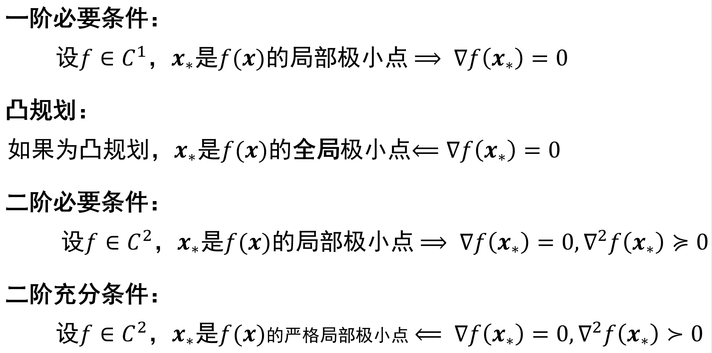

# 大类 2、无约束优化相关

## 最优解刻画

### 可微

### 不可微、凸规划

将上图的“凸规划”推广到不可微情况，使用次梯度。

$\boldsymbol{x}_*$为$f(\boldsymbol{x})$全局极小点$\Leftrightarrow$$\boldsymbol{0}\in\partial f(\boldsymbol{x})$

## 方法

这里面涉及的都是无约束优化，各方法的使用条件为：

* GD：无约束、$C^1$（没有强制要求为凸优化，但如果不是凸优化则是局部极小点/鞍点，凸优化则是全局极小点）  
* （基本）NT：无约束、$C^2$、强凸优化（各点 Hasse 矩阵正定）  
* CG：无约束、$G$正定的二次函数（一定是凸优化）
* SG：无约束、凸优化