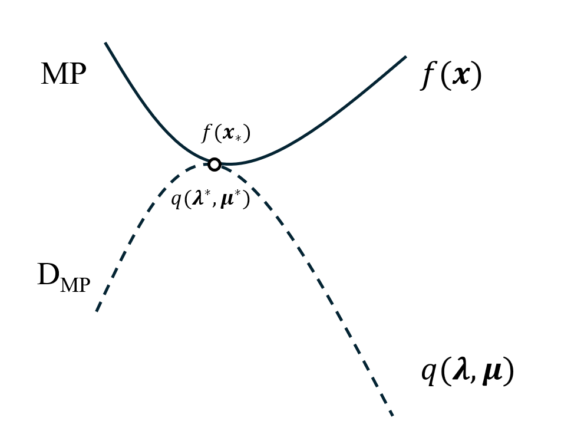

# Ep.9 Lagrange 对偶问题

要解决原问题，构造一个与之相伴的问题，即对偶问题；当对偶问题解决后，可能原问题也求解了。

**关键**：

* 怎么求解对偶问题
* 原问题与对偶问题的关系是什么（尤其是解的关系）

## 一、对偶问题

### 1. 定义

对于优化问题：

$$
f_*=
\begin{array}{cl}
\underset{\boldsymbol{x} \in X}{\operatorname{minimize}} & f(\boldsymbol{x}) \\
\text { subject to } & \boldsymbol{h}(\boldsymbol{x})=0 \\
& \boldsymbol{g}(\boldsymbol{x})\le0
\end{array}
\quad (\text{MP})
$$

其拉格朗日函数：

$$
\mathcal{L}(\boldsymbol{x},\boldsymbol{\lambda},\boldsymbol{\mu})=f(\boldsymbol{x})+\boldsymbol{\lambda}^T\boldsymbol{h}(\boldsymbol{x})+\boldsymbol{\mu}^Tg(\boldsymbol{x})
$$

其可以看为有三类变量（每类各有若干个变量）：$\boldsymbol{x},\boldsymbol{\lambda},\boldsymbol{\mu}$，但之前都将$\boldsymbol{\lambda},\boldsymbol{\mu}$看为了常数。

然而可以这样考虑：

* 主问题是优化$\boldsymbol{x}$让其极小化的问题，即：$\underset{\boldsymbol{x}\in X}{\min}$
* 目标函数是$\tilde{f}(\boldsymbol{x})=\underset{\boldsymbol{\lambda}\in\R^m,\boldsymbol{\mu}\in\R^p_+}{\max} \mathcal{L}(\boldsymbol{x},\boldsymbol{\lambda},\boldsymbol{\mu})$

即：

$$
(\text{MP}) \Leftrightarrow \min_{\boldsymbol{x}\in X}\max_{\boldsymbol{\lambda}\in\R^m, \boldsymbol{\mu}\in\R^p_+} \mathcal{L}(\boldsymbol{x},\boldsymbol{\lambda},\boldsymbol{\mu})
$$

从而得到**一个与原问题(MP)等价的的问题**。

> 证明：
>
> 对于$\tilde{f}(\boldsymbol{x})=\underset{\boldsymbol{\lambda}\in\R^m,\boldsymbol{\mu}\in\R^p_+}{\max} \mathcal{L}(\boldsymbol{x},\boldsymbol{\lambda},\boldsymbol{\mu})=\underset{\boldsymbol{\lambda},\boldsymbol{\mu}\ge0}{\max} (f(\boldsymbol{x})+\sum \lambda_ih_i(\boldsymbol{x})+\sum\mu_jg_j(\boldsymbol{x}))$  
> 因为$\boldsymbol{x}$在这里看为常量，故$f(\boldsymbol{x}),h_i(\boldsymbol{x}),g_j(\boldsymbol{x})$均为定值。
>
> 对于$\tilde{f}$，其每个优化变量和约束均为独立的，当所有都取最大值时，整个函数值最大。  
> 故可以分开考虑每一个$h_i(\boldsymbol{x})\lambda_i$和$g_j(\boldsymbol{x})\mu_j$。
>
> 对于$h_i(\boldsymbol{x})\lambda_i\:(\lambda_i\in\R)$，其为一元正比函数$y=ax$，  
> 如果$a>0$或$a<0$，则正或负无穷处取得最大值，为$+\infty$；只有当$a=0$时，最大值为$0$。
>
> 对于$g_j(\boldsymbol{x})\mu_j\:(\mu_j\ge0)$，其也为一元正比函数$y=bx$，  
> 如果$b>0$，则正无穷处取得最大值，为$+\infty$；只有当$b\le0$时，最大值为$0$。
>
> 综上：  
> 只有$h_i(\boldsymbol{x})=0,g_j(\boldsymbol{x})\le0$时，$\tilde{f}$的最大值为0；否则$\tilde{f}$的最大值可取到$+\infty$，即：  
> $$
> \begin{cases}
> \max _{\boldsymbol{\lambda}, \boldsymbol{\mu}} \mathcal{L}(\boldsymbol{x}, \boldsymbol{\lambda}, \boldsymbol{\mu})=f(\boldsymbol{x})+0+0=f(\boldsymbol{x}) & \boldsymbol{x}\text{在可行域内} \\
> \max _{\boldsymbol{\lambda}, \boldsymbol{\mu}} \mathcal{L}(\boldsymbol{x}, \boldsymbol{\lambda}, \boldsymbol{\mu})=f(\boldsymbol{x})+\infty=\infty & \boldsymbol{x}\text{不在可行域内}
> \end{cases}
> $$
>
> 那么，$\underset{\boldsymbol{x}\in X}{\min} \tilde{f}(\boldsymbol{x})$，不在可行域时为正无穷，故极小值一定在可行域内取到，  
> 故与原问题(MP)等价。

那么对偶问题，则是将两个运算符交换，  
**即(MP)的对偶问题为**：

$$
\underset{\boldsymbol{\lambda}\in\R^m,\boldsymbol{\mu}\in\R^p_+}{\max}\underset{\boldsymbol{x}\in X}{\min}\:\mathcal{L}(\boldsymbol{x}, \boldsymbol{\lambda}, \boldsymbol{\mu})\qquad(\text{D}_{\text{MP}})
$$

通常记：$q(\boldsymbol{\lambda},\boldsymbol{\mu})=\underset{\boldsymbol{x}\in X}{\min}\:\mathcal{L}(\boldsymbol{x},\boldsymbol{\lambda},\boldsymbol{\mu})$，则对偶问题$\text{D}_{\text{MP}}$表示为优化形式：
$$
\begin{array}{cl}
    \underset{\boldsymbol{\lambda}\in\R^m,\boldsymbol{\mu}\in\R^p}{\text{maximize}} & q(\boldsymbol{\lambda},\boldsymbol{\mu}) \\
    \text{subject to} & \boldsymbol{\mu}\ge\boldsymbol{0}
\end{array}
$$
可知：$\text{dom}\:q=\{(\boldsymbol{\lambda},\boldsymbol{\mu}):\boldsymbol{\mu}\ge0,q(\boldsymbol{\lambda},\boldsymbol{\mu})>-\infty\}$。

这里只是定义了一个对偶问题，因为该对偶问题具有很好的性质（见下），  
但该问题与原问题不一定等价，只在部分情况下两个问题解等价。

### 2. 性质 - 一定是凸规划

存在性质：(MP)的**对偶问题$(\text{D}_{\text{MP}})$一定是凸规划问题**。

> 证明：
>
> 记$q(\boldsymbol{\lambda},\boldsymbol{\mu})=\min_{\boldsymbol{x}\in X}\mathcal{L}(\boldsymbol{x},\boldsymbol{\lambda},\boldsymbol{\mu})$，  
> 则对偶问题表示为：
> $$
> q_*=
> \begin{array}{cl}
> \underset{\boldsymbol{\lambda}\in\R^m,\boldsymbol{\mu}\in\R^p_+}{\operatorname{max}} & q(\boldsymbol{\lambda},\boldsymbol{\mu}) \\
> \text {s.t.} & \boldsymbol{\mu}\ge0
> \end{array}
> $$
>
> 易知不等式约束条件$\boldsymbol{\mu}\ge0$为凸函数，$\max q\Leftrightarrow\min -q$，故只需要证$-q(\boldsymbol{\lambda},\boldsymbol{\mu})$是凸函数即可。
>
> $-q(\boldsymbol{\lambda},\boldsymbol{\mu})=\max_{\boldsymbol{x}\in X}-\mathcal{L}(\boldsymbol{x},\boldsymbol{\lambda},\boldsymbol{\mu})$，记让$-\mathcal{L}(\boldsymbol{x},\boldsymbol{\lambda},\boldsymbol{\mu})$关于$\boldsymbol{x}$最大化的$\boldsymbol{x}$取值为$\boldsymbol{x}_*$。  
> 则$-q(\boldsymbol{\lambda},\boldsymbol{\mu})=-\mathcal{L}(\boldsymbol{x}_*,\boldsymbol{\lambda},\boldsymbol{\mu})=\sum -h_i(\boldsymbol{x}_*)\lambda_i+\sum-g_j(\boldsymbol{x}_*)\mu_j-f(\boldsymbol{x}_*)$，为一个仿射函数（关于变量$\boldsymbol{\lambda},\boldsymbol{\mu}$其系数为常数），  
> 仿射函数一定凸，得证。

### 3. 写出对偶问题的步骤

对于原问题[(MP)](#1-定义)：

1. 写出拉格朗日函数：$\mathcal{L}(\boldsymbol{x},\boldsymbol{\lambda},\boldsymbol{\mu})=f(\boldsymbol{x})+\boldsymbol{\lambda}^T\boldsymbol{h}(\boldsymbol{x})+\boldsymbol{\mu}^T\boldsymbol{g}(\boldsymbol{x})$
2. 令$q(\boldsymbol{\lambda},\boldsymbol{\mu})=\underset{\boldsymbol{x}\in X}{\min}\mathcal{L}(\boldsymbol{x},\boldsymbol{\lambda},\boldsymbol{\mu})$，将$\boldsymbol{\lambda},\boldsymbol{\mu}$视为常数，求解$\boldsymbol{x}$取何值时（为带$\boldsymbol{\lambda},\boldsymbol{\mu}$的表达式），$\mathcal{L}$能取得最小值  
   **通常**：$\mathcal{L}$关于$\boldsymbol{x}$为凸函数，则“驻点$\Rightarrow$极小点”，故**通常是求驻点**$\boldsymbol{x}_*$。
   * **如果$\mathcal{L}$关于$\boldsymbol{x}$是凸函数**，且驻点$\nabla\mathcal{L}=0$有显式解$\boldsymbol{x}_*$：  
     则将$\boldsymbol{x}_*$代入，得到消去$\boldsymbol{x}$的函数$q(\boldsymbol{\lambda},\boldsymbol{\mu})$，然后得到对偶问题为：
     $$
     \begin{array}{cl}
         \underset{\boldsymbol{\lambda}\in\R^m,\boldsymbol{\mu}\in\R^p}{\text{maximize}} & q(\boldsymbol{\lambda},\boldsymbol{\mu}) \\
         \text{subject to} & \boldsymbol{\mu}\ge\boldsymbol{0} \\
         & \nabla_x\mathcal{L}=0
     \end{array}
     $$
     注意：$\nabla=0$要写在约束里，因为可能建立了$\lambda,\mu$的联系，视情况可以直接删除或化简为一个变量$\lambda/\mu$。
   * **如果$\mathcal{L}$关于$\boldsymbol{x}$是凸函数**，但驻点$\nabla\mathcal{L}=0$没有显式解：  
     则对偶问题只能包含$\boldsymbol{x}$，并将$\nabla\mathcal{L}=0$作为约束条件，写为：
     $$
     \begin{array}{cl}
         \underset{\boldsymbol{\lambda}\in\R^m,\boldsymbol{\mu}\in\R^p}{\text{maximize}} & \mathcal{L}(\boldsymbol{x},\boldsymbol{\lambda},\boldsymbol{\mu}) \\
         \text{subject to} & \nabla_{\boldsymbol{x}}\mathcal{L}(\boldsymbol{x},\boldsymbol{\lambda},\boldsymbol{\mu})=0 \\
         & \boldsymbol{\mu}\ge\boldsymbol{0}
     \end{array}
     $$

### 4. 例 1 - 对偶问题恰好与原问题解相同

这里给出一个对偶问题**恰好**与原问题具有以下三个性质的一个例子：

* 两问题**最优值相同**：$q_*=f_*$
* 对偶问题$(\text{M}_{\text{DP}})$最优解$\boldsymbol{\lambda}_*,\boldsymbol{\mu}_*$，为原问题(MP)的**最优解$\boldsymbol{x}_*$对应的拉格朗日乘子**
* 在极小化$\mathcal{L}$函数、确定参数$\boldsymbol{x}$的值、以确定$q$函数时，会得到$\boldsymbol{x}$与$\boldsymbol{\lambda},\boldsymbol{\mu}$的一个关系：$\boldsymbol{x}(\boldsymbol{\lambda},\boldsymbol{\mu})$  
  而将对偶问题$(\text{M}_{\text{DP}})$最优解$\boldsymbol{\lambda}_*,\boldsymbol{\mu}_*$代入后，得到的值为原问题的最优解$\boldsymbol{x}_*$，即：$\boldsymbol{x}(\boldsymbol{\lambda}_*,\boldsymbol{\mu}_*)=\boldsymbol{x}_*$

> 例子 - 对偶问题恰好与原问题解相同：
>
> 原问题为：
> $$
> \begin{array}{cl}
>     \underset{x\in\R}{\text{minimize}} & x^2 \\
>     \text{subject to} & x\ge1
> \end{array}
> $$
> 易知：$x_*=1,f_*=1$。
>
> 其拉格朗日函数为：$\mathcal{L}(x,\mu)=x^2+\mu(1-x)$，  
> 易知：拉格朗日乘子$\mu=2$（通过求$\nabla_x\mathcal{L}(1,\mu)=2-\mu=0$得到）
>
> 对于$q(\mu)=\min_{x\in\R}(x^2-\mu x+\mu))$，易知$\mathcal{L}$关于$x$为二次函数，即凸函数，  
> 根据二次函数性质：$x=-\frac{b}{2a}=\frac{\mu}{2}$时$\mathcal{L}$取最小值，最小值为$-\frac{\mu^2}{4}+\mu$。
>
> 故对偶问题表示为：
> $$
> \begin{array}{cl}
>     \underset{\mu\in\R}{\text{maximize}} & -\frac{\mu^2}{4}+\mu \\
>     \text{subject to} & \mu\ge0
> \end{array}
> $$
> 易知：$\mu_*=2,q_*=1$。
>
> 故可以验证上面说的三个性质。

这三个性质并不是巧合，当**满足某些条件**时，对偶问题与原问题**一定具有这三个性质**。

### 5. 例 2 - 对偶问题包含原始变量

> 例 2 - 对偶问题包含原始变量$\boldsymbol{x}$（无法求出$x$的显式解）：
>
> 原始问题：
> $$
> \begin{array}{cl}
>     \underset{x\in\R}{\text{minimize}} & e^x \\
>     \text{subject to} & x^2\le1
> \end{array}
> $$
>
> $\mathcal{L}(x,\mu)=e^x+\mu(x^2-1)$，因为$\mu\ge0$，所以$\mathcal{L}$关于$x$为凸函数  
> 则$q(\mu)=\min_{x}(e^x+\mu(x^2-1))$最小点为$\nabla_x\mathcal{L}=0$处，即$e^x+2x\mu=0$，无法求出$x$的显式解，  
> 则对偶问题只能表示为：
>
> $$
> \begin{array}{cl}
>     \underset{\mu\in\R}{\text{minimize}} & e^x+\mu(x^2-1) \\
>     \text{subject to} & \mu\ge0 \\
>     & e^x+2x\mu=0
> \end{array}
> $$
>
> 拓展：如果将原问题形式变换以下，将约束条件变为$\text{subject to} \quad x\le1,x\ge-1$，则$x$有显式解，  
> 故对偶问题的形式，依赖于原问题的特定表示形式（就算是同一个原问题，但原问题表示形式不同，则对应的对偶问题也不同）

## 二、弱对偶性

本节给出了一个“弱对偶性”，是**通用存在的性质**，即对偶问题有解的时候、$q^*\le f_*$，  
而最优秀的性质则是“强对偶性”，即$q^*=f_*$，  
但对于通常的问题存在反例，即反例 1 和反例 2，  
因此在下一节中给出“强对偶性”，即对偶问题存在最优解且与原问题相等的充分条件。

### 🌟1. 弱对偶性定义

> **定理 - 弱对偶性**：
>
> 原问题(MP)和对应的对偶问题$(\text{M}_{\text{DP}})$，  
> 对于对偶问题任意可行解$\bar{\boldsymbol{\lambda}}\in\R^m,\bar{\boldsymbol{\mu}}\in\R^p_+$，以及原始问题的任意可行解$\bar{\boldsymbol{x}}\in X$，均满足：
> $$
> q(\bar{\boldsymbol{\lambda}},\bar{\boldsymbol{\mu}})\le f(\bar{\boldsymbol{x}})
> $$

即：

* $q(\boldsymbol{\lambda},\boldsymbol{\mu})$是$f(\boldsymbol{x})$的下界，故$f(\boldsymbol{x})$最大的下界（下确界）为$\max q$
* $f(\boldsymbol{x})$是$q(\boldsymbol{\lambda},\boldsymbol{\mu})$的上界，故$q(\boldsymbol{\lambda},\boldsymbol{\mu})$最小的上界（上确界）为$\min f$

可以用这样的图形来几何记忆：  

> 证明：
>
> $q(\bar{\boldsymbol{\lambda}},\bar{\boldsymbol{\mu}})=\min_{\boldsymbol{x}\in X}\mathcal{L}(\boldsymbol{x},\boldsymbol{\lambda},\boldsymbol{\mu})$，  
> $\because\bar{\boldsymbol{x}}$为可行解，其一定$\in X$；又$\because$最小值一定$\le$任意值，  
> $\therefore\min_{\boldsymbol{x}\in X}\mathcal{L}(\boldsymbol{x},\boldsymbol{\lambda},\boldsymbol{\mu})\le\mathcal{L}(\bar{\boldsymbol{x}},\boldsymbol{\lambda},\boldsymbol{\mu})$  
> $\mathcal{L}(\bar{\boldsymbol{x}},\boldsymbol{\lambda},\boldsymbol{\mu})=f(\bar{\boldsymbol{x}})+\boldsymbol{\lambda}^T\boldsymbol{h}(\bar{\boldsymbol{x}})+\boldsymbol{\mu}^T\boldsymbol{g}(\bar{\boldsymbol{x}})$，  
> $\because\bar{x}$为可行解，故$\boldsymbol{h}(\bar{\boldsymbol{x}})=0,\boldsymbol{g}(\bar{\boldsymbol{x}})\le0$，  
> $\therefore \mathcal{L}(\bar{\boldsymbol{x}},\boldsymbol{\lambda},\boldsymbol{\mu})\le f(\bar{\boldsymbol{x}})$  
> 综上：$q(\bar{\boldsymbol{\lambda}},\bar{\boldsymbol{\mu}})\le f(\bar{\boldsymbol{x}})$，得证。

**可以得到以下推论**：

* 🌟$q_*\le f_*$  
  记$\text{gap}=f_*-q_*$，称为“**对偶间隙**”，  
  可知$\text{gap}\ge0$，则核心问题是：**找$\text{gap}=0$的时候**（强对偶性）。
* 存在原始问题可行解$\boldsymbol{x}_*$和对偶问题可行解$(\boldsymbol{\lambda}^*,\boldsymbol{\mu}^*)$，  
  如果：满足$f(\boldsymbol{x}_*)=q(\boldsymbol{\lambda}^*,\boldsymbol{\mu}^*)$，  
  则：$\boldsymbol{x}_*,(\boldsymbol{\lambda}^*,\boldsymbol{\mu}^*)$分别是原始问题和对偶问题的最优解。
* 如果$\text{D}_{\text{MP}}$无上界，则原始问题没有可行解（$\text{dom}\:f=\empty$）；  
  如果(MP)无下界，则对偶问题没有可行解（$\text{dom}\:q=\empty$）。

### 2. 反例 1 - 对偶间隙为 0 但对偶问题无解

*是满足弱对偶性，但不是强对偶性的反例。*

> 问题：
>
> $$
> f_*=
> \begin{array}{cl}
>     \underset{x\in\R}{\text{minimize}} & x \\
>     \text{subject to} & x^2\le0
> \end{array}
> $$
>
> 易知：$x_*=0,f_*=0$。

$X=\R$，  
拉格朗日函数为：$\mathcal{L}(x,\mu)=x+\mu x^2$，  
$q(\mu)=\min_{x}x+\mu x^2=\begin{cases}-\infty,&\mu=0\\-\frac{1}{4\mu},&\mu>0\end{cases}$，  
对偶问题为：

$$
\begin{array}{cl}
    \underset{\mu\in\R}{\text{maximize}} & q(\mu) \\
    \text{subject to} & \mu\ge0
\end{array}
$$

做出函数图像，类似于反比例函数，  
可知：对偶问题的最优解是$\mu\to\infty$为$q^*=0$，但取不到（$\mu$要趋于无限），故**对偶问题无解**！

### 3. 反例 2 - 对偶间隙非 0

> 问题：
>
> $$
> f_*=\begin{array}{ll}\underset{x\in[0,2]}{\operatorname*{minimize}}& -x^2\\\text{subject to}& x=1\end{array}
> $$
>
> 易知：$x_*=1,f_*=-1$

$X=[0,2]$，  
$\mathcal{L}(x,\mu)=-x^2+\lambda(x-1)$，  
$q(\lambda)=\min_{x\in[0,2]}-x^2+\lambda(x-1)$，为开头向下二次函数，最小值取边界，故：$q(\lambda)=\begin{cases}-4+\lambda,\lambda\leq2\\-\lambda,\quad\lambda>2\end{cases}$  
对偶问题为：

$$
\begin{array}{cl}
    \underset{\lambda\in\R}{\text{maximize}} & q(\lambda)
\end{array}
$$
可以求得：$\lambda^*=2,q^*=-2$。

故：**存在对偶间隙**，$gap=f_*-q^*=1>0$。

---

因此下面研究：  
1)对偶问题的**最优解存在**，  
2)**对偶间隙为零**  
的**充分条件**，即**强对偶性**。

## 三、强对偶性

*其实这部分直接看“4. 强对偶性定义”就可以。*

> 问题 - 仅考虑不等式约束(ICP)：
>
> 由于等式约束可以转换为两个不等式约束，故这里只考虑不等式约束。
>
> $$
> f_{*}=\begin{array}{ll}
> \underset{x \in X}{\operatorname{minimize}} & f(\boldsymbol{x}) \\
> \text { subject to } & g_{j}(\boldsymbol{x}) \leq 0, j=1, \cdots, p
> \end{array}\quad(\text{ICP})
> $$

为了更方便理解下面的推导，并且可以作为一个总结，这里先简单给出“强对偶性”的定义：

**如果**：

* (MP) 是凸优化
* (MP) 满足 Slater 条件（或者松弛 Slater 条件）

**则**：

对偶问题有解，且$\text{gap}=0$（解跟原问题相同）。

### 1. 如何判断对偶系统有解（伴随系统无解）

*这里刚开始可能难以理解，为什么要判断这个伴随系统（自命名）无解，但看到最后就明白：这个系统无解，可以与“对偶问题有解”建立联系。*  

**①问题 - 如何判断对偶问题的伴随系统无解**：

已知常数$c$，对于下面关于$\boldsymbol{x}$的系统（问题），如何判断其无解：

$$
\begin{cases}
f(\boldsymbol{x})<c \\
g_j(\boldsymbol{x})\le0, j=1,\cdots,p \\
\boldsymbol{x}\in X
\end{cases}\quad(\text{I})
$$

**(I)系统与原问题的联系**：这个系统无解，其实就可以看成原问题$\min f$有解、最优值为$f_*=c$。

**②回答**：

如果存在非负权重$\mu_1,\cdots,\mu_p$，使得不等式
$$
f(\boldsymbol{x})+\sum_j\mu_jg_j(\boldsymbol{x})<c
$$
在$X$上无解，  
则(I)无解。

> 证明 - 反证法：
>
> *反证，即假设条件成立（存在$\boldsymbol{\mu}$使得不等式无解），而结论不成立（即(I)有解）。*
>
> 如果(I)有解，那么将存在的$\mu\ge0$和解$\boldsymbol{x}$代入，  
> $f(\boldsymbol{x})+\sum_j\mu_jg_j(\boldsymbol{x})=\text{小于}c\text{的数}+\text{非正数}<c$，则$\boldsymbol{x}$是上式的一个解，  
> 即这个“存在$\boldsymbol{\mu}$”反而会使得不等式有解，故矛盾，反证。

**③回答的等价变换**：

上述回答可以等价变换为：
$$
\exist\boldsymbol{\mu}\ge0:\min_{\boldsymbol{x}\in X}f(\boldsymbol{x})+\boldsymbol{\mu}^T\boldsymbol{g}(\boldsymbol{x})\ge c
$$

> 原因：因为存在$\boldsymbol{\mu}$使得上不等式无解，即所有值都要$\ge c$、即最小值要$\ge c$。

即又变成两个系统之间的关系：

如果：关于$\boldsymbol{\mu}$的系统，
$$
\begin{array}{ll}
\underset{\boldsymbol{x}\in X}{\min} & f(\boldsymbol{x})+\boldsymbol{\mu}^T\boldsymbol{g}(\boldsymbol{x}) \geq c \\
&\boldsymbol{\mu}\ge0
\end{array}\quad(\text{II})
$$
有解。

则：关于$\boldsymbol{x}$的系统(I)，无解。

**④与原问题、对偶问题建立联系**：

可以看到(II)第一个不等式左侧，即为对偶问题的目标函数$q(\boldsymbol{\mu})$，  
所这个系统有解$\boldsymbol{\mu}_0$，就是说对偶问题$q(\boldsymbol{\mu}_0)\ge c=f_*$有解（①里说了，$c=f_*$）。  
而因为“弱对偶性”：$q(\boldsymbol{\mu})\le f_*,\forall\boldsymbol{\mu}$，  
故：$q(\boldsymbol{\mu}_0)=f_*$。  
故：**对偶问题有最优解**$\boldsymbol{\mu}^*$、最优值为$q^*$，且**与原问题最优解值$f_*$相同**（$\text{gap}=0$）。

### 2. 凸择一定理

> *解释 - 什么是“凸”“择一”定理*：
>
> 就是说两个系统A,B，存在性质：A 有解则 B 一定无解，  
> 但要通过 B 有解得到 A 无解，则要加一定条件，这里加的条件则为“凸”+Slater条件（但这个在题目中没体现出来）。

(I)是一个关于$\boldsymbol{x}$的系统（就代表原问题），(II)是一个关于$\boldsymbol{\mu}$的系统（就代表对偶问题）。

> **定义 - 凸择一定理**：
>
> 关于$\boldsymbol{x}$的系统(I)（无解代表原问题有解），和关于$\boldsymbol{\mu}$的系统(II)（有解代表对偶问题有解），
>
> * 平凡部分（即易知）：如果(II)有解，则(I)无解。
> * **非平凡部分**（即需要加条件）：  
>   如果：(I)无解，  
>   且：
>   * （**凸规划**）$X$是凸集，$f,g_j\forall j$在$X$上凸
>   * （[**Slater 条件**](../Ep.8%20约束优化%20-%20最优解的刻画/8.3.%20约束品性、灵敏度分析.md#3-slater-条件sc)）存在$\boldsymbol{x}\in X$，使得$g_j(\boldsymbol{x})<0,j=1,\cdots,p$成立  
>     *区别：这里跟约束品性中的 Slater 条件还有所区别（SC 里只要求积极约束非退化，而这里要求所有约束都非退化（可以看成所有点都满足 SC 里的））*  
>     *还可以是松弛 Slater 条件，见下。*
>
>   则：(II)有解。

其实是有这个定理后，再取$c=f_*$来运用，可以得到：

* 对于平凡部分：说明如果对偶问题有解，即存在$\boldsymbol{\mu}\ge0$，使得$q(\boldsymbol{\mu})\ge f_*$，  
  而因为弱对偶性$q(\boldsymbol{\mu})\le f_*$，所以$q(\boldsymbol{\mu})=f_*$，  
  所以对偶问题的解值一定是原问题的最优解值。
* 对于非平凡部分：说明原问题的最优解$\boldsymbol{x}_*$、最优值$f_*$，如果原问题满足凸规划 + Slater 条件，  
  则对偶问题有解，且最优值$q^*$就为$f_*$。

> 证明 - 凸择一定理：
>
> 第9周 星期3  
> 57:26 ~ 1:06:37
>
> 优先级较低，可以省略。

### 3. 松弛 Slater 条件

对于 Slater 条件，其要求存在的点$\bar{\boldsymbol{x}}$，所有不等式约束都非退化（严格小于 0）。  
但之前说了：(ICP)问题是将等式约束看成两个不等式约束处理的，  
那么对于等式约束，不可能同时满足$h(\boldsymbol{x})<0$和$-h(\boldsymbol{x})<0$，  
所以这里要**对等式约束额外松弛**一下。  
（注意：对于凸规划，[等式约束一定是仿射函数](../Ep.8%20约束优化%20-%20最优解的刻画/8.2.%20不等式约束、凸规划.md#1-凸规划)）。

> **定义 - 松弛 Slater 条件**：
>
> 对于约束$\boldsymbol{x}\in X,g_j(\boldsymbol{x})\le0,j=1,\cdots,p$，  
> 其中：
>
> * $g_i(\boldsymbol{x}),i=1,\cdots,m$是仿射函数（可代表等式约束）；
> * $g_j(\boldsymbol{x}),j=m+1,\cdots,p$是非仿射函数（真正的不等式约束）
>
> 如果：$\exist\bar{\boldsymbol{x}}\in\text{ri}X$（相对内部），  
> 使得：
>
> * $g_i(\bar{\boldsymbol{x}})\le0$（**仿射约束可以退化**、不严格）
> * $g_j(\bar{\boldsymbol{x}})<0$（**非仿射函数非退化**、严格）
>
> 则称：满足松弛 Slater 条件。

### 🌟4. 强对偶性定义

> 定义 - 强对偶性：
>
> 对于[原问题(ICP)](#三强对偶性)，  
> 以及与之关联的对偶问题：$q^*=\max_{\boldsymbol{\mu}\in\R^p_+}q(\boldsymbol{\mu}),q(\boldsymbol{\mu})=\min_{x\in X}\mathcal{L}(\boldsymbol{x},\boldsymbol{\mu})$，
>
> 如果：
>
> * 原问题为**凸规划**：$X$为凸集、$f,\boldsymbol{g}$在$X$上为凸函数，$h$是仿射函数
> * 满足**松弛 Slater 条件**：$\exist\bar{\boldsymbol{x}}\in\text{ri}X$，使得仿射$g_i(\boldsymbol{x})\le0$，非仿射$g_j(\boldsymbol{x})<0$
>
> 则：对偶问题有解（存在$\boldsymbol{\mu}^*\ge0$），且与原问题最优值相同（$f_*=q^*$ / $\text{gap}=0$）。

**得到对偶问题的解$\boldsymbol{\mu}^*$后，如何得到原问题的最优解$\boldsymbol{x}_*$**？  
**方法**：

将$\boldsymbol{\mu}^*$代入$\mathcal{L}(\boldsymbol{x},\boldsymbol{\mu})$，得到关于$\boldsymbol{x}$的函数，  
然后**极小化这个函数**（只有$\boldsymbol{x}\in X$这个约束啦），可能得到**若干个解**$\{\boldsymbol{x}_i\}$，  
找到**满足“互补松弛条件”的解**，$g_j(\boldsymbol{x}_i)\mu_j=0$，那么这个解**就是最优解**$\boldsymbol{x}_*$。
> 因为：$\{\boldsymbol{x}_i\}$里面的点都已经满足 KKT 条件的原始可行性、对偶可行性了，所以只用再满足互补松弛条件，则为（凸优化）的最优解。

*反之也成立：原问题的最优解，一定在解集$\{\boldsymbol{x}_i\}$里，且满足松弛条件（没运用价值、知道就行）。*

## 四、应用

### 1. 线性规划的互补松弛定理（快速得到对偶问题、求得最优解）

1:13:44