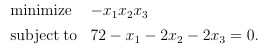
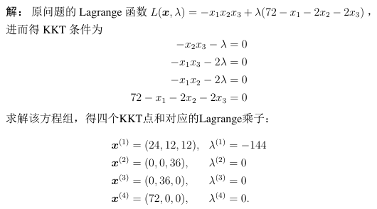
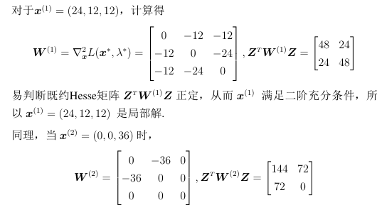
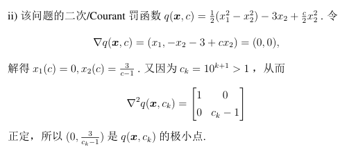
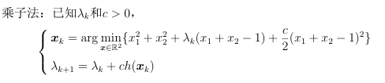
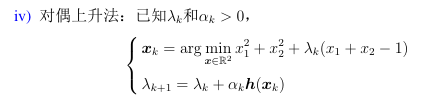
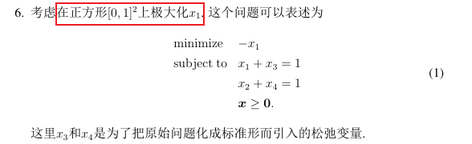
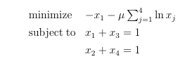
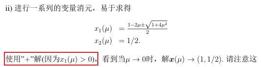
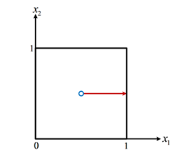

# 约束优化方法

$$
\begin{array}{ll}
    \min & f(x) \\
    s.t. & h(x)=0
\end{array}
$$

前三个针对等式约束，最后的针对不等式约束。

1. 二次罚函数法 —— 针对原问题  
   引入约束条件二次项、惩罚系数$c$。  
   当$c\to\infty$，$x\to x_*$。  
   故不断增大$c$，用GD等方法解$x$，直至$x$趋近一个值，且$h(x)\approx0$，可以停止。
2. 乘子法 —— 针对对偶问题  
   二次罚函数法因为要让$c\to\infty$，  
   在二次法函数基础上，引入约束条件一次项和拉格朗日系数$\lambda$

## 0. 利用 KKT + 二阶必要条件（或图解验证）求解

> 类似于无约束优化中，首先求驻点，然后用二阶必要条件，说明$\nabla^2\succeq0$即可。  
> 但这里要注意有约束的区别：
>
> 1. 求驻点：即KKT点
> 2. 要说明满足某CQ，才能用二阶必要条件验证
> 3. 二阶必要条件为$d^TW_*d\ge0, d\in M=\{d\in\R^2:d^T\nabla g_i,i\in A(x)\}$
>
> 但如果变元简单（$x\in\R^2$，或$x\in\R^3$但可以消元变为$\R^2$），则可以用图解说明（做等高线图）。

如对于问题：  

首先写出$\mathcal{L}$，再写出 KKT 条件，再求解：  

然后说明满足CQ：易知满足LCQ。

然后分析$M=\{d\in\R^n:d^T\nabla g=0\}$。

⭐这一有一个方法：如果只有一个$g$且$\nabla g$为常向量，  
如这里$\nabla g=(-1,-2,-2)$，则可以得到等式$\{d\in\R^3:d_1+2d_2+2d_3=0\}$，  
此时可以**向下降一维**，即变为$d_1=-2d_2-2d_3$，所以对于$\forall d_2, d_3$，只要让$d_1$满足即可，  
则可以写为$\{Ay:y\in\R^2\}$，其中$A=\begin{bmatrix}-2&-2\\1&0\\0&1\end{bmatrix}$，  
> 验证：$d=Ay=\begin{pmatrix}-2y_1-2y_2\\y1\\y2\end{pmatrix}$，$d_1+2d_2+2d_3=0$满足。

那么$M=\{Ay:y\in\R^2\}$，就变成了证$y^TA^TW_*Ay\ge0,\forall y\in\R^2$，即证$A^TW_*A\succeq0$。  
  
其他三个点，是不定的，排除。

## 1. 二次罚函数法

针对**等式约束问题**：
$$
\begin{array}{ll}
    \text{minimize} & f(x) \\
    \text{subject to} & h_i(x)=0,i=1,\cdots,m
\end{array}
$$

**二次罚函数**$q(x, c)$：
$$
q(x,c)=f(x)+\frac{c}{2}(h_1(x)^2+\cdots+h_m(x)^2)=f(x)+\frac{c}{2}\|\boldsymbol{h}(x)\|^2
$$

**方法定义**：

取一个$c$，然后$\min_{x}\;q_c(x)$，  
再取一个更大的$c$，然后

**求解**：

通常一阶条件$\nabla_x=0$得到的点，则为$q(x,c)$的极点（但还需要用二阶条件说明），故：

1. 如果$\nabla_x=0$，可以得到$x$关于$c$的表达式$x(c)$  
   还需要用二阶条件$\nabla^2_x q(x,c)\succeq0$，说明$x(c)$确实是极小点。如下图。  
     
   此时$c\to\infty$，则$x\to x_*$、$h(x)\to 0$、$ch(x)\to\lambda^*$（可能成立）。
2. 如果不好求、得不到$x(c)$，只能用迭代方法做  
   对于每个子问题$\min_x q_{c_k}(x)$，**用GD等方法**求得$x_k$，  
   然后增大$c$，对于新的子问题$\min q_{c_{k+1}}(x)$，再求$x_{k+1}$，  
   **直至**$x_{k}$趋近于一个稳定的点，并且$h(x_{k})\to0$（即满足约束），可以停止。

还可能存在性质（部分成立）：可用$\lambda_k=ch(x_k)$来估计$x_*$对应的$\lambda$。  
当$c\to\infty$时，$\lambda\to\lambda^*$。

*针对不等式的，只用了解$g(x)\le0\Rightarrow\max(g(x),0)=0$即可。*

## 2. 乘子（罚函数）法

**乘子法函数**：

就是在二次罚函数基础上，加上拉格朗日函数部分，变成“增广拉格朗日函数$L_c(x,\lambda)$”：
$$
L_c(x,\lambda) = f(x)+\lambda^Tg(x)+\frac{c}{2}\|h(x)\|^2
$$

**$\lambda$更新方式**：

1. 乘子法 / 梯度法  
   一种简单的迭代格式，效果不如下面的。
   $$
   \lambda_{k+1} = \lambda_k + ch(x_k)
   $$
2. 牛顿法  
   *这个虽然叫牛顿法，但只是形式类似，并非迭代公式一样*
   $$
   \lambda_{k+1} = \lambda_k + [-\nabla h(x_k)^T(\nabla_x^2 L_c(x_k,\lambda_k))^{-1}\nabla h(x_k)]^{-1}h(x_k)
   $$  
   *这个看着很吓人，要算两次逆，但$[]$内部的算完就是常数了，逆就是倒数。*

*两种区别可以看成步长的区别。*

对于梯度法更新的$\lambda$，可统一格式为：

在每一epoch中，更新规则：

* $c$慢慢加大，10,100,...
* $\lambda$则按照公式迭代

## 3. 对偶上升法——解决对偶问题的 GD 法

原问题的梯度下降法$\Leftrightarrow$对偶问题的对偶上升法  
$x_{k+1}=x_k-\alpha_k\nabla f(x_k)\Leftrightarrow \lambda_{k+1}=\lambda_{k}+\alpha_k h(x_k)$

就是解对偶问题$\min_x\mathcal{L}(x,\lambda)$。

取初始$\lambda_0$，然后得到$x_k=\argmin\mathcal{L}_{\lambda_{k}}(x)$，  
更新$\lambda_{k+1}=\lambda_k+\alpha_kh(x_k)$，迭代进行。

最后统一格式为：  

## 4. 障碍函数法——针对不等式约束

对于问题：
$$
\begin{array}{ll}
    \min & f(x) \\
    s.t. & h(x)=0 \\
    & g(x)\le0
\end{array}
$$

则利用“对数障碍”，对应的障碍函数为：
$$
f_{\mu}(x)=f(x)+\mu(\ln g_1(x)+\cdots+\ln g_p(x))
$$

转化为问题：
$$
\begin{array}{ll}
    \min & f(x)+\mu\sum\ln g_i(x) \\
    s.t. & h(x)=0
\end{array}
$$

然后求$\nabla=0$，可得到$x(\mu)$，一般有多个（二次方程），  
通过约束条件和$\nabla^2\succeq0$，筛选出最终得$x(\mu)$，  
让$\mu\to0^+$，则得到$x_*$。

### 解析中心、中心路径

中心路径：从最开始$\mu=\infty$，$x$为整个约束范围的解析中心；到$\mu\to0^+$，$x$为“最优面”的解析中心。

如下题：  
  
最优解为$\{(1, x_2):x_2\in[0,1]\}$，故是一个“最优面”。

对应障碍函数问题：  
  
为凸优化，可通过求KKT点得到最优解，得到$x(\mu)$：  

---

对应的中心路径为：  

当$\mu=\infty$式，$x=(\frac{1}{2},\frac{1}{2})$，为整个约束范围的解析中心；  
当$\mu\to0^+$时，$x=(1,\frac{1}{2})$，为最优面的解析中心。

故随着$\mu=\infty\to0^+$，$x(\mu)$从整个约束范围（正方形）的解析中心$(\frac{1}{2},\frac{1}{2})$，移动到最优面的解析中心$(1,\frac{0+1}{2})$。