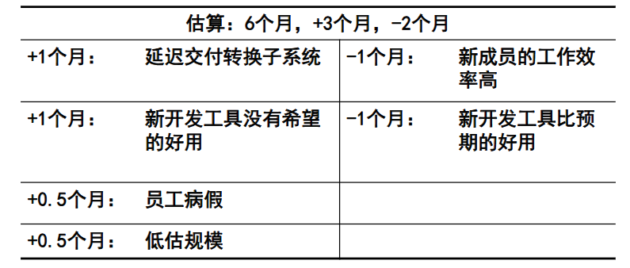

# Ep.4 软件项目估算

**估算的大致内容**：

* 费用
* 进度：里程碑（大的进度）、详细的任务进度
* 资源

估算是对项目设定一个合理的预期，  
如果按照不合理的预期执行，很可能导致项目失败。

**估算中可能存在的问题**：

问题1. 充满想象力的估算：  
比如找人修车，问他好久修好别人直接回复明天能修好。  
此时其是暗含了很多假设：比如工具没坏、明天不生病、有合适零件等。  
这些就是项目设计中的“假设和条件”。

问题2. 不是问你想法、而是让你猜：  
找人修车，问他好久修好，别人说明天，自己说“明天？不行，必须15min”，导致压力。

问题3. 估算变成谈判的工具：  
因为知道别人会压力自己，所以故意说很长的时间，使得别人压缩后刚好差不多。

问题4. 自我实现：  
报的10h，只做了4h，剩下的时间用来自我实现（镀金）。

**估算的不确定性**：

越早期不确定性越大。  
但估算需要成本和时间，故不能随时都估算。

**估算的阶段**：

1. 可行性分析
2. 需求确定后
3. 每次迭代

**估算的常见问题**：

1. 基于价格而非工作量的估算  
   就是先估算个价格，其他东西根据价格来推算。
2. 没有充足时间来做估算
3. 需求不确定就估算（是指需求确定后需要再估算）
4. 不使用历史数据来支撑

**估算对结果的影响**：

* 高估：会导致提前做完，而做非工作的事（镀金）。  
  要基于“帕金森法则”，即估计多少就刚好做多少。
* 低估：导致质量问题  
  “温伯格定律”：如果一个系统不要求是可靠的，那么他可以满足任何其他目标（即如果你要求速度，质量很难保证）

故一般都采取高估而非低估。

**估算内容**：

1. 根据软件需求规格说明书，得到“规模估算”
2. 根据“规模估算”，得到“工作量估算”（比如代码行）
3. 根据“工作量估算”，结合其他因素，得到“进度估算”和“成本估算“

**估算过程**：

输入：

* SOW, WBS
* 资源单价
* 历史数据（最好是招跟项目相近的历史数据）
* 学习曲线

过程：各种工作量估算方法

输出：估算说明文件，包括：

* 估算出的各种工作量和成本。
* 假设

## 一、工作量估算方法

*PPT P21。*

单位通常是“人月”。

### 1. 代码行估算方法(LOC)

即软件项目的所有源代码的行数。

**优点**：

* 直观、容易理解、操作成本低

**缺点**：

* 早期难以估计
* 依赖编程语言和个人风格
* 忽略了项目工作量的体现
* 会导致鼓励程序员写冗杂代码

*程序员平均为 100~200 LOC/d。*

因此应该作为一种事后估计、度量指标。  
根据这种指标来对以后产生调整。

同时代码行应该与“缺陷率”指标结合，用来判断代码缺陷情况。

### 2. 功能行(FP)

根据软件的大小由它所执行的功能的数量和复杂性来衡量。  
目标是从用户的角度来估算软件功能，并且能尽早使用（需求分析阶段后，而LOC基本是在测试阶段和适用）。
*如买房：100平则是 LOC，有两室一厅一卫则是 FP。*

*拓展 - “国际功能点协会”：用来定义如何估算功能点。*

* 5个功能点
  * 对用户不可见：
    * 内部逻辑文件(ILF)：
    * 外部接口文件(EIF)：要调用其他系统、或被其他系统调用的接口，EIF一定是其他系统的ILF
  * 对用户可见：输入、输出、查询
    * 外部输入(EI)
    * 外部输出(EO)
    * 外部查询(EQ)：是输入和输出的组合，从ILF和EIF从组合得到输出，并且不会更新ILF

  首先对每个功能点划分为三种复杂度：简单、平均和复杂，并要各给予个权重。  
  然后统计5种功能点的个数，并划分为简单、平均、复杂三种等级。
  然后计算加权值，可以计算出“未调整的功能点”(UFC)。
* 14个技术复杂度因子  
  表示某个技术可能造成的系统复杂度。  
  分成 6 个等级（从 0 到 5，越小越不影响）。

  由这个可以计算出一个调整因子，为$0.65\sim 1.35$，  
  乘上UFC，得到“调整后的功能点”。

**难点**：

1. 功能点很难确定。
2. 权重也难以确定，但可以参考经典权重。

**优点**：

* 客户便于理解
* 在信息系统、数据管理系统等数据很强的系统很容易使用。（如可用数据流图描述）

**缺点**：

* 需要很强的分析经验（能识别功能点）
* 不适合

**发展**：

现在有三种：

* 功能点
* 非功能点：即非功能需求
* 简单功能点 - SFP：适合于敏捷

### 3. 用例点估算法 (UC)

因为 FP 是给予数据流的，是结构化的。  
而现在大多是 OOP 开发，故提出用用例来估算的方法。

需要在**用户目标级别的用例**在估算，具体到用户可以做的具体事情。  
区别于“系统级别的用户”（更抽象）。

**步骤**：

1. 计算未调整的用例权重 UUCW  
   根据步骤、涉及类、界面、涉及数据库的情况，给用例划分难易度（简单、一般、复杂）
2. 计算未调整的角色权重 UAW  
   给角色划分重要程度（如 API 交互为简单；GUI 交互为复杂）
3. 计算未调整的用例点 UUCP  
   即 $UUCW+UAW$
4. 计算技术复杂因子 TCF  
   有 13 个，如并发。每个因子给出评估结果（项目中涉及）和权重（本身影响程度）
5. 计算环境复杂因子 ECF  
   有 8 个。
6. 计算最终的调整后用例点 UCP  
   $UCP = UUCP * TCF * ECF$
7. 估算工作量 EE
   有一个项目生产率因子 PF，即每一个用例点需要多少人时。  
   $EE = UCP * PF$

可以看到跟 FP 类似，但主要是基于用例的。

**优点**：

* 可以自动化
* 结果可靠

**缺点**：

* 需要编写用例后才能评估
* 不适合用于敏捷（敏捷没有用例、只有故事点）

### 4. 自底向上估算

对 WBS 的每个底层的功能包进行估算。  
可以结合“PERT”方法进行估算。

**优点**：

* 如果 WBS 分解足够准确，则该方法准确

**缺点**：

* 需要 WBS
* 通常是低估的（因为合并也有消耗）

### 5. 类比法

根据以前大概的项目的情况来估算。

优点是简单、可以在很早期用；缺点是不准确、而且要考虑代码重用。  
*因为已经有原来相似的代码了，那也可以进行代码重用。*

### 6. 专家判断法（德尔菲法）

就是交给多个专家来一起估算。

Deiphi 法：即向多个专家对多个工作单元进行估算，如果估算的一样则过，不一样则再次缩小可选范围进行估算，直至收敛。  
专家之间不能互相讨论、独立填写，避免影响。

### 7. 参数估计法 (COCOMO)

就是给一个包含参数的公式（模型）来计算。  
有基于 FP 也有基于用例点的模型。

重要的有 **COCOMO 模型**。

* 基本 COCOMO 模型  
  $Effort=c*size^k$  
  $size$是代码量，参数$c,k$是根据系统的类型来设置（如嵌入式、开放式等）
* 中等 COCOMO 模型  
  加入了“成本驱动因子”，从人员、产品、计算机等方面属性来评估，每个因子相乘。  
  $Effort=(c*size^k)*dem$
* 高级 COCOMO 模型

### 8. 简单估算法（宽带德尔菲法）

上方的方法都需要使用条件。  
而该方法则不需要。

该方法是“专家判断法”的变形，即把每个项目小组成员看成“专家”。  
让每个小组成员来估算每个功能模块的工作量（人月），并按专家判断法来处理。

在敏捷中也经常使用。

### 9. 三点估算法 (PERT 法)

考虑三个值：

* O - 乐观
* L - 最可能
* P - 悲观

得到：

* 均值$M=(O+4L+P)/6$
* 标准差$\sigma=(L-O)/6$

### 10. 其他方法

* AI
* 敏捷常用：故事点

## 二、成本估算方法

*PPT P80。*

### 1. 基于成本构成（SDC）

**软件开发成本**(SDC)：

从项目立项开始到完成验收之间，所涉及的所有需求、概要、编码、测试、验收及相关项目管理支持活动。  
包括：

* 人力成本
  * 直接人力成本(DHC)：工资、奖金、福利  
    对于非全职人员，应该要用其在项目的工作量与其总工作量的比例折算
  * 间接人力成本(IHC)：管理成本
* 非人力成本
  * 直接非人力成本(DNC)：办公费、差旅费、培训费、采购非
  * 间接非人力成本(INC)：不为开发特定项目而产生，而是在所有开发活动中都有的，比如房租、水电

同时第一级还可以分为直接和间接两类。

**计算方法**：

*没有听懂*。

* DHC
  1. 知道每类开发人员各自的人月费用
  2. 不知道，给出一个整体的估计人月费用
* IHC
* DNC
* INC  
  分摊到每个人的费用，乘以人月

### 2. 基于规模

基于功能点估算。

### 3. 基于参数的简化估算

1. 开发成本：先根据工作量和人力成本参数（每个人一个月多少钱），计算得到开发成本
2. 管理成本：比例系数（20～25%）*开发成本
3. 直接成本=开发成本+管理成本
4. 间接成本=直接成本*间接成本系数（20%）
5. 总成本=直接成本+间接成本

### 4. 以人月和工资为基础快速估算

成本=工作量*员工平均每月工资

### 5. 以功能（模块）为基础快速估算

成本=求和（各功能模块单价）

还可以在最后乘一个开发系数。

### 6. 最后的报价

在估算了成本后，怎么去报价。  
根据利润，报价为$成本*(1+利润率)$。

## 三、估算的表示形式

就是在不同阶段、估算具有不同准确度。

1. 加减限定表示：比如 6 人月表示成"6+3,6-1人月"
2. 范围表示：比如 6 人月表示成"5~9人月"
3. 风险量化  
   
4. 分情况阐述：最佳 5 个月、计划 6 个月、最差 9 个月

---

**总结**：

* 工作量估计方法：FP, UC, COCOMO
* 成本估计方法  
  最基础的是 SDC，  
  但复杂，可以把直接成本分成“开发+管理”（管理直接是开发乘系数）
