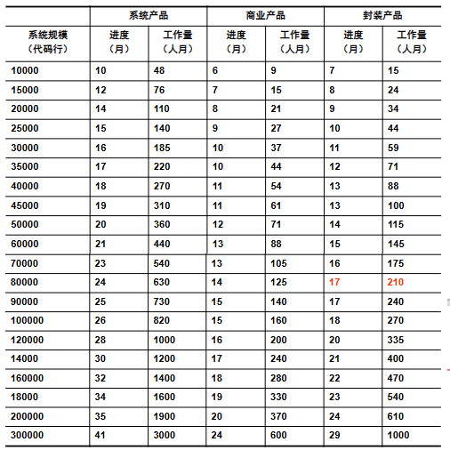
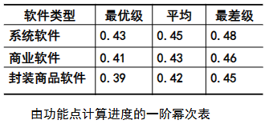
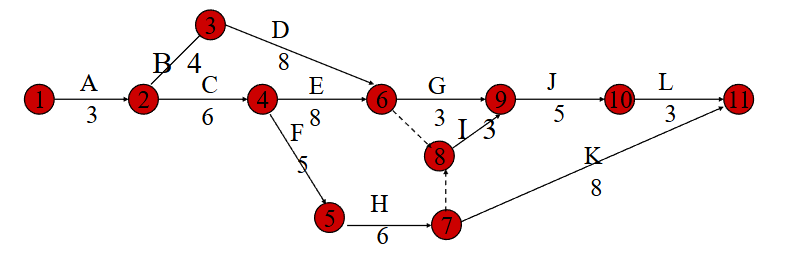
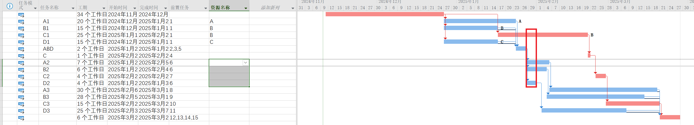

# Ep.7 软件项目进度管理

## 总结

* 进度计划过程
  1. 识别任务（在3.2范围管理中完成，得到 WBS）
  2. 确定任务依赖关系
  3. 为每个任务估算工作量、资源和进度
  4. 给每个任务分配资源
  5. 调整任务顺序和资源，直至达成一致同意的计划
  6. 确定项目里程碑
  7. 创建活动网络图、甘特图
* 关键路径法(CPM)的绘制、时间计算
* 时间压缩方法
* 资源分配

## 一、概述

### 1. 进度管理

一旦**任务**（来自 WBS）和**对应的工作量**（来自估算）已知，则需要制定进度表。

项目进度表就是一个日历，将要完成的**任务和**将要完成这些任务的**资源联系起来**。  
将任务按照时间顺序排列，能够体现**任务的依赖关系**。

**标注内容**：

* 计划日期
* 持续时间
* 里程碑
* 资源

**意义**：

* 保证在正确的时间有正确的**资源可用**
* **避免**不同的活动在相同的时间**竞争相同的资源**
* 为每个人员**分配任务**，协调人员
* 实际的进度可以**有标准进行衡量**
* 产生**成本消耗计划**
* 依据进度计划调查某个活动完成**时间延迟**后带来的**后果**
* 进度计划作为一种**沟通工具**在干系人之间达成共识

**相关术语**：

* **活动 / 任务**：基于 WBS，WBS 的最底层节点则是一个活动（也称任务）
* **里程碑**：**一组活动（一个阶段）的终点**，只代表一个关键节点、其持续时间为 0。

### 2. 进度管理、规划过程

有两种进度规划方法：

* 预测型方法：对应瀑布，依据工作量估算来预测完成时间
* 适应型方法：对应敏捷，依据优先级来规划

**PMBOK 对进度管理过程的步骤**：

1. 规划进度管理
2. 定义活动
3. 排列活动顺序
4. 估算活动持续时间
5. 制定进度计划
6. 控制进度

**进度规划过程**：

1. 识别任务（在3.2范围管理中完成，得到 WBS）
2. 确定任务依赖关系
3. 为每个任务估算工作量、资源和进度
4. 给每个任务分配资源
5. 调整任务顺序和资源，直至达成一致同意的计划
6. 确定项目里程碑
7. 创建活动网络图、甘特图

### 3. 任务依赖关系

一个任务涉及的资源或工作产品，是另一个任务随后需要的，则两者具有依赖性。  
如果要使用“关键路径分析法”，必须要确定依赖关系。

**两种依赖设计**：

* 逻辑设计：只考虑活动的**顺序（先后）关系**，称为**活动排序**（Sequencing）
* 物理设计：在逻辑设计基础上考虑**资源约束**，称为**调度**（Scheduling）

进度计划一般先按照逻辑设计排序，然后根据资源等其它因素进行物理设计。  
*除了这两种主要依赖关系，可能还有其他因素，如采购因素等。*

**四种顺序关系**：

* **完成开始**(FS)：B 只能在 A 完成后 开始（最常见）
* 开始开始(SS)：B 只能在 A 开始后 开始
* 完成完成(FF)：B 只能在 A 完成后 完成
* 开始完成(SF)：B 只能在 A 开始后 完成

**依赖关系分类**：

* 强弱
  * 强制性依赖关系（硬逻辑关系）：**固有的依赖**、由**客观因素**限制导致的依赖（比如测试必须在开发完后进行）
  * 选择性依赖关系（软逻辑关系）：由项目管理团队确定的相关性、是**人为设定**的、主观的
* 内外
  * 内部依赖关系：项目活动之间的紧前关系，**在项目团队的控制之中**（比如测试必须要团队将机器组装完成）
  * 外部依赖关系：项目活动与外部活动的相关性，**不在本项目团队控制范围内**（比如测试必须等购买的硬件设备到达）

### 4. 进度规划原则

* **并行**组织任务，以最优利用资源
* 使任务**依赖关系最小**，避免等待
* 安排中包含一定**缓冲**
* 依赖于项目经理的经验

## 二、进度图示

有以下几类图示：

* 甘特图
* 网络图：PDM、ADM、CDM
* 里程碑图
* 资源图

### 1. 甘特图

关注时间和活动依赖。

### 2. 网络图 - PDM, ADM

1. **优先网络图(PDM)**、单代号网络图、活动在节点法(AON)  
   
2. 箭线法网络图(ADM)、双代号网络图、活动在箭头法(AOA)  
   
3. *条件箭头图法网络图(CDM)，实际很少用*

### 3. 里程碑图

按照里程碑的检查情况画图。

### 4. 资源图

关注各个资源（主要是人员）的占用情况。

## 三、进度估算

用工作量来估算进度（持续时间），  
如果工作量是 60 人月(pm)，理论上安排 20 个人就能在 3 个月内完成，  
但进度和工作量并不是简单的比例关系，还要考虑到**团队效率**和**项目最短时间**。

**团队效率**与团队的沟通有密切的正关系，而沟通又**与团队规模有反关系**。

以下是进度估算方法。

### 1. 经验公式估算法

$$
D=E/(S\times P)
$$

* $D$ - 进度：用 h, d, week 表示
* $E$ - 工作量：用 pm, pd 表示
* $S$ - 团队规模：用人数表示
* $P$ - 开发效率：范围$(0,1]$，没有量纲，表示了团队效率和个人效率的关系

需要确保**团队规模合理**（不能太大，比如 10 人团队）

适用于：**规模比较小**的项目（小于1万行代码 / 工作量小于 6pm）

### 2. 参数公式估算法

$$
D=a\times E^b
$$

* D 进度，E 工作量
* $a,b$为系数，根据经验：
  * $a$一般取$2\sim4$之间、通常为$3$
  * $b$一般为$1/3$

假如$E=65pm$，按照经验系数则算出$D=12m$，此时暗示了团队最佳大小是$65/12\approx5,6$个人。

适用于：没有任何估算经验的项目经理，可以作为估算的开端。

> 两个常见模型：
>
> 1. IBM 模型  
>    
> 2. COCOMO 模型  
>    

### 3. 自上而下经验分配比例法

如果估算工作量时，只有整个项目的工作量，则上面两个方法只能得到整个项目的用时。  
此时如果要**得到每个阶段的用时**，就可以用“经验比例法”。

经验比例法将整个项目的历时，按经验划分到每个阶段上；  
得到阶段历时后，再根据识别的任务(WBS)分配到每个阶段的各个任务上。

$$
各阶段工作量（历时）=项目总工作量（历时）*各阶段分配比例系数
$$

**比例系数来源**：

1. 行业数据
   * 需求 - $13.10\%$
   * 设计 - $12.71\%$
   * 构建 - $41.56\%$
   * 测试 - $22.59\%$
   * 实施 - $10.04\%$
2. 经验比例
   1. 40-20-40规则：编码前40，编码20，编码后40
   2. 计划$2\sim3$、需求分析$10\sim25$、软件设计$20\sim25$、编码$15\sim20$、测试$30\sim40$（不包含实施交付阶段）
   3. 需求$18$、设计$13$、构建$26$、测试$28$、实施$15$
   4. 因为需求模糊，所以需求阶段时间不可控，可以抛开需求阶段分配时间、只考虑计划、设计、编码、各种测试
3. 其它比例
   1. McConnell - 《软件项目生存指南》  
        
      其认为：1) 需求分析要另外花费项目$10\sim30\%$的时间；2) 项目应给出$10\sim15\%$的比例、进行**项目管理和支持活动**
   2. Walker Royce：还考虑了**环境配置和项目实施**阶段  
      

### 4. 基于承诺的进度估算法

从需求出发来安排进度，让**开发人员自己做出进度承诺**来安排进度。

* 优点：有利于开发者对进度产生关注；承诺比安排是一个相对更准确的时间表
* 缺点：开发人员一般乐观估计，低谷$20\sim30\%$

### 5. 大致的进度表估算法

给一个表来参考，有三类：

* 可能的最短进度表
* 有效进度表
* 普通进度表

从下往上进度越来越短，要求越来越高。

#### (1) 可能的最短进度表

几乎不可能完成，只能作为一个进度审核的依据（不可能比这个还快）。

#### (2) 有效进度表

是**实践中的最佳情况**。

**条件**：

* 人员
  * 有人才库中前25%的最拔尖的人作为开发团队成员
  * 开发人员有1年的应用编程、编程环境工作经验
  * 对目标有共同看法、没有严重冲突
  * 有效的人员模式
  * 每年人员调整小于 6%
* 其它
  * 有效的变成工具
  * 主动的风险管理
  * 优良的物理环境
  * 沟通工具使用方便

#### (3) 普通进度表

一般状况。

**条件**：

* 人员
  * 人才库中中等以上的人作为开发团队成员
  * 开发人员对编程经验和编程环境一般熟悉
  * 对应用领域有一定经验、但不丰富
  * 每年人员调整是 10~12%
* 其它
  * 编程工具一般
  * 风险管理不像理想情况一样得力
  * 工作环境一般
  * 沟通工具还可以
  * 进度压缩一般

#### (4) Jones 一阶估算准则

利用功能点的总和进行估算。

不能代替更仔细地进度估算，只是提供了一个获得粗略进度估计的简单方法、或用于快速检查。  
比如一个封装商品软件功能点 350 个，则最优情况都是$350^{0.39}=10$个月。

## 四、进度规划

### 1. 关键路径法(CPM)

#### (1) 元素

相当于 ADM 网络（“活动在箭头法”）  
或者说拓扑遍历找关键路径法，可以想到图论中图的节点无意义，**关键是连线和权重、代表活动**。

* 箭线：表示一个活动，箭尾表示活动开始、箭头表示活动结束、方向表示活动前进方向  
  * 活动代号写在上面、活动历时写在下面
  * **虚箭头**：不占用资源、只表示时间前后关系（用来连接有多个前置活动的活动）  
    一般来说没有历时、但有时候表示要延迟时会有历时
* 节点：剪线的交点，表示活动的开始或结束，用圆圈+数字表示  
  不消耗时间和资源。  
  只有一个全局起点和终点。

一个活动图有多个线路，其中最长的就是关键路径。

#### (2) 构造规则

* 前置活动：活动的紧前活动
* 后置活动：活动的紧后火哦的那个
* 只有一个起点、一个终点
* 箭线有持续时间，节点无持续时间
* 节点顺序编号，而且**箭头节点的编号**要大于**箭尾节点的编号**，编号可以不连续编。
* 活动可用两编号表示，例如③→④：就可表示为活动(3-4)
* 网络不包含圈，**不能出现循环**
* 网络不能有悬空点（也就是不能有多个终点）
* 两个相邻节点**只能有一条箭线**  
  对于有多条箭线的情况，要用“虚活动”来表示，如：  
  

**虚活动的其他用法**：

  
这里想表达的是：A指定硬件后可以C处理硬件订单，但只有同时A指定硬件和B设计数据结构后可以D编码，  
左图设计则不合理，可以转换为右图。

**例子**：

  

#### (3) 识别关键路径 - 节点最早最晚开始时间

就是拓扑遍历里找关键路径的方法：节点的**最早开始时间 等于 最晚开始时间**。

*一些相关术语可以见 PPT P75~79。*

对于 ADM 网络的节点表示方法：

**方法**：

* 求节点最早开始时间(ET)：正推  
  从起点开始，ET为0；每个节点的ET，是所有入节点的ET+活动用时的最大值
* 求节点最晚开始时间(LT)：逆推  
  从起点开始，LT=ET；每个节点的LT，是所有出节点的LT-活动用时的最小值

**例子**：

下面是另一种表示法：  

**一些意义**：

* 关键路径：就是项目工期，所以：
  1. 要确保关键路径上的资源和活动顺利进行
  2. 要缩短整个项目周期，必须缩短关键路径
* 非0时差：可以用来进行活动调整（延时），而不会影响整个工期
* 近似关键路径：长度比关键路径周期短$10\sim20\%$的路径，容易在缩短工期后变成关键路径。

### 2. 时间压缩

在**不改变项目范围前提**下，寻找**缩短项目计划**的途径。
有以下两种方法。

#### (1) 平行作业法 / 快速跟进法

就是将一些前后活动平行地进行，这些活动通常要按前后顺序进行（例如，在设计完成前，就开始写程序）。  
平行作业常导致返工和增加风险。

**具体方法**：

* 增加提前量：针对FS（完成开始）关系，将后置活动提前进行
* 减少滞后量：针对FF, SS关系，将本来要在某一活动完成（开始）后再完成（开始）的活动提前（减小滞后量）

**示例**：

#### (2) 应急法 / 赶工法 / 时间-成本平衡法

通过**增加资源**，以最小的成本代价来压缩进度工期的一种方法。  
方式包括：为活动增加人员、加班、付费。

由于会增加成本，所以要权衡成本和进度间的得失关系，以决定如何用**最小增量成本**以达到**最大量的时间压缩**，  
因此也称为时间-成本平衡方法。

**进度压缩和成本增长的关系**：

1. 线性关系法
   即每个活动存在一个正常进度和对应的正常成本；也存在一个压缩后的进度和对应压缩后的成本（可见下方示例），  
   然后在这之间压缩进度是，成本也成比例变化。

   **例子**：  
     
   
2. 进度压缩因子法  
   就是进度与成本是**非线性关系**，但这个方法主要是计算**压缩后的工作量**的。  
   
   * 公式：  
     $$
     进度压缩因子＝期望进度/初始进度 \\
     压缩后的工作量＝期望工作量/进度压缩因子
     $$
   * 举例：  
     项目初始进度是12个月，但是要求压缩到10个月，那么压缩因子为10/12＝0.83。  
     如果初始工作量78人月，那么压缩后工作量78/0.83＝94人月，其含义是进度压缩17％，工作量增加21％。
   * 要求：进度压缩因子不应该小于0.75，否则就需要减少工作量（如缩小项目规模），不能仅仅压缩进度

### 3. 资源分配

资源是项目中所需的人员或者任何事物。  
有些资源在整个项目中都需要；有些则在部分活动中需要。前者管理起来反而比较简单。

**类别**：

* 人力
* 设备：基本办公条件（桌椅、计算机，非消耗资源）
* 材料：消耗资源
* 空间：房间要保证能容纳更多的人
* 时间：可以和其它主要资源代替
* 钱

#### (1) 资源识别与分析

  

#### (2) 资源调度

将资源需求映射到具体的活动上。  
此时最好用**横条形甘特图**呈现活动计划, 从而可以产生对每个资源的直方图，如下。

  
在下方的直方图中，反映的是对分析员的需求，高度代表数量需求。  
在这里假设"SM","DM"这两堆任务每个任务都只需要一个分析员，故刚开始第8、13周需要4个；而过后越来越少。

##### (2).1 平衡资源

* 存在问题：有时候**可用资源少于所需资源**
* **解决方法**：将活动**延期**或者将活动**剖分开**，使得资源图变得均匀（高的往少的填）  
    
  注：D不仅被剖开了（先做8w，后面再做5w），还被延后了2w

解决问题后，将同一资源分配给多个活动时，需要**对活动进行排序**，  
考虑：

* 总**浮动**：具有最小浮动的活动具有最高优先级（因为浮动越大，可调整余地越大）
* 其他指标  
  如按：最短关键活动、关键活动、最短非关键活动、具有最小浮动的非关键活动、非关键活动

##### (2).2 找出瓶颈活动并进行时间压缩

* 存在问题：上面的解决方法是延期，但有时候延期导致整个工期延误
* 解决方法：还**需要进行时间压缩**

**举例**：

对应的关键路径（瓶颈）：  

因此对于关键路径中，"详细说明模块 C"可以用"平行作业法"拆分，  
即：先检查对模块A,B，D的分析，然后就开始设计，对C的分析的检查另行进行。  

此时总工期缩短了 5 天，
活动图和甘特图变为：  
  

然后可以将 C 推迟 15天，这样会又延迟 1 天，所以总工期相比最开始是缩短 4 天。

> 注：此时还是会在后面的设计模块阶段出现资源冲突，如下图：  
>   
> 可以看到红框处，仍需要 4 位分析员，后面还需要进行调整（在 (2).4 分配资源中调整）。

##### (2).3 重新得到关键路径、生成关键路径

按照上面的举例，活动图变为：  
  
关键路径发生了改变（变成最下面的路径）。

**生成关键路径**：

注意到：关键活动"详细说明模块 C"，依赖于"详细说明模块 B"和"详细说明模块 D"能够及时完成（这样分析员才能空出来），  
所以这两个活动虽然不在关键路径上，但**也是关键活动**。

即：**关键活动依赖（前置）的活动**，也是关键活动，称为生成关键活动。

##### (2).4 分配资源

涉及具体的资源分配。  
**思想**：越关键的任务，分配给越资深的人员。

通常分为“分析阶段分配”和“设计阶段分配”，  
分析阶段以一个核心思想进行大致分配、而设计阶段需要再考虑到资源的冲突并解决，形成实际的分配方案。

*下面按上面的具体例子来说明。*

**分析阶段**：

考虑：谁说明模块、谁设计模块。  
故这么分配：  

**设计阶段**：

分析阶段发生了冲突（上图红圈），故需要调整。  
如果仍按照原本的想法进行延期，无法满足不延迟工期，只能换人。

  
换人后延期，不影响总工期。

#### (3) 计算成本进度

按照员工每日工资和分配的任务工时，计算人力成本；以及每日间接成本带来的非人力成本。  

同时可以得到每周成本和累计成本。  

### 4. 容易忽视的问题

* 假期（周末，节假日，病假，事假等）
* 精力上的时间损失
* 沟通与会议（传达和被理解比想象中占用的时间要多的多）
* 人员交接上的时间损失
* 确认与评审时间（等待的时间也许长得无法忍受）

## 5. 进度规划修正

假定有一个6个月的进度计划，计划4周完成第一个里程碑，而实际用了5周。这时怎么修正进度计划？

1. 假定能在后续进度中弥补损失的一周？
2. 把这一周加到整个进度中？
3. 把整个进度乘以拖延的数量（比例），本例中为25%？

建议选择3
