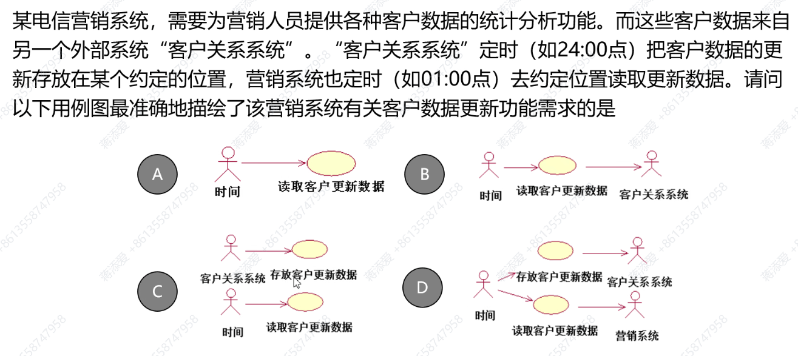

# Ep.3 需求

## 一、理解需求

### 1. 需求定义和内容

> 定义 - 需求：
>
> 需求是客户可接受的、系统必须满足的条件或具备的能力。
>
> (IEEE) 用户解决问题或达到目的所需的条件和能力；系统或系统部件为满足合同、标准、规范或其他正式规定文档所需具有的条件和能力；反映上述两条件所描述的条件或能力的**文档说明**。

* 功能性需求：详细描述了系统必须有能力执行的动作，用 IPO(Input, Process, Output) 来描述
* 非功能性需求：定义了系统工作时的约束、特性，如下 URPS+
  * 可用性(Usability, U): 人为因素（美观、易用）、用户界面、文档、培训资料
  * 可靠性(Reliability, R)：故障频率和严重性、故障平均时间(MTTF)、故障恢复能力
  * 性能(Performance, P)：响应时间、内存使用等
  * 可支持性(Supportability, S)：可扩展性、可测试性、兼容性、可配置性
  * 其他需求(+)：设计约束、接口需求、物理需求

### 2. 需求工程

需求中可能存在大量错误，如果没有在需求设计阶段及时发现更正，会引起软件开发费用增加、质量降低、甚至造成失败。  
需求中的错误是可以避免的。  
故需求也需要开发——**需求工程**。

即以工程化思想开发和管理需求。

* 需求开发：建立待开发的系统提供一个清晰的、一致的、精确的并且无二义性的需求模型
* 需求管理：在整个系统开发过程对需求进行有效地管理，特别是对需求的变更

需要注意：用户要求不等于用户需求

**主要工作**：

* 确定目标和范围 -> 问题和目标分析技术  
  从业务现状中发现系统问题、确定目标和范围
* 获取需求 -> 需求获取的启发技术  
  归纳整理用户的各种问题和要求，获得系统需求
* 文档化需求（需求建模规约） -> 基于用例模型文档化需求  
  形成软件需求的文档化描述
* 分析需求 -> 结构化 / 面向对象的需求分析  
  采用软件观点表述需求

### 3. 需求准则

* 一致性：需求不能互相冲突或具有二义性
* 完整性：需求描述了系统所有可能的输入和响应（但很难保证 100% 的场景）
* 可行性：需求可以基于可得到的资源和约束条件得到满足
* 需要行：需求是真正需要的、并且实现了系统的目的（不一定所有需求都是系统真正需要的，需要筛选）
* 正确性：正确陈述了需求
* 可跟踪性：需求可以直接映射到系统的功能和特征
* 可测试性：定义需求使得他们可以在测试期间展示出来

## 二、确定目标范围

### 1. 确定方法

目标 = 预期 - 现状

项目所需要解决的问题，就是用户的预期和项目之间的差距。

很多时候，导致问题的“现象”并不是问题的本质，**不能只根据现象来确定需求**。  
比如看病，只解决现象（痛）而开止疼药并不能解决问题本身，而要诊断是什么疾病，  
同时还要确定各类约束条件，开药的时候要根据年龄、体重等信息确定处方。

**方法 - 鱼骨图**：

用于把握结果（特征）与原因（影响特征的要因）。  
问题的特性总受到一些因素的影响，通过头脑风暴找出这些因素，并将它们与特征值一起、按相互关联性整理，标出重要因素，形成鱼骨图。
对于鱼骨图的大骨通常采用 6M 方法：

* 中骨：事实
* 小骨：为什么会那样
* 孙骨：进一步追查为什么会那样

原因可采用 5W1H 方法分析。

### 2. 根据问题确定项目目标

明确问题后，可与项目建设方一起确定项目目标和范围。

* 项目发起人：对现状和预期有最清晰的了解
* 出资人：对项目的成本 / 效率更关注
* 属主：负责项目推动

### 3. 描述方式

* 定性描述：从总体属性、趋势、宏观的角度（口号）  
  只能指出模糊的方向，无法有效界定系统范围
* 定量描述：用具体精确的数据描述
  * SMART原则：具体的(Specific)、可度量的(Measurable)、可实现的(Attainable)、相关的(Relevant)、有时限的(Time-based)

  如定性描述“全面提升业务客户服务质量”，定量描述为：  
  
* 场景化描述：用**故事场景**描述用户期望  
  定性描述太模糊无法验证、定量描述太具体可能不能达到，这种方法则折中。

  如上例：

### 4. 活动流程

## 三、需求获取

明确范围和目标后，对需求进行提炼获取、进一步获取细节。

**需求获取的启发技术**：

* 对现有文档、表格和数据库的抽样  
  * 组织结构图：首先了解组织结构图，得到用户的组织关系
  * 产生项目的历史文档、计划
  * 描述正被研究或设计的业务功能的文档
  * 以前系统研究的设计文档
* 调研相关技术和竞品分析  
  * 互联网、期刊杂志、参考书
  * 对类似问题有经验的公司、团体、人
  * 竞争对手、竞品分析  
      
    利用 SWOT 方法进行分析
* 观察工作环境  
  观察或参与到用户的活动。
  * 优点
    * 可靠
    * 确切明白做什么：因为复杂任务难以用语言解释
    * 系统分析员可以进行工作度量
  * 缺点
    * 观察影响被观察者，表现不一样
    * 效率较低
    * 有遗漏（有些情况在特定时间发生）
    * 观察到的都是现状，是当前情况下的状况、现在这么干的，而不能看到当系统出现后未来状况如何。
* 问卷调查表
  * 格式
    * 自由格式（问答题）
    * 特定格式（选择题）
  * 特点
    * 可匿名、表达真实想法
    * 主观性很强
    * 大规模调查需要专业人员设计问题和分析结果
* 面对面访谈
  * 组成：面谈者、被面谈者、**问题**
  * 特点
    * 可以建立友善关系，给用户主动做贡献的感觉，从而得到更多反馈
    * 取决于系统分析员（面谈者）的交际能力
  * 设计问题
    * 5W+1H
    * 多问开放式问题（答案自由）
    * 避免诱导性问题
    * 前期要开放式、非诱导式，因为对需求还不了解，只能广泛听取；  
      后期对需求有一定了解后，可以考虑封闭式、诱导性问题，但要获得用户真实想法
* 系统原型
  * 工具
    * Axure RP
    * Figma
    * 墨刀、蓝湖
* 用户故事 / 场景  
  轻量化的用户需求调研手段
  * 描述方式：“作为【角色， Who】，希望通过系统【功能， What】，以便达成【商业价值， Why】”
  * 3C
    * 卡片(Card): 故事的简短描述、工作量估计
    * 交谈(Conversation): 细节来源于和客户的交谈
    * 确认(Confirmation): 通过验收测试确认用户故事被正确完成
  * 用户故事地图

**总结**：  

## 四、需求建模（规约）

### 1. 基于用例的需求模型

组成：参与者 + 用例。  
用例图模型化了系统对外提供的功能（用例）和系统外部使用环境（参与者）。

* 参与者：在系统之外，通过系统边界与系统发生交互的对象  
  * 要素：
    * 系统外：不是系统的一部分
    * 系统边界：透过系统边界直接与系统交互
    * 系统角色：参与者与使用系统的物理人和职务没有关系，需要从参与系统的角色（作用）来寻找参与者
    * 与系统交互：系统需要处理其交互过程，即系统职责
    * 任何事物：人、外系统、时间、因素
  * 寻找方法：  
    
  * 文档化
    * 描述：简要、准确描述该参与者扮演的角色和职责
    * 基本特征：职责范围、物理环境、使用习惯、用户数量和类型、使用系统的频率
    * 干系人、典型用户
* 用例：关键在于“**价值**”（有没有用）  
  参与者使用系统这个用例达到目标  
  用例实例时系统执行的**一系列动作**，这些动作将生成特定参与者可以观测到的结果值
  * 与功能的区别：
    * 用例是在需求阶段，是用户的想法，面向用户
    * 功能是在设计阶段，是系统的能力，面向系统
  * 寻找方法：  
    
  * 命名：（状语+）动词+（定语+）宾语
* 关联关系：用例与参与者之间的关系，表明参与者与用例**产生交互**  
  关系箭头的方向代表**交互行为的发起方向**

例题：  
  
因为客户关系系统是外部系统，故不考虑其任何内部交互，其“存放数据”这一用例与本系统无关，排除C, D；  
同时，“客户关系系统”就是本系统，肯定也不作为参与者，排除 B；  
答案: A  

### 2. 撰写用例文档

用例图只是对系统目标的总体描述，需要用用例文档**对用例图进行更精细的描述**。  
用例文档是需求文档的核心，用例图作为用例文档的索引图。、

**主要内容**：

* 用例名称
* 概述
* 前置条件
* 后置条件
* **事件流**：业务流程
* 关系
* 活动图：对用例事件流的可视化
* 特殊需求（补充约束）：数据需求、业务规则（如算法）、非功能需求、设计约束
* 其他图

### 3. 用例关系重构

即"Include", "Extend"等。

### 4. 常见问题

* **用例不是功能分解**  
  用例是“因”、功能是“果”
* 用例$\ne$需求规约文档  
  需求规约文档还包括数据要求、非功能需求、设计约束、用户界面、验收标准等
