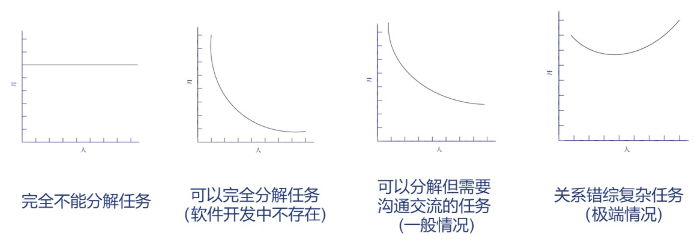

# Ep.1 寻找银弹

## 一、焦油坑

**大型的**系统开发经常遇到焦油坑。  
单独的问题很简单，但当其相互纠缠、放入一整个系统时，复杂度会急剧膨胀、导致团队行动变慢。

软件开发的**过程演化**为：

1. 程序(Program)
2. 系统(Programming System, 包含各类接口 Interfaces, 系统集成 System Integration) 
3. 产品(Programming Product, 包含泛化能力 Generalization, 测试 Testing, 文档 Documentation, 运维 Maintenance)

表现如下：

### 1. 进度滞后、延期  

是最普遍的现象。

**原因**：

* **乐观主义**，过度自信  
  开发过程中往往基于“一切运行良好”、“任务仅花费应该花费的时间”这样的假设，对于大型的编程工作往往不是如此，导致错误估计。
* 人月神话
  "人月"本意是工程上的计量单位，值为“参与开发的人员数目 * 项目的持续月数”，确定了开发人员，便可以算出开发时间；  
   但使用人月为单位来衡量一份工作的规模，是一个危险和具有欺骗性的*神话*。它暗示人员数量和时间是可以相互替换的。

   是神话的原因：

   * 许多任务无法拆建
   * 即便任务可以拆解，但人员之间的沟通交流成本会因人手增加而以 $(n-1)*n/2$ 递增  
     
* **测试（系统测试）时间安排不足**（检测 bug 最有效的方法就是测试）  
  由于乐观主义，通常实际软件出现的缺陷数量比预计的更多，造成系统测试进度安排不合理，导致直到项目发布，才有人发现进度的问题。
* 空泛、**不准确的估算**，没有客观、可量化的估算手段  
  * 有限的时间
  * 非阶段化方法的采用
  * 极少的数据支持
  * 完全借助项目经理的直觉

  如同厨师，某项任务的计划进度是由用户的紧迫程度决定，但紧迫程度无法准确控制。
* 因估算不准导致**调整进度**，从而产生灾难性的重复工作后果  
  若存在进度延迟，若要保证相同开发时间，则只能增加人手，但又会导致需要培训、任务需要重分解、人员沟通合作成本增加、合并难度增大等问题。  
  导致“越调整、越落后”。  
  因此，在开始的估算中就要把这些情况考虑充分，尽量避免之后的调整。

  进度已落后、避免上述问题的方法：

  1. 重新安排进度，即进行延期、安排新的合理的工作进度，并保证之后不会重新调整
  2. 削减任务，先不实现部分需求

> **Brooks 法则**:  
> 向进度落后的项目增加人手，只会使进度更加落后。

### 2. 缺乏沟通

大型项目需要注重沟通，否则会因为信息不透明导致系统失效。

沟通方式：

* 成员之间非正式途径的经常性讨论
* 定期召开的项目会议
* 项目工作手册、文档

### 3. 文档问题

**问题**：

* 自己不愿意给代码留下文档
* 使用别人的代码却找不到文档

**文档只需要撰写关键的文档**：

* 书面的决策更加精确
* 文档可作为交流沟通的手段
* 文档可为系统将来的优化和扩展提供指导
* 项目经理的文档可作为项目的数据基础和检查表

**不提倡过度的文档**：

* 给用户最终产品不是文档
* 可利用各类 CASE 工具管理文档

**需要的文档**：

* 做什么：开发目标（愿景、需求）
* 怎么做：产品技术说明（架构设计），以建议书开始、以内部文档和用户手册结束
* 时间：进度表
* 资金：预算
* 地点：工作空间分配
* 人员：组织图

**自文档化的程序**：

即代码当中的格式化注释，从而自动形成文档。

## 二、银弹

银弹(Silver Bullet)指解决所有问题的通用方法。  
*来自于古希腊神话中的人狼，只有银弹可以消灭这种怪兽、且非常有效。银弹一出，这个威胁就彻底解决了，发生根本性变革。*

目前没有银弹，即没有任何技术或管理上的紧张，能够独立地许诺十年内使生成率、可靠性或简洁性获得数量级上的进步。

没有银弹的原因 —— 软件项目的内在特性：

* 复杂性  
  软件工程十分复杂：
  * 软件不存在流水线（不可能有代码完全重复的软件）
  * 数学物理可以抽象、抽掉复杂性，建立简化模型；而软件天生是复杂的、复杂性是必要属性，抽掉复杂性也去掉了软件的部分本质属性
* 一致性  
  没有一个一致性的逻辑，同一功能不同的人实现不一样。  
  在自然界中存在**天然的**一致的各类规则（物理化学生物）；但软件中没有，是由人本身制定的。  
  软件工程师必须控制很多复杂度、但这些通常是随心所欲、毫无规则的，来自各种必需遵守的人为惯例和系统。
* 可变性  
  软件会进行需求变更、更新迭代。  
  软件实体纯粹**是思维活动的产物**，很容易修改。  
  软件依赖于其他存在，如用户、硬件、社会、自然规律等。
* 不可见性  
  软件大部分是不可见的，没有客观载体。  
  导致剥夺了一些具有强大功能的概念工具的构造思路。

许多技术只能提高效率，但不是银弹：

* 高级编程语言
* 面向对象编程
* 人工智能
* 图形化编程
* 程序验证
* 迭代开发
* 智能化

## 三、软件工程

> 定义 - 软件工程：
>
> * 软件工程是建立和使用一套合理的**工程原则**，以便获得**经济**的软件，这种软件是**可靠**的，可以在实际机器上**高效**的运行。
> * 运用现代科学技术知识来设计并糟糕计算机程序设计，及为开发、运行和维护这些程序所必须的相关资料文档
> * 将**系统化的、严格约束的、可量化的**方法应用于软件的开发、运行和维护，即将工程化应用于软件。

软件工程是以借鉴传统工程的原则、方法，以提高质量，降低成本为目的指导计算机软件开发和维护的工程学科。

**目标**：

* 实现功能
* 高性能
* 高质量
* 江都成本
* 维护费用
* 及时交付

**要点**：

* 时间
* 质量
* 成本

**学科范畴**：

* 数学、计算机科学：提供用于软件开发的模型与算法
* 工程科学：制定规范、设计规划、评估成本等
* 管理科学：管理计划、资源、质量、成本

**软件工程知识体**(SWEBOK)：  

包含软件工程各个体系领域的知识，涉及 15 个知识域(KAs)，每个知识域包含若干个知识点(KPs)。

有以下知识域：

* 软件工程专业基础知识
  * 软件工程经济
  * 计算基础
  * 数学基础
  * 工程基础
* 软件工程实践领域
  * 软件需求
  * 软件设计
  * 软件构造
  * 软件测试
  * 软件维护
  * 软件配置管理
  * 软件工程管理
  * 软件工程过程
  * 软件工程模型与方法
  * 软件质量
  * 软件工程职业实践

*中国软件工程知识体系(C-SWEBOK)。*

## 四、软件工程方法

提供“如何做”的**技术**，贯穿于整个软件开发过程。  
SWEBOK 2004 将软件方法分类四类：

* 启发式方法：用于非形式化处理问题  
  只是用于辅助、常见于需求、设计阶段，如各类建模、面向数据、面向对象。
* 形式化方法：基于数学的方法处理问题  
  用于模型建模和模型证明。
* 原型方法：以各种形式的原型处理问题  
  在启发式方法基础之上，建立模型来描述处理。
* 杂类方法

### 1. 启发式方法

**发展**：

1. 数据(Data) + 处理(Process) -> 面向过程、结构化方法
2. 将数据和处理整合在一起 -> 对象(Object) -> 面向对象
3. 多个对象共同作用 -> 组件(Component)/服务(Service)
4. 虚拟化（如像水电，直接可取用）、云(Cloud)化

抽象层次不断提升，从面向机器变成面向人。

### 2. 形式化方法

采用严格的数学描述语言，具有精确的数学语义的一类方法。  
利用逻辑推理，将所有事物建立为逻辑表达式，故可以进行证明。

传统的启发式方法只能通过软件测试保证软件质量，但测试只能发现问题、不能证明软件不存在问题。  
对于安全关键软件、**高安全高可靠软件**（如车载机载软件），更需要严格的方法保证软件质量。

**特征**：

* 对软件的期望特征或行为进行精确、简洁的形式化描述
* 基于形式化描述，对软件相关特性进行数学分析和证明
* 利用程序求精，实现从抽象的形式化规格，推演出具体的面向计算机的程序代码
* 开发过程所采用的是基于软件生命周期的模型变换，可在开发前端发现、分析、设计问题

**常见方法**：

* 自动机（简单，常见于编译器）
* 时序逻辑
* 通信顺序进程（CSP）
* Z 语言
* B 方法
* Petri 网
