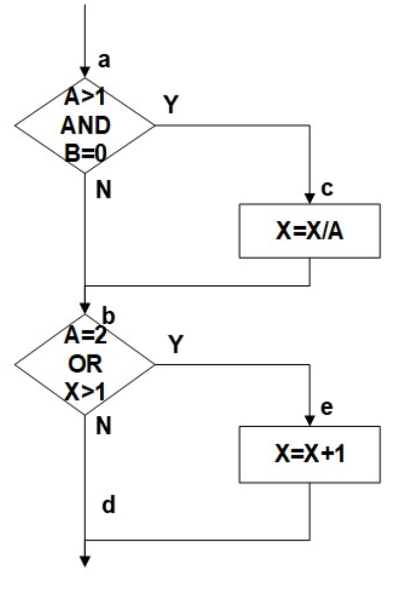
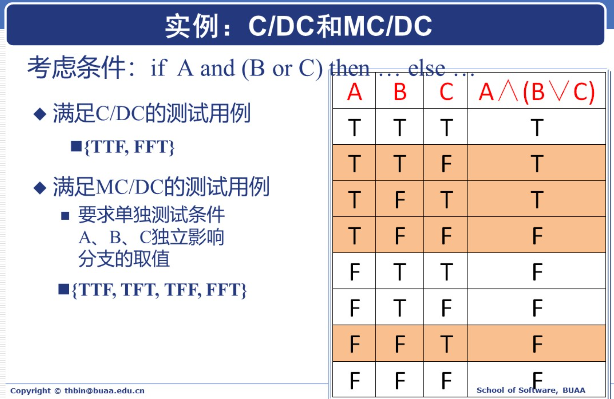
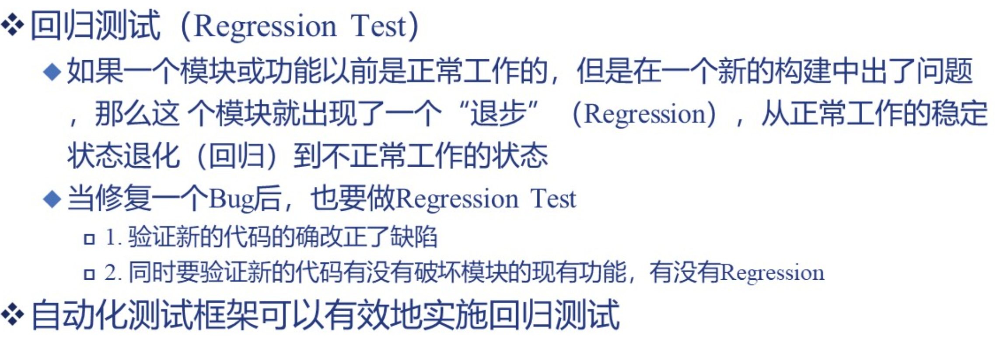
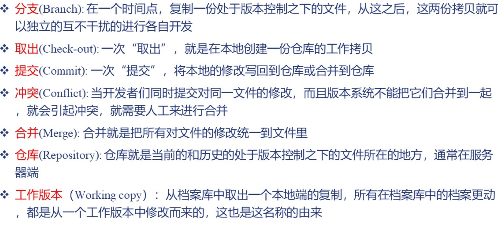
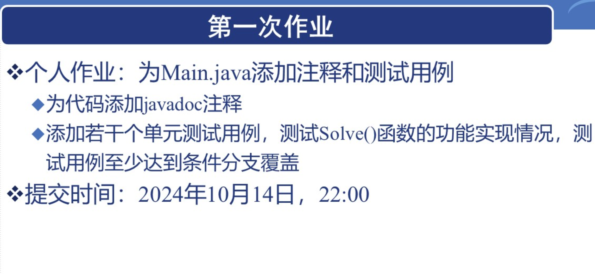

# Ep.2 软件工程个体能力

## 一、储备个人技能

### 1. 个人技能领域

* 编程
  * **程序理解**：阅读、分析、调试
  * **架构设计**：模块化、接口设计
  * **模块实现**
  * **单元测试**：考虑单元覆盖度
  * 性能分析和改进
  * 代码评审、规范、质量
  * 进程/线程/平台的通信
  * 命令行脚本、文件系统
  * 大数据处理
  * 编程语言
  * 最新技术发展
  * 基本设计模式：MVC、GoF、OCP
* 软件工程
  * 个人代码管理：Git/SVN
  * 估算、记录工作流：知道自己的代码进度
  * 需求分析
  * 基本项目管理
  * 测试：测试系统的设计和运行
  * 开发工具使用：IDE、性能工具、配置管理、开发环境
* 专业和平台
  * 计算机科学：数据库、算法、体系结构
  * 支撑学科：人机交互、数学、心理学
  * 开发平台：Web、PC、Mobile
  * 业务领域：游戏、企业、金融
* 职业能力
  * 自主学习
  * 任务计划
  * 按期按质量完成任务
  * 协同工作
  * 展示：报告、想法、写文档

*扩展：PSP(个体软件工程)*

### 2. 代码质量

> 区别 - 产品质量和代码质量：
>
> * 产品质量：指产品满足规定需求和潜在需求的特征和特性的总和。
> * 代码质量：指软件源代码满足系统需求的程度。

代码质量可以表现为两个部分：

* 外部质量：用户可以感受到的部分，即正确性、易用性、效率、可靠性
* 内部质量：可维护性、可移植性、可读性、可理解性

好的产品（外部质量很好），不等于好的代码（内部质量很好）。

*扩展：衡量代码质量 —— WTFs/min*

内在质量的七个维度：

1. 编码规范：是否遵守代码规范、是否遵循最佳实践。
2. 潜在 Bug：是否是可能在最坏情况下出现问题的代码，以及存在安全漏洞的代码
3. 文档和注释：过少、过多（信息太冗杂）、过时
4. 重复代码：违反 Don't Repeat Yourself 原则
5. 复杂度：代码架构复杂（圈复杂度高），难以理解维护和测试
6. 测试覆盖率：编写单元测试，特别是针对复杂代码的测试覆盖是否足够
7. 设计与架构：是否高內聚、低耦合、依赖最少

## 二、规范个人代码

需要面向人写代码，让别人能读懂。

**作用**：

1. 促进团队合作
2. 降低维护成本
3. 减少 Bug
4. 代码审查
5. 自身成长

代码规范的实施范围：

* 强制部分：公司
* 推荐部分：项目组、优良习惯

原则是绝大多数求同、少量求异。

---

**代码异味**(Bad Smell)：
如果一段代码不稳定或有一些潜在问题，那么代码往往包含一些明显痕迹。
如同食物腐败前会散发异味，这种痕迹便叫做代码异味。

典型的异味：

1. 神秘命名
2. 重复代码
3. 过长函数（最佳的是一整个屏幕能放下）
4. 过长参数列表
5. 全局数据
6. 可变(Mutable)数据
7. 发散式(Divergent)变化：存在一种万能类，因此当需要修改时总会改他 -> 解决方法：拆开
8. 散弹式(Shotgun)修改：当提出需求需要变更时，发现各个类都有更改 -> 解决方法：结合
9. 依恋情节：在某一个类的函数，却大量使用另一个类的函数 -> 解决方法：挪动
10. 基本类型偏执：喜欢用简单类型
11. 重复的 switch：逻辑复杂 -> 用 state/strategy 模式调整
12. 过长的消息（调用）链：一个对象请求（调用）另一个对象；然后再调用另一个对象
13. 被拒绝的集成：继承过多，最子类只用最父类的很少属性 -> 用“代理”来替代继承
14. 注释：注释太多，证明代码难懂

## 三、测试个人代码

即单元测试。

> 定义 - 单元：
>
> 软件设计的最小单元（软件构件或模块），
> 最基本的是函数、然后是类。
> 是可编译、装配、链接、加载。

单元测试是针对程序单元进行正确性验证的测试工作。
测试重点是模块内部逻辑。

**任务**：

* 模块接口
* 局部数据结构
* 边界条件
* 独立路径
* 错误处理

**技术**：

完全测试（所有情况测试到）是不可能的，因为情况太多。
故要使用以下测试方法：

* 白盒测试 - 内部视角
* 黑盒测试 - 外部视角

### 白盒测试 - 内部视角

白盒测试是根据代码结构生成测试用例。

白盒测试可以：

* 保证一个模块中所有独立路径至少执行一次
* 对所有逻辑分支均测试真和假
* 在上下边界、即可操作的范围内执行所有的测试
* 验证内部数据结构，以确保其有效性

**方法**：

* 流图
  * 构建：对程序流程图简化，突出描述程序逻辑
    对于复合条件（多个布尔运算），需要为每个条件创建不同的结点（即便只有两种情况/结果）  
    如下：  
      
    节点`A>1`先分成两个，一个Y指向`B=0`、一个N指向`A=2`；然后`B=0`分成两个，一个Y指向`c`、一个N指向`A=2`；  
    接着`A=2`如上分成两个。
* 当画出流图后，可以计算圈(cyclomatic)复杂度  
  圈复杂度是一种为程序逻辑复杂度提供定量尺度的软件度量，  
  定义了程序基本集合中的**独立路径**数。

**技术**：

* 基本路径测试：基于独立路径
  利用流图和圈复杂度计算出独立路径数，然后找到所有独立路径，设计相应测试用例。
* 循环测试：基于循环结构
  基本路径测试只是用于简单的分支逻辑，不适用循环逻辑。
  * 简单循环
    如果最大循环次数为$n$，则测试集测试如下：
    * 不循环
    * 1、2 次
    * m 次（小于 n）
    * n-1, n, n+1 次
  * 嵌套循环
    不能直接用多重简单循环方法
    
  * 串接循环
    如果两者独立，则简单循环测试；否则嵌套循环测试。
  * 非结构循环
    无法测试，需要将其结构化
* 覆盖测试：基于覆盖目标
  比路径测试简单
  * 语句覆盖
  * 分支覆盖：每个 if 的 Y/N 都测试到了
  * 条件覆盖：每个 if 中各个子条件的 Y/N 都测试到了（如果各个 if 只有一个条件，则分支覆盖 == 条件覆盖）
  * 条件分支覆盖(C/DC)：由于分支和条件覆盖不能相互保证，故需要一起测试
  * 修正的条件分支覆盖(MC/DC)：模块的输入和输出点都至少考虑 1 次，if 的 Y/N 都执行 1 次，每个 condition 对于 if 的结果值都是**独立**的（每个条件都会影响最终结果的选择）。
    独立性指：如三个条件A, B, C，但 B, C 不变，A 变化时结果会变化，则 A 是独立的。
    则：要找一个 if 的所有 condition(n 个)，满足其具有独立性的两个测试用例（最多 2n 个）
    
    所需测试及比 C/DC 严格，但准确率更好。
  * 多重覆盖
  * 循环覆盖

**好的单元测试**：

* 在最基本的功能 / 参数上验证程序的正确性
* 测试后机器状态不变
* 产生可重复、一致的效果
* 覆盖所有代码路径

**100% 的代码覆盖不等于 100% 的正确率**：

* 对“应该写但是没有写”的代码无能为力
* 有性能问题
* 多线程中同步的问题

**测试驱动的开发**：

在开发功能代码前，先根据测试用例编写测试代码。只编写使得测试通过的功能代码，从而驱动整个开发进行。

**回归测试**：

## 四、管理个人代码

### 1. 软件配置管理(SCM)

用于配置识别、配置控制、配置状态记录与报告、配置审计

核心：

* 版本控制
* 变更控制
* 过程支持

管理范围：

* 数据
* 配置
* **代码**
* 部署
* 文档
* 硬件

### 2. 代码管理

**发展**：

* 单机版(RCS)
* 集中式(SVN)：只有一个中心的版本服务器
* 分布式(Git)：每个本地都有本地版本库

**术语**：

---

## 课后

作业：
