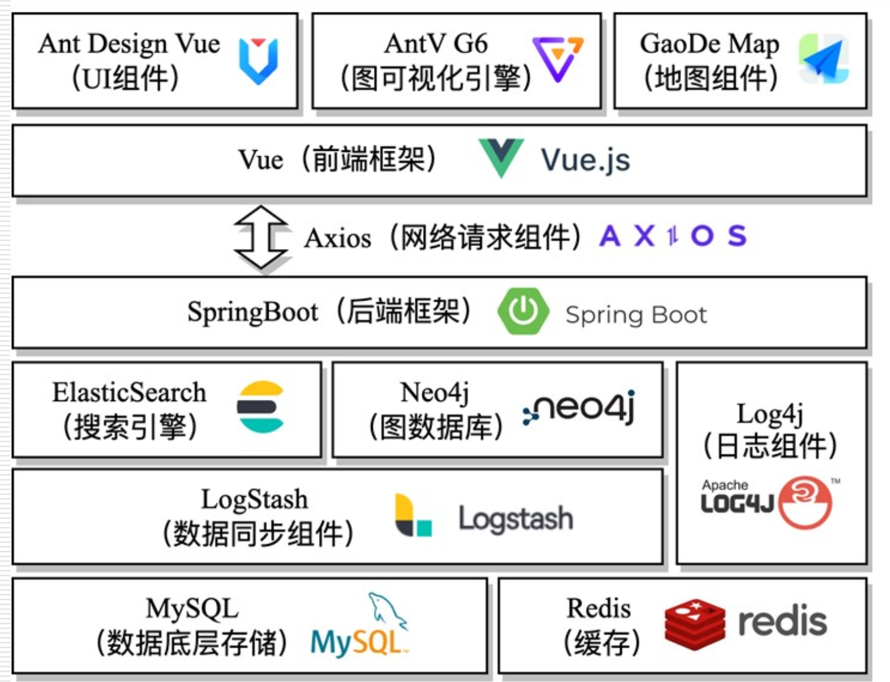

# 设计基础

拿到需求后，要将其设计为软件的功能模块。

## 一、理解设计

需求解决做什么(How)、设计解决怎么做(What)。

> 定义 - 软件设计：
>
> 设计是架构、构件、接口、以及系统其他特征定义的过程。

**必须包括**：

* 系统的架构(architecture)  
  如何分解和组织构件，即概要设计 / 结构设计。
* 构件间的接口(interface)
* 构件(component)  
  即模块设计。

**分成两个阶段（工作）**：

1. 架构设计(Architecture Design)  
   为引领性的作用，确定软件如何分解成各部分、以及各部分之间的相互关系
2. 构件设计  
   面向对象方法则对应于类；结构化方法则对应于模块

**方法**：

* 结构化设计方法  
  基于过程的分解。  
  * 架构设计：按照过程将系统分解为不同模块，模块最小粒度为函数  
  * 构件设计：关注模块内的算法、数据结构、用户界面
* 面向对象
  * 架构设计：分层、分区
  * 构件设计：类

**作用**：

* 设计决定方向问题，形成解决方案的蓝图
* 可以对模型进行**分析和评价**，判断其满足各种需求
* 便于考察备选方案和可行的替换措施
* 设计模型可以用于规划后续的开发
* 是编码和测试阶段的输入

## 二、设计原则

用于解决下述问题：

* 使用什么样的准则，才能把**软件分解**为各个单独的构件
* 怎么把功能和数据结构的细节，从软件概念表达式中分离出来
* 定义软件设计的技术质量有统一标准吗

有很多原则，重点讲下面四个：

* **分解**：考虑模块独立性，关注内聚和耦合指标
* **抽象**：数据抽象、过程抽象、对象抽象
* **分层**：类层次、对象层次
* **复用**：架构复用、设计复用

### 1. 分解

核心为”分治“思想。

**基本原理**：

令$C(X)$代表问题$X$的复杂性；$E(X)$代表解决问题的耗时（工作量）。  

* 对于一个问题，越复杂则耗费工作量越多。
* 把一个问题划分为两个独立的子问题，往往比考虑单个问题更简单，并且工作量也更小

分解后问题并不能独立，往往需要集成、进行通信，引入额外的成本即工作量，所以不能无限分  
即$E(P) ? E(P_1)+E(P_2)+E(P_1P_2)$。

$E(P_1),E(P_2)$固定，所以需要控制接口成本$E(P_1P_2)$。  
即：确保**模块的独立性**，与其他模块的接口相对简单。

模块的独立性可由两个定性标准度量：

* 耦合：不同模块彼此互相依赖的金木程度
* 内聚：一个模块内部元素彼此结合的紧密程度

高内聚、低耦合，则模块独立性高。

#### (1) 内聚 (Cohension)

* 高内聚
  * 顺序内聚：前一个的**输入**就是后一个的**输出**
  * **功能内聚**：整个模块的各个组成部分就为了实现一个小功能，单独划分出来没有意义，合在一起才有
* 中内聚
  * 过程内聚：由控制流联结在一起，**存在先后关系**，但并**没有输入输出关系**（区别顺序内聚）
  * 通信内聚：模块间**使用同一个输入**数据、或**向同一个数据输出**
* 低内聚  
  从功能、执行过程讲都不相关。
  * 偶然内聚：没有特定意图的放在一起，拆开之后完全可以
  * 逻辑内聚
    如分层结构中的界面层，都用于展示界面，但大部分界面相互之间没有关系，  
    或者一个 UI 库的笔刷、组合为一个包，都是用来绘制，但彼此之间没关系。
  * 时间内聚：若干个工作集中在一个时间内，但工作彼此无关  
    如初始化

并不是说低内聚不好，有时候甚至还必须要低内聚，只是要认识到内聚程度这个概念。

#### (2) 耦合 (Coupling)

* 低耦合
  * 无耦合：完全不依赖对方，脱离后可以工作
  * 数据耦合：调用和被调用者，存在**简单变量**这样的**数据传递**，但**不会影响内部执行逻辑**（区别控制耦合）
  * 特征耦合：传递数组、对象这样的**复杂数据**，但**不会影响内部执行逻辑**（区别控制耦合）
* 中耦合
  * 控制耦合：传递的是一个控制信号，会影响其执行逻辑（如传 0 执行什么，传 1 执行什么）  
    > 这个在实际开发中很常见，但不推荐，可以考虑：
    > 1. 拆分为多个只有单一逻辑的方法
    > 2. 利用策略(Strategy)等设计模式
  * 外部耦合：多个构件与同一个**外部环境**关联（IO、通信协议）
  * 公共耦合：多个构件访问同一个全局**数据结构**
* 强耦合
  * 内容耦合：允许一个构件直接调用另一个构件内的数据（公有成员）或控制信息（goto）

上方是基于过程式、函数的耦合，对于面向对象，还有一些耦合关系：

* 交互耦合：构件之间的消息调用（对应时序图里的消息传递）  
  降低：
  * 消息的参数要少
  * 消息的数量要少
* 继承耦合：是面向对象里耦合度最高的关系，因此**继承关系必须谨慎**
  * 继承类之间应该紧密耦合在一起
  * 避免低耦合的继承

还有一些内聚关系：

* 操作内聚：操作是否只完成一件事
* 类内聚：一个类的属性和方法是否相关
* 一般-特殊（继承）内聚：子类要真正描述父类的特征，并使用父类的许多属性和方法

### 2. 抽象

抽象是通过特定的实例，抽取共同特征后形成概念的过程。  
要揭示区别于其他事物的本质特征，强调主要特征，忽略次要特征。

分解会将问题无限细化，关注同一层次的细节；  
而人的注意力的 7+2 原则，当细节太多后，则要抽象为一个层次，从而只关注特定细节。

软件工程过程的每一步就是对较高一层抽象的进一步解释：

* 需求阶段：用户具体行为 → 问题域
* 设计阶段：需求 → 构件 → 类

**方法**：

* 过程抽象：定义函数，并自顶向下或自底向上逐步深化
* 数据抽象：定义数据结构
* 对象抽象：将构件由具体的类表示

### 3. 分层

将问题的各个方面分解到不同层次进行处理。

**分层结构**：

* 系统层次：系统行文分配到不同层次  
  上层面向用户、下层面向机器，越下层复用程度越高
* 类层次：建立不同抽象层次的类  
  利用**继承**关系体现层次结构
* 对象层次，将对象分解为不同层次的部分  
  用**组合**体现层次结构（如大学由学院、办公处等组成，学院又由系组成）

### 4. 复用

* 代码复用  
  通过继承、聚合、关联等手段使用已有的代码，即各种包 / 库。
* 设计复用  
  通过设计模式(Design Pattern)寻求设计的复用，其不受实现环境的影响。  
  设计是对某个问题的解决方案，如果可以抽象出对某类问题的解决方案，则可称为设计模式。  
  其针对具体的业务场景，复用粒度仍然较低。
  **GoF设计模式**：包含 23 种最经典的设计模式，包含：
  * 创建型
  * 结构型
  * 行为型
* 架构复用  
  对类似的业务系统，采用相似的软件架构，及“架构模式”。
* 需求复用
* 领域复用  
  上面的两个是对问题领域某些事物的抽象描述，独立于设计技术和实现结构，  
  如：分析模型、数据资源模型、领域建模、领域软件工程

## 三、设计过程

* 逻辑设计（系统分析）：独立于技术方案，建立平台无关的设计模型（PI）
* 方案选型（过度换件）
* 物理设计（系统设计）：针对特定技术平台，考虑实力环境，建立平台相关的设计模型

### 1. 逻辑设计方法

* 两个层面：上层结构和底层细节
* 两个维度：静态和动态结构
* 两个方面：结构化和面向对象

### 2. 方案选型

就根据逻辑设计，去决定选择什么方法。

### 3. 物理设计

1. 决定技术：数据库、后端、前端、UI 组件  
   
2. 组件、包图
