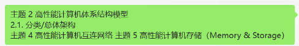

# 大作业

IBM Roadrunner

* 简要概述介绍
* 按之前的主题，深入介绍
  * 主题2 - 是什么架构
  * 主题4 - 互联方式
  * 主题5 - 存储方式

周五晚上

---

我在“高性能计算机体系结构”一课中，需要做一个主题调研，具体要求如下：

本次课程大作业以主题形式开展调研，每组根据国内外相关论文、教材、网站等资料对某一主题开展调研，形成报告并在课上进行汇报展示。调研参考资料范围不做限制。
课程所有学生分为10个小组，对应10个高性能计算机相关主题。各主题和参考题纲如下所示：

1. 高性能计算机科学技术问题和工程实现挑战
   1.1. 性能
   1.2. 并行性
   1.3. 可编程性
   1.4. 可靠性
   1.5. 功耗
   1.6. 问题和挑战的应对方法
2. 高性能计算机体系结构模型
   2.1. 分类/总体架构
   2.2. 单指令多数据流 SIMD
      2.2.1. Vector Pipelined 向量流水计算机
      2.2.2. Processor Array SIMD 阵列机
   2.3. 多指令多数据流 MIMD
      2.3.1. 共享存储型（SMP、CC-NUMA）
      2.3.2. 分布式存储（并行向量处理机 Vector、大规模并行处理机 MPP、机群 Cluster）
3. 高性能计算机节点机
   3.1. 高性能计算机对节点机的需求（高性能、低功耗、高 IO 带宽、高集成度）
   3.2. 节点机处理器
      3.2.1. 超标量处理器
      3.2.2. 向量处理器
      3.2.3. 众核处理器
      3.2.4. 向量扩展处理器
      3.2.5. 通用 GPU
      3.2.6. TPU
   3.3. 节点机系统
      3.3.1. 节点机体系结构
      3.3.2. 节点机系统硬件
      3.3.3. 节点机系统软件
   3.4. 节点机操作系统
      3.4.1. 操作系统结构和服务
      3.4.2. 进程管理
      3.4.3. 线程
      3.4.4. 内存管理
   3.5. 节点机类型及实例（计算、存储、服务、管理、登录等节点机）
4. 高性能计算机互连网络
   4.1. 高性能计算机对互连的需求
   4.2. 互连网络基本概念
   4.3. 消息传递机制
   4.4. 互连网络拓扑
   4.5. 高性能计算机互连网实例（以太网、Infiniband、Myrinet、QSnet 等）
5. 高性能计算机存储
   5.1. 高性能计算存储层次
      5.1.1. 数据重用和局部性
      5.1.2. 存储层次结构
      5.1.3. 存储系统的性能
   5.2. 内存
      5.2.1. 访存模型（UMA、NUMA、COMA、CC-NUMA、NORMA 等）
      5.2.2. 分布式共享存储系统
      5.2.3. 访存介质（如 DDR、HBM 等）
   5.3. 外存（可参考《High Performance Computing: Modern Systems and Practices》）
      5.3.1. 存储设备（如硬盘存储器，固态硬盘存储器，磁带，光存储等）
      5.3.2. 存储阵列 RAID
      5.3.3. 存储网络（DAS、NAS、SAN）
      5.3.4. 文件系统
6. 高性能计算机系统软件
   6.1. 系统部署工具
   6.2. 资源管理系统
   6.3. 作业调度系统（如 Torque PBS、SLURM、LSF、Condor 等）
   6.4. 系统监控工具
      6.4.1. 性能监控
      6.4.2. 资源监控
      6.4.3. 故障监控
   6.5. 可视化
      6.5.1. 基本概念
      6.5.2. 可视化工具包 VTK
7. 高性能计算机系统的评价方法及评测工具
   7.1. 性能指标：峰值性能、持续性能、可扩展性
   7.2. 性能评测方法
      7.2.1. 机器级性能评测
      7.2.2. 算法级性能评测
      7.2.3. 程序级性能评测
   7.3. 基准测试程序（可参考《High Performance Computing: Modern Systems and Practices》）
      7.3.1. 高度并行计算的 Linpack，HPCG，NPB
      7.3.2. 能效相关 Benchmark
      7.3.3. 人工智能算法 Benchmark
      7.3.4. Top500，Green500
      7.3.5. 戈登贝尔
8. 高性能计算机开发环境
   8.1. 并行编程模型
      8.1.1. OpenMP 编程模型
      8.1.2. MPI 编程模型
   8.2. 分布式计算环境
   8.3. AI 编程模型
   8.4. 库（数学加速库、AI 加速库）（可参考《High Performance Computing: Modern Systemsand Practices》）
9.  经典的高性能计算机系统设计实例
   9.1. 地球模拟器 ES
   9.2. IBM Roadrunner
   9.3. 曙光系列高性能计算机
   9.4. 联想深腾系列高性能计算机
   9.5. 天河 2 号
   9.6. 神威·太湖之光
   9.7. Summit & Sierra
   9.8. 富岳 Fugaku
   9.9. 美国的 E 级机
   9.10.中国的 E 级机
10. 高性能计算机的应用举例
   10.1. 高性能计算机在气候预测、地球科学方面的应用
   10.2. 高性能计算机在工程学方面的应用
   10.3. 高性能计算机在药物开发、生物信息学方面的应用
   10.4. 高性能计算机在材料学等方面的应用
   10.5. 高性能计算机在经济学、金融学方面的应用
   10.6. 戈登贝尔奖举例

我们组负责的主题是“主题9. 经典的高性能计算机系统设计实例”，现在需要围绕该主题完成一份调研报告，要求为：
（1）调研报告需要内容详实、引用清晰、内容与主题紧密相关；
（2）调研报告中的内容如属摘录或参考其它文献资料，则摘录内容相应的文字段落后需注明参考文献来源（教材、论文或网址）；
（3）调研报告评分：完成质量、内容详实程度。

而我们组计划，针对一些典型的高性能计算机系统（HPC），结合之前的主题来深入地讲解，包括：
1. 主题2 - 高性能计算机体系结构模型：围绕上方的主题2. 高性能计算机体系结构模型其中的2.1.分类/总体架构，详细讲解该HPC是什么架构
2. 主题4 - 高性能计算机互连网络：围绕上方的主题4. 高性能计算机互连网络和其中各个部分，详细讲解该HPC的互联网络，比如是什么类型（按拓扑结构/控制方式/应用需求等分类）、是什么消息传递机制、什么消息传递模型、怎么针对消息传递进行性能优化、是什么网络拓扑（Fat-Tree, 环面、超立方体、多层次拓扑等）、该网络拓扑的成本/时延/最小割是多少（用大O表示）等
3. 主题5 - 高性能计算机存储：围绕上方的主题5. 高性能计算机存储和其中各个部分，详细讲解该HPC的存储层次、内存的访存模型/介质、外村的存储设备/阵列/网络/文件系统等

对于我，我所选择的HPC是“IBM Roadrunner”。那么我需要围绕这台HPC，完成我的调研和报告撰写。根据我们组的计划，我认为调研和报告应该分为以下几个部分：

1. 简要介绍：对该超算的简单、全面的概括性和要点性介绍
2. 体系结构模型：对应上方的我们组的计划1
3. 互联网络：对应上方的我们组的计划2
4. 存储：对应上方的我们组的计划3

那么接下来，我需要你协助我完成进行调查，以及这个报告的撰写。首先，我需要你向我讲解上方关于高性能计算机的主题2 高性能计算机体系结构模型，按照主题题纲进行讲解，以便让我对这个主题有一个全面的认识。