# Roadrunner

## 架构

> 补充一些架构的基本知识：
>
> **费林分类法**：
>
> 按照指令流和数据流分类为以下四种：
>
> * *SISD*：单指令流、单数据流，为极早期的个人 PC、或者现在的嵌入式芯片。
> * **SIMD**：多指令流、单数据流，每次只处理一组数据，但通过指令并行（流水线）/空间并行（多处理器）来达到并行处理  
>   目前来说：不作为 HPC 的整体架构，但 HPC 的部分芯片可能为这个架构（比如 GPU(CUDA)、向量流水处理器（指令并行）、处理器阵列（空间并行）
> * *MISD*：单指令流、多数据流，只运用于特定的架构，HPC 基本不考虑。
> * **MIMD**：多指令流、多数据流，现如今最常见的脚骨
>   * 按内存模型视角分类  
>     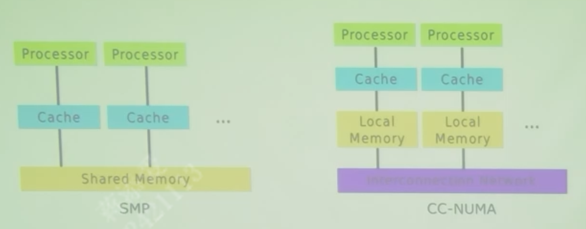
>     * SMP：所有处理器**共享同一内存**、是一致/对称的，适合小规模并行计算，易于编程。适用于中小型的服务器/工作站，现在采用 SMP 的 MPC 均在底层  
>       类似于 SIMD 中的处理器阵列，区别在于共享级别：处理器阵列具有更高的共享级别，而 SMP 只共享内存  
>         
>       但共享内存通常很底层，并不好实现和控制
>     * CC-NUMA：每个处理器**有自己的本地内存**、是非一致/对称的，访问其他处理器的内存时需要**通过网络**，适合大规模并行计算。适用于大规模的科学计算  
>         
>       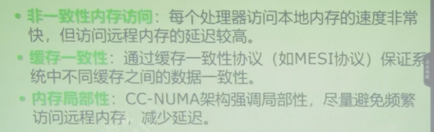  
>       *还存在非缓存一致的 NC-NUMA，但会带来编程开发的困难，所以不推广*
>   * 按处理器结构视角分类
>     * PVP（并行向量处理机）：low了
>     * MPP(大规模并行处理机)
>     * Cluster(集群)  
>       MPP 与 Cluster 有些相似，不过区别在于松散程度：Cluster 肯定更松散、而 MPP 是节点(Node)内的并行/分布式  
>         
>       MPP 就是专门设计的一个整体，而 Cluster 就是分布式集群、堆数量的（再利用类似 Ethernet/IB 互联；Hadoop 管理）。  
>       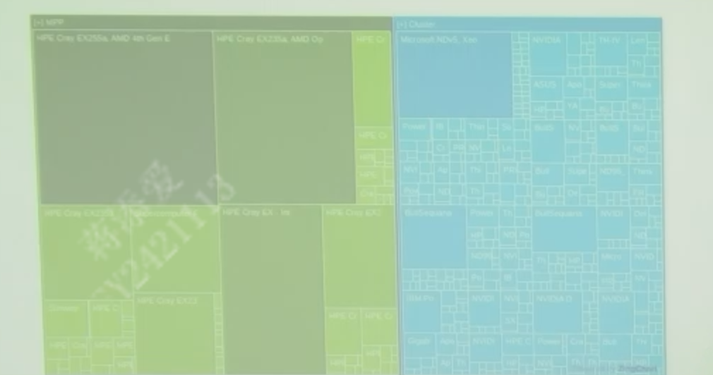  
>       可以看到top30都是MPP、专门设计肯定很好，但数量少；  
>       而后面的大量都是 Cluster、很容易设计，性能肯定打不过专业的
>
> 由于 HPC 肯定要有数据的并行处理，所以只考虑 SI**MD** 和 MI**MD**，而现在基本上都是 MIMD。

Roadrunner 不出意外的应该是 **MIMD 的 Cluster**
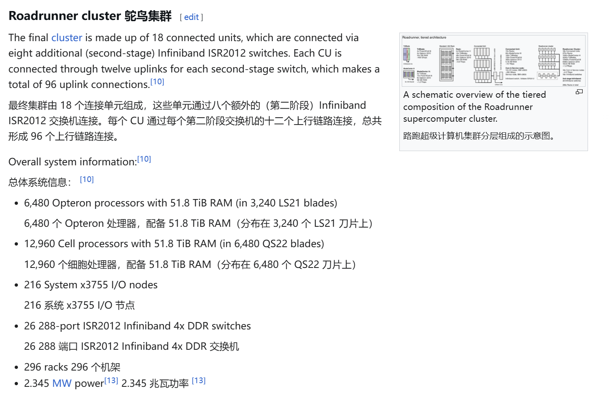（来源[3]维基百科）

### 整体

是一种“hybrid Cell-Opteron architecture”（混合了 PowerXCell 8i 和 Opteron 两种CPU(?)的架构）

从宏观到微观（但讲的时候应该从微观到宏观）：

* Roadrunner = 17 * Computer Unit(CU)，达到 1.38P flop/s  
  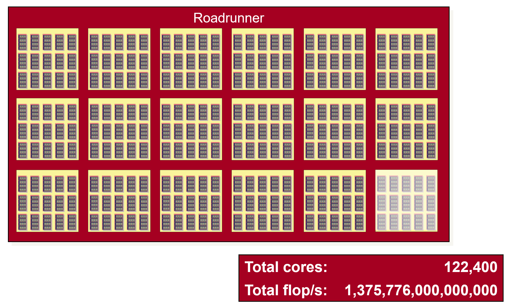  
  （注：图中白色的并没有，故一共只有17个）
  * Connected Unit(CU) = 15 * 机柜  
    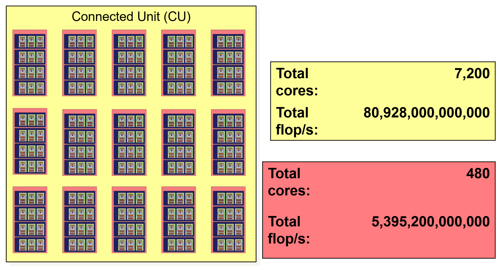
    * 机柜 = 4 * BladeCenter  
      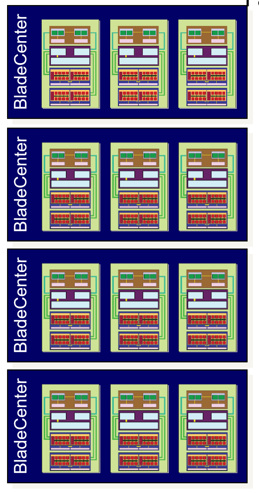
      * BladeCenter = 3 * Compute Node(Triblade)
        * Compute Node = 2 * QS22 + 1 \* LS21 + 1 * 扩展卡  
          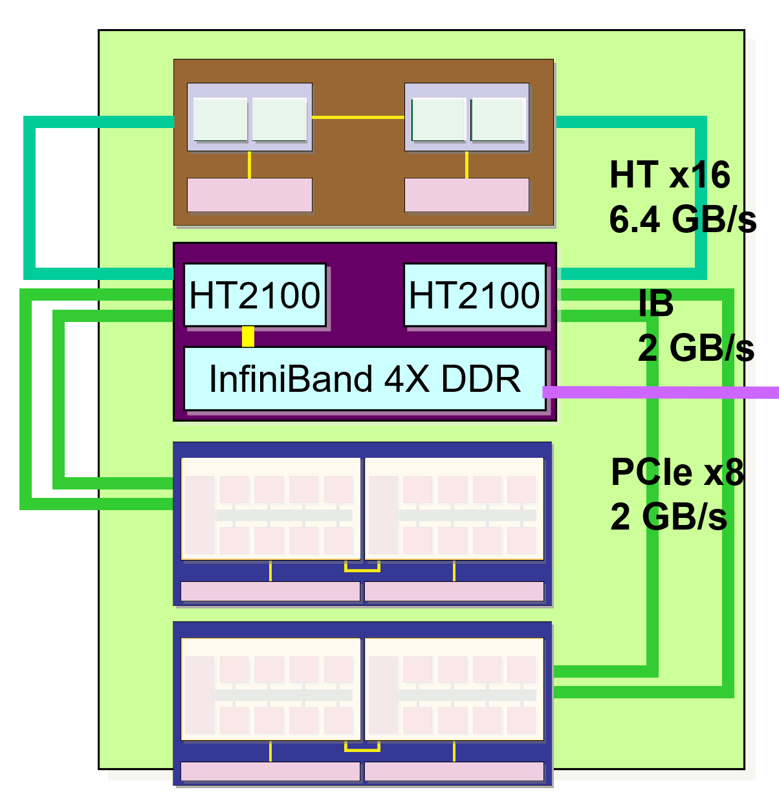  
          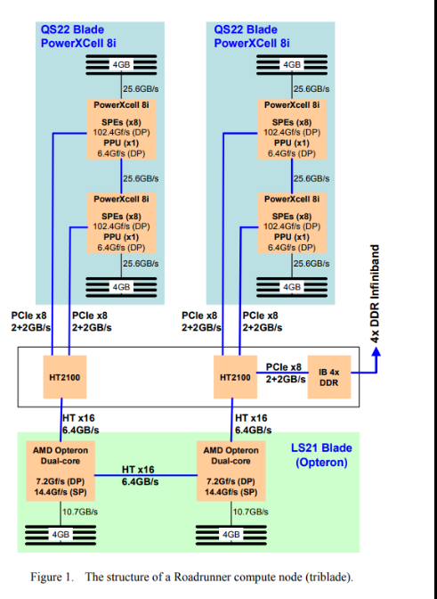  
          三刀片(TriBlade)结构：1个刀片(LS21)；2个刀片(QS22)；还有一个扩展卡占第4刀片位置，用于三者互联。  
          三刀片的每个刀片的**每个核**，都有 4GB DDR2 内存
          * QS22 = 2 * PowerXCell 8i + 2 \* 4GB DDR2  
            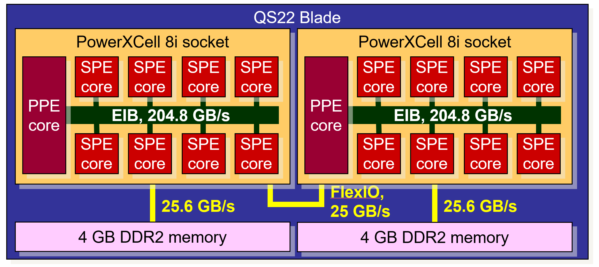
            包含2个多核 PowerXCell 8i
            * PowerXCell 8i: 包含1个功率处理元件（PPE Core）和8个协同处理元件（SPE Core），3.2GHz  
              是 IBM 的 Cell Broadband Engine Architecture (CBEA) 的实现。
          * LS21 = 2 * Opteron + 2 \* 4GB DDR2  
            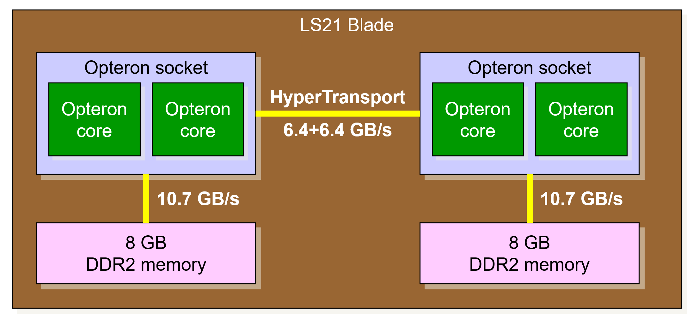
            包含2个双核(Dual-Core) Opteron
            * AMD Opteron: 双核(2 * Opteron socket)，1.8GHz
          * 扩展卡 = 2 * HT2100 + 1 \* IB 4x DDR

### 作用

* Opteron 的任务是管理标准处理，如文件系统 I/O
* Cell 处理器则处理数学和 CPU 密集型任务。  
  例如，Cell 的 8 个矢量引擎内核可以完成算法加速，比通用内核更酷、更快、更便宜。

## 互联方式

### 1. 互联方式

> 扩展学习 - IB：
>
> 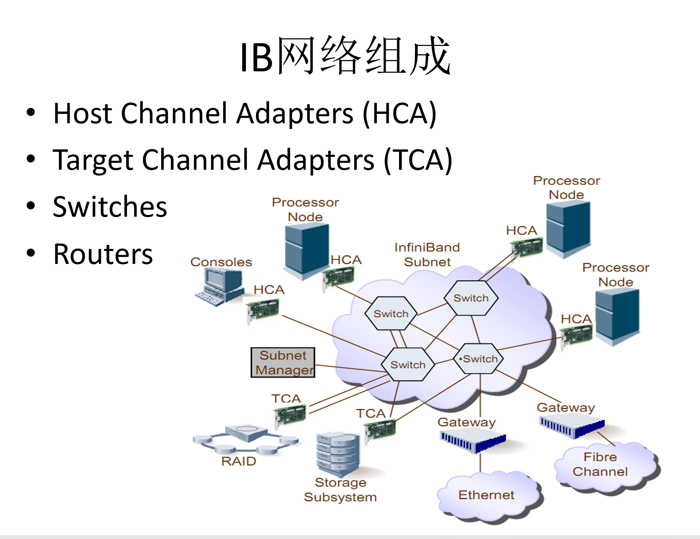

应该是：

* 内部（连接节点）：PCIe, HyperTransport
* 外部（连接存储）：InfiniBand。  
  *可参考：[1]中的“B. The Roadrunner Compute Unit”。（还未读）*

> [1] - “Within the triblade,...”:
>
> 在三刀片中，**每个 PowerXCell8i 刀片都通过两个 PCIe x8 接口与 Opteron 刀片相连**。该设计的结构如图 1 所示。每个 PowerXCell8i 刀片都与 Opteron 处理器直接相连。事实上，正如我们在后面所描述的，每个 PowerXCell8i 处理器都与特定的 Opteron 内核相关联，因此在加速运行模式下，每个 Opteron 内核都与一个 PowerXCell8i 处理器直接通信。**单元刀片的 PCIe 总线通过两个 Broadcom HT2100I/O 控制器转换为 HyperTransport 总线，以便与 Opteron 处理器连接**。HT2100 有一个 HyperTransport x16 端口和三个 PCIe x8 端口。其中一个 HT2100 的第三个端口**连接一个 Mellanox4x DDR InfiniBand 主机通道适配器（HCA）**。每个 PowerXCell8i 处理器与其相关 Opteron 内核之间的峰值带宽为每个方向 2GB/s。

总结：Cell 和 Opteron 通过 PCIe 相连，但中间经过了 HT2100 转换为 HyperTransport 总线，而 IB 与外界相连，对应 IB 的 HCA

每个 Cell 要一个 Opteron 直连的原因：[2] - "LANL's White further emphasized the uniqueness of Roadrunner's hybrid architecture, calling it a “hybrid hybrid”, because the Cell processor itself is a hybrid. This is because the Cell has the PPU (PowerPC) core and eight SPUs. Because the PPU is “of modest performance” as the folks at LANL politely say, they needed a core for running code that wouldn't run on the SPUs and improved performance. Thus, the Cells are connected to the Opteron."  
由于 Cell 中的 PPU 的 “性能一般”，他们需要一个内核来运行 SPU 无法运行的代码并提高性能。因此，Cells 与 Opteron 相连。

### 2. 消息传递

消息传递：使用Open MPI消息传递接口函数库。
> “Roadrunner is essentially a cluster of clusters of Linux Opteron nodes connected with MPI and a parallel filesystem” —— [2]
>
> “It also used the Open MPI Message Passing Interface implementation.” —— [3]（原始出处是 [4]）

**参考资料**：

## 存储

> 学习：
>
> * UMA：一致性内存访问，通过一条总线共用系统所有内存（如 SMP, 对称多处理器就是 UMA）
> * (simple) NUMA：每个处理器都有一个本地内存，可以通过网络（如IB）访问其他处理器的本地内存（远端内存）  
>   One is a simple NUMA. It can cache the memory attached to the other PUs, but the coherence is not kept.（它可以缓存连接到其他 PU 的内存，但无法保持一致性。）
> * CC-NUMA, 缓存一致性NUMA：与 NUMA 相反，可以提供一致性高速缓存。
> * COMA: 直接没有全局内存（在NUMA里是分布式内存）了，用高速缓存来取代，全局地址空间由高速缓存组成，访问远端的高速缓存借助分布式高速缓存目录进行。

### 内存

该系统还携带 98 TB 内存，  
参考自[2], "The system also carries 98 terabytes of memory,..."

应该是 (Simple) NUMA。
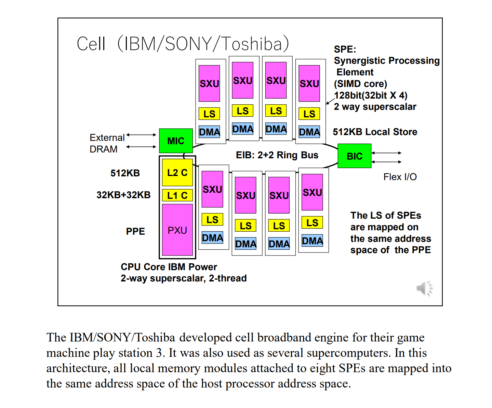

### 外存

以及 10,000 个 InfiniBand 和千兆以太网连接，需要 55 英里长的光纤布线。万兆以太网用于连接 2 PB 的外部存储。  
参考自[2], "The system also carries 98 terabytes of memory,..."

## 参考资料

* [1] Barker K J, Davis K, Hoisie A, 等. Entering the petaflop era: The architecture and performance of Roadrunner[C]. SC ’08: Proceedings of the 2008 ACM/IEEE Conference on Supercomputing, 2008: 1-11.
* [2] Gray J. The roadrunner supercomputer: a petaflop’s no problem[J]. Linux J., 2008, 2008(175): 1:1.  
  只有“Speed = Hybrid Architecture + Software”有用
* [3] Roadrunner (supercomputer)[Z]. Wikipedia, (2024-08-25).
* [4] Squyres J. Open MPI: 1015 Flops Can’t Be Wrong[J]. 2008.
* [5] https://pages.cs.wisc.edu/~markhill/restricted/lanl08_roadrunner.pdf（介绍了互联方式 Fat-Tree，有图；还有内存，NUMA，但没看懂）
* [6] https://www.am.ics.keio.ac.jp/comparc/numa.pdf（简单提到了 Roadrunner 是 (simple) NUMA）