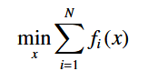
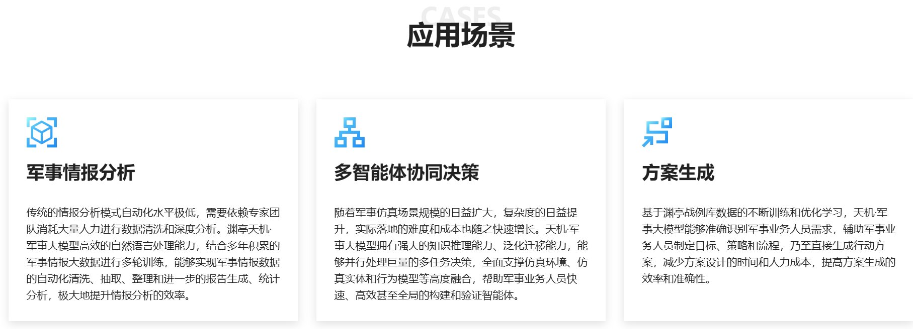

# 智能化指挥控制

智能化战争作战体系以**人工智能技术**为核心，以**栅格化网络系统**为支撑，以**信息化、智能化、无人化武器平台**为主体，以**有人/无人协同、分布式作战、蜂群作战**为主要作战样式，具有**去中心化、信息聚能、智能决策、跨域释能**的体系作战优势。

**调研路线**：

1. 智能化指挥控制、有人/无人平台协同作战背景介绍
2. 分布式协同相关技术调研
3. 群体智能相关技术调研
4. LLM 初步调研

## 一、背景介绍

*参考资料：[现代协同作战概述](https://zhuanlan.zhihu.com/p/584873777)*

### 1. 发展阶段

**有人/无人平台协同作战的三个阶段**：  

目前，有人/无人协同作战体系研究正在进入第二阶段。在该阶段，有人/无人作战体系需要**辅助作战环境中的有人武器系统作战人员（如飞行员）决策**，且为无人值守系统提供**任务执行层面的自治**。

### 2. 运作模型

**有人/无人平台协同作战的运作模型**：

  
从中可以看出协同作战体系中，各个任务和目标的所处层次。

### 3. 关键技术总览

1. **分布式人机协同技术**
   1. **分布式人机决策技术**：在分布式系统中，人、机器等分布式节点**首先进行独立自主的决策**，然后通过**一定规则进行决策的融合或协调**，最终整体形成分布式决策。
   2. **分布式管控技术**：在人机混合的分布式系统中，通过群体的**分布式感知、协同**等，**辅助人类实现更好的环境态势理解和快速决策**，从而高效地进行人机混合群体的管理和控制。
   3. **人机交互技术**：在分布式人机系统中，以分布式的方式**解决人与机器群体在任务进行过程中的语言、行为等交互问题**，促使人与机器之间的决策、行为表达等高效沟通、无障碍。
2. **群体智能技术**
   1. **群体感知技术**：智能无人群体系统利用内置的传感器**感知群体内部及周边环境信息**，并将感知信息通过通信网络**在群体内部共享**，并对感知信息进行数据融合，最终**向群体系统提供有用的信息和服务**。
   2. **群体决策技术**：群体决策是为了尽可能大的发挥群体的智慧，多智能体一起**共同参与问题分析并制定解决问题的决策方案**的全过程。
      > **与分布式决策的区别**：分布式决策通常是自主体各自提出针对自身和当前情况的最优方案，再基于某原则协商选择出最终的解决方案；而群体智能决策则综合考虑所有的方案、可能产生新的、融合各个方案的更优的方案。  
      > 分布式决策侧重于决策权力和过程的分散化，而群体智慧则强调的是集体中各成员智慧的整合和升级。
   3. **群体协同技术**：群体行为具有分布式、自组织和协调性的特点，**通过个体简单的局部规则，涌现出协同的智能行为**。群体**通过分析群体内部及周边环境**，相互合作，完成协同运动、协同计算、协同创作等群体协同行为。
      > **涌现**指系统中由个体简单行为或规则的相互作用所自然产生的全局特性或复杂行为。如鸟群飞行时，每只鸟只需遵循简单的规则（如保持与邻近鸟适当距离），整个鸟群便能形成复杂的同步飞行模式。
   4. **群体演化技术**：根据群体已得到的信息和已学习的行为，自主**演化生成更高阶的群体行为**，是群体技术的高级阶段。
3. 弹性灵活的网络及通信技术
   1. **网络安全技术**：马赛克战基本作战单元之间的通信网络通过数据加密、权限管理、通信协议加密等安全措施，保证马赛克战拼图安全自主，不受外部信号干扰、介入和操控。
   2. **灵活、开放、自适应的网络拓扑设计技术**：由于马赛克战基本作战单元进行组网和解散均是自由灵活的，因此开放、共用的网络架构，可拓展、自适应的网络拓扑，能够保障马赛克战拼图整体功能的灵活快速切换、可持续运行。
   3. **弹性网络设计技术**：该技术主要应对复杂对抗环境下的动态任务分配和网络攻击任务，提高马赛克战网络及通信的自适应任务优化组网能力、抗摧毁能力、被毁伤后的可恢复能力等。
4. 体系作战效能仿真、评估与试验技术  
   体系作战效能仿真、评估与试验技术是一种涉及各类软硬件系统和模型的综合性仿真技术，不仅需要模拟各基本作战单元的感知、决策、制导控制等功能，同时还需要进行不同功能的数学仿真或实物仿真的合理分配。更重要的是，体系作战效能评估与试验技术需要结合算法、模型和实物仿真出体系作战的概念，从而评估体系作战的效能。
5. 任务组分层自主优化调整技术  
   有人/无人武器系统优化调整问题中，使命任务、长长环境、平台状态动态性、不确定性程度高，战场自主调整适变性实时性要求较高，且优化调整过程具有的多重因果反馈关系，使得优化调整问题更加复杂。如何区分不同动因，根据任务组处理动因能力，进行分层自主优化调整，是目前有人/无人武器系统自主优化调整研究的关键问题。

## 二、分布式协同相关技术调研

### 1. 分布式协同控制

*参考资料：[Ren H-R, Liu Q-H, Zhou Q, Lu R-Q. Journal of Guangdong University of Technology, 2024. A Review of Distributed Cooperative Control Research on Unmanned Autonomous Systems[J]. 01/01/2024. Journal of Guangdong University of Technology, 2024China: , 41(4): 1–13.](https://search.ebscohost.com/login.aspx?direct=true&db=int&AN=25728174&lang=zh-cn&site=ehost-live)*

本文针对无人自主系统的**分布式协同控制**，将其划分为三种不同目标的方式方法：

1. 基于一致性问题
2. 基于编队控制问题
3. 基于分布式优化问题

#### (1) 基于一致性问题

分布式一致性控制解决的主要问题是如何在没有集中控制器的情况下, **通过局部信息的交互, 确保整个系统协调一致**。  
通过实现一致性, 系统中的各个自主体能够在一定时间内达成某一变量(如位置、速度、方向等)的一致, 有利于确保系统的稳定性和可靠性。

*即通过让所有自主系统保持一致，以达成协同控制要求。*

**需要考虑的问题**：

1. **随机网络拓扑**：拓扑结构随时间变化  
   因通信故障、数据丢包以及物理信道内在不稳定性等影响, 使通信网络的拓扑结构随时间变化。
2. **时间延迟**  
   由于信息的交换、数据的采集与处理以及控制指令生成与执行过程需要消耗时间, 所以多无人自主系统通常面临时间延迟问题。
3. **数据采样**：模拟信号采样成数字信号、离散处理  
   相邻自主体之间的信息交换会以采样数据的形式进行，引出了数据采样下的一致性问题。

**扩展**：

* 实现**重复运行**的多无人自主系统的一致性
* 应对**欺骗攻击**的安全一致性研究
* 具有**干扰抑制**的固定时间一致性跟踪

#### (2) 基于编队控制

相较于所有自主体最终状态统一的一致性问题, 编队控制策略下的自主体最终状态**展现出了更为多样化的特性**, 使得多自主体系统能够根据不同的任务需求,展现出更加灵活和协同的集体行为。

分布式策略下, 自主体可以对环境实时感知并和相邻自主体交互合作, 具有更强的适应性。

**研究分类**：

1. 基于位置：基于位置的编队控制依赖于全局坐标系, 其中每个子系统**在全局坐标系中感知自身的位置**, 并自主调整运行状态, 实现预期的编队队形。
2. 基于位移：基于位移的编队控制是基于位置的编队控制的扩展, 进一步**考虑了自主体间的平行运动**, 其中每个自主体**拥有与全局坐标系同向的局部坐标系**。  
   尽管自主体无法直接感知整个编队的全局坐标系的原点位置, 但由于坐标系对齐, 局部坐标系下的相对位置信息与全局坐标系下的相对位置信息是相同的。
3. 基于距离：基于距离的编队控制在基于位移编队控制的基础上**考虑了自主体的旋转**, 因此不再要求局部坐标系必须同向, 并且**摆脱了对全局坐标系的依赖**。  
   这种控制策略是自主体在自身局部坐标系下感知相邻自主体的距离, 通过控制期望的相对距离, 达成理想编队。
4. *仿射编队控制*：虽然上述3种基本的编队控制策略得到了广泛的研究和应用, 但它们需要通过约束位置、位移和距离来实现期望编队, 这极大地限制了编队控制的灵活性, 使**平移、旋转或缩放等这些仿射变换**操作变得困难。为了解决这一问题, 仿射编队控制策略得到了发展。

#### (3) 基于分布式优化

在多无人自主系统中, 很多控制问题都可以归为优化问题。分布式算法在优化问题的处理中得到了广泛应用。  
在分布式优化方法中,每个自主体都有一个动态状态,作为优化决策变量的估计值。每个自主体通过底层通信网络,根据其相邻自主体的局部信息,交互并更新其估计值。

**目标**：  
极小化所有自主体的局部目标函数之和。  

**模型**：

1. 无向通信网络  
   如：一阶分布式梯度下降(Distributed Gradient Descent, DGD)算法、基于Nesterov梯度法的快速分布式优化算法、分布式随机梯度跟踪算法
2. 有向通信网络：由于通信能力的不均匀, 信息交换可能是单向的, 进而网络拓扑结构是有向的。  
   如：基于Push-Sum的方法、基于Push-Pull的方法
3. 受约束优化问题：在实际应用中, 存在各种约束。针对分布式优化问题, 可分为局部约束和全局约束, 而全局约束又可分为等式约束和不等式约束。

### 2. 分布式调度

*参考资料：[张中伟, 高增恩, 王菁锐, 李艺, 武照云. 《制造技术与机床》编辑部, 2024. 分布式AGV调度研究综述与发展趋势分析[J]. 制造技术与机床, 2024(11): 55–61.](https://1951.mtmt.com.cn/cn/article/doi/10.19287/j.mtmt.1005-2402.2024.11.008)*

**分布式 AGV 调度问题(distributed AGV scheduling, DAGVS)**：无人平台充分发挥自主决策能力, 选择适合自己执行的任务/目标, 并合理规划执行/到达路径, 从而最大化提升系统的工作效率。

**两个任务**：任务分配 + 路径规划。

#### (1) 分布式任务分配

**方法**：

* **基于市场机制的拍卖算法**  
  拍卖算法模拟市场拍卖机制, 由参与方、竞拍品、收益函数和竞价策略4部分组成, 求解速度较快, 具有良好的可扩展性, 且在理论上可保证分配最优。  
    
  AGV综合考虑自身状态和任务属性对待分配任务竞标出价, 竞价成功的AGV将获得竞标任务。
* **强化学习**  
  RL 通过与环境交互来学习最优行为, 应用其解决分布式任务分配问题时, 无人平台不断地探索和学习, 优化自身策略, 以适应动态的环境和任务需求。
* **博弈论方法**  
  AGV之间竞争与合作并存, 可以利用博弈论思想分析AGV之间的竞争和合作关系, 设计合适的博弈策略提高任务分配的均衡性和效率。

#### (2) 分布式路径规划  

**考虑**：(1)执行搬运任务的**单AGV**如何规划自己的搬运路径; (2)如何避免**多AGV**之间的冲突和死锁问题  

**方法**：

* **启发式搜索算法**：A*、Push-Swap-Wait 算法、双向交替跳点搜索 A* 算法
* **群体智能算法**：蚁群算法、粒子群算法等  
  群体智能算法基于个体在整体环境中的互动和协作运行, **个体在无监督情况下行动**, 是一种集体智慧的计算方法, 有较好的鲁棒性和可扩展性
* **强化学习算法**：Q-Learning、MARL 技术（多智能体强化学习）  
  路径规划问题往往存在大量的状态和动作组合, 且环境是动态变化的。RL能够根据环境反馈不断学习和调整策略。  
  

## 三、群体智能调研——知识和数据协同驱动的群体智能决策方法

群体智能(Collective intelligence, CI)起源于**对群居性生物及人类的社会性行为的观察研究**, 因其分布性、灵活性和健壮性等优势, 为很多极具挑战的复杂性问题提供了新的解决方案, 是新一代人工智能重点发展的五大智能形态之一。

*参考资料：[蒲志强, 易建强, 刘振, 丘腾海, 孙金林, 李非墨. 自动化学报, 2022. 知识和数据协同驱动的群体智能决策方法研究综述[J]. 自动化学报, 2022, 48(3): 627–643.](https://1951.mtmt.com.cn/cn/article/doi/10.19287/j.mtmt.1005-2402.2024.11.008)*

### (1) 传统群体智能、协同驱动

**群体智能决策分类**:

* **知识驱动**：充分利用已有知识, 包括已有模型与算法知识、规则经验知识以及特定领域知识
  1. 数学物理模型：如群体动力学模型
  2. 基于模型的算法知识：如路径规划算法、任务分配算法
  3. 规则经验知识：对于集群基础行为的认知构建起的集群简单行为规则, 如各类基于模糊理论、知识系统构建起的规则推理方法等
  4. 面向特定应用场景的领域知识：例如在兵棋推演系统中构建的各类实体要素模型和裁决规则知识  
     为群体学习进化提出了新的约束条件, 但同时也对问题求解空间进行了极大约简，从而支撑群体智能系统走向实用化。
* **数据驱动**：无需精确建模、能实现解空间的大范围覆盖和探索、从数据中持续学习和进化、算法通用性强
  1. 群智方法（生物启发式进化算法）：蚁群算法、粒子群优化算法、直接对无人集群系统行为具有重要借鉴意义的狼群算法、鸽群算法
  2. 深度学习——感知；强化学习——决策；深度强化学习(DRL)

  
将知识驱动和数据驱动两大类方法相结合, 利用各自优势, 形成知识与数据协同驱动的新方法路径。

**知识和数据驱动协同**：

### (2) 架构级协同

*对于复杂系统和复杂任务而言, 特别是无人集群系统所面临的复杂任务, 端到端的学习模型难以奏效, 此时一个合理的**智能体任务体系架构**便显得尤为重要。*  
架构级协同为复杂问题的解决搭建了基础框架, **为各类**知识驱动、数据驱动以及知识与数据协同驱动的**算法提供了“容器”**, 体现为**不同算法间的逻辑关系**。

可从两方面剖析其体系架构问题：

1. 个体的体系架构, 研究个体如何自主决策  
   若将每个个体看作一个智能体(Agent), 则从Agent建模角度来看, 个体的体系架构大致可分为3类:
   1. 反应式体系架构：模拟了动物反应式行为的特点, 包含多个能独立输入输出的模块, 每个模块采用反应式的“感知—动作”结构, 对输入信息进行反应式的动作  
      缺陷：仅基于局部信息做决策, 在大规模系统中, 这种相对“近视”的决策机制可能难以获得理想结果。
   2. 慎思式体系架构：将对输入信息进行逻辑推理，如信念意图–期望(Believe-desire-intension, BDI)模型。  
      缺陷：其推理过程往往较复杂, 难以很好地适  应实时性要求很高的环境
   3. 混合式体系架构：兼顾两者  
      采用层次化体系结构, 对于群体系统往往包含3层, 自上而下分别为**合作层、推理层和反应层**, 合作层处理智能体间的合作任务, 推理层完成智能体内部的慎思式推理, 反应层执行环境刺激的反应式行为和上层下达的行为指令。
2. 群体的体系架构, 研究群体如何协同决策  
   刻画存在于各智能体中的通讯和控制模式, 体现了集群中个体间的信息共享、存储和协作方式
   1. 网络结构：每个智能体的**地位均等**, 符合条件的智能体间均能进行信息交互, 最大限度体现了群体系统的自组织特性
   2. 层次结构：智能体分为**不同层次**, 每层的决策和控制权来自于其上层的指令输出, 分层架构体现了问题的逐级抽象特点, 便于复杂任务的层次化分解
   3. 联盟结构：智能体**根据一定规则划分为不同联盟**, 联盟内和联盟间分别采用不同的信息交互机制形成**群体协同**, 这种结构体现了一定的功能异构性

> 上述个体和群体结构为复杂系统架构建模提供了基本思想和模型要素, 面向不同应用领域, 则将基于上述基础模型进行进一步设计。
>
> 以无人集群系统最为典型的应用领域——军事指挥控制领域为例：  
> 这是一个典型的多要素、巨复杂场景, 其智能指挥控制过程难以采用单一的端到端模型加以刻画, 体系架构设计便显得尤为重要。  
> 面向多无人机任务规划等任务, 洛克希德·马丁公司提出了多态认知智能体架构(Polymorphic cognitive agent architecture, PCCA), 其核心是包含一个认知层, 并进一步自上而下分解为宏观(Macro)、微观(Micro)、原子(Proto)三层认知架构, 宏观认知层采用基于SOAR的知识推理模型, 微观认知层采用基于ACT-R的专家推理模型, 原子认知层采用基于群智分布式自组织方式实现。

以 OODA(Observe-orient-decide-act, 观察–判断–决策–执行) 指挥决策循环理论为例，可将复杂的群体决策问题描述为下图所示的概念架构模型：  
  

该模型将从原始状态输入到最终行为输出间的决策控制过程分为观察、判断、决策、执行四层，每一层根据需要进一步分解为不同颗粒度的子模块。  
**知识和数据协同驱动的思想则渗透到所有层次子模块**中：即可根据每个子模块的功能特点、问题复杂度灵活选择是**采用知识驱动方法**(浅灰色圆角矩形)**还是数据驱动方法**(深灰色矩形)。  

可进一步研究具体采用哪一种知识驱动方法，如：基于模型的解析算法(Algorithm)或启发式的经验知识(Heuristic)等；  
或哪一种数据驱动方法, 如：深度学习中的卷积神经网络(Convolutional neural network, CNN)模型、强化学习中的近端策略优化(Proximal policy optimization, PPO)算法、多智能体强化学习中的MADDPG算法等。

特别地, 涌现(Emergence)作为我们对群体系统重要的期待特征, 当前存在大规模复杂系统涌现机理不清晰、复杂任务涌现规则难以设计等问题。  
为此, 结合层次化分解思想, 我们可将群智涌现行为局限在较低层次的执行层, 而非具有更高复杂度和问题抽象度的判断、决策层, 便于自组织、涌现方法在实际系统中的集成应用

### (3) 算法级协同

主要探讨**具体算法内部**如何协同运用知识与数据的相关要素, 体现为**某类算法内的逻辑关系**。

* **层次化协同算法**  
  算法内部体现了一种分层思想，“算法包含架构”。
  * 神经网络树：神经网络模型代表数据驱动, 决策树结构则代表了知识驱动。  
    如首先设计一个决策树, 再从中生成层次化神经网络模型；或反过来从已训练好的神经网络中提取决策规则。
  * 遗传模糊树：除了具有像神经网络树这样的树结构外, 还代表了模糊推理这种典型**知识驱动模型**和遗传算法这**类数据驱动模型相结合**的算法。  
    模糊逻辑基于专家知识建立起推理框架, 遗传算法用以实现模糊推理中的前后件规则参数的优化, 而树结构则进一步表征复杂问题中的层次化体系架构。
  * 分层强化学习：采用策略分层、分而治之的思想, 为解决复杂大规模问题提供了有效手段。  
    如 Dayan 等提出的封建强化学习(FRL)，将复杂任务在时空上分层，当前层的学习目标是满足上层的任务, 并向下层下达指令, 非相邻层之间实行奖励隐藏(Reward hiding)和信息隐藏(Information hiding), 实现任务解耦。
* **组件化协同算法**
  1. 知识增强的数据驱动  
     以数据驱动方法构成算法的主体框架, 算法的部分组件或某个操作步骤采用现有知识加以辅助或增强设计, 目的是相较纯数据驱动方法获得性能提升。  
     如强化学习中的模仿学习、启发式回报函数设计；深度学习中的网络化知识表示。  
     
  2. 数据调优的知识驱动  
     以知识驱动方法构成算法主体框架, 同样算法的部分组件或某些操作步骤采用数据驱动方法、特别是数据驱动强大的寻优能力来实现相对于纯知识驱动方法的性能改善。  
     总体思想：利用数据驱动方法强大的寻优能力来实现知识驱动方法中结构或参数的优化。  
     如：遗传模糊算法、自适应控制。
  3. 知识与数据的互补结合  
     知识驱动、数据驱动两类方法的主次关系相对不明显, 二者将以互补方式构成集成算法。  
     

### (4) 未来研究方向

1. 多学科融合视角下的群体智能机理研究
2. 知识与数据协同框架的理论分析
3. 群体系统智能决策的可解释性研究
4. 知识与数据的迭代进化

## 四、LLM 初步调研——天机大模型、艾武大模型

国防领域的天机大模型利用部分情报数据进行了特定场景训练, 武警部队科研团队提出“艾武大模型+”原型系统, 在多模态交互、任务规划和决策建议生成方面进行了探索。

**天机军用大模型**：

  

**艾武大模型**：

*参考资料：[崔翛龙,高志强,姬纬通,等. "艾武大模型+":一种军事大模型系统的开发与实证[J]. 数据采集与处理,2024,39(3):588-597. DOI:10.16337/j.1004-9037.2024.03.007.](https://d.wanfangdata.com.cn/periodical/sjcjycl202403007)*

提出了一种面向智能化指挥的大模型应用框架。

* 能力需求：  
  
* 应用框架：  
  * 战术层面的指挥控制：一般以“观察‐判断‐决策‐行动”(Observe‐orient‐decide‐act, OODA)环为指导
  * 战役和战略层面的指挥控制：通常具备“筹划‐准备‐执行‐评估”(Planning‐readiness‐execution‐assessm ent, PREA)等关键环节

  
* 系统架构  
  遵循ICAF‐LLM框架, “艾武大模型+”的系统架构为“数字人+大模型+大系统+大数据”。  
    
  * 大数据层：融合汇聚领域专用、公开和外部等数据, 形成涵盖我情、敌情和战场环境等精确数据的领域语料库;
  * 大模型层：通过预训练、指令微调和外挂知识库等, 形成大语言模型的军语理解、任务规划和决策建议等能力;
  * 大系统层：对齐调用系列决策分析(任务)小模型(矩阵), 融合嵌入大数据应用系统及服务;
  * 数字人层：具身为“艾武”虚拟参谋, 具备语音、文本等智能交互能力, 可支持“云‐边‐端”有/无人平台的末端协同和指令控制拓展。
* 信息流程  
  
* 系统实现与协同关系  
  
* 关键技术
  * 基于虚拟参谋“语音识别与合成”的综合集成, 使大模型具备多模态的人机交互能力。
  * 基于“指挥专用语料库”的提示工程训练, 激发大模型的指挥领域语义理解能力。
  * 基于大系统的“大模型+系列小模型+可视化”模式, 使大模型具备任务规划和系统执行能力。
  * 基于大数据的“精准结果数据”反向输入, 使大模型具备精准内容生成能力。
  * 基于指挥员评价的“循环反馈提示”, 使大模型具备自学习自优化的自我提升能力。