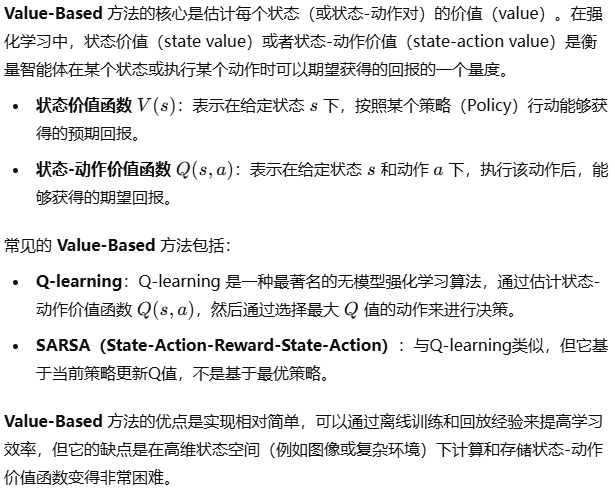
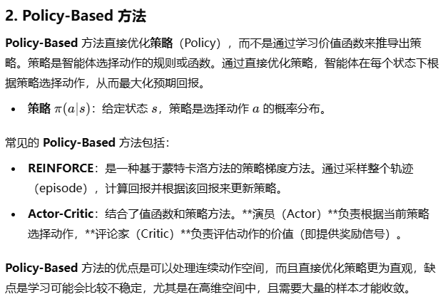

# Reinforcement Learning

通常用于存在“Agent”（人）与“Environment”（环境）这两个概念的一个系统。  
因为强化学习很适合游戏，通常用“游戏”来理解。

## 最核心思想

强化学习最核心的思想是：

1. Agent 利用 Policy Function（需要学习的对象），根据当前 State 做出 Action
2. 利用 Transition Function（根据环境分析得到的），根据 State 和 Action 得到新的 State。代表 Agent 所作出 Action 后的结果  
   需要注意，环境可能**有随机因素**，比如 Action 是向上走，但实际上可能因为风导致概率性向下走。  
   > 这也导致了有些游戏可能人的直觉并不是最好的，也就是贪心非最优。  
   > 比如[十分钟强化学习系列第一讲：基本概念](https://www.bilibili.com/video/BV1jK4y1w7T8)中的冰湖游戏，因为存在风、导致向哪走并不可能是真的向哪走，所以看似每次都尽量朝终点走，但成功率并不高。  
   > 这就需要用强化学习，来学习一种最优的 Policy Function。
3. 利用 Reward Funciton（通常人为指定的），代表当前 Action 的回报。  
   这是用来调整 Policy Function 的关键：每当获得正回报，就证明这种 Policy 好，加深印象；每当获得负回报，就减轻印象。

根据按当前策略游玩一次后的回报如何，调整策略，使得回报不断最大化。

**关键对象**：

1. `State`：这个游戏游玩过程的必要状态信息  
   比如冰湖游戏，只用知道：
   1. 游戏是否结束`Done`（这是个关键状态，用于表示一次游玩的结束，因为一次游玩不可能无穷玩下去，在这里无论是掉下冰湖还是找到保障、都为`True`）
   2. 玩家的位置`Pos`

   但如果宝箱也会随机移动，就可以再加上宝箱的位置。
2. `Env`：用于决定状态如何转移的，即根据当前`State`和 Agent 的`action`，得到新`State`
   * `response(State, Action) -> (State', reward)`  
     这里同时**将奖励函数融入到里面来了**。  
     奖励函数的设置是关键：在冰湖游戏中，可以简单设置为“只要到达宝藏位置，`reward=1`”。
3. `Agent`：
   * `act(State) -> Action`：通常用`policy`表示学习的策略，直接`return policy[state]`即表示当前状态的最优行为。
4. `Game(Env, Agent)`
   用来模拟游戏的进行
   * `play`：游玩一次游戏

      ```py
      state = init_state()
      steps = 0
      while state.Done != True and steps <= MAX_STEPS: # 游戏没有结束；但为了避免无限玩下去，通常还设置 max_steps
        action = agent.act(state) # Agent 根据 State 做出 Action
        new_state, reward = env.response(state, action) # Env 响应 Action，并反馈回报（这个 Action 好还是坏）
        state = new_state
        steps += 1
      ```

## 深入机制 - 如何找到最优策略

### 1. 需要有一种方法评估当前策略 - V 值

核心：利用**多次游玩、每一次的总回报`games_return`**来评估。  
> 即$return = \sum(reward)$，但有时候可能有加权操作，即折旧率`discount`。

比如冰湖游戏，游玩10次，只有1次到达终点，则`games_return=[1,0,...,0]`。

---

然后求平均值`mean_return`，用于表示这$n$次游玩（称为一轮尝试`epoch`）的策略好坏。  
比如上例：`mean_return=0.1`。

当游玩次数越多，则这个值越能反应策略的好坏。

用函数表示为`mean_return(game, play_times) -> float`（其中`game`包含了`env`和`agent`）。

但通常还指定一个起始状态`mean_return(game, state, play_times)`，  
因为不同起始状态，策略好坏不同（比如越接近终点，贪心策略就越好（因为随机因素造成的影响就越少））。

---

最终，将`mean_return(game, state) -> float`表述为"State Value Function"，状态价值函数。

$$
V_{env, agent}(S)
$$

**故通过$V_{env,agent}(S_0)$来评估**。

---

$V(S_0)$的计算方法：

* 最基础 - 模拟：就直接模拟游戏`play`，然后计算
* Bellman 公式：利用迭代的方式，更准确的计算。  
  核心思想是：当前状态$V(S)$和下一状态的$V(S')$存在一种递归关系（这也是为什么要指定一个起始状态`state`的原因了，就是为了利用这个公式，迭代算出更准确的$V(S_0)$）。  
  *具体算法这里先忽略。*

### 2. 需要有一种方法调整当前策略 - Q 值

$Q$值就是在$V$值的基础上，加上了 Action。  
即：
$$
Q(S, action)
$$

* **原理**：$Q$值与$V$值也存在迭代关系，可以通过$V$值算出$Q$值。
* **作用**：改进策略，则对于每个不同的$S_i$，改进为$Q(S_i, action_j)$最大的那个$action_j$。

---

以上就体现了强化学习当中的一种基本方法"Q-Learning"、基本类别"Value-Based"的思想。

## 方法分类

### 1. Value-Based 方法



### 2. Policy-Based 方法



补充：通常即是“策略梯度方法”，直接对策略函数进行参数化，并**通过梯度上升（或下降）来优化策略**，从而最大化累积奖励。

## TODO

* https://zhuanlan.zhihu.com/p/337976595  
  DPG(基于策略梯度), DQN(Deep Q-Learning Network，基于Value), DDPG(两者结合)  
  有前置知识，需要重点学习 DQN, DPG 中相关概念。
