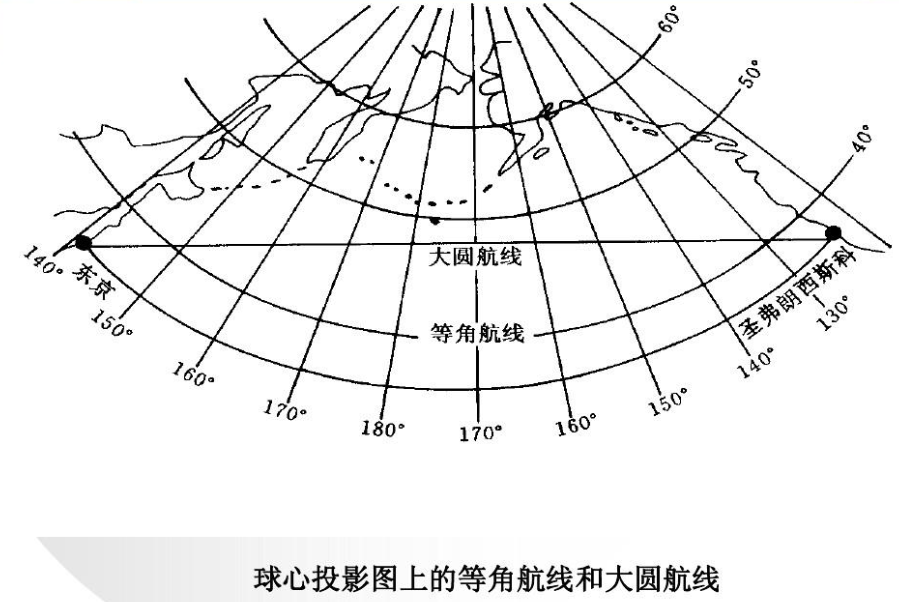
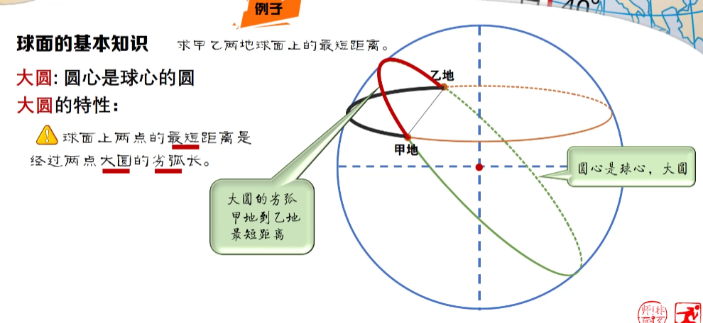
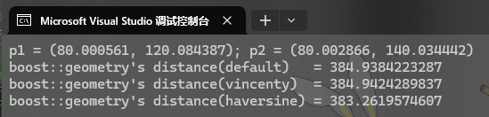
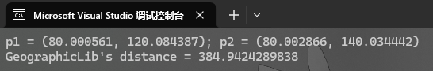
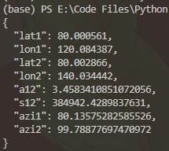
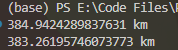

# GIS 相关

## 0x00 - 基础知识

1. 地球形状
   * 标准球形，$R \approx 6371.009 \textrm{km}$
   * 椭球
2. 经纬度
   * 经度(Longitude, lon/lng) - y 轴上点
   * 纬度(Latitude, lat) - x 轴上点
3. 经纬线
   * 经线 - 对应 y 轴
     * 对于标准球形：不同纬度，经线一样长；故不同经线上，相同经度跨度，距离一样
   * 纬线 - 对应 x 轴
     * 对于标准球形：不同经度，纬线不一样长；故不同纬线上，相同纬度跨度，距离不一样
4. 坐标: (lat, lon)

## 0x01 - 地测线相关

两种 Geodesic Problem（大地主题解算）：

1. Direct（大地主题正解）: 根据一个坐标、方位角和（最短）距离，求另一个坐标
2. Inverse（大地主题反解）: 根据两个坐标，求距离和方位角

### 1. 距离

与平面的区别：

* 在平面上：两点的距离为连接两点线段的长度
* 在（椭）球上：两点的距离为“**大圆距离**(Great-circle distance)”

需要特别与地图的最短距离进行区别，实际两坐标的最短距离在地图上看是圆弧；  
在地球仪上，两坐标的最短距离也不是坐标沿直线变化率变化过去的（特别是对于同一经度上，不是按照纬线过去是最小的）。

如下图，将地图变化为可以表示球的形状：等角航线是地图上的直线（或地球仪上直线变化率）；大圆航线对应的才是最短距离。  


如下图，同一经度上，不是同纬度过去是最短的。  


### 2. 方位角

有三种方位角，一般考虑真方位角 - 与北极的夹角。

> 解释一个困惑的问题 - 对于同一经度（非赤道）上的两坐标，为什么方位角不是 90°：
>
> 因为距离是大圆距离，所以并不是沿经线过去的。  
> 所以在 Inverse 求解的时候，会有`azi1`和`azi2`，其对应起点沿着大圆顺向的方位角、终点沿着大院顺向的方位角。
>
> 

## 0x02 - GIS 库

* C++
  * boost::geometry: 不只局限于地理 GIS，更多的实际上偏向于几何图形处理，但可以做如判断点是否在面内、线段与面是否相交这样的几何关系。
  * GeographicLib: 只有基础的地理解算，不能做几何关系处理。
* Python
  * GeographicLib
  * geopy（基于 GeographicLib）

### 1. 大地主题解算

对于经纬度点：

* p1 (80.000561, 120.084387)
* p2 (80.002866, 140.034442)

策略（有很多策略，这里只提到三种）：

* vincenty: 使用椭圆，精确、速度慢
* andoyer: 很精确（与 vincenty 误差 0.5 %，速度较快）
* haversine: 使用圆，不精确、速度快

#### (1) C++ - boost

```c++
#include "boost/geometry.hpp"

namespace bg = boost::geometry;
namespace bg_s = boost::geometry::strategy;
using Point = bg::model::point<double, 2, bg::cs::geographic<bg::degree>>; // 定义点类型：用度表示的地理坐标（感觉使用的只能是 WSG-84 大地坐标系，待确认）

int main()
{
    Point p1(120.084387, 80.000561), p2(140.034442, 80.002866); // 注意：这里遵守(lon, lat)格式（即(x, y)）

    double dist_default = bg::distance(p1, p2); // 直接调用 distance 求解距离，此时默认使用的是 andoyer 策略
    double dist_vincenty = bg::distance(p1, p2, bg_s::distance::vincenty<>()); // 使用 vincenty 策略求解
    double dist_haversine = bg::distance(p1, p2, bg_s::distance::haversine<>(6371009.)); // 使用 haversine, R = 6371009.
}
```



### (2) C++ - GeographicLib

```c++
#include "GeographicLib/Geodesic.hpp"

namespace gl = GeographicLib;

int main
{
    // 创建一个 Geodesic 对象
    Geodesic geod = gl::Geodesic::WGS84(); // Geodesic 好像也只有 WSG-84 大地坐标系

    // 设置两个点的经纬度
    double p1_lat = 80.000561; // p1 纬度
    double p1_lon = 120.084387; // p1 经度
    double p2_lat = 80.002866; // p2 纬度
    double p2_lon = 140.034442; // p2 经度

    // 计算距离和方位角（起点终点各一个）
    double s12, azi1, azi2; // 这三个传入下面的函数中作为引用，解算结果返回到这三个变量
    geod.Inverse(lat1, lon1, lat2, lon2, s12, azi1, azi2); // 应当是 vincenty 策略
}
```



### (3) Python - GeographicLib

```py
from geographiclib.constants import Constants
from geographiclib.geodesic import Geodesic
from geopy import Point

# 这里提前用了 geopy 中 Point 来描述坐标
p1 = Point(80.000561, 120.084387)
p2 = Point(80.002866, 140.034442)

geodesic = Geodesic(Constants.WGS84_a, Constants.WGS84_f) # 创建 WGS84 的大地坐标系，还可以使用 Geodesic.WGS84 创建

result = geodesic.Inverse(p1.latitude, p1.longitude, p2.latitude, p2.longitude) # vincenty
```



### (4) Python - geopy

```py
from geopy import Point
import geopy.distance as gd

p1 = Point(80.000561, 120.084387)
p2 = Point(80.002866, 140.034442)

dist_geodesic = gd.geodesic(p1, p2) # 用的椭球, vincenty
dist_great_circle = gd.great_circle(p1, p2) # 用的球, haversine, R = 6371.009
```


