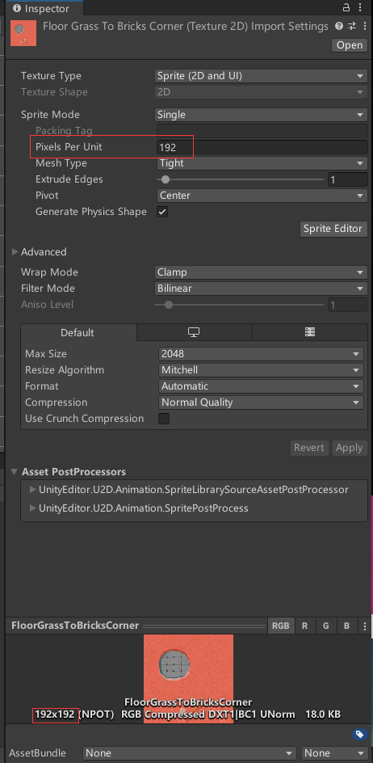

# Tile - 瓦片

对于 2D 像素游戏来说，游戏场景的设计基本上都是一个个像素涂上去的，  
如"泰拉瑞亚"、"Rabi-Ribi"等游戏。

 

Unity 中提供的“瓦片”系统，就是方便创建这样的场景的。

可以想象这些场景的每个像素块就像一片片不同的瓦片，然后整个场景就是由这不同的瓦片拼起来的。  
绘制场景只用选用相应的瓦片，然后涂相应的像素块就行。

## 一、基本概念

* Sprite - 精灵  
  精灵不用多说，就相当于一个 2D 图片，也就是场景的最基本素材。  
  由于基本上不可能只用一个像素块表现一个物体，用于瓦片的精灵大多是物体的一个部分。
  举例：桥面、桥墩、桥栏。
* Tile - 瓦片  
  其实跟精灵差不多，只不过调色板所用的基本素材改名为了瓦片x。
  举例：也是桥面、桥墩、桥栏。
* Tile set - 瓦片集  
  前面说过精灵或瓦片一般只是一个微小单元，一个个导入很麻烦，  
  因此可以先把所有瓦片放在一起导入进来，再分割成一个个瓦片。  
  举例：整座桥（这里举例可能不恰当，因为没必要把整座桥分成若干部分，再绘制出整座桥。可以想象不同类型的地面(Floor)，先全部导入分割，再按需绘制地面）
* Palette - 调色板  
  由若干个相同种类但不同样式（像 Minecraft 的泥土，分为上层的草方块和下层的泥土方块，这两个就是同种类但不同样式）的瓦片组成，从而用来绘制某场景。  
  举例：由桥面、桥墩、桥栏组成的集合，用来绘制桥。
* Brush - 笔刷  
  选择调色板中的某种瓦片，在瓦片地图上进行绘制。
* Tilemap - 瓦片地图  
  由调色板上的一片片瓦片绘制构成的最终场景。

可能经常在游戏素材中看到这样的奇妙文件：  
  
其中每个格子的图片就是一个瓦片(Tile)，这些瓦片就构成了调色板(Palette)，  
很明显，这个调色板的作用就是绘制地面的。

就像各种游戏人物会很鬼畜地分解为脸啊身体啊各个部分，然后压缩到一个文件中，  
光看这个文件感觉很恐怖，不知道是怎么变成游戏中呈现的人的，  
其实就有类似瓦片的思想在里面。

## 二、调色板创建、瓦片地图绘制方法

### 1. 使用精灵创建方法

先创建调色板，然后再把所需的精灵拖到调色板中变为瓦片。

在工具栏的"Window"中找到"Tile Palette"，打开瓦片调色板。

在下图位置新建一个调色板（各选项的含义可自行查询）后，就可以看到一个个格子组成的调色板了。

然后把所需的精灵直接拖到下面的网格中，形成瓦片，  
需要将瓦片重新保存到某个位置（所以这里不懂为什么不直接用精灵orz……  
一个精灵需要拖到某个位置，多个精灵则会自动安排位置。

**注意：**精灵的"Pixels Per Unit"(PPU)属性，需要跟精灵图片像素大小一致，  
否则后面绘制时，一个瓦片的大小跟一个方格的大小不一致。  

可以创建出如下面这种调色板：  

其中上面的各工具很好理解，  
"Active Tilemap"指的是要把这个调色板对哪个“瓦片地图”进行绘制，  
下面的"Edit"如果选中，工具则对调色板进行操作；否则对瓦片地图进行操作。

### 2. 使用瓦片集创建方法

例如下图的瓦片集，包含了3×3个瓦片。
  
【其实我是跟着教程后面才知道上面的是个瓦片集_(:зゝ∠)_……

方法其实跟上面的差不多，不过要是先把这一个精灵，告诉 Unity 它实际上是⑨个不同的精灵。  
步骤如下：

1. 在"Sprite Mode"中指定精灵类型为"Multiple"，表示它是由多个精灵组合而成的。
2. 在PPU中指定每一个瓦片的像素大小。  
   在 Inspector 窗口下方可以看到整个像素为192，其为3×3瓦片集，故每一个瓦片像素为64。
3. 然后点击下面的"Sprite Editor"按钮，进入精灵编辑页面，点击上方工具栏的"Slice"进行切割。
4. 在"Type"中指定切割类型为"Grid By Cell Size"，此时会自动划分为对应瓦片大小的瓦片。  
   
5. 点"Apply"保存即可。

此时展开精灵，发现已经被切分为了⑨个精灵！  

接着把切分好的精灵集直接拖到 Tile Palette 中，就可以一次性全部添加到调色板中。

### 3. 瓦片地图绘制

绘制就很简单，选中调色板中某瓦片，在瓦片地图上点击绘制即可。

## 三、有关瓦片的属性

### 1. Tilemap Collider 2D - 碰撞箱

横版游戏的话，作为地表需要加碰撞箱，否则人物会掉下去。

直接加这个组件的话，所有瓦片都会加上一个碰撞箱，包括内部不会碰撞到的瓦片，造成资源浪费。  
此时可以再添加"Composite Collider 2D"，视为一个刚体整体，构建碰撞箱。
