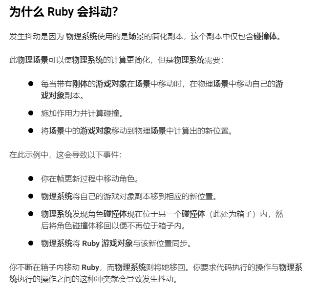

# 常用组件

## 1. Transform - 变换组件

每个游戏对象都自带的组件，表示了物体的**位置、方向、大小**三个基本属性。

> 问题 - 更改此组件属性以位移，导致物体产生抖动：
>
> 对该组件属性的改变，会**比“物理系统”提前计算**，  
> 因此会导致：在脚本中使用`transform.position`改变物体位置时（模拟移动），会移动到碰撞箱内，再被物理系统移出来，产生抖动。
>
> 
>
> 解决方法：移动刚体`Rigidbody`本身而不是变换组件。

## 2. Rigidbody - 刚体组件（物理系统）

使得物体可以支持物理作用力的计算，如：重力、作用力、摩擦力。

[相关文档地址](https://docs.unity3d.com/cn/current/Manual/class-Rigidbody2D.html)

参数：

* Body Type - 刚体种类  
  不同种类性质参数不同、计算需求不同。
  * Dynamic - 动态，最具互动性，启用所有的参数（质量、重力、阻力等）
  * Kinematic - ~~暂时不明~~
  * Static - 静态，自身会静止不动（相当于无限质量），用于障碍物等。
* Gravity Scale - 重力系数，设为$0$不会下落（俯视视角）。
* Constraints - 移动限制
  * Freeze Position - 限制移动，勾选相应轴后可限制该轴的移动。
  * Freeze Rotation - 限制旋转，勾选后防止碰撞产生的物体旋转。

## 3. Collider - 碰撞箱

很好理解，主要是有很多种类：

* 