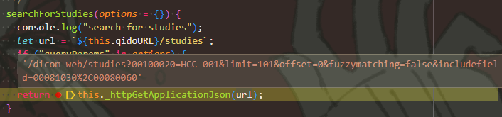

# 左侧栏相关

左侧栏：

* Primary - 当前打开Study
* Recent - 除了当前打开的Study，最近打开的该Patient的其他Study（与Primary相斥）
* All - **该 Patient 的所有 Studies**（Primary和Recent的并集）

**方法：**

`extensions/default/src/Panels/getStudiesForPatientByStudyInstanceUID.js`，  
是用来根据一个StudyInstanceUID来找该患者的所有Studies的函数。

是首先通过该UID，查到对应的Study，  
然后再得到Study里的Patient ID(0010, 0020)，进行字段匹配搜索【如病人是"HCC_001"，则Request的Parameter有`00100020=HCC_001`，如下图。  
  

然后该JS被同目录下的`WarppedPanelStudyBrowser`引用，再包装后作为属性(props)传给真正的Panel - StudyBrowser，  
PanelStudyBrowser拥有该JS，在68行的时候调用了，  
顺序是：

1. 该Panel的`StudyInstanceUIDs`（应当是个全局上下文）会变化，导致监听触发，然后调用该函数，得到该 Patient 的**所有 Studies**，并`set`赋值给`StudyDisplayList`状态。
2. 到后面的273行，会创建出左侧StudyBrowser的三个选项页的东西，调用`_createStudyBrowserTabs`，里面会传当前打开的Study的UID`primaryStudyInstanceUIDs`，以及`studyDisplayList`（所有Study的列表）
3. 在该函数里面，根据传来的参数，构造相应的"Primary"、"All"等选项页。
4. 最后在具体的 StudyBrowser 渲染的时候，从传来的`tabs`取 Studies 进行渲染。

然后这个函数是写在`extension-default`的嘛，类似于一个工具，所以会在该插件的`UntilityModule`中进行注册【？……  
然后是被`extensions/measurement-tracking/src/panels/PanelStudyBrowserTracking/index.tsx`给重用了的。  
【所以两个Panel其实差不多？……
