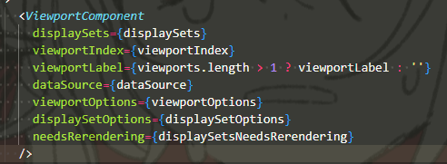
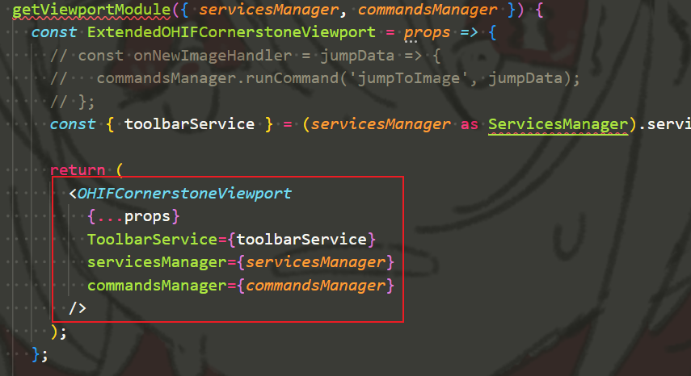
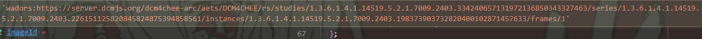
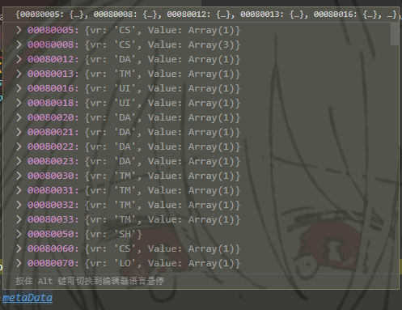

# 3D(Vtk.js)

* dcmjs
* itkjs+vtkjs

*注：转SEG的是dcmqi。*

## 传给Viewport的props

有两层：  
  

固定的`props`为：  
  
Module还可以传，比如Cornerstone里的：  

## VTK.js学习

### 1. 基础概念

* RenderWindow - 渲染窗口(类似Viewport的概念)  
  存在方法`renderWindow.render()`，可执行渲染。
  * `fullScreenRenderWindow` - 应该就是指全范围（所处的HTML DOM下）渲染，一般就用这个  
    初始化为`vtkFullScreenRenderWindow.newInstance()`，可以传一个`useRef`元素`{ rootContainer: someRef.current }`，作为某一HTML DOM的`ref=`属性，从而展示到页面上。  
    通过这个获得RenderWindow，用`xxxRenderer.getRenderWindow()`，然后可执行上述方法。
* Renderer - （某一渲染窗口的）渲染器  
  基于RenderWindows下的，所以要获得直接是`xxxRenderer.getRenderer()`
  方法：
  * `.addActor(actor)` - 增加渲染方式的（一般只初始化一次，后面在这基础上改属性）
  * `.resetCamara()`
* `mapper`(`vtkMapper.newInstance()`) - 管理渲染的图形数据的
  方法：
  * `.setInputData` - 设置
  * `.setInputConnection` - 咱不明
* ⭐`actor`(`vtkActor.newInstance()`) - 管理渲染方式的  
  需要与

### 2. 数据转换顺序

1. imageIds + metadata - 通过API(DICOMwebClient的`retrieve`)*或本地*获取  
   imageId如下，imageIds就是这个study下**所有的instances**。  
     
   metadata就是元数据。  
     
   这个metadata好像要加到`cornerstoneWADOImageLoader.wadors.metaDataManager.add(imageId, metadata)`
2. imageDataObject(Dataset) - 通过`getImageData()`，然后再`loadImageData(imageDataObject)`
3. imageData(VTK属性)  
   上述方法，直接`.vtkImageData`即可；  
   转换为imageData，还可以通过ITK来实现。
4. actor(VTK属性) - 变量为volumeRenderingVolumes，通过`_createCT3dPipeline`生成