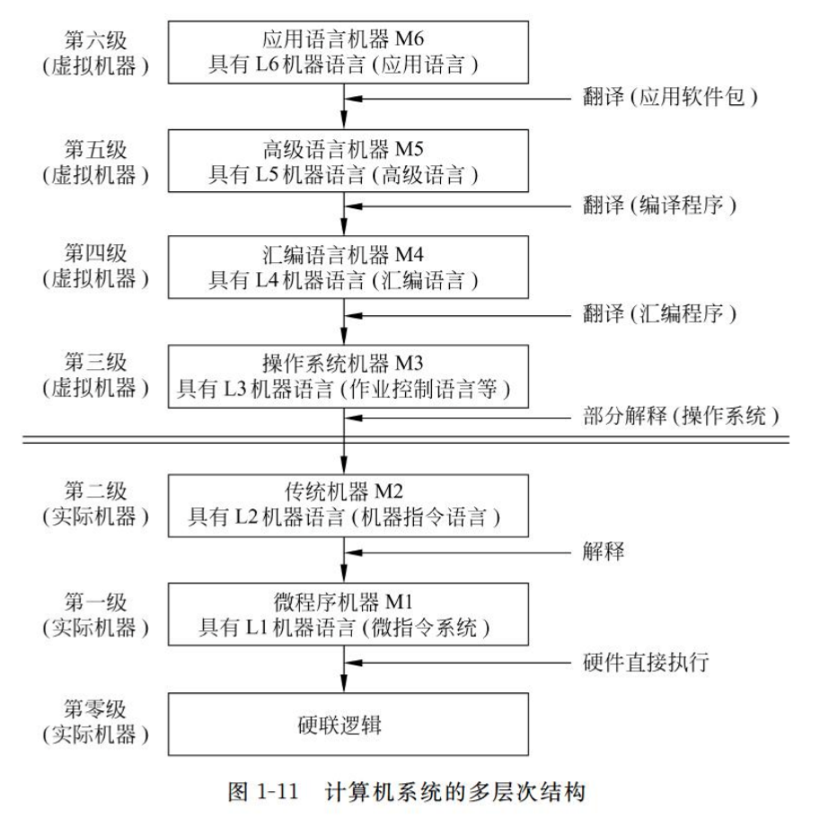

# Ep.1 概论

## 第一节 计算机系统的组成与工作特点

### 一、计算机系统的组成

* 硬件
  * 主机
    * CPU
      * **运算器**
      * **控制器**
    * 主存储器
  * 外设
    * 辅助存储器
    * 输入设备
    * 输出设备
* 软件
  * 系统软件：为提高系统效率或扩展硬件功能而编制的程序。
  * 应用软件

### 二、计算机工作特点

计算机采取事先编制程序、存储程序、自动连续运行程序的工作方式，称为**存储程序控制方式**。

冯诺依曼体制计算机：

* 采用二进制代码表示数据和指令
* 采用存储程序工作方式
* 硬件由五大基本部件组成  
  运算器、控制器、存储器、输入设备和输出设备

> 拓展 - 非冯诺依曼体制计算机：
>
> 1. 哈佛结构  
>    将指令和数据的存储分开，使得指令执行效率提高。
> 2. 改进型哈佛结构  

### 三、计算机的工作过程示意

基本过程：取指令→分析及取数→执行

### 四、数字计算机的特点

* 能在程序控制下自动连续地工作
* 运算速度快  
  指的是执行一整件事情，能迅速得连续完成，因为可以**事先存储**信息。  
  而相较于模拟计算机，其单次的运算速度（如做一次加法）是更慢的。
* 运算精度高
* 信息存储能力强
* 通用性好

## 第二节 计算机系统的层次结构

### 一、层次结构模型

* 硬件：执行指令
* 系统软件：管理分配硬件资源
* 应用软件

  

硬件与软件之间的界面（接口）是**指令系统**。

### 二、系列机和软件兼容

系列机：一个厂家生产的，具有相同的系统结构，但具有不同组成和实现的一系列不同机器。

兼容性分为四种：

* 按市场投入时间
  * 向后兼容
  * 向前兼容
* 按机器档次
  * 向上兼容
  * 向下兼容

必须**保证向后兼容**，力争向上兼容。

## 第三节 计算机硬件系统的组织

### 一、计算机总线

现代计算机中广泛使用三态门连接总线。

## 第四节 计算机的发展

*略*
