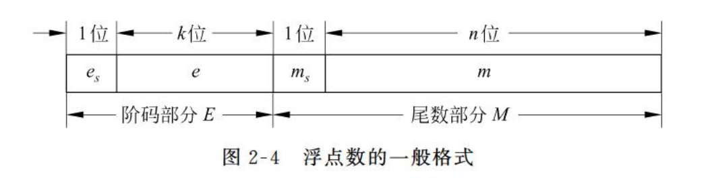

# 第二节 机器数的定点表示与浮点表示

算术运算时需要指明小数点的位置，  
因此根据小数点位置是否固定，有两种对小数的表示方法。

1. 定点表示法
2. 浮点表示法

## 一、定点表示法

操作数数据格式中小数点的位置是固定的。  
计算机中的定点数只采用**纯整数**或者**纯小数**表示。

## 二、浮点表示法

即为小数点会改变位置的表示方法。

需要知道：浮点数中精度和表示范围是两者冲突的。

### 1. 浮点数表示范围（范围 - 阶码E）

可以将小数用如下形式表示：  
$$
N=M\times r^E
$$
其中基数$r$是常数，通常$r=2$，也可以为$2^n$，  
故可将浮点数记为$<\textrm{阶码}E,\textrm{尾数}M>$。

将阶码和尾数均采用补码来表示，可以以以下格式来表达浮点数。
  

### 2. 规格化浮点数（精度 - 尾数M）

尾数的最高尾数必须是一个有效值，以提高数据表示**精度**。  
即必须左移右移趋近于$(0.1xxxxx)_2$的形式，直到不能再移。

> e.g.
>
> $(0.000011)_2=(0.1011000)_2\times2^{-3}$，为规格化数  
> $(0.000011)_2=(0.0101100)_2\times2^{-2}$，非规格化数
> $(1.0xxx)_2$，规格化数  
> $(1.1xxx)_2$，非规格化数

### 3. 阶码的移码表示法

移码：在真值$X$的基础上加上一个偏移值。